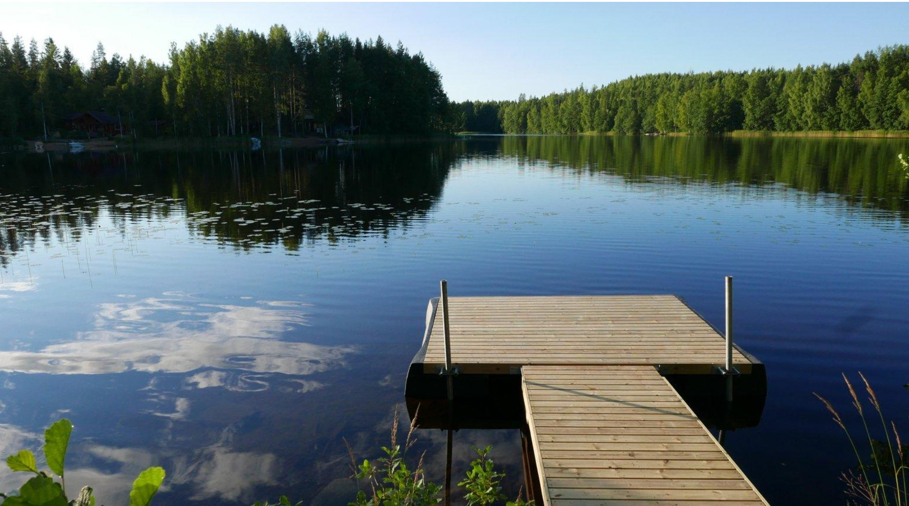

# Outside activities, services and sightseeing at "Uitonranta" cottage and Mäntyharju

This is part of [Mäntyharju “Uitonranta” Cottage instructions](/post/airbnb-mantyharju-instructions)

[TOC]

## Services and shops at Mäntyharju town

Mäntyharju town is located about 10 min driving distance from the cottage. It has good selection of services, shops and restaurants available:

* **Grocery store** with good selection "K-Supermarket Mäntyharju", address: Liiketie 1, Mäntyharju
* **Grocery store** with good selection "S-Market Mäntryharju", address: Pentinpolku 2, Mäntyharju
* **Electric car fast-chargers** are at parking places of both K-Supermarket and S-Market.
* **Gasoline station** is located at the S-Market parking place.
* **Pharmacy** is located in same building as the S-Market at address Pentinpolku 2.
* **Tokmanni department store** has selection of hardware, electronics, clothes, kitchenware, toys, etc. Address: Keskustie 18, Mäntyharju.
* **Pizzeria Dada** is restaurant with Pizza and Kebab, at address: Asematie 1, Mäntyharju

## Weather

Finland has high variation of seasons and you the clothing and available activities depend strongly on the time of year.

See [Weatherspark info](https://weatherspark.com/y/95206/Average-Weather-in-Mikkeli-Finland-Year-Round#Figures-Summary) or [Climate-data.org](https://en.climate-data.org/europe/finland/mikkeli/mikkeli-679/) or [weather-and-climate-com](https://weather-and-climate.com/average-monthly-min-max-Temperature,mikkeli-eastern-finland-fi,Finland) on the Mikkeli area (close to the cottage) weather at different times of year. For example average minimum and maximum temperatures at different months are shown below:

Note that actual maximum and minimum temperatures can still vary significantly from the average minimum and maximum. For example in January-February it is not rare to get -25 C occasionally and in July-August it is not rare to get +28 C occasionally.

## Aerial videos from the villa and surroundings

* [The house and yard in September](https://www.youtube.com/watch?v=GTM9HzvT9OM)
* [The forest and lake in September](https://www.youtube.com/watch?v=wIqPG2b1h-E) 
* [The forest and lake in July](https://www.youtube.com/watch?v=6NVq_3tQr_4)
* [The forest and lake in Winter](https://www.youtube.com/watch?v=oH-1yQPNpQs)

## Walking in nature

In Finland it is permissible to walk in any forests and use a boat on any lake regardless of the owner or the land. So feel free to roam around in the nature surrounding the house! Just don't go very near other houses to allow privacy for everyone in their yards.

## Mushrooms

Mäntyharju area is famous for mushroom picking. In the fall you can find many different mushrooms in the forest.

<small>Penny bun (Boletus edulis / cep / tatti), Chantarelle (kantarelli) and funnel chanterelle (suppilovahvero)</small>

We have found from the peninsula where the cottage is located:

* [Penny bun / Boletus edulis / cep / porcino (tatti)](https://en.wikipedia.org/wiki/Boletus_edulis).
* [Chanterelle (kantarelli)](https://en.wikipedia.org/wiki/Chanterelle)
* [Funnel chanterelle / yellowfoot / winter chanterelle (suppilovahvero)](https://en.wikipedia.org/wiki/Craterellus_tubaeformis)

Chantarelle usually is found already i august, other mushrooms in September and October.

Only pick mushrooms that you recognize and are sure are edible. There are many poisonous mushrooms in the area as well. See internet for more information and identification on mushrooms.

Map below shows with red circle where we have regularly found Boletus (tatti):

## Blueberries

In July-September there are usually plenty of blueberries in the forest near the cottage:

## Jetty

Jetty can be used for going swimming and boarding the boat in the summer period (approximately May-October period).

The water at the end of the jetty is quite shallow, so don't jump into the water when you go swimming.

Due to the possibility of ice damage, the Jetty is taken out of the water for winter-period.

## Boat

A boat is available for guests to use on the lake in the summer period. The boat can be rowed with oars or driven with the electric engine. Never rely on the electric engine only: it can run out of battery or break - always have also the oars in the boat for backup even if you choose to mainly use the engine.

When you put the boat to water, ensure that the plug in the bottom is attached so that water does not come in.

During your stay, you can keep the boat in water, attached with rope to the jetty. If rain-water has been coming to the boat, you can empty it with the orange scoop in the boat.

Please use the boat only if you are capable of swimming or wear life vests (located at the sauna balcony). If the weather and water is cold, we recommend life vests even for capable swimmers since swimming in cold water can be hard.

### Navigating the lake, maps and rocks

You can have nice varied views of Finnish lake-scenery by taking with the boat the route south from cottage, going around the Muuttosaari island, as shown in the map below from [Kattapaikka web app](https://asiointi.maanmittauslaitos.fi/karttapaikka/?lang=en):

<small>Nice boat route around Muuttosaari island</small>

**Be careful of underwater rocks when boating!** The lake has many locations with rocks that come near the surface but are not visible and can damage then engine or boat if you collide with them.

To avoid colliding with rocks, especially on longer trips, please use some map app which shows water depth, rock positions and your current position. I recommend using the [Kattapaikka web app](https://asiointi.maanmittauslaitos.fi/karttapaikka/?lang=en) which can be used on phone or tablet. Boat route map above is from karttapaikka app. Below is example of the karttapaikka map with higher magnification, showing water depth and rocks with back T, inverted T and triangle symbols:

<small>Dangerous underwater rocks marked in Karttpaikka map</small>

If you do not follow these instructions and that results in damage the boat or engine, you will be charged for the repair costs.

### Boat electric engine

In addition to rowing with oars, you can use the boat electric engine. Care and expertise should be used with the electric engine.

The engine model is Motorguide R3, with [full operation manual here](https://www.motorguide.com/content/dam/motorguide/owners-resources/owners-manuals/R3%20Owners%20Manual%20-%202017.pdf). Please read the manual if you are unsure about how to use the engine.

The engine uses 12V battery. Please ensure that the battery has enough charge before using the engine.

If you use the engine, return the battery inside and charge with the charger as shown below. Make sure to attach the plus (+) and minus (-) cables of the charger to the respective battery terminals. After connecting the charger, press the charger "MODE"-button until both the charging and "car" lights are on:

The battery can take about 10 hours to charge fully.

### Boat in the end of your stay

1. Pull the electric engine to high position so it will not hit the bottom when you pull boat to land. (Alternatively you can detach the engine and put it to Sauna balcony.)
1. Pull the boat up fully to land on the side of the jetty
1. Detach the plug in the bottom at the back of the boat so that rainwater will drain out of the boat (you can leave the plug in the boat)

## Fishing

If you want to go fishing but don't have your own equipment, there are some simple hook-and-bait fishing rods at the house. Baits (worms) you can buy from the town or try to dig from ground with a shovel. Fishing with hook-and-bait does not require a license in Finland. You can catch perch with hook-and-bait.

<small>Perch caught with hook-and-bait</small>

Fishing with spinning rod and more advanced equipment requires fishing permit. Fishing permits can be purchased from R-Kioski shops at the Mäntyharju town.

There is also [Kalakortti online-shop for fishing permits](https://www.kalakortti.com/luvan_tilaus/shopdisplayproducts.asp?id=104&cat=M%E4ntyharjun+viehelupa) (Finnish only, but translates ok)

[Fishing information on the lake “Pyhävesi”](http://www.mantyharju-repovesi.com/fi/aktiviteetit/kalastus/pyhavesi) mentioning that the lake is known for Pike and Pike-Perch.

<small>Pike caught with spinning rod</small>

## Ice-swimming in winter

If you are interested *and experienced* in ice-swimming, the cottage has tools for making a hole in the ice to swim from Sauna.

Tools that can be used for making hole include ice-drill (kaira), iron bar (rautakanki), saw and electric motor saw.

## Sightseeing and activities

### Outside summer activities

* If you enjoy nature trails, there is [Repovesi National park](https://www.nationalparks.fi/repovesinp) less than 1 hour drive away from the cottage.
* Web page on Mäntyharju nature activities (Finnish, use translation if needed): https://www.visitmantyharju.fi/luontoaktiviteetit
* [Vola GOLF](https://vola.fi/) at Konnesaarentie 1 has is a driving range located in Mäntyharju, Finland. Vola-Golf offers you a chance to practice your swing or even get a green card. You don’t need your own equipment, just an open mind and curiosity. Suitable for the whole family!
* [Frisbeegolf track](https://www.mantyharju.fi/sivut/vapaa-aika-kulttuuri/luontoaktiviteetit/frisbeegolf/) can be found Near Mäntyharju town center at address Asematie 10.   
* [Childrens outdoors playground area](https://www.mantyharju.fi/sivut/vapaa-aika-kulttuuri/luontoaktiviteetit/metsaleikkipuisto/) near town center.

### Winter Outdoors activities

* Rental of snowshoes in [Mikkeli ES-liikunta](https://www.esliikunta.fi/valinevuokraus/)  (Paukkulantie 22, Mikkeli)
* [Rental of snowshoes at Mäntyharju library](https://www.mantyharju.fi/sivut/vapaa-aika-kulttuuri/kirjasto/lainattavat-esineet/) 
* Repovesi park has also [activities for Winter-time](http://www.mantyharju-repovesi.com/en/homewinter)
* Skiing and Skating is often possible directly on the ice of the lake outside the cottage
* [Maintained Skiing tracks and Skating areas](https://www.mantyharju.fi/sivut/vapaa-aika-kulttuuri/luontoaktiviteetit/talvella-ulkoilua/) close to the cottage.

### Indoors activities and sightseeing

* [Art museum “Salmela”](http://www.taidekeskussalmela.fi/eng/) is popular sight for art-lovers at address Mäntyharjuntie 25.
* [Woikoski Factory museum and Woikoski car museum](https://www.woikoskifeeling.fi/en/attractions) show interesting view to the industrial history of Mäntyharju.
