# Location and Arrival to Mäntyharju "Uitonranta" Villa

This is part of [Mäntyharju “Uitonranta” Cottage instructions](/post/airbnb-mantyharju-instructions)

## Address

* Current official address:  
**Uitonniemenraitti 86 B**, 52700 Mäntyharju
* Address before 1.6.2025 road name change:  
**Uitonniementie 86 B**, 52700 Mäntyharju.  
Most navigator software still use this address!
* Note that there are several "Uitonniementie" roads in Finland, so be careful to navigate to the one at Mäntyharju.
* GPS coordinates: [61.444085° N, 26.786082° E](https://www.google.com/maps/@61.4438187,26.7856655,17.04z)
* Driving time from Helsinki, approx 2.5 hours.

## Location maps

Location of cottage in Southern Finland (marked with star):

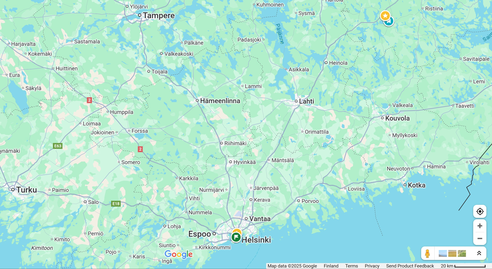

Driving instructions from Helsinki:

1. From Helsinki, go to Lahti motorway
1. When passing Lahti, continue along the motorway towards Mikkeli.
1. After about 90 km from passing Lahti, turn right to Pertunmaantie road with the signs “Pertunmaa” and “Mäntyharju” and start driving south-east towards Mäntyharju.

Mäntyharju area map showing the location of the cottage (marked with star):

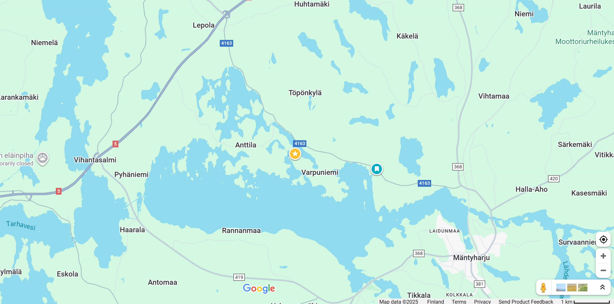

Close-up map of the "Uitonniemi" peninsula on arrival:

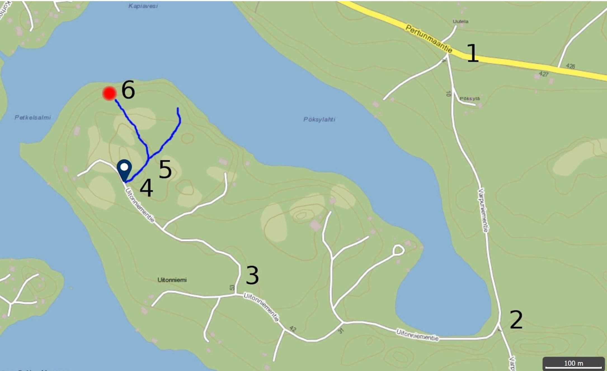

1. Turn from Pertunmaantie road (at Pertunmaantie 449) to south to Varpuniementie road
1. Drive about 500 m along Varpuniementie road and near trash boxes turn right to Uitonniementie (Uitonniemenraitti) road.
1. About 500 m along Uitonniementie (Uitonniemenraitti) road, the road turns sharply right. Note that older maps and navigators incorrectly tell that Uitonniementie continues forward here whereas it nowadays turns right northward.
1. About further 300 m along Uitonniementie (Uitonniemenraitti) road, turn right at “Uitonniementie 86” sign. Note that Google Maps and some other older map apps do not show the road after this point (the road with blue color on the map above)
1. After about 50 m, turn left at “Uitonniementie 86 B” sign.
1. After about 100 m there is a hill down and you have arrived at the cottage. **In Winter do not drive down this last hill** since it's too steep and slippery (see Arriving and parking in winter" below)

## Charging electric car

Electric cars can be charged at the cottage for additional fee (20 cents / kWh as of 2025-11, please check with owner before for current price). You need to have your own charging adapter for your car. Please report to the owner in the end of your stay amount charged to be added to your bill.

If you want to charge your electric car, open the outside electric box from key (blue in the picture below). Inside is Schuko socket with a 16A / 3.7 kW capacity and red power-electricity socket with 11 kW capacity. You can plug your car charging adapter to either one, let the cable come out from the box through the opening in the bottom (marked red in the picture below and close the box door).

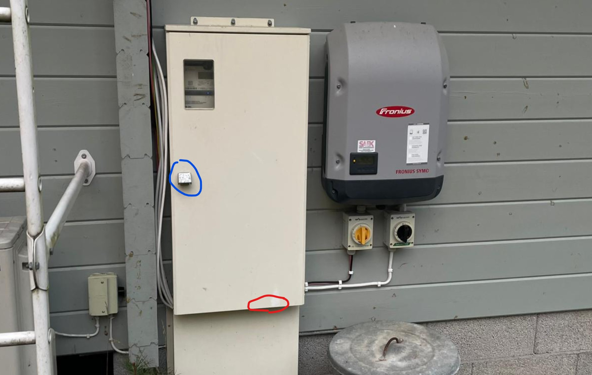

<small>Electronics box which has electric sockets inside</small>

## Arriving and parking in winter

Snow in winter can present challenges in using roads, particularly small countryside roads. We recommend a good winter-capable car, with good winter-tyres with spikes to drive on the icy road. Ideally 4WD. Drive slowly and carefully.

Cottage owner has agreement with a local snow-plough driver to remove snow from the last small roads leading to the cottage. The removal is agreed to happen within 24-hours after heavy snowfall (10+ cm of snow). This means that there might be temporarily snow on the road that hinders driving.

In winter when road has ice or snow *do not drive down the last downhill slope to the cottage*. The hill is too steep and slippery to drive back up so your car will be stuck.

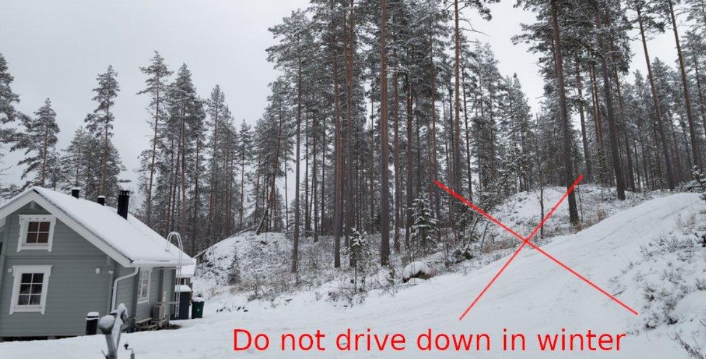

Following picture shows map of the area with suggested winter parking locations:

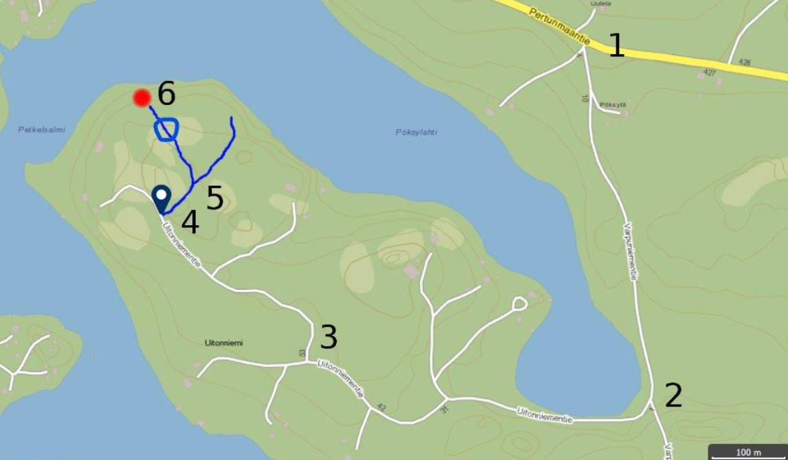

* Blue circle has a parking place before the last hill to the cottage. This location is usually suitable and recommended for parking in the winter (see picture below)
* If the road is extremely slippery (wet ice), you don’t have an extremely winter-capable car or you are not an experienced winter-driver, you can consider parking even earlier to crossing (5) or (4). Note however, that if you park in the middle of the road, then the snow-plough cannot come to clean the road if there is snowfall so you might need to prepare for moving your car to allow snow-plough to pass when needed.

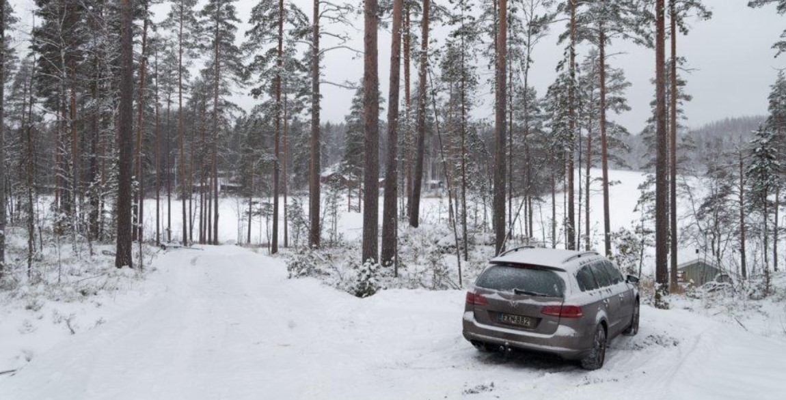

<small>car parked on the winter parking place (blue circle in the map)</small>

To get back from the winter parking place to Uitonniementie it might be necessary to back up (drive in reverse) up the hill, especially with a 2WD front-driving car, turning the car on the very slippery icy road can be difficult and lead to your car falling away from the road.

In case you get stuck with your car, you can try following things:

1. Shoveling away some snow around the car with snow-shovel outside the cottage.
1. Take some gravel from the two gravel boxes on the side of the road and spread to the road to increase friction.
1. Try using snow-chains (stored in the wood-shed near the cottage)
1. Finally if nothing else helps, you can call the snow-plough operator **Olli Halme** phone +358 40 524 5859 to come and pull your car. Address is Uitonniementie 86 B (house of Robert Brotherus). This will cost you extra if he needs to come urgently and not wait for the regular schedule.

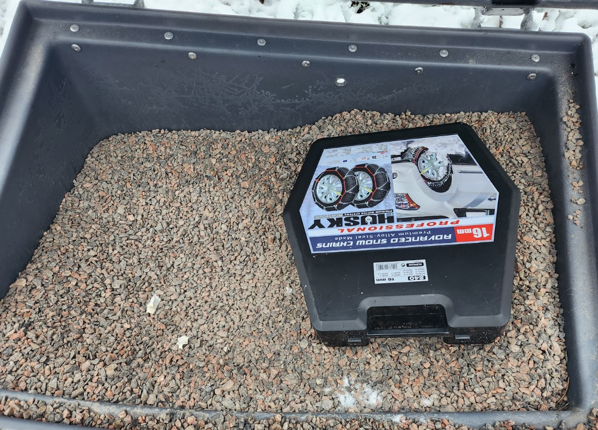

<small>Gravel boxes on the side of the road have gravel you can use. The show-chains box shown here can be found at wood shed</small>

## Karttapaikka map

A more detailed local map (cottage position marked with red circle) from Finlands [Karttapaikka-service](https://asiointi.maanmittauslaitos.fi/karttapaikka/?lang=en) which I recommend for local hiking and boating on the lake:

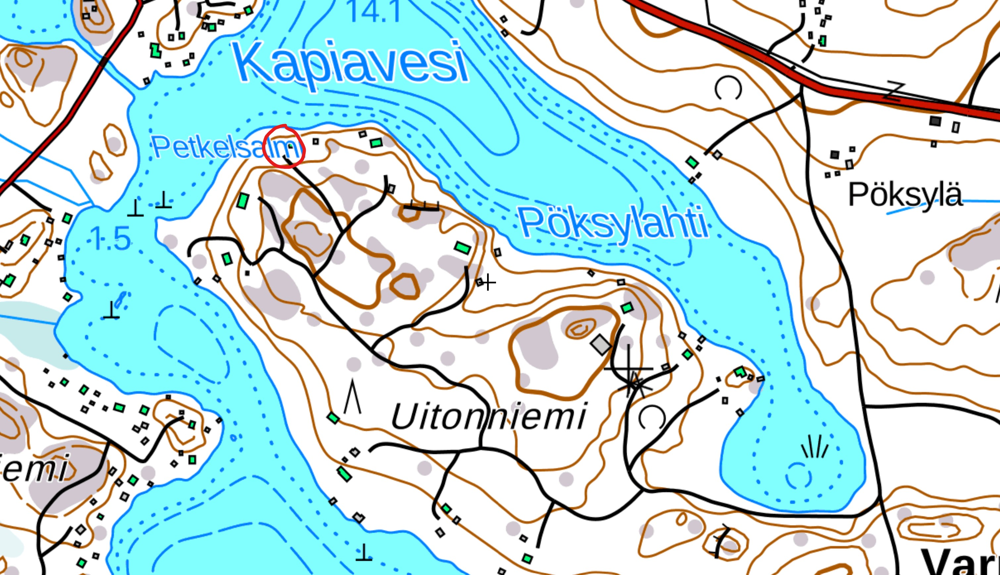

## Using Taxi to arrive

I do recommend to come to the cottage with your own or rented car to have maximum flexibility eg. for driving to Mäntyharju town (10 min drive) for shopping when needed. However, it is also possible to come to Mäntyharju by train and then take a taxi for the last part. Local taxi numbers listed at [https://www.taksinumerot.fi/Mantyharju](https://www.taksinumerot.fi/Mantyharju) and also here (list updated 2022):

* Taxi center: 0601 10036
* Taxi station. Address: Savontie 1. Phone: 015 464 434
* Taxi M-L Pulkkinen 0400 655 827
* Taxi Tuomo Marttila 0400 655 828
* Taxi Matti Hujanen 0400 155 502
* Taxi Jari Liukkonen 045 671 5702

## Cottage site map

Detailed map of the cottage (HUVILA), sauna and their surrounding site. Lake is on the north side:

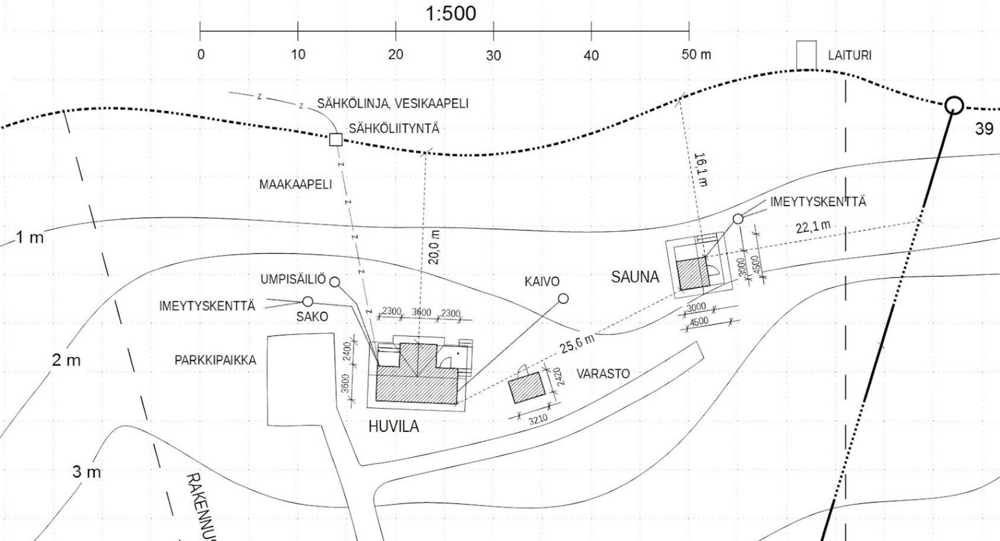

## Key-box, Key and unlocking the doors

Cottage Key is stored in a combination-code key-box on the wall next to the villa main door:

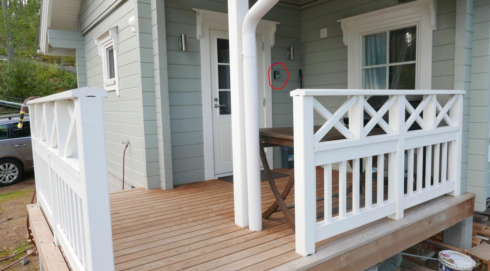

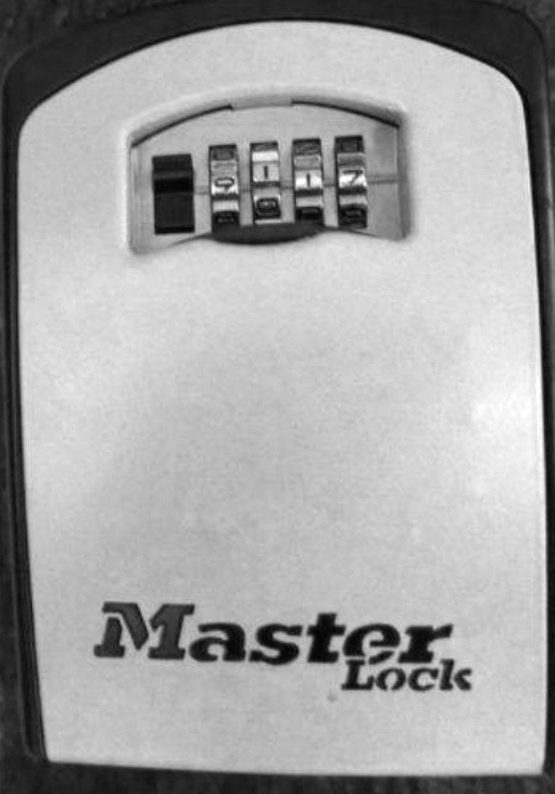

When you have finalized your booking, please ask the owner for the current code to open the box.

After opening the door with the key and setting the door lock to “unlocked” mode:

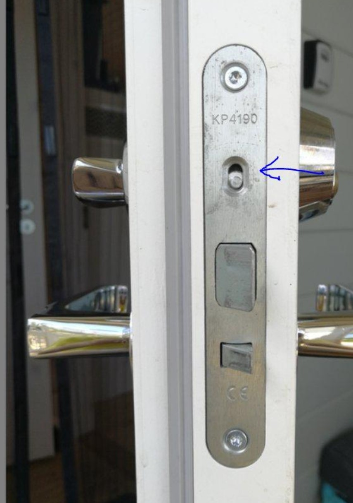

After opening and unlocking the door, please immediately *return the key to the key-box*. We kindly ask all guests to *always quickly return the key in the key-box* to avoid losing the key or locking yourself out while the key is inside the villa. (However, if you nevertheless lock yourself out, contact the owner for help to get spare key)

It is typically safe to keep they door unlocked during your stay even if you go for a walk or shopping to the town. The cottage is in such remote and safe location that there are practically never unwanted visitors.

At the end of your stay, push the door locking switch back to locking mode, close the door and check that it is locked.

## Initial check for cleanness

Since the cottage is rented on a “self-service” basis, all guests have the responsibility to clean and arrange the cottage after their stay. Since as the owner I do not have possibility to visit the cottage after every guest, please after arriving, check that the previous guest have been cleaning and arranging properly after their stay:

1. Are the floors clean?
1. Are the dishes washed? (it is acceptable to have clean dishes in the dishwasher if the previous guests started the dishwasher but did not have time to finish it)
1. Is the kitchen clean?
1. Is the fridge clean? (it is acceptable to leave well-preserving items like butter and ketchup in the fridge)
1. Are items and furniture arranged neatly?
1. Is trash taken away?
1. Please check if the previous guests have left washed linen drying in the tumble dryer (in kitchen), hanging on the lines outside or hanging on the upstairs loft rail. If so (this is acceptable), please take to the linen box (or take it immediately to use for yourself).

Please report to the owner any significant uncleanness or other problems. If the problems cause significant extra effort for you, I will be happy to offer a discount in the cottage rent as compensation.
