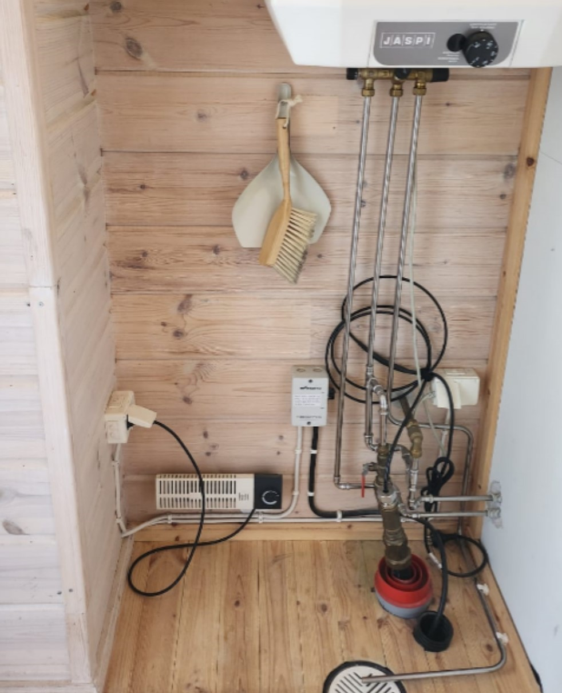
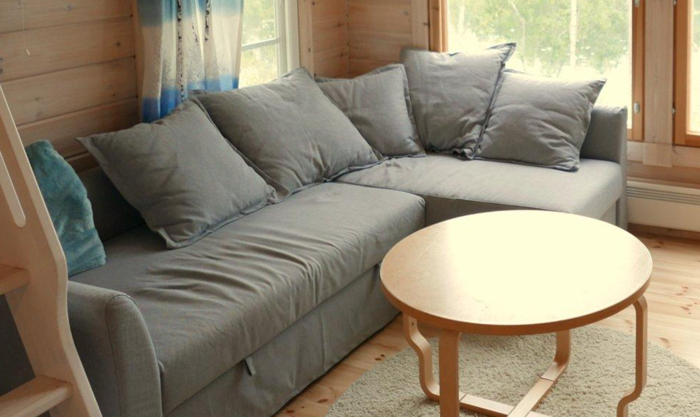
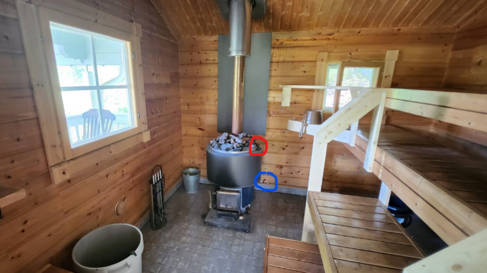
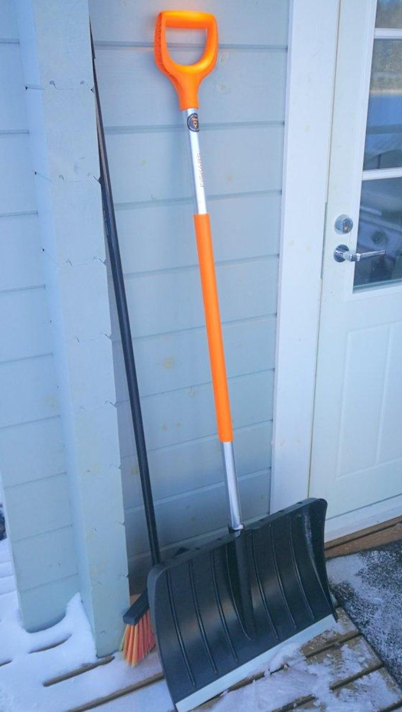
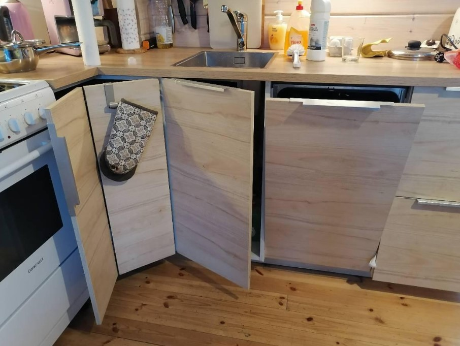

# Mäntyharju “Uitonranta” Cottage instructions

See also separate documents on:

* [Mäntyharju "Uitonranta" Cottage arrival instructions](/post/airbnb-mantyharju-arrival)
* [Outside activities, services and sightseeing](/post/airbnb-mantyharju-activities) at our cottage and Mäntyharju area.

Table of contents

[TOC]

## Welcome!

Welcome to our "Uitonranta" Villa at Mäntyharju, Finland!

We built this modern villa with love in 2016. It is built on land that our Brotherus extended family has owned over 100 years since 1920's. We built the cottage mainly for our own holiday use, but later decided we wanted to give visitors also the possibility to enjoy beautiful Finnish nature.

## Owner contact info

Robert J. Brotherus

* Phone / WhatsApp: +358 45 1145602
* email: [robert@iki.fi](mailto:robert@iki.fi)
* Facebook: robert.brotherus
* Please contact me for inquiries about renting the cottage.

## Self-service nature of the cottage and cleaning

Since we live in Helsinki, 2.5 h drive from the cottage, we are not able to visit the cottage between each guest, instead doing maintenance-visits about once per month. This means that the cottage is rented out on a “self-service” basis and we are not able to personally assist our guests at the location (though we are happy to help through text chat and phone).

In this kind of self-service cottage it is especially important for guests to clean the cottage well at the end of their stay as described in the end of these instructions. We do not add any cleaning fee to the rent because cleaning is the responsibility of the guests. On the rare occasion that the previous guests' cleaning is in some way lacking and that causes inconvenience to you, we are open to giving a discount on the rent as compensation. We want to have happy guests, so please consider beforehand whether you would be open to such an arrangement. If you require from your rental properties that there is zero possibility of any issues in the level of cleaning, some other property might be more suitable for you.

## Location and arrival to the cottage

See [Mäntyharju "Uitonranta" Cottage arrival instructions](/post/airbnb-mantyharju-arrival)

## Wifi

ID:   `uitonranta`  or  `uitonranta-ext`  
PASSWORD: `finland123`

The Wifi is provided by a 4G phone-router near the computer. It providers approximately 10 mbit/s connection speed.

## Floorplan

First floor:

* **Tupa**: Kitchen and living-room with a sofa-bed  
* **MH**: Bedroom with double bed  
* **PH**: Toilet and shower  
* **Terassi**: Terrace

Second floor / loft:

* **Makuuparvi**: Sleeping loft with two beds

## Water

The villa uses water from the well in the yard. *Water is good for drinking directly*.

Avoid taking excessive long showers and other excessive water use to avoid the well running dry, especially if the weather is hot and dry.

The corridor has hot water boiler on the wall and controls for water systems:

Switching on and using water:

1. Water pump electricity switch. Switch this on in the beginning of your stay to use water. Switch OFF at the end of your stay to ensure that there is no water damage in case some pipe leak appears.
2. Water-pipe main valve handle. This can be always kept open (as shown in the photo). But if you have trouble using water, double-check that it is open.
3. Hot-water boiler electric cable. Keep always plugged in, even at the end of your stay, to ensure hot water is available. If it has been plugged out, it will take about one hour to get hot water again.
4. Water-pipe heating plug for winter-time. When temperatures are freezing this should be always plugged in, otherwise pipes can freeze and break. Owner will plug it in in November and unplug it in April, guests should never unplug this. Please verify that it is plugged in and feels warm to hand when you arrive and leave in winter time.

### Waste-water tank check

Toilet waste water in the cottage is collected to an underground tank that is emptied when it gets full. 

On the second floor loft, near the window, there is a “Tank-Check RF-412” waste-water tank indicator:

Please keep this always plugged in, even at the end of your stay. Please check in the beginning and end of your stay that the "OK" light is lit in the device.

If the tank is getting close to full, the device emits sound and lights the red "FULL" light. Please inform the owner if the FULL-indicator becomes lit (so that emptying of the tank can be scheduled). Also inform if the Error-light comes on (indicating low battery level). If the full / error sound  bothers you, you can unplug the device after informing the owner of the status.

## Heating

For heating the cottage when weather outside is cold, there is:

1. Fireplace (see [“Using fireplace” chapter below](#using-the-fireplace))
1. [Air-heat-pump](#air-heat-pump) on the wall of kitchen
1. Electric radiators in each room
1. Floor heating of the toilet (this must be always on, minimum level 3, even when you leave cottage)
1. Wall radiator at the toilet (always keep plugged in, no need to adjust)

During your stay, it is recommended to keep the bedroom door open to let the heat from the living room (air-heat pump and fireplace) get there. But if this not enough, you can additionally switch on and use the bedroom electric radiator (power-switch on its right-hand side). If you do so, please switch the bedroom radiator off in the end of your stay.

### Air heat pump

<small>Air heat-pump on the wall of kitchen</small>

The temperature-setting and other settings of the air-heat-pump can be controlled with a remote control nearby it.

Air-heat pump uses less electricity for heating than the electric radiators, so please use it instead of the electric radiators for the main room heating and keep the radiators at the default +5 C temperature.

## Beds and bedroom

<small>Main bedroom double-bed</small>

The bedroom has drawers where you can store your own clothes and items during your stay.

<small>Sofa-bed in the living room</small>

Living room sofa can be used as bed and extended to a double-bed by pulling from the handle straps. The sofa-bed also has a storage-box for sheets (see ["sheets and towels"](#sheets-and-towels) below).

Upstairs loft has some mattresses that can be used as additional beds:

<small>Loft matressess</small>

## Sheets and Towels

For bed sheets and towels, you can choose to bring your own sheets and towels or use sheets and towels of the cottage.

Cottage has sheets, bag-sheets for blankets, pillow-covers and towels. If you do use the sheets and/or towels of the the house, wash them in the washing machine in the end of your stay as described in [“washing clothes and linen” chapter](#washing-clothes-and-linen).

Clean sheets and towels are normally stored in the metal drawers in the bedroom or in the linen storage box inside the sofa-bed (see picture below). However, washed sheets from previous guests might also be drying in the kitchen tumble dryer or hanging on the lines outside or from upstairs loft rail. When you arrive, please take these to the linen box or directly to your use.

<small>Sofa-bed sheet box</small>

## Kitchen and Fireplace

* A - Fireplace chimney open/close knob (keep pulled out)
* B - Fireplace door
* C - Fireplace door closing latch
* D - Fireplace air intake switch (always keep on left position)
* E - Ventilation controls
* F - Microwave oven
* G - Stove and oven
* H - Dishwasher machine
* J - Fire extinguisher
* K - Kitchen light control button (on sidewall of the cupboard) for the lights under the cupboards. To switch on the kitchen cupboard lights, ensure that switch on the left side of the fireplace is on, then press the button K.

Kitchen has fridge with a freezer compartment. It is acceptable to leave to the fridge some well-preserving items like butter and ketchup.

Kitchen also has water-cooker, rice-cooker, toaster, coffee maker and mixer.

Any food, spices, oil, paper, soap and other consumables that exist in the kitchen you can use freely. We will try to keep the consumables stocked up on our visits. If, however, some consumable runs out and you need to buy more we are willing to refund the costs.

### Kitchen ventilation

When you are staying in the cottage, you can choose to use the ventilation device (E) on to keep the air in the cottage fresh. The ventilation will suck air from the kitchen and toilet. Minimum level of the ventilation is normally sufficient, you can increase the level when cooking.

**Turn ventilation off when using the fireplace** (see ["Using the fireplace" chapter](#using-the-fireplace) below) since the low pressure produced by the ventilation disturbs the draft of smoke up through chimney and the fire. This can cause fire to stop or suck smoke from fireplace to the room.

<small>Kitchen ventilation hood and control buttons</small>

## Using the dishwasher

Dishwasher can be used to wash dishes:

1. Check that the water-tap to the dishwasher is opened (the small switch under the main tap, see picture below).
1. Dishwasher detergent tablets can be found in one of the kitchen closets. Take one tablet.
1. Open the dishwasher by pulling from the handle.
1. Place the tablet in the small hatch on the inside of the dishwasher door.
1. Press briefly the power-on button on the left side of the button-panel.
1. Select program P1 to P4 with arrow buttons. We recommend P3 program which is the fastest (30 mins).
1. Close the dishwasher firmly
1. A red light will appear on the floor below the dishwasher
1. After ~1 min the dishwasher will start taking water and washing the dishes. If this does not happen and after 5 mins the dishwasher is still not washing, check the dishwasher water-tap (instruction 1 above)
1. After the dishwasher has finished, it will emit a beep and a green light will appear on the floor below the dishwasher.

If the dishwasher stops after a short while and does not start washing and displays an error code, the most likely reason is that the water intake tap (see picture below) is still closed. Try opening it again.

<small>Dishwasher water tap (market with red) on the base of the kitchen faucet</small>

## Using the fireplace

If you want to burn fire in the fireplace, follow these instructions closely. Not following these instructions might cause smoke to come to the cottage and fire alarms to set off.

### Firewood

Firewood is located in the wooden shed between the cottage and sauna. It has two sections A and B for firewood. One section has firewood which is more fresh and wet other one wood which is older and drier. Try to select as dry as possible wood especially when starting the fire, the fresh firewood is difficult to get to burn. If unsure, ask the owner which storage location has currently driest wood.

<small>Firewoord in the wooden shed</small>

The fireplace contains a lot of stone that heats up when burning the fire and provides heat to the cottage for several hours after the fire has stopped. If the weather is warm, avoid using the fireplace so that it does not become too hot inside.

### Steps for using fireplace

Refer to the picture in ["Kitchen and Fireplace"](#kitchen-and-fireplace) above:

1. Keep the chimney closing knob (A) pulled out so that the chimney is open and smoke gets out. In summer you can keep the knob always pulled out, but in winter keep it pushed in when not having fire to preserve heat.
1. Keep the bottom ventilation switch (D) always in the left position so that the fire can get air from the bottom.
1. If the bottom of the fireplace contains ash, use the black metal shovel to clean away the ash to the black ash-bucket. If the ash-bucket is full, you can empty it into the forest (but be careful it does not contain any hot ash).
1. When you have emptied ash, use a metal hook to lift up the metal "arina" grid at the bottom of the fireplace and inspect the metal box under the grid. If it seems close to full of ash, please empty it also.
1. Get wood from the outside woodshed to the fireplace. Use an ax to make small thin pieces of wood for starting the fire.
1. Set wood to the fireplace, small pieces to the bottom with some paper and ignition pieces to get the fire starting.
1. Open the [two round air intake vents](#air-replacement-vents) in the living room walls by pulling from the string below them (unless already open). In summer time these vents can be kept always open, but in winter time please close them when not having a fire in the fireplace.
1. Before starting fire, turn off the kitchen ventilation (E) and open slightly kitchen window. If doors and windows are closed and/or ventilation is on, the low pressure in the villa will cause fire to stop, suck smoke to the room and cause fire alarms to go off.
1. Start the fire and close the fireplace door and latch.
1. If the fire fails to start and dies away, wait while smoke clears away from the fireplace before opening the door to avoid smoke coming to room. After you open the door, you can add more ignition material and try again.
1. After the fire has been starting well and the chimney warms up, you can close the opened window. But do not use the kitchen ventilation (E) the whole time when using the fireplace to ensure good flow of air. The fire itself provides ventilation by sucking air from the room and passing smoke through the chimney.
1. Keep the door of the fireplace always closed and the latch handle down (locked) when there is fire burning in the fireplace. If you open the fireplace door when fire is burning, smoke easily comes to the room. Add more wood only when the previous wood has burned to cinder and not producing smoke.

### Air replacement vents

<small>Air replacement vent. Two are on living room walls and one in bedroom. Keep open in the summer or when burning fire in fireplace or using ventilation. Keep closed in winter when not using ventilation or fireplace to preserve heat</small>

## Fire safety

Fire-extinguisher is on the kitchen wall (J). In case of fire, take it, pull away the socket and use it to extinguish the fire.

Be careful with fire since the wooden cottage and Sauna burn easily. Be careful with the fireplace and if you burn any candles, keep eye on them. Do not make fire outside in the forest since the forest can also easily catch fire.

There are smoke-detectors in the cottage: in the ceiling of the kitchen and in the ceiling of the bedroom. If smoke comes to the cottage, they will start emitting extremely loud noise. Button in the fire-alarm can be pressed to temporarily quiet them in case smoke was mistakenly coming from the fireplace or cooking.

## Computer and TV-screen

Living room has a Windows PC with a big TV-screen. The PC is connected to the internet through the cottage WIFI-network and can be used to view any online content, for example to watch TV-programs from streaming-services like https://www.youtube.com/,  https://areena.yle.fi/tv , https://www.mtv.fi/ and https://www.netflix.com/ 

The house does not have a TV-antenna, so classic over-the-air TV-channels are not visible. But most of the programs on those channels are available through the streaming services listed above.

The TV Remote-control can be used to turn the TV on and off.

Computer is connected to separate active loudspeakers. Volume is adjusted from a knob on the right-hand loudspeaker.

You can turn the computer to sleep mode or off when you don't need it.

## Toilet and shower

<small>Toilet and shower</small>

More toilet-paper can be found at the upstairs loft.  

Shampoo, soap, toothpaste and other consumables at the toilet can be freely used. We try during our visits to stock up consumables. If, however, some consumables run out, we can refund any costs of you purchasing more (let us know).

There is a hair-dryer that can be used in the toilet.

### Floor heating

On the wall close to the toilet seat are controls for floor heating: on/off button and dial for setting heating level to 1-6.

*Please Never switch floor heating off*, keep it always on, even at the end of your stay. Light (green or red) must always burn. Switching the floor-heating off in winter will cause pipes in the toilet to freeze and break which is an expensive damage to repair.

The normal level of floor heating is 3. If you want to increase the level from 3, please restore to level 3 at the end of your stay.

## Washing clothes and linen

A washing machine in the toilet can be used to wash your clothes during your visit. If you have used linen of the cottage, please wash them at the end of your visit.

Model of the Washing machine: LG K4WV508N1W.
Manual (Swedish + Finnish):  [LG Washing Machine SWE+FI.pdf](
https://github.com/rbrother/articles/raw/refs/heads/main/airbnb-mantyharju-instructions/LG%20Washing%20Machine%20SWE+FI.pdf)

Using the washing machine:

1. Check that the water-tap to the washing machine is open.
1. Add some washing powder to the washing machine. There is washing powder in a small box on the shelf above the washing machine. If that becomes empty, there is a bigger box at upstairs loft to fill it.
1. Select program. For linen at the end of your stay you can use the “Quick program” (which takes about 30 minutes). I recommend adjusting the sping to 1200 rpm by pressing "Spin" to have the linen drier after wash.
1. Press the start-button

For small amount of clothes you can use the “Wash + Dry” program (which takes about 3 hours and can take only 4 kg of clothes). But using the washing machine quick program and kitchen tumble tried for drying is faster.

Troubleshooting:

* Error code: IE → Machine does not get water, check that water tap is open
* Error code: UE → Spinning failed to start since laundry is too unevenly distributed → Open door, move laundry around (or take some away), close door and press start-button.
* Error code: CD, door does not open → Cooldown period after drying program → Wait for a while and try again.
* Error code: OE → Failure to remove water → Check that water removal pipe is not blocked and water removal filter is clean.

### Drying clothes and linen

Clothes and linen can be dried on:

1. The washing machine itself when selecting the “Wash + Dry” function. Note that this limits the amount of clothes to 4 kg, so the washing machine cannot be packed full when using the drying program. The “Wash+Dry” program is quite long, about 3 hours, so might not be suitable if you are in a hurry.
1. Tumble Dryer-machine in the kitchen (see picture below). Select "Erittäin Kuiva" for automatic drying, or 20/40 mins for fixed time. Press "Käynnistys / Tauko" button for start.
1. Drying-rope which is between trees (outside near the parking place, see picture below)
1. Drying stand (inside or outside, see picture below)
1. Linen hanging from the upstairs loft hand-rail (inside, see picture below).

If it's a warm summer day, the clothes can be best dried outside. In rainy or cold weather it is better to use the washing machine's drying function, tumble drier or hanging from the upstairs loft rail.

<small>Tumple dryer in the kitchen</small>

<small>Tumple dryer controls. Select "Erittäin Kuiva" for automatic drying and press "Käynnistys / Tauko" button to start.</small>

<small>Drying clothes on the line outside</small>

<small>Drying rack for drying small clothes inside or outside</small>

<small>Upstairs loft hand-rail can be used to hang wet linen in the end of your stay if you have no time to dry them otherwise</small>

## Barbecue device

Cottage had following barbecue devices:

### Weber Spirit II E-210 Gas-barbecue

[Instruction manual of Weber barbeque](https://weber.mizecx.com/retrieve/s3/knowledge/WEBER_OG/58208/58208.pdf).

If the barbecue runs out of gas, empty gas bottles can be replaced with full ones from the “Mainio” or "Tokmanni" shops in Mäntyharju town. Send pic of receipt to the owner for refund.

Instruction video on how to connect and disconnect the gas pipe from the gas bottle [in Finnish](https://www.youtube.com/watch?v=5ZRWkaKu2xk) and [in English](https://www.youtube.com/watch?v=LqTKKTzVebU).

### Ceramic Charcoal-barbeque BBQ King KAMADO

[English manual](https://manuals-cdn.masterbuilt.com/kamado-joe.myshopify.com/KJ13RH_9804190028_IM_English_Optimized.pdf)  
[Suomenkieliset käyttöohjeet](https://img.karkkainen.com/kayttoohjeet/K%C3%A4ytt%C3%B6ohje_6438014148403_KAMADO_BBQ_18_KERAAMINEN_GRILLI_FI.pdf)

### Simple charcoal barbeque

## Sauna

Next to the cottage is our traditional Finnish Sauna that can be heated with the fireplace inside it.

The Sauna door should be kept unlocked at all times. There are no valuable things inside the sauna so leave it unlocked also at the end of your stay for the convenience of the next guests.

### Getting water to the Sauna

In the summer-period there is a long water-hose from the cottage wall to the sauna. Hose ends with a faucet that can be used to fill various water-containers at the sauna before setting fire to the sauna fireplace:

In winter time the outside water pipe cannot be used, you need to carry water from the house with buckets.

### Using the sauna

<small>Inside sauna. Note that the stove has been changed to a bigger model after taking this picture and the hot-water container is now around the chimney-pipe.</small>

1. Fill with water the hot-water container around the fireplace chimney from the opening at its top.
1. Check that water is coming out from the hot-water container tap when you open the handle. Sometimes small sticks from lake water can clog / block the tap and you need to clean the tap first. This is easier if the water is not hot yet.
1. Fill the large bucket on the floor with cold water.
1. Remove the ashtray from under the stove and empty the ash to a metal ash bucket. If the bucket is full, empty to the forest.
1. Make fire to the fireplace and keep it burning hot for about 30-60 minutes occasionally adding more firewood so that the stones get hot
1. In sauna sit on the highest level and throw water to the stones to make steam (“löyly”)
1. Make warm washing water by mixing hot water from the hot-water container tap with cold water in a small bucket. Wash and rinse yourself with the warm water.

### After using Sauna

1. **In Winter time**, fully empty the hot water container above the stove (leave the tap open). Leaving water there in winter time will cause the valve to freeze and break.
1. Wipe excess water away from the floor to help the floor dry.
freeze will break the tap.
1. If you have used Sauna floor heating (see below), remember to switch it off the next day or latest in the end of your stay

### Sauna Floor heating

Sauna has floor heating feature to help the floor to dry after use. I recommend using it when using the Sauna in cold weather. The heating feature can be switched on from the electric switch cabinet behind the sauna by flicking ON the switch number 6 (marked with “F”) as shown in the pictures below. Check also that the blue main switch is on.

If you use the sauna floor heating feature, *remember to switch it OFF* at the end of your stay (from switch 6 / "F" main blue switch).

## Winter-time: Snow-removal from yard

Snow-plough is coming to remove snow from the road after heavy snowfall, but any required removal of snow in the yard of the cottage (like shoveling a walking-path to the door) is the guests responsibility.

## Trash disposal

### Bio waste

Bio-trash (food waste, etc.) collect to some bucket and empty in the end of your stay to bio-trash compost device behind the shed. The food waste will turn into soil in the compost device and we will use it for the yard plants.

<small>Bio-compost device for food waste</small>

### Burnable trash

Burnable trash such as cardboard, paper and light PE-plastic you can burn mixed with wood in the fireplace or sauna stove. If you collect burnable trash, please aim to burn them before leaving and not leave for the next guests. Alternatively you can recycle plastic, paper and cardboard in the recycling station at Mäntyharju (see below) or put to mixed waste (see below)

### Recycling bottles

Most plastic and glass bottles (water, soda, beer, etc.) can be returned to recycling devices in the K-Supermarket or S-Market grocery shops. You will get some money from the shop for returning the bottles.

### Recycling paper, plastic, cardboard, metal and glass

If you want to reduce your environmental impact, especially if you stay for longer time, you can minimize amount of mixed waste by recycling paper, plastic, cardboard, metal and glass at Mäntyharju town. There are publicly available recycling containers at Mäntyharju town center at S-market parking place address "Pentinpolku 2".

### Mixed waste

For other waste that cannot be recycled or you choose not to recycle, there are mixed waste bins.

**During summer**, the Uitonniemi peninsula area has shared garbage-collection service operating with five large 300L bins located at the crossing (2) shown below. You can know if these bins are in use if one or more are standing upright. If all are placed on their side on the ground, these bins are not in use.

<small>Mixed waste bins at summer time (approx May to October) at location 2</small>

<small>Summer-period mixed-waste bins. You can know they are in use when at least some are in upright position.</small>

**During winter** the shared garbage-collection service is not in use. Mixed waste can be put to the mixed 150 L waste bins at the cottage. The bins are located in winter-period at the upper parking place.

<small>Winter-time mixed waste bins at the upper parking place</small>

## In the end of your stay

### Inside cleaning

1. If you have used any sheets from the house, [wash them in the washing machine](#washing-clothes-and-linen). The wash with the quick program takes 30 minutes to complete, so start it early enough so you will have time to take the sheets to dry before you need to leave.
1. If you have been washing sheets, check that they are placed in the drawer in the bedroom or if they are still wet, [dry them by hanging from the loft rail or outside](#drying-clothes-and-linen) if the weather is good.
1. Wash dishes [with the dishwasher](#using-the-dishwasher) or by hand. Empty the dishes in the dishwasher to cupboards.
1. Take carpets from toilet, living room and bedroom to balcony and shake any dust away from them
1. Vacuum clean the floors
1. Clean away any stains on the floors with a wet rug or mop.
1. Clean the kitchen, shelf and table surfaces with wet wipe
1. Clean the sink
1. Clean any dirt from inside of the fridge with a wet wipe. Empty from the fridge any food that can go bad, however well-preserving food like butter and ketchup you can leave to the fridge for the next guests to use.
1. Empty fireplace of ash. Clean soot from the fireplace glass if needed
1. Clean the bathroom: toilet seat, the sink and shower floor.
1. Remove the square drain plate from the bottom of the shower box and clean the metal filter inside from dirt.
1. Put all items and furniture to their original locations
1. After cleaning, send pictures of the living room, kitchen, toilet and bedroom to the host in whatsapp or airbnb chat.
1. Take away all trash (see [Trash Disposal chapter](#trash-disposal) above)

### Inside arrangements

1. If you have been increasing the level of [toilet floor heating](#floor-heating), restore it to setting 3.
1. If you have been using the [Air heat pump](#air-heat-pump) during your stay for heating or cooling: in summer-time turn it off from the remote control. **In winter** leave the air-heat-pump on to the minimum heating temperature (+16 C)
1. Adjust the electric radiators in living room and kitchen to minimum +5 C
1. Switch off the electric radiator of the bedroom completely from the switch in the side.
1. Close fireplace chimney knob as shown in [Kitchen and Fireplace](#kitchen-and-fireplace) above
1. Close the three [air intake vents at walls](#air-replacement-vents)
1. Switch off [kitchen ventilation](#kitchen-ventilation)
1. Leave kitchen closet doors and dishwasher door slightly open to let heat go to water-pipes inside them (see picture below)
1. Switch off all lamps and television and computer. Do not switch off the wifi router
1. Switch off the [water-pump electricity switch](#water). (Do NOT unplug the hot-water boiler or other water-area plugs)

<small>In winter-time leave kitchen closet doors and dishwasher door slightly open to let heat go to water-pipes inside them</small>

### Outside

1. Clean the outside balconies. Brush any sand away with a broom.
1. Clean inside of [Sauna](#sauna), including the Sauna floor.
1. Close the Sauna door, but leave it unlocked
1. Switch off [Sauna floor heating](#sauna-floor-heating) if you have been using it
1. Take boat to the shore and prepare it as described above in [Boat in the end of your stay](/post/airbnb-mantyharju-activities#boat-in-the-end-of-your-stay)
1. Lock the cottage doors and verify that the key is in the key-box.

### Thank you!

Thank you for staying at our Mäntyharju "Uitonranta" cottage! We hope you enjoyed your stay and the nature surroundings. Please let us know of any suggestions of how to improve the cottage even more.

If you or your friends want to come again, please contact me directly for best price on direct rentals.
