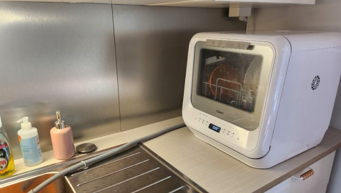
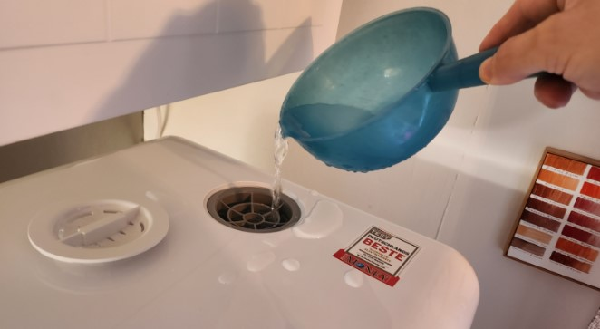
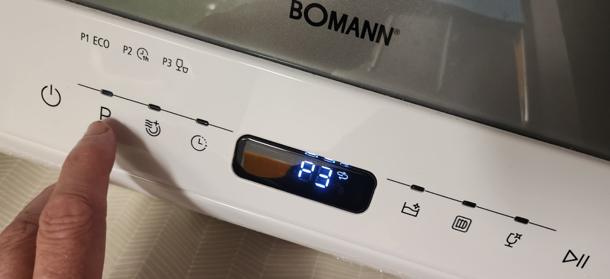

# Tammisaari Cottage Dishwasher instructions

This is part of [Tammisaari Cottage instructions](/post/airbnb-tammisaari-instructions)

Tammisaari Cottage kitchen has a small desktop dishwasher device **Bomann TSG 5701** for washing dishes. can be used for some small-scale dishwashing of small dishes. Larger and more dirty dishes need to be [hand-washed in the sink](/post/airbnb-tammisaari-instructions#washing-dishes).

Dishwasher is a model that does not need permanent water-connection. Instead about 5 L of water is added to the dishwasher internal water-tank and that is sufficient for the whole program.

## Full manual

* [Full manual of the dishwasher (in Finnish)](https://github.com/rbrother/articles/raw/refs/heads/main/airbnb-tammisaari-dishwasher/bomann-tsg-5701-suomi.pdf)
* [Full manual of the dishwasher (in English)](https://www.manualpdf.in/bomann/tsg-5701/manual) 

## Quick instrucions

1. Pre-rinse dishes in the sink to reduce significant food remains. The dishwasher can become clogged if there is too much food waste inside.
1. Put dishes inside the dishwasher.
1. Put a small amount of dishwasher detergent powder to the dip on the inside of the door. Small teaspoon is enough since the machine is small. (Do not use detergent tablets since they are too big to dissolve.)
1. Close the dishwasher door.
1. Ensure that the dirty water discharge pipe is in the sink (see picture above). During the washing the dishwasher will discharge used dirty water through the pipe.
1. Turn the dishwasher power on.
1. Add water to the dishwasher from the top opening using a scoop or bottle or other suitable tool. About 5 L of water needs to be added. **The dishwasher will emit a series of beeps when enough water has been added.**

8. Choose washing program:  
    P3 -> 30 mins (Recommended, usually this is enough)  
    P2 -> 1 hours  
    P1 -> 2 hours
    
    

9. Start the washing from start-button on the right-side of the panel
1. The washer will perform a washing cycle and then rinsing cycles.
1. In the end the washer display shows "End"
1. Open the door
1. You can leave the dishes to dry in the machine or lift them to dry to the shelf above the sink

