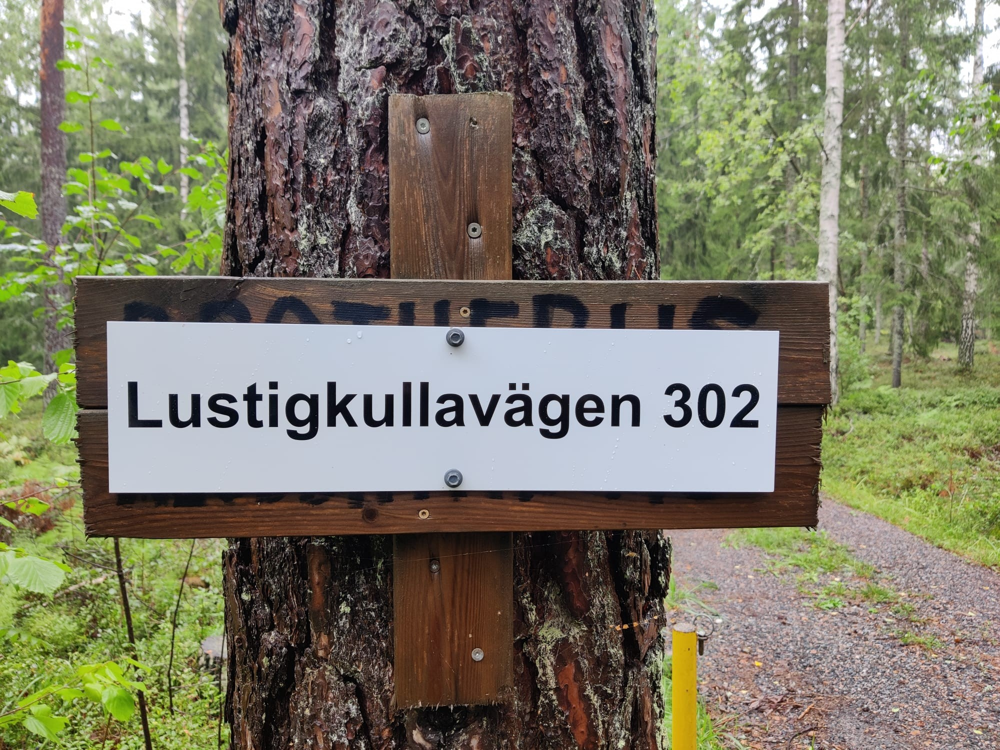

# Summer cottage “Skinnaräng” in Tammisaari, Raasepori, Finland

This instruction document online: https://www.brotherus.net/post/airbnb-tammisaari-instructions

Owner: Robert J. Brotherus  
Phone: +358 45 1145602 (also whatsapp)  
Email: robert@iki.fi  
Facebook: robert.brotherus

## Style and nature of the cottage and its surroundings

While we have dozens of happy guests every year, it is good to understand that this is a primitive traditional Finnish summer-cottage from 1976 with limited maintenance and might not be suitable for some guests who have expectations of higher standards. We wish to have guests who are happy with the cottage, so please consider whether the following points are important for you and discuss with the host beforehand if you are concerned:

* The area around the cottage is not maintained as a garden or lawn, so it grows nature's wild plants from the forest like ferns.
* The cottage has an outside composting toilet (no water-flushing toilet) and has a traditional Finnish Sauna for washing (no shower).
* The area is rather hilly and the path to the sauna and shore quite steep, so not all facilities are suitable for people with movement disabilities.
* The sea-shore at the cottage area is at a bay which has muddy shallow shores with lots of bullrush, reed and seaweed growing, especially when temperature gets hot in the summer. We try to compensate for this with a long jetty and a rowing boat for your use, but the quality of the swimming experience can be still limited.
* Since we don't live close to the cottage, I cannot visit the cottage after every guest but do maintenance-visits approximately every two weeks. Therefore we rent the cottage in "self-service" fashion which relies on the guests cleaning the cottage after their visit for the next ones. If you are not willing to do this, please consider renting a different cottage.
* 95% of the time guests clean the cottage well, but in some rare occasions guest cleaning work is substandard causing inconvenience to the next one, which might be you. While in serious cases I can compensate for this with a discount to the rent, please consider if you can tolerate a small risk of problems regarding initial cleanliness of the premises.

## Arrival instructions

Official address: Lustigkullavägen 302 (Lustigkullantie 302), Raasepori  
[Location of Lustigkullavägen 302 on map](https://www.fonecta.fi/kartat/Lustigkullantie%20302,%2010600%20raasepori?lon=23.521535396575928&lat=59.97633983533491&z=15).  
Old address before 2010: Aluddintie 118 (Some old maps might still use this)  
Distance from Helsinki about 100 km, driving time about 1.5 hours.

Aim to arrive as early as possible in the evening since if it is very dark in the evening, navigating the small countryside roads can be more difficult. Furthermore if the weather is bit cold, it’s good to have some time to warm up the fireplace and cottage for the night.

Instructions:

1. From Tammisaari, drive south over the bridge to Gammelboda island
1. In Gammelboda, drive about 1.5 km and then turn left to the Lustigkullavägen
1. Drive about 3 km along Lustigkullavägen (first alongside Ekegolf golf course) to get to Lustigkullavägen 302
1. At Lustigkullavägen 302 there is an address sign with “Lustigkullavägen 302” text. Turn there left to the small forest road and drive about 200 m to get to the cottage.

The final forest road turning at Lustigkullavägen 302:

## Key

Outside door with water faucet (blue) and combination-lock key-box (red):

Ask the owner to tell you the current combination number to unlock the box.

## Opening and closing the door

To open the door, keep turning the key in the lock and then push strongly against the door.

To keep the door from locking when closed, flip the small “locked-unlocked” switch on the edge of the door to other position:

I recommend keeping the door unlocked during your whole stay. The cottage is in quite a remote location with no intruders so it is quite safe to keep the door open even if you do some sightseeing trips away from the cottage.

Please return the key to the key-box after opening the door and unlocking it. In this way you will not lose the key, lock yourself outside or forget to return the key to the box in the end.

If you still do lose the key, there is a hidden emergency key at the premises, call the owner to ask for the location.

## Return the key to the box at the end of your stay

To lock the door again, flip the switch back to the “locked” side, close the door and then strongly push against the door strongly for the lock to “click” in. If it does not click to lock easily it might require some oiling (inform the owner about this).

## Initial check for cleanness

Since the cottage is rented on a “self-service” basis, all guests have the responsibility to clean and arrange the cottage after their stay. Since as the owner I do not have possibility to visit the cottage after every guest, please after arriving, check that the previous guest have been cleaning and arranging properly after their stay:

1. Are the floors clean?
1. Are all the dishes washed?
1. Is the kitchen clean?
1. Is the fridge clean?
1. Are items and furniture arranged neatly?
1. Is there enough clean linen remaining in the linen closet?
1. Is trash taken away?

Please report to the owner any significant uncleanness or other problems. If the problems are significant and cause notable extra work or trouble for you, I will offer a reduction in the cottage rent sum as compensation.

## Room plan

With 1-3 guests, I recommend using bedroom 1, since it is quicker to heat and has darker curtains to keep the room dark in the finnish summer nights.

With the living room sofa-bed extended, total number of bed places is 2 + 2 + 2 + 1 = 7

## Bedware, sheets and towels

If you want to use linen / towels of the cottage, check first if there is clean linen and/or towels hanging on the back balcony drying lines after being washed by previous guests. If so, prefer to use those.

In the bedroom 2 there are two closets that have clean sheets and towels, plus additional blankets and pillows on shelves:

If you are using the double-bed but there are not enough clean double-bed linen remaining, you can use two single-bed linen for the double bed.

If you use linen or towels from the cottage, please [wash them in the end of your stay in the balcony washing machine](#washing-machine-and-dryer)

## Living room Sofa bed

If you have a need for more beds, you can unfold the sofa-bed in the living room to a double bed.

This is IKEA EXARBY sofa-bed With a clicking-mechanism for converting between sofa and bed:

Here is also: [video showing the mechanism](https://www.youtube.com/watch?v=pjEt9H_a45Q)

## Electricity

The cottage has electricity. The main electric switch with fuses is in the lobby after coming in from the main door.

Do NOT switch off the main electricity switch when leaving the cottage.

A single 10 Amp fuse can support 2300 W of power. Avoid using more power at the same time in a single room to avoid burning out fuses.

In the rare case of short-circuit or over-using power, a fuse might burn out and need to be replaced. There are replacement fuses in a drawer in the living room.

There is another electricity/fuse-box in the forest about 10 m from the cottage at an electric pole. That contains main 20A / 25 A fuses. In even more rare cases some of those might burn out and need to be replaced.

## Electric Radiators

We recommend using fireplace should be the main method of heating the cottage. However, if needed, rooms have electric radiators which can be switched on or off and whose temperature can be controlled.

Please switch off any electric radiators in the end of your stay.

## WiFi / internet / Computer

In a living-room shelf there is a 4G-wifi router that gives Wifi internet-access.

Wifi id: `cottage`  
Password : `helsinki`

In the shelf there are USB-loudspeakers, USB-hub, USB cables and USB.charger. These can all be used by guests when returned afterwards to this location.

## Television and computer

Living room has a television that can be used to watch antenna-tv channels.

Television is also connected to a computer that can be used to watch internet-content.

Switching between TV-mode and computer (HDMI-connection) can be done with buttons on the bottom-right side of the TV.

Guest computer can also be connected to the television with the HDMI-cable.

## Water

Clean and drinkable water from a drill-well is available at the cottage. The water faucet (blue in picture below) is in the wall near the main door. You can take water for use in the kitchen directly from the tap to a bucket.

Water main switch is at ground near the main door, below the switch is shown open. Please close the switch in the end of your stay.

## Washing machine and dryer

Back balcony has a washing machine that you can use to wash your clothes and linen and a dryer for drying them. If you use towels or linen from the cottage you should also wash and dry these at the end of your stay.

We recommend using the quick program for washing the linen.

## Kitchen and cooking

Kitchen has:

* Electric stove with cooking plates and oven
* Microwave oven
* Water cooker
* Coffee-maker
* Bread toaster
* Sink for washing dishes
* Dish washing brush and washing detergent.
* Buckets for carrying water from the balcony faucet.
* Lots of dishes, pots and pans in the closets.
* Small desktop dishwasher (see separate [Tammisaari Cottage Dishwasher Instructions](https://docs.google.com/document/d/1CJ4Sjbl-GfPgYHZ1of_QSLIa4yv6zziPQVftAqQPWEM/edit?usp=sharing).)

For food storage, a fridge with freezer box is located in the closet on the right side from the main door.

On the back balcony there is a small grill that can be used for barbecue.

## Fireplace

**If you want to use the fireplace, follow these instructions carefully.** Attempts to set fire to the fireplace in any other way will cause smoke to fill the cottage!

1. Open some outside door of the cottage a little so that the pressure inside the cottage equals outside pressure.
1. Open the small bottom hatch (1)
1. Put small amount of paper inside the small hatch and set it on fire
Keep burning small paper in the bottom hatch for about 5 minutes. This will heat up the chimney-pipe so that smoke will rise up to the chimney and not be pushed to the room.
1. After burning paper in the bottom hatch for about 5 minutes, there should be a strong draft of air being sucked into the hatch when the paper is burning. Wait for the fire in the hatch to die out.
1. Close the small hatch (1)
1. Open the main fireplace outer hatch (2) and the inner hatch inside it.
Build fire to the main fireplace (2) with paper, small wood and large wood. You can also use the fire starter liquid inside the corner closet opposite to the fireplace.
1. When the fire is burning, keep the inside part of the hatch (2) slightly opened and the outer part fully opened. If you close the inside hatch fully, it might get stuck as the heat expands it.

After burning the fire and cooling down, if there is a significant amount of ash in the fireplace, move the ash with the metal spade to the metal ash bucket.

Once fire has been burned in the fireplace successfully for some time, it remains hot for several hours after the fire stops. When the fireplace is noticeably warm, the draft is easy to obtain and a new fire can be set there more simply and directly without needing to burn paper in the bottom hatch first.

## Fire-safety

Be careful with fire since the cottage is wooden.
Do not leave the fireplace or candles unattended when on.
Do not smoke inside

Fire-extinguisher is located on the wall near the fireplace:

There is a smoke-detector in the roof of the living-room:

You can inspect that the smoke-detector is working by keeping its button pressed for a few seconds - a loud noise should be emitted.

In case you have trouble using the fireplace and smoke is coming to the living-room, the smoke-detector will start making loud a noise. You can stop the noise by pressing its button briefly.

## Toilet and wood shed

Toilet (behind, on the left) and wood shed (on the right)

Woodshed has firewood for the use of the fireplace and sauna. Some piles of wood are more dry and good for burning, others are still too fresh and wet to burn well. Inspect the wood piles on both sides of the shed and try to find the most dry wood to use. You can also use the ax inside the shed to make pieces of wood smaller for easier burning.

## Composting toilet

After using the toilet, add some composting agent from the yellow bucket to the toilet. If the yellow bucket is empty, you can fill it from a large green bucket in the right-hand room of the wood-shed or gather some old leaves from the ground to the bucket.

If the toilet-container becomes close to full, inform the owner to come empty it.

## Sauna

The traditional Finnish wood-fired Sauna is located down the hill close to the sea-shore and can be freely used for washing and warming up:

## Getting water to the sauna

Before fire is set to the sauna stove, the hot-water container in the chimney above the stove must be filled with water from the opening on the top. Also the large cold-water bucket inside the sauna can be filled at this point. Water-hose with a switch is located on the Sauna balcony.

## Using Sauna for washing

1. After filling the water-containers, make fire to the Sauna stove. Keep adding wood as needed, approximately every 20-30 minutes
1. After about 30-60 minutes the Sauna is warm and the water in the hot-water container above the stove should also be quite warm.
1. While In sauna you can throw water to the stones to get "löyly", more heat
1. You can mix hot water from the hot-water container and cold water in some smaller bucket to get water that is suitable warm for washing.
1. Use a scoop to rinse yourself with the warm water

## Draining water from Sauna

Before using the Sauna, check that the water drainage hole on the floor is unblocked so that water on the floor can drain out. The hole is about 2 cm in size and located in the center of the groove that round across the middle of the Sauna floor. Remove any trash from the center of the groove to reveal the hole.

## Shore and jetty

The sea-shore near the cottage is rather shallow and muddy, but there is a long jetty that can be used to access the water and go swimming from Sauna or for fishing.

## Boat

A rowing boat can be used by the guests.:

If there is some rain water inside the boat, use a scoop to remove it.

In addition to oars, there is a small electric motor and 12-volt battery that can be used with the boat:

The motor is stored on the outside wall of Sauna and the battery and charger are inside Sauna.

Care and expertise should be used with the electric engine. Please consult if needed [the electric engine manual](https://www.motorguide.com/content/dam/motorguide/owners-resources/owners-manuals/R3%20Owners%20Manual%20-%202017.pdf).

If you use the engine, return the battery inside and charge with the charger. Make sure the red clip goes on the plus head and black clip to the minus (-) head of the battery.

## Using your own boat

If you have your own boat on boat-trailer, you can put it in to water at a boat ramp at Tammisaari town, address “Pursitie 6” (“Skutvägen 6”), shown in map below

You can attach your boat then to the cottage jetty, the water depth at the end of the jetty is about 1 m

Tammisaari area is famous for fishing Pike.

## Services in Tammisaari

## Sightseeing around Tammisaari area

Good english website of sightseeing in Tammisaari / Raasepori area:
http://www.visitraseborg.com/en/

For example:
* [Beaches for swimming](http://www.visitraseborg.com/en/sights/activities/beaches)
* [Museums and galleries](http://www.visitraseborg.com/en/sights/culture-history/museums-galleries)
* [Cruises at the sea](http://www.visitraseborg.com/en/sights/archipelago/cruises)
* [Nature trails](http://www.visitraseborg.com/en/sights/activities/nature-trails)
* [EkeGolf golf course](http://ekegolf.fi/index.php/fi/) just 2 km from the cottage
* [Boat rentals](https://www.visitraseborg.com/en/service/boat-rentals/) if you need a bigger boat

## Cleaning and leaving the cottage

1. If you have used towels and/or linen from the cottage, wash them in the balcony washing machine, dry with tumble-drier or leave them to dry on the hanging lines on the balcony.
1. Vacuum clean the floors (vacuum cleaner is in closet near the entrance)
1. Wash dishes. For hand-washing you can mix hot water (from the water cooker) and cold water in the sink and add some dishwashing liquid. Have clean water in another bucket for rinsing. Or use the dishwasher device.
1. Clean the kitchen sink and washing table.
1. Empty the fridge. Clean the fridge interior if it has got dirtied. If there are some well-preserving foods (like butter or ketchup) in the fridge, you can leave them for the next guest.
1. Put items and furniture in their original locations.
1. After cleaning, please send the host photo from the kitchen, living room and main bedroom to the host.
1. Switch off all lamps, electric radiators and other electronic devices. However, do not unplug or switch off the wifi/computer-devices or the living-room remote-heating radiator.
1. Lock the doors and place the key back to the combination-lock box (unless it's there already)

## Trash

1. Burnable trash (paper, burnable plastic) can be burned in the fireplace (see instructions about the fireplace)
1. Food and other bio-trash can be thrown to the composting toilet.
1. Other trash should be collected in plastic bags and at the end of the visit disposed of in the green trash container at the crossroads of the cottage road.

## Thank you and welcome again!

Thank you for staying at our Tammisaari cottage! We hope you enjoyed your stay and the nature surroundings. Please let us know of any suggestions of how to improve the cottage even more. If you or your friends want to come again, ask us directly for the best price.
