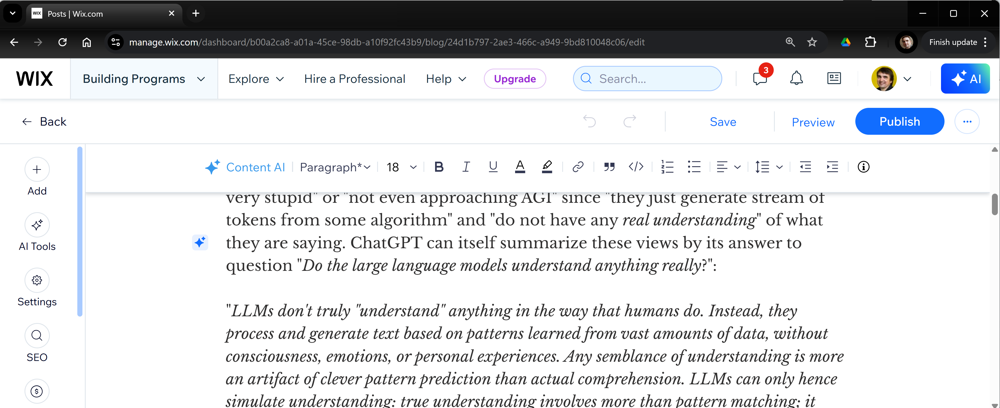
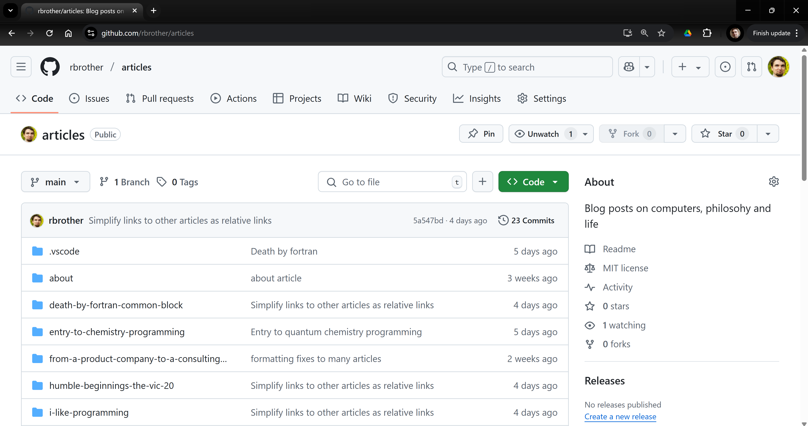
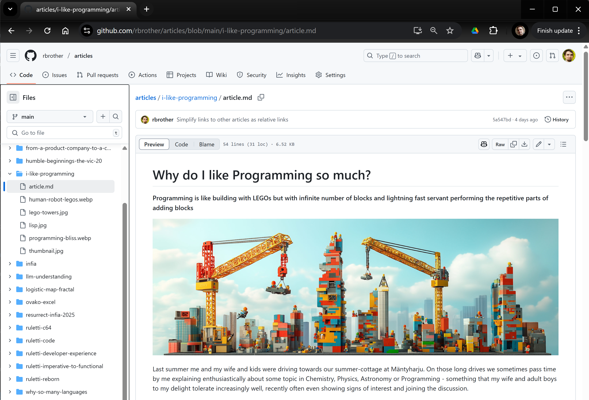
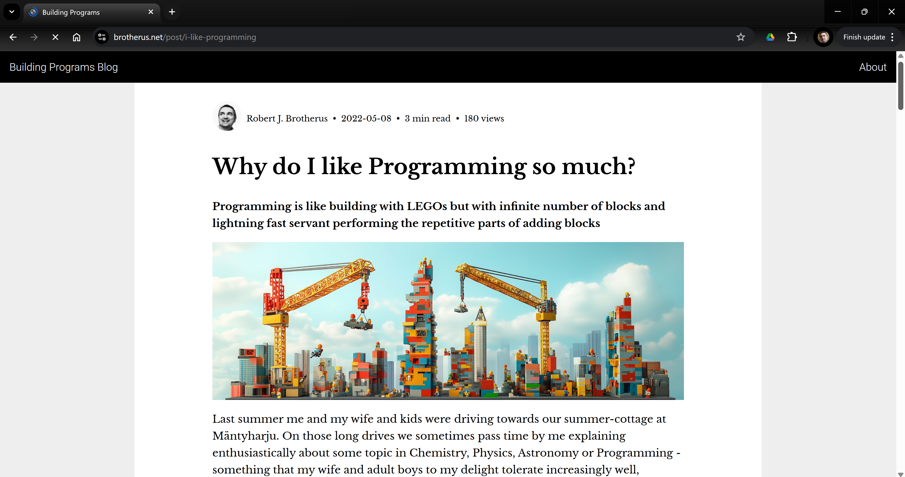
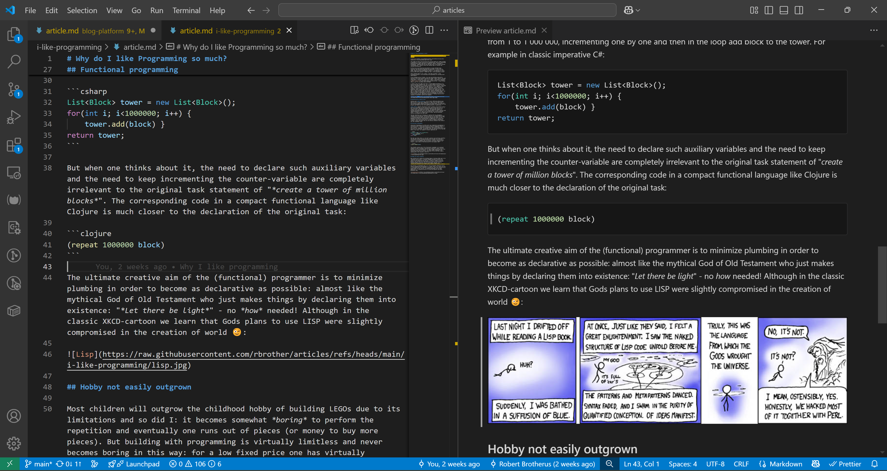

# From Wix to a custom blog-platform

## Blogspot and Wix

I started this blog featuring my thoughts and history on software development originally in 2019 on the [Blogger platform](https://www.blogger.com/). Blogger is owned by Google and host blogs in the famous and once dominant [blogspot.com](https://blogspot.com) address. Blogger was familiar to me from writing an earlier [far-yet-close blog](https://far-yet-close.blogspot.com/2012/08/mothers-and-cursing-horses.html) on my remote relationship with a Chinese girl in 2012-2013.

After just a couple of posts to *Building Programs*, I decided in late 2919 to migrate from Blogger to the [Wix platform](https://wix.com). Wix supports blogging with [WYSIWYG](https://en.wikipedia.org/wiki/WYSIWYG)-editor like Blogger, but allows also custom web-page design in addition to blogging. In this sense Wix is comparable to *Squarespace* and *Weebly*, all popular web-site platforms that are suitable for non-programmers. The are easy to get started with and feature a free tier with some limitations.

In addition to the more extensive features and layout customizations, I wanted to move to Wix to connect it to my domain `brotherus.net` which I had acquired already in 2003 and used for various websites since then. Wix supports connecting of custom domains, though not for the tree tier: I have been paying about 150 €/year for my Wix premium-subscription since 2019 on top of the domain-fee.

I was mostly satisfied with Wix for the past five years. The WYSIWYG editor worked reasonably well, the visual templates I could choose looked slick and the 150 €/year was not breaking my budget. But slowly some concerns and wishes for something better started to build up.

## Unexpected WYSIWYG behaviors

While WYSIWYG-editing of articles has some advantages, there are occasional inevitable moments of confusion. We all know when editing a document with WYSIWYG-software like MS Word, LibreOffice Writer or Google Docs, that sometimes the editing operations do not work in an intuitive way. What should happen, for example, when one deletes the new-line between a heading and subsequent paragraph? Perhaps one expects the heading text to be merged with the paragraph, but perhaps the software changes the paragraph to heading style instead. There are several editing operations like this, where the outcome is not strictly determined and something unexpected might happen.

<small>Editing a blog post on Wix WYSIWYG-editor</small>

My most painful post regarding this was the [Death By Fortran Common Block](https://www.brotherus.net/post/death-by-fortran-common-block) which has several consequent pre-formatted blocks showing email-excerpts. It involved considerable fighting with Wix editor to get the pre-formatted blocks separated by one line of regular paragraph. Occasionally Wix decided to convert the whole pre-formatted block to regular paragraph when I was trying to convert one line. It's not Wix to blame: with any WYSIWYG-editor it can be difficult for the editor logic to determine how to map specific editing operation to the underlying structure of the document.

On the other hand, I have been using various [Wiki-systems](https://en.wikipedia.org/wiki/Wiki) from early 2000s and for many years used [Atlassian Confluence](https://www.atlassian.com/software/confluence) for both personal website, notes and team documentation at [Napa](https://www.napa.fi/) during 2007-2018. As a programmer I had created my first websites in the 1990s with hand-written HTML and I liked the way the wiki-syntax was powerful like HTML but more concise and readable. An example of wiki-markup is the [MediaWiki syntax](https://www.mediawiki.org/wiki/Help:Formatting) used by the most famous and valuable of all Wikis, [The Wikipedia](https://www.wikipedia.org/). Such wiki-markup is then transformed programmatically to HTML for final viewing. Most importantly, since the wiki-syntax was *just text*, editing it with text-editor is always fully deterministic with zero surprises and full control of the outcome.

The problem in the early days of Wikis was that there were really many [different wiki-systems](https://en.wikipedia.org/wiki/List_of_wiki_software) and all of them used different custom syntax rules. This meant that any text written for such wiki produced a sort of "vendor lock" to that platform, which is not good for long run. I have for example still a lot of Confluence-markup from my personal Confluence-site, but I don't have a working Confluence installation any more and new Confluence versions have moved towards WYSIWYG-editing.

In light of this earlier cacophony of formats, seeing the rise of [Markdown](https://en.wikipedia.org/wiki/Markdown) as a de-facto standard in the markup-jungle has been refreshing. It renewed my interest to return blogging with text-based markup again. Markup-supporting tools and libraries have proliferated on many programming languages and frameworks, so using Markup no longer implies a single-platform lockdown but is more akin to a standard like HTML. In particular, the de-facto code platform *GitHUB* supports viewing Markdown-documents in its repositories so that some document/book-projects nowadays are implemented simply as a GitHub repos with markdown-files.

## Programming, Programming!

Another nagging thought when I was writing posts in Wix was this: Wix is a tool for making it easy for non-programmers to create web-pages, but *I am not a non-programmer, I am a programmer liking programming*. On a typical year I have several hobby-programming projects, most recently a [website for my Chinese wife handicraft designs](https://cacatelier.fi/). Such a website can be implemented with modern tools and libraries on free time during few weeks (and this does not even take into account the productivity boost from modern AI-based code tools).

Custom programming provides both ultimate freedom to do the site exactly as I want and ultimate control for knowing exactly what to do to implement any requirement along the way. Trying to configure 3rd party web-site services like Wix to a certain look and feel has similar unpredictability and lack of control as WYSIWYG-editor has in editing a complex document. Whereas programming the desired look and feel with HTML, CSS and events provides same kind of control in the whole website as Markdown provides for the document content and editing.

So I developed a growing thought, that creating a custom webapp for Markdown-based blogging would be both good learning exercise and fun to work on as a hobby project. I also estimated the effort to be quite reasonable due to the wide availability of libraries for the core logic of Markdown->HTML conversion.

## From reasonable price to practically zero cost

While the Wix 150€ / year cost was definitely not breaking my budget, it is still not nothing. Cost of a custom website with custom programming used to have similar cost in the days when cloud-hosting was synonymous with renting of a virtual computer. But with todays serverless cloud services like AWS *S3*, *CloudFront*, *Route 53* and *Lambda*, the price scales with the amount of usage. For a low-usage website like my wives [cacatelier.fi](https://cacatelier.fi) or my blog platform with, say, 1 GB of data and 1000 accesses of 1 MB per month, the cost is virtually negligible:

* S3 storage: $0.25 per *year*
* S3 Bandwidth: ~$0.01 per year (low due to cloudfront caching)
* Cloudfront: $0.80 per *year*
* Route 53 routing of custom domain: $5 per *year*
* TOTAL ~ $6 per year

This is negligible, much less than the $20 I pay yearly in any case for the `brotherus.net` domain.

Even if I want to add some backend logic with AWS Lambda later, the service includes *free of charge* 1 million invocations and 3 million seconds of compute time per month, which is orders of magnitude more than used by a simple website.

## The risks of internet oblivion

In my circle of freethinker acquaintances, a quite blogger [Jaakko Wallenius](https://fi.wikipedia.org/wiki/Jaakko_Wallenius) has been writing multiple blogs like `uskoitseesi.blogs.fi`, `beinghuman.blogs.fi`, `thelittlebook.blogs.fi`, `ikkunat.blogs.fi` and `odotushuone.blogs.fi` with total views approaching 800 000. In 2013 after 7 years of active blogging and over 1000 articles, he wrote: "I have loved the thousands of hours that I have spent writing and editing this blog."

Jaakko Wallenius Died of cancer in June 2013 at age of 55. His friend **Jussi K Niemelä** wrote in [a memorial](https://jussikniemela.blogspot.com/2013/06/jaakko-j-wallenius-in-memoriam.html): "*This huge internet activity [the blogs] is the major legacy Jaakko left behind for us. He comforted and taught us, providing the wisdom of ages for anyone interested in philosophy, rationalism, secularism and scientific thinking.*"

<small>Jaakko Wallenius in 2010</small>

In 2016 all of Jaakkos blogs stopped working, in fact the whole `blogs.fi` domain disappeared later and today `beinghuman.blogs.fi` returns ERR_NAME_NOT_RESOLVED just like if the blog would have never existed. For those rare individuals who knew the blogs well *and* remember the URLs *and* and are willing to do some detective work *and* know of the [Internet Wayback machine](https://web.archive.org/), can find some partial content like the [2014 Archived beinghuman.blogs.fi](https://web.archive.org/web/20140913003516/http://beinghuman.blogs.fi/). But for the 99% of internet audience, all the texts and Jaakko Wallenius internet legacy disappeared to oblivion.

Information online is more easily accessible than traditional books, but it is also more brittle to disappear in the way Jaakkos blogs disappeared. Hence the final reason for me to move from Wix to another platform was the concern for the long-term preservation of the texts. In this respect, I was drawn to the ultimate form of stability on the ever-changing internet-landscape: *GitHUB*. The stability of a GitHUB repository comes from three reasons:

1. It is owned and supported by Microsoft, the #1 most valuable company in the world with immense technical and financial resources and staying power.
1. Todays trillion-dollar software-business and almost all software-companies are highly dependent on thousands of free open-source libraries hosted on GitHUB. For these businesses to keep operating, all these libraries must be found in the same exact URLs with extreme reliability and longevity. Therefore even in the unlikely event that Microsoft would be magically destroyed overnight, all the big software-companies of the world would come together in zero time to set up a new alliance to keep GitHUB servers running smoothly for virtual eternity.
1. GitHUB repos are free of charge up to a quite high size limit. This means that any credit-cards or paypal-accounts stopping working or any bank-accounts running dry will not result into any project or file being deleted.

These properties should make GitHUB *deathproof* unlike whatever tech stack and platform Jaakko Wallenius used. In addition to robustness, GitHUB also supports viewing of Markdown files and there are some real document projects using it directly.

## Combining robust & fancy

Yet using only GitHUB has also some obvious limitations: The UI is quite technical and general without customization possibilities and there are no searching or sorting functions that are useful for a good blog user-experience.

Trying to decide between the robustness of GitHUB and the power and control of custom-programmed blog-platform, I realized that it is possible to do *both*: have the documents stored in GitHUB for a durable low-UX view and build a custom blog-application for better display and navigation.

So I created on my GitHUB account a public a repo [https://github.com/rbrother/articles](https://github.com/rbrother/articles) which serves as a robust permanent storage for the texts and their associated images:

The repo has a strict structure of a single folder for each article and its associated images. Markdown-file `article.md` in each folder contains the content of the article and this can be directly viewed in GitHUB:

Then I programmed and deployed to [https://brotherus.net](https://brotherus.net) a custom web application with ClojureScript / React / [Re-Frame](https://day8.github.io/re-frame/re-frame/). The application gets the raw data from the GitHUB articles repo and displays it with custom Markdown conversion and formatting, with custom clean UI (similar my earlier Wix blog), search-capabilities and other added blogging-specific features:

This dual strategy allows full UX for the blog in "good times" and provides a backup for long-term durability for possible "bad times".

## Conversion of articles

In the end, the conversion of existing articles from Wix to Markdown was larger effort (~ 40 hours) than writing the software for the blog-platform  (~ 20 hours). I don't have so many articles yet, but some of them are fairly long, so that the total content is approximately 75 A4 pages of text plus the accompanying pictures. In this regard, it was good to do the tech-conversion rather earlier than later. And what's more, since markdown is computer-readable format, any possible future conversions can be done automatically with a small program.

Since Wix does not provide access to the low-level data that document comprises of, some manual work could not be avoided in this conversion. For simple paragraphs of text, it was just matter of copy-paste to markdown document. But in many paragraphs I use links and *emphasized* text written in markdown as `*emphasized*` which needed to be re-applied after copying to text (see [Markdown Guide](https://www.markdownguide.org/cheat-sheet/) on how to represent various text styles in Markdown).

<small>Editing a Markdown article in VSCode with a real-time preview</small>

There were also advantages in needing to semi-manually go thorough the texts again. I was able to correct many spelling mistakes (thanks partly to better spell-checking facilities of VSCode than the Wix platform) and revise some sentences on higher level.

Any images I had used in Wix I saved to same folder as the `article.md` markdown-file of the post. This allows in GitHUB the insertion an image with very simple syntax `` without complex URL paths. Markdown does not support embedding of images in the text out-of-the-box so to keep things simple I chose in the conversion to use images only as separate paragraphs.

## "It does not look like anything to me"

In a software conference I was once listening to a talk by a HBO Tech Lead titled "*It does not look like anything to me*". The title was a reference to a line in HBOs *WestWorld* series (I tell no more to avoid spoilers, but do watch the Season one!) The topic of the talk was how HBO had switched all of their streaming services from one storage-platform provider to another. HBO has *a lot of storage* and they do *a lot of streaming* from that storage. Still they were able to switch from one provider and tech stack to a different provider and tech stack *on the fly with no downtime* and so that *no viewer noticed*, even if they were in middle of streaming some episode. Indeed quite a feat to do such a shift so that *it does not look like anything* to the viewers.

In switching from Wix to my custom blog-platform, I wanted to set myself a similar goal for the transition: the URL for the blog ([https://brotherus.net](https://brotherus.net)) and the URLs for each individual article (such as [https://brotherus.net/post/i-like-programming](https://brotherus.net/post/i-like-programming)) should remain identical and simply switch at some moment of time from pointing to an article in the Wix-blog to the corresponding article in the new custom blog. This would allow old bookmarks to remain valid. I was able to make good of this wish, though in the switch I had in the end about one hour of downtime.

After the switch, the old WIX site now remains visible at [https://robert3389.wixsite.com/building-programs](https://robert3389.wixsite.com/building-programs) but I will not add any new articles there. I still have some draft non-published articles there that I will bring to the new platform before shutting down the Wix site. There is no hurry money-wise doing that since without the custom domain I'm back in the Wix free plan.

## A Delightful writing experience

Already during the conversion of my existing blog-articles, I have been starting to like the feeling of control of working with local files edited with proper text-editor like VSCode - something that I of course do a lot in my software development job for program code files. The possibility to check-out the articles repo and then work locally without internet connection is an added bonus. With Markup I feel I am focusing more on the content and less on fighting with the editing. Adding pictures is super smooth. In a way it feels like a return to the legendary [WordPerfect 5.1](https://en.wikipedia.org/wiki/WordPerfect#/media/File:Wordperfect-5.1-dos.png)  - the last pre-WYSIWYG version - but without the downsides. I hope and expect that this pleasant experience will accelerate my process of writing more on my software-career stories in this blog as well as expand to publish some of my articles on topics of skepticism, atheism and religion.
