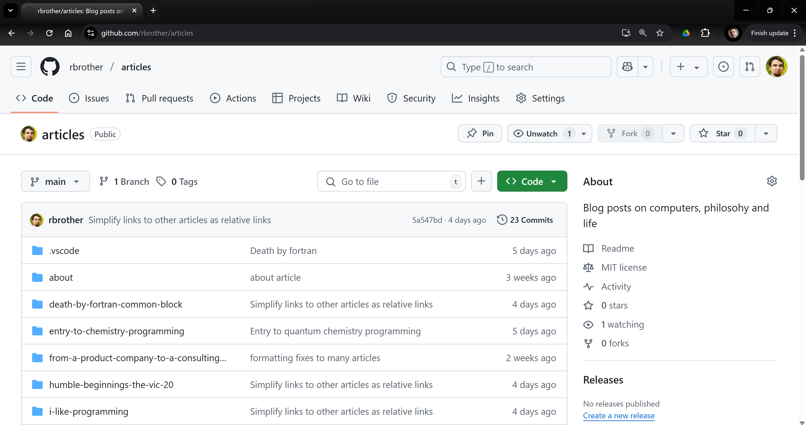
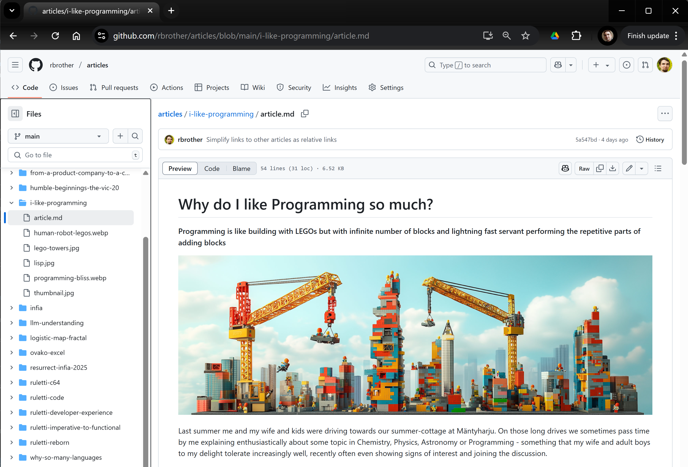
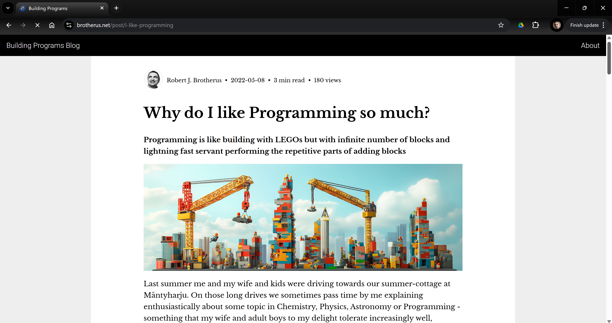

# The architecture of this blog

## From Blogger to Wix in 2019

I started this blog featuring my thoughts and history on software development originally in 2019 on [Blogger platform](https://www.blogger.com/). That platform is owned by Google and host blogs in the famous [blogspot.com](https://blogspot.com) URL. Blogger was familiar to me from writing earlier [far-yet-close blog](https://far-yet-close.blogspot.com/2012/08/mothers-and-cursing-horses.html) on my remote relationship with a Chinese girl in 2012-2013.

After just a couple of posts, I migrated from Blogger to the [Wix platform](https://wix.com). Wix supports blogging with WYSIWYG-editor like Blogger, but allows also custom web-page design (blogging is just one feature). In this sense Wix is comparable to *Squarespace* and *Weebly*, all popular web-site platforms that are suitable for non-programmers. The are easy to get started with and feature a free tier.

In addition to the more extensive features and layout customizations, I wanted to move to Wix to connect it to my domain `brotherus.net` which I had acquired already in 2003 from [Joker.com](https://joker.com/) and used for various websites since then. Wix supports connecting of custom domains, though not for the tree tier: I have been paying about 150 €/year for my Wix premium-subscription since 2019.

I was mostly satisfied with Wix. The WYSIWYG editor worked reasonably well, the visual templates I could choose were looked slick to me and the 150 €/year was not breaking my budget. But slowly some concerns started to develop.

## Unexpected WYSIWYG behaviors

While WYSIWYG-editing of articles has some advantages, there are the inevitable moments of confusion. We all know when editing a document with MS Word, LibreOffice Writer or Google Docs, that sometimes the editing operations do not work in an intuitive way. What should happen, for example, when one deletes the new-line between a heading and subsequent paragraph? Perhaps one expects the heading text to be merged with the paragraph, but perhaps the software changes the paragraph to heading style instead. There are several editing operations like this, where the outcome is not strictly determined and something unexpected might happen.

My most painful post regarding this was the [Death By Fortran Common Block](https://www.brotherus.net/post/death-by-fortran-common-block) which features several consequent pre-formatted blocks (for emails). It involved considerable fighting with Wix editor to get the pre-formatted blocks separated by one line of regular paragraph.

I have been using various [Wiki-systems](https://en.wikipedia.org/wiki/Wiki) from early 2000s and for many years used [Atlassian Confluence](https://www.atlassian.com/software/confluence) for both personal website / notes and for professional team documentation at Napa Oyj during by time there in 2007-2018. As a programmer I had created my first websites in the 1990s with hand-written HTML and I liked the way the wiki-formatting was much more concise and readable than HTML. Yet such wiki-text transformed to HTML for viewing with precise rules, like the [MediaWiki syntax](https://www.mediawiki.org/wiki/Help:Formatting) used by the most famous and valuable of all Wikis, [The Wikipedia](https://www.wikipedia.org/). And most importantly, since the wiki-syntax was *just text*, editing it with text-editor was always fully deterministic operation with zero surprises and full control of the outcome.

The problem in the early days of Wikis was that there were really many [different wiki-systems](https://en.wikipedia.org/wiki/List_of_wiki_software) and all of them used different custom syntax rules. This meant that any text written for such wiki produced a sort of "vendor lock" to that system, which is not good for long run. I have for example still a lot of Confluence-markup from my personal Confluence-site, but I don't have a working Confluence installation any more and new Confluence versions have scrapped the Confluence-markup in favor of WYSIWYG-editing.

In light of this earlier cacophony of formats, seeing the rise of [Markdown](https://en.wikipedia.org/wiki/Markdown) as a de-facto standard in the markup-jungle has been refreshing. It renewed my interest to return blogging with text-based markup again. Markup-supporting tools and libraries have proliferated, so it no longer implies a single-platform lockdown but is more akin to a super-standard like HTML. Particularly the de-facto code platform GitHub supports viewing Markdown-documents in its repositories so that some document/book-projects nowadays are implemented simply as a GitHub repo with markdown-files.

## Programming, Programming!

Another nagging thought when writing posts in Wix was this: This is a tool for making it easy for non-programmers to create web-pages, but *I am a programmer, not a non-programmer*. On a typical year I have several hobby-programming projects, most recently a [website for my Chinese wife handicraft designs](https://cacatelier.fi/). Such website can be implemented with modern tools and libraries in few weeks of evenings (without even taking modern AI-based code development into account).

Custom programming provides both ultimate freedom to do the site exactly as I want and ultimate control for knowing exactly what to do for any requirement along the way. Trying to configure external web-site services to a certain look and feel has similar unpredictability and lack of control as WYSIWYG-editor has in editing a complex document. Whereas programming the desired look and feel with HTML, CSS and events provides same kind of control in the whole website as Markdown provides for the document content and editing.

So I developed a growing thought, that creating a custom webapp for Markdown-based blogging would be both good learning exercise, fun to work on as a hobby project. I also estimated the effort to be quite reasonable due to the wide availability of libraries for the core Markdown->HTML conversion.

## From reasonable price to dirt cheap

While the Wix 160€/year cost was definitely not breaking my budget, it is not nothing. Cost of a custom cloud-hosted website with custom programming used to have similar cost as well in the years when cloud-hosting was synonymous with renting of a virtual computer. But with todays serverless cloud services like AWS *S3*, *CloudFront*, *Route 53* and *Lambda*, the price scales with the amount of usage. For a low-usage website like my wives [cacatelier.fi](https://cacatelier.fi) or my blog with, say, 1 GB of data and 1000 accesses of 1 MB each per month, the cost is virtually negligible:

* S3 storage: $0.25 per *year*
* S3 Bandwidth: ~$0.01 per year (low due to cloudfront caching)
* Cloudfront: $0.80 per *year*
* Route 53 routing of custom domain: $5 per *year*
* TOTAL ~ $6 per year

This is negligible, even much less than the $20 I pay yearly for the brotherus.net domain connected to my blog.

Even if I want to add some backend logic with AWS Lambda later, the service includes *free of charge* 1 million invocations and 3 million seconds of compute time per month, which is orders of magnitude more than used by a simple website.

## Combining robust & fancy

For final reason to move from Wix to a custom platform, I grew slightly concerned for the long-term preservation of the texts. In my circle of freethinker friends, there was a quite prolific blogger **XXXXXXX XXXXX** who wrote for several years *Being Human* blog on religion, philosophy and life. He died and after a while the blog website stopped responding. Thousands of texts disappearing to oblivion. Well, not quite, the internet archive site did manage to get automatic backup of his site and it can still be viewed in the awkward URL of XXXXXXXXXXXXXXX But it's unlikely that anyone except the rare people with good pre-existing knowledge of the blog *and* internet archive *and* tendency for detective  work would ever go there any more. Yet, the blog was a significant part of legacy of XXXXXXX. Information online is more easily accessible than traditional books, but it is also more brittle.

Keeping this in mind, I was drawn to the ultimate form of stability on the ever-changing internet-landscape: GitHUB. The stability of a GitHUB repository comes from three sources:

1. It is owned and supported by Microsoft, the #1 most valuable company in the world with huge technical and financial resources.
1. Todays trillion-dollar software-business of almost all software-companies is highly dependent on open-source libraries hosted on GitHUB. For these softwares to keep working, the dependency libraries must be found in the exact URLs they have been located before with extreme reliability. Even in the unlikely event that Microsoft would be magically destroyed overnight, all the big software-companies of the world would in zero time set up another alliance that would keep GitHUB servers running smoothly for virtual eternity.
1. GitHUB repos are free of charge up to reasonably high limit. That means that any credit-cards or paypal-accounts stopping working or any bank-accounts running dry will not result into any project or file being deleted. This makes github *deathproof* unlike whatever tech stack that XXXXXXX used.

The robustness of GitHUB is attractive, it supports viewing of Markdown files and there are some real document projects using it. Yet using only GitHUB has also some obvious limitations: The UI is quite technical without customization possibilities and there are no searching or sorting functions.

Trying to decide between the robustness of GitHUB and the power and control of custom-programmed blog-platform, I realized I can do *both*. So I created to my GutHUB account a public a repo [https://github.com/rbrother/articles](https://github.com/rbrother/articles) which serves as a robust permanent storage for the texts and their associated images:

The repo has a strict structure of single folder for each article and its associated images and `article.md` as the Markdown content of the article that can be directly viewed in GitHUB:

Then I programmed and deployed to [https://brotherus.net](https://brotherus.net) a custom web application gets ar runtime the raw data from the GitHUB articles repo and displays it with custom Markdown conversion and formatting, with custom clean UI (similar my earlier Wix blog) and search-capabilities:

This dual strategy allows full UX for the blog in "good times" and provides a backup for long-term durability.

## Current tech stack

Development started 2025-04-29, working 1-2 hours on few evenings per week for four weeks, public production deployment 2025-05-31, perhaps 20 hours total for the first release.

local routing in clojurescript

markdown processing pipeline in the ClojureScript app

Style tweaks (img centering)

Some need for html in markdown

## Deployment

Deployment: S3 + CloudFront + Route 53 (Joker.com -> Add AWS NS)

No Infra as code, too simple and not mission-critical (in case crashes and requires some time to restore)

## Conversion of articles

Converting all articles to markdown, quite many hours! But possibili
ty for review, spelling fixes

vscode-markdown.png

## Switching on the fly

Reactor dev-day presentation: Game of Thrones streaming platform change -> 

requirement: exact same URLs work (so old saved links to any article work)
but wanted to make URLs shorter, so support both short and redirect from long
(Wix made long since made URL from title)

Switching "on the fly", old WIX site now at [https://robert3389.wixsite.com/building-programs](https://robert3389.wixsite.com/building-programs)

## Future plans

Downside of Dynamic client-side markup-conversion: not search-engine friendly or "post summary" friendlt when posting to FB / Linkedin. 