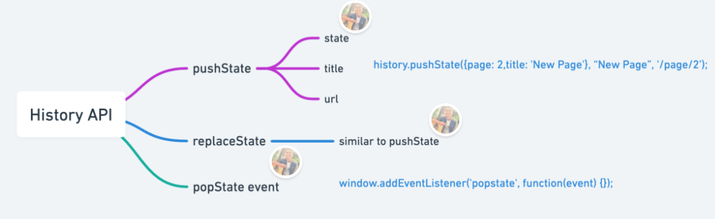
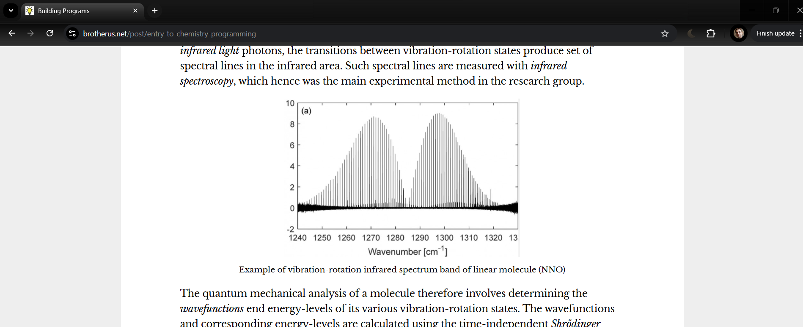

# Tech stack of this blog application


In 2025-05 I moved this blog [from Wix to custom blog-platform](/post/blog-platform). I started development of this custom webapp 2025-04-29, working 1-2 hours on few evenings per week for four weeks - perhaps 20 hours total - before the first production deployment on 2025-05-31. The blog platform code is at [https://github.com/rbrother/blog](https://github.com/rbrother/blog) and the blog articles as Markdown-files in a separate [https://github.com/rbrother/articles](https://github.com/rbrother/articles) repo.

## SPA with ClojureScript and Re-frame

I implemented the blog viewer as Single-Page-Application (SPA) running in the browser as JavaScript (compiled from ClojureScript) and deployed to AWS S3 blob store. Alternatives to SPA would have been (1) *Server-Side Rendering* (SSR) implementation (with Clojure on JVM as AWS Lambda function) or (2) *Static Site Generation* (SSG) where final HTML-files are generated at compile time.


I implemented the Single-Page-App with [ClojureScript](https://clojurescript.org/), React and [Re-Frame](https://day8.github.io/re-frame/) using [pure functions](https://en.wikipedia.org/wiki/Pure_function) where possible. Clojure(Script) has good support for writing apps using pure functions which are functions that return result computed only from function input parameters. Such functional logic is widely re-usable since it does not depend on the environment. Hence the app could be adapted for backend-based execution with reasonably small effort.

In terms of building React front-end, working with JavaScript and ClojureScript is very similar:

1. Both represent *React Components* as functions
1. Both support reactive local state (with *Hooks* in JS and with *Atoms* in ClojureScript)
1. Both support reactive global state with 3rd party libraries (Redux, Zustand, Jotai, Recoil, etc. for JS and Re-Frame for ClojureScript)

The main practical difference between JS and ClojureScript in React applications is that while JS applications create HTML-definitions with embedded [JSX-syntax](https://react.dev/learn/writing-markup-with-jsx) whereas ClojureScript supports HTML-definitions with [Hiccup library](https://github.com/weavejester/hiccup) which uses Clojure native vector/map syntaxes. The Hiccup approach has the advantage of having more uniform syntax across the whole source file, avoiding syntactical elements like `{...}` necessary for switching between JS and XML syntaxes in JSX. Also because Hiccup is simply Clojure data, it can be manipulated and post-processed like any other data.

On core language level, Clojure(Script) has stronger support for high-performance [immutable persistent data structures](https://clojure.org/reference/data_structures) important for functional programming. As a LISP, Clojure also supports powerful macros that can be used for performant compile-time language-extensions.

In terms of library support, Clojure has good interoperability with its native Java platform libraries and ClojureScript has good interoperability with JavaScript NPM libraries. So one does not run out of options for 3rd party functionality even if one does not find perfect library from the wide selection of Clojure native libraries.

## Local routing

Single-Page-Apps (SPA), as the name implies, do not trigger browser HTML-page reload from server. For some SPAs it's perfectly fine to just single one URL in the browser like `https://myapp.com` and have all the different states and views of the application play out within that URL. However, for some applications it is important to be able to *link* to individual parts of the application with different URLs like `https://myapp.com/one-page` and `https://myapp.com/another-page`. In a blog-application it is quite essential for each article to have separate clear URL which readers can bookmark or share in social media and which search-engines can index. Since I was moving to custom blog-application from Wix, I wanted to preserve the exact URLs of the existing posts with form `https://www.brotherus.net/post/[title]` so that existing bookmarks would continue to work after the transition.

*Routing* (mapping URLs to content) can be done also in SPA in which case it's called *local routing*: mapping happening in JavaScript at the users browser. Local routing uses [Browser history API](https://developer.mozilla.org/en-US/docs/Web/API/History_API) which allows manipulation of browser URL and reacting to URL changes without triggering page reload. ClojureScript has a handy library [Accountant](https://github.com/venantius/accountant) wrapping the history API and allowing functional mapping of browser paths to re-frame events defining application internal state (like the blog post to display). 



In [core.cljs](https://github.com/rbrother/blog/blob/master/src/brotherus/blog/core.cljs) I define the few simple routes of the blog with regular expressions and map them to corresponding re-frame *dispatch function* which performs appropriate change for the app state:

```clojure
(def routes
  [{:regex #"/about", :dispatch [:brotherus.blog.info/show-info]}
   {:regex #"/post/(.+)", :dispatch [:brotherus.blog.item-page/select-item]}
   {:regex #"/posts/(.+)", :dispatch [:brotherus.blog.filters/select-items]}
   {:regex #".*", :dispatch [::home/home]} ;; Default route, match anything
   ])
```

Then I connect accountant navigation handler to find first route matching the regex and then dispatching the corresponding event-handler with possible parameters extracted from the regular expression *capturing groups* `(...)` :

```clojure
(defn dispatch-route! [{:keys [matches dispatch]}]
  (let [params (->> matches rest (map js/decodeURIComponent))]
    (rf/dispatch (vec (concat dispatch params)))))

(defn setup-routes []
  (accountant/configure-navigation!
    {:nav-handler
     (fn [raw-path]
       (js/window.scrollTo 0 0)
       ;; Filter away query parameters from the path
       (let [path (re-find #"^[^\?]+" raw-path)]
         (->> routes
              (map (fn [{:keys [regex] :as route}]
                     (assoc route :matches (re-matches regex path))))
              (find-first :matches)
              dispatch-route!)))
              ...
```

Notes about the preceding code:

1. I don't currently have any paths that would support URL-parameters like `...?a=1&b=2` so I filter those away with regex `^[^\?]+` to simplify regex matching. This is because when posting to social media like Facebook vanilla-links without URL-parameters, they often automatically add URL-parameters with their own metadata to such links.
1. I map each captured path parameter through `decodeURIComponent` function which converts URL-encoded path parameters like `my%20blog%20post` to original strings like `my blog post`.

## Markdown to HTML processing pipeline


The core Blog-functionality of loading, transforming and displaying article to the blog reader is implemented in [item_page.cljs](https://github.com/rbrother/blog/blob/master/src/brotherus/blog/item_page.cljs) and [article.cljs](https://github.com/rbrother/blog/blob/master/src/brotherus/blog/article.cljs). It starts by event-handler `::select-item` when user clicks on some article in the article list. This sets the selected item id to re-frame global state `db` and dispatches event `::load-article` to load the markdown from Github:

```clojure
(rf/reg-event-fx ::select-item
  (fn [{:keys [db]} [_ id-raw]]
    (if-let [info (get db/articles-index id-raw)]
      {:db (-> db
               (dissoc :page :error)
               (assoc :selected-item id-raw))
       :dispatch [::load-article (str id-raw "/article.md")]}
      ...)))
```

The `::load-article` event-handler uses re-frame extension [http-xhrio](https://github.com/day8/re-frame-http-fx) to trigger HTTP GET-request for the Markdown data in functional declarative way:

```clojure
(rf/reg-event-fx ::load-article
  (fn [{:keys [db]} [_ url]]
    {:db db
     :http-xhrio {:method :get
                  :uri (str components/articles-base-url url)
                  :timeout 8000
                  :response-format (ajax.core/text-response-format)
                  :on-success [::set-article-content]
                  :on-failure [::set-article-content-failed]}}))
```

The `:on-success` attribute is set to further trigger `::set-article-content` event handler when content has been loaded so that the raw content is stored in app-db under `:article-content` key:

```clojure
(rf/reg-event-db ::set-article-content
                 (fn [db [_ content]]
                   (assoc db :article-content content)))
```

The Markdown -> HTML processing pipeline is implemented as Re-frame as a set of *subscriptions* which are triggered by the Re-frame framework automatically when the `:article-content` in the app-db changes. These can be compared to Excel cells with formulas referring to other cells: Excel automatically re-calculates their resulting values when their source cells change. Re-frame subscriptions are created with `rf/reg-sub` macro, the first one in the chain being simple subscription that draws the raw content from the app-db:

```clojure
(rf/reg-sub ::article-content (fn [db _] (:article-content db)))
```

The main subscription doing the heavy lifting of the transform is `::article-html` shown below. It is set to depend on the lower-level subscriptions `::article-content` and `::selected-item` using the `:<-` arrow-syntax of Re-frame. Such *higher-level subscription* is triggered for re-execution automatically by Re-frame if and only if any value of it's source-subscriptions change.

```clojure
(rf/reg-sub ::article-html
            :<- [::article-content]
            :<- [::selected-item]
            (fn [[markdown item-id] _]
              (article/markdown-to-hiccup markdown {:item-id item-id})))
```

The subscription calls pure function `article/markdown-to-hiccup` which contains the main processing pipeline:

```clojure
(defn markdown-to-hiccup [markdown context]
  (binding [*rendering-context* context]
    (let [mark (Marked. (markedHighlight marked-options))]
      (some->> markdown
               (.parse mark)
               html->hiccup
               (into [:div])
               postprocess))))
```

In the code above:

  1. `(let [mark (Marked. ...)]` creates an instance of [Marked Markdown-parser](https://www.npmjs.com/package/marked) and assigns it to symbol `mark`. Marked is one of the most commonly used Markdown-parsers with 15 million weekly downloads. Its particular advantage in my case is that is supports GitHub-flavor of markdown, making it a good pair for my GitHub-based blog strategy.
  1. `(some->> ...)` is a Clojure [threading-macro](https://clojure.org/guides/threading_macros). Threading-macros or "arrow macros" come in several flavors, but they all allow deeply nested function calls to be written in simpler list form read from top to bottom. For example `(-> x a b c)` is equivalent to `(c (b (a x)))` which in Javascript-syntax would be equivalent to `c(b(a(x)))`. Although Clojure is a Lisp and Lisps are infamous for a lot of parenthesis, the threading macros often allow syntax which is has actually less parenthesis than the equivalent Javascript, Python or Java.
  1. In the chain / pipeline of processing, the first step `(.parse mark)` uses the Marked parser to create HTML. 
  1. The created HTML string could be immediately set at the content of our react element but I wanted to make some post-processing to the generated HTML. Such processing is challenging to do to HTML string, but becomes easy when we have the HTML converted first to the equivalent native Clojure data-structure called [Hiccup](https://github.com/weavejester/hiccup). This is done with `html->hiccup` function call, which uses [taipei-404.html library](https://cljdoc.org/d/taipei.404/html-to-hiccup/0.1.8/api/taipei-404.html). For example HTML `&lt;span class="foo"&gt;bar&lt;/span&gt;` is in Hiccup equivalent to the Clojure data structure `[:span {:class "foo"} "bar"]`
  1. `postprocess` calls my custom postprocessing function for the resulting Hiccup data structure to preform desired manipulations (described below)  

## Post-processing for HTML-tweaks

The postprocess-function that is last part of the Markdown-processing pipeline applies additional improvements to the generated HTML-tree (in form of the equivalent Hiccup-data-structure):

```clojure
(defn postprocess [hiccup]
  (->> hiccup
       (walk/postwalk
         (fn [node]
           (cond-> node
                   (is-element? node :a) set-link-new-tab
                   (is-element? node :img) fix-image-links
                   (string? node) (he/decode node) ;; &lt; to < etc
                   )))))
```

The processing uses from the Clojure core library the powerful functional `postwalk`-function which recurses through any nested Clojure data structure and calls the given transformation function for each part / node. The node transformation function uses conditional pipeline macro `cond->` to perform selective post-processing.

The test `(is-element? node :a)` triggers for HTML link-elements such as `&lt;a href="url"&gt;text&lt;/a&gt;` (generated from Markup `[text](url)` syntax), postprocessing function `set-link-new-tab`. This adds `target="_blank"` attribute to links, which causes them to be opened in new tab, which I consider desirable in blog-context. Markdown itself does not have syntax for specifying such behavior, so it is reasonable to add as a post-processing step.

For HTML `&lt;img src="..."/&gt;` elements inserting images to the page, I do post-processing to support simple syntax for images that are part of the blog-posts content. In the GitHub articles repository I store image-files of the article in the same folder as the articles main `article.md` markdown-file. This allows referencing such images with simple relative syntax like `` without full domain in the URL. Both VSCode and GitHub are able to display files with such simple syntax when they are in the same folder as the markdown file. But when the article is viewed through my custom blog-application in URLs like `https://www.brotherus.net/post/llm-understanding` such simple image-URLs don't work since the images exists only in the Github domain of `https://raw.githubusercontent.com/rbrother/articles/`.

`fix-image-links` applies post-processing to the `src` attributes of images in a way that relative links are converted to absolute ones by prefixing them with the articles base URL:

```clojure
(def content-base
  "https://raw.githubusercontent.com/rbrother/articles/refs/heads/main")

(defn relative-link? [url] (not (re-find #"^https?://" url)))

(defn make-absolute-link [src]
  (str content-base "/" (:item-id *rendering-context*) "/" src))

(defn fix-image-src [src]
  (cond-> src
          (relative-link? src) make-absolute-link))

(defn fix-image-links [img]
  (update-in img [1 :src] fix-image-src))
```

## Syntax highlighting for code samples

Since this is a blog about Software Development, many articles will contain source code samples of some kind. The readability of such samples are improved with proper *syntax highlighting* ie using different colors for different types of syntactic elements of the language in a consistent way.

Luckily the Marked-library I chose for Markdown parsing has many plugins, and one such plugin is [marked-highlight](https://www.npmjs.com/package/marked-highlight) which supports generation of syntax-highlighting with [highlight.js library](https://www.npmjs.com/package/highlight.js?activeTab=readme). Highlight.js supports large number of language syntaxes, including Clojure as you can see from the code samples in this article. The syntax-highlighting for Marked is configured in its constructor with the `markedHighlight` function: 

```Clojure
(Marked. (markedHighlight marked-options))
```

This gets as parameter `marked-options` which configures with `:highlight` key a function that will be called for code-blocks to perform the syntax highlighting. It does this by calling `hljs.highlight()` from the highlight.js library:

```Clojure
(def marked-options
  #js {:emptyLangClass "hljs"
       :langPrefix "hljs language-"
       :highlight (fn [code lang]
                    (.-value (.highlight hljs code #js
                            {:language (if (= lang "") "plaintext" lang)})))})
```

## Style tweaks

For most customizations of the article output, no HTML-postprocessing is needed, instead CSS-rules are enough. For example I wanted small images and their captions to be horizontally centered like the spectrum image in the [Quantum Chemistry Programming post](/post/entry-to-chemistry-programming):



Markdown image syntax `` has no way of specifying centering and Markdown has no concept of image caption. But these both can be accomplished with set of CSS declarations (on in this case in their equivalent [ClojureScript Garden](https://github.com/noprompt/garden)-syntax) using [flexbox](https://css-tricks.com/snippets/css/a-guide-to-flexbox/):

```clojure
  ["div.article img" {:max-width "800px" :max-height "500px" }]
  ["div.article p:has(img)" {:display "flex" :justify-content "center"}]
  ["div.article p:has(img):has(+ p small)" {:margin-bottom "8px"}]
  ["div.article p:has(small)" {:text-align "center" :margin-top "8px"}]
```

## Deployment

As I described in my [previous article](/post/blog-platform), I had set myself a requirement for keeping URL of the blog ([www.brotherus.net](https://www.brotherus.net/)) and URLs of individual articles (such as [https://www.brotherus.net/post/entry-to-chemistry-programming](https://www.brotherus.net/post/entry-to-chemistry-programming)) identical when transitioning from Wix to my custom blog-software.

In my earlier static JavaScript application deployments I had simply used AWS S3 buckets that I configured for public web-hosting. For example for my [Ruletti-reframe game](post/ruletti-reborn) I created "roulette-reframe" bucket with web-hosting which makes the game visible in URL [http://roulette-reframe.s3-website.eu-north-1.amazonaws.com/](http://roulette-reframe.s3-website.eu-north-1.amazonaws.com/). This works fine, but these URLs are ugly, difficult to remember, don't support custom domains and only work with HTTP, not HTTPS which modern browsers prefer.


Mapping S3 deployment to custom domain and HTTPS in AWS is not possible with the S3 service alone, but requires creation of cloud resources in several connected AWS services:

  1. [Amazon CloudFront](https://aws.amazon.com/cloudfront/) content delivery network (CDN) service is first configured with the S3 bucket as content source. Using CloudFront provides the additional benefit of caching and slightly lower transfer latencies than S3 alone.
  1. [Amazon Route 53](https://aws.amazon.com/route53/) Domain Name System (DNS) service which allows mapping of the domain (`www.brotherus.net`) to the CloudFront deployment.
  1. [AWS Certificate Manager](https://aws.amazon.com/certificate-manager/) service for creating SSL-certificate which is needed for the secure HTTPS protocol.

Because AWS has dozens of services, each of these have numerous resource types and each resource numerous attributes, it used to be rather tedious to find out the right set of resources and their attribute-values to accomplish a given goal. When the best available help was Google, Stack Overflow and AWS technical documentation, one could easily end up on several incorrect paths in setting up the cloud resources. But with the aid of modern LLMs, this has become much easier: from a very high-level description of your goal tools like ChatGPT, Gemini, Claude, Llama and DeepSeek provide exhaustive step-by-step guides for reaching your goal by navigating through the numerous screens and settings of the AWS Portal.

For a project with multiple environments (DEV, QA and PROD), bigger team, longer development life-cycle or more complex cloud resources, it would have made more sense to use some Infrastructure-As-Code (IAC) solution like [AWS CloudFormation](https://aws.amazon.com/cloudformation/). This would involve writing the list of required resources and their attributes with some IAC Coding language (a flavor of YAML in case of using CloudFormation), so that executing this code creates the desired resources.

Finally I created small PowerShell-script [deploy.ps1](https://github.com/rbrother/blog/blob/master/deploy.ps1) which compiles production version of the app and uploads to the S3 bucket (which is then automatically distributed through the CloudFront):

```plaintext
npm install
Remove-Item -Recurse -Force .\resources\public\js\compiled
npm run release
aws s3 cp .\resources\public  s3://brotherus.net/ --recursive
```

## Future improvement possibilities

While the Single-Page-Application React-architecture I use provides slightly more snappy response when navigating withing the application and very nice development experience, I have noticed some downsides. Because the main content of each article page is generated dynamically with JavaScript, web crawlers and similar automated tools have harder time deciphering content of the page. Luckily the Google web-crawler (powering the Google search) works quite well with dynamic pages by executing JavaScript on the page and waiting a while to get the page final form, but other search engines sometimes use more limited crawlers and would hence miss all the main content.

More importantly, the "post preview builders" that social media platforms like FaceBook, Linked-In and X use easily miss dynamic content. When posting a link to these platforms, these little agents analyze the content of the target page and amend the post with a small preview that has typically the first image on the page and excerpt from the beginning of the text. On pages where content is generated by dynamic JavaScript, these platforms easily fail to make meaningful preview.

This limitation has made me consider trading off the snappy local navigation of the React SPA with a more search/preview-friendly architecture nature of server-side rendering. While the high-level architecture of such app would be quite different, transition would be simplified by the fact that core application logic is functional Clojure/JavaScript-code that is independent of any environment.
