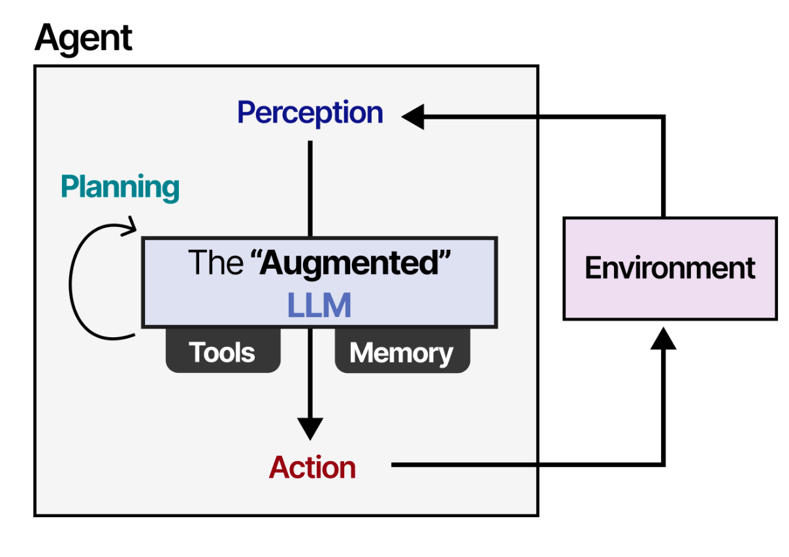
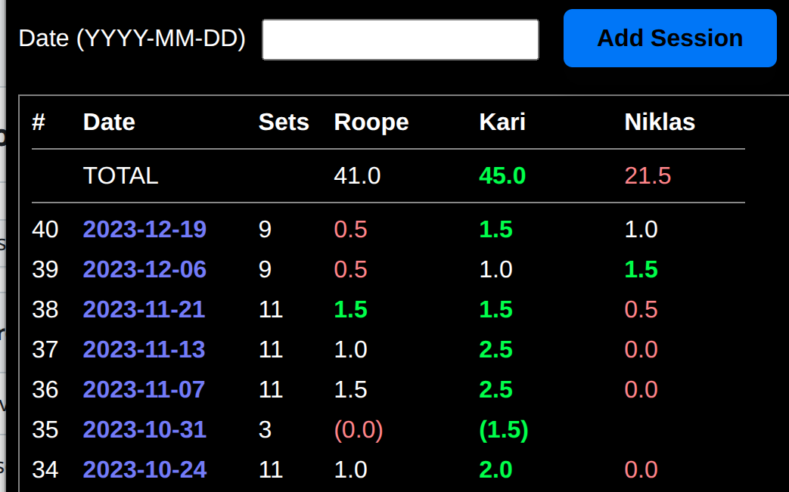
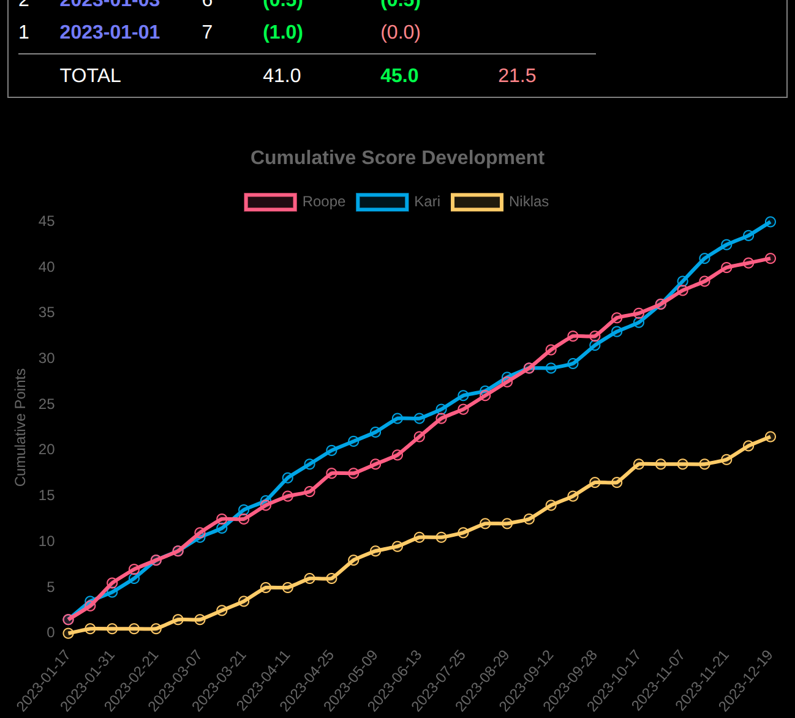

# Why do I like Programming, The next chapter: AI Coding Agents


In 2022 I wrote about [Why do I like Programming so much](/post/i-like-programming), comparing my joy from programming to my childhood love of building things with Lego-blocks. Programming provides all the thrill of creativity of building but with a *super-power*: a programmer can automate the boring repetitive parts of building, maximizing the creative thrill and productivity.

I still remember the magical feeling of getting first [loops working with Commodore VIC-20 Basic-programming](post/humble-beginnings-the-vic-20) when I was 9. The idea that you could command your computer to do anything you wanted. And that it would loop to repeat work items one after another automatically. Sky was the limit.  

And now, in 2025, I am happy to say that the new generation of AI coding agents like **Claude Code**, **GitHub Copilot Agent**, **GPT-5-Codex**, **Cursor** and **Gemini Code Assist** has expanded this super-power and joy of maximized productivity and creative power to a whole new level.

Of course there have been many other advances in programming technologies, frameworks, libraries, languages and tools since the 1980's 8-bit Basic-programming. When I [re-created my 1986 Commodore 64 game with modern technologies in 2021](post/ruletti-reborn) it was like a night and day difference. But still all of those improvements - even getting guidance from ChatGPT for writing individual function - seem incremental in nature compared to this revolution, this quantitative jump in automation and autonomy brought by coding-agent loops that edit, compile, test, observe, reflect, learn and repeat. Working to code with those has definitely given me in recent months moments of joy and trill that resemble the magical feeling of my first *"Print 'Hello!', Goto 10"* loop on VIC-20.

## Quick Primer on Agents

AI Coding Agents achieve new level of programming productivity by combining together three components:

1. Core AI LLM (Large Language Model). Any LLM can be used in principle, but recently all major LLM producing companies (Open AI, Anthropic, Google, X) have also produced special LLM variants that are geared towards coding agent use.
2. In addition to production of text for human reading, Agents integrate *Actions* using *Tools* through APIs and reading back the results of the actions to the LLM. Actions are mostly integrated through the open-source [MCP Protocol](https://en.wikipedia.org/wiki/Model_Context_Protocol) developed by Anthropic.
3. *Agent Loop* which takes care of repeating the sequence of *think* → *act* → *perceive* until the goal defined by users prompt has been reached. 



<small>AI Coding Agent Loop</small>

The most common action for a coding agent is naturally reading, writing and editing of code files of target software project. But another powerful class of actions involves executing *command line commands*, since that open up interaction with large range of tools like GIT, AWS CLI, CURL and code compilers. And when the agent needs maximum power for some action, it can even choose to write a small one-off Python script that performs the action through combination of custom code and the vast selection of free Python libraries.

In my experimentation during summer 2025 I was mostly using [Augment Code Agent](https://www.augmentcode.com/) as VSCode plugin with [Claude Sonnet 4](https://www.anthropic.com/claude/sonnet) LLM core. While different Agent providers argue to the superiority of their Agent-loop and MCP-tool implementations, the most defining characteristic of Agent capability is still the used core LLM. Hence any other agent with Claude Sonnet in core would have likely given roughly similar results and I have indeed observed comparable performance later with [GitHub Copilot CLI Agent](https://github.com/features/copilot/cli) using same Claude Sonnet core.

## Case 1: Going extra mile while adding feature to a Web App

As an early simple experiment I tried adding a new feature to a small hobby-project: a [ClojureScript + React web-app for tracking scores of the Squash-games](https://github.com/rbrother/sport-score) with a group of friends on season and match level.



I had been for a while wanting to add a graph showing the cumulative development of each players score during a season, but had felt too busy to investigate the relevant graph libraries and their integration. With the agent I used following prompt:

“*This is my squash score tracking application done with ClojureScript, React, Reagent and Re-frame. I would like to work with you to extend a new feature to it. I am running the build so that development-build is running at localhost:8280 and updated automatically. First I would like to have a chart of score development during a year on the year page. The chart should be after the score table and show how cumulative points of each player has been developing during the year. It should be line-chart with time (date) on X-axis and cumulative score on Y-axis. Different players should be represented with lines of different color.*”

The result was 100% successful, producing working implementation with single prompt in a few minutes. I was pleased with several aspects of the agent workflow:

1. The agent analyzed my codebase and understood correctly all technologies and libraries used (React, Reagent, Re-Frame, ClojureScript)
1. The agent checked if I have already some chart-library in use, found out there is none, considered several alternatives and then chose to add `chart.js` and `react-chartjs-2` wrapper library which were good choices for integration to the Re-Frame app.
1. The Agent proceeded in controlled step-wise way to develop first the calculation function for cumulative scores, then the graph component and finally the integration of the graph-component to the relevant page of the UI.
1. The final Agent-produced [commit of code](https://github.com/rbrother/sport-score/commit/5e4bf3f4858d1ae12d63a648e32f23e04ece59e7) not only worked as intended, but the architecture was idiomatic and clean style, well blending to the existing codebase.
1. During its work, the agent generated test-data for testing the application, launched a browser to run and interactively view the app, *found corner-case bugs on its initial implementation* (such as unintended behavior if season was empty), and *fixed the code to handle all those corner-case bugs*.



<small>Agent-implemented graph: nice style, working correctly and clean architecture with single prompt</small>

Overall I got in 5 minutes an implementation that would have taken at least 4 hours from me to manually make - great X-factor! But none of the preceding aspects impressed me as much as a small part of the agent-written code that I found inspecting the implementation. Here is part of the new cumulative-score calculation routine added by the agent to `calculations.cljs`:

```clojure
(defn cumulative-scores-over-time [year-data]
  "Calculate cumulative scores for each player over time"
  (let [amended-sessions (->> year-data (map-vals analyze-session))
        ;; Get sorted sessions, only with all players present
        sorted-sessions 
           (->> amended-sessions
             (filter (fn [[_ session]]
                       (:include-in-year-points? session)))
             (sort-by first))]
    (->> players
         (map (fn [player-name]
                (let [cumulative-data
                      (->> sorted-sessions
                           (reduce (fn [acc [date session]]
                           ...
```

There is the comment "only with all players present" and the corresponding code `(filter (fn [[_ session]] (:include-in-year-points? session)))`. I stared at this for a long time, stunned, tears of surprise and joy in my eyes. 

I had *not* asked in my prompt to include only sessions with all players in the cumulative points. But looking at this code I remembered that we had agreed with my friends about a year ago that the points from sessions that did not include all players *would not be counted towards the season grand total*. This was decided so that having to skip a session would not hurt your relative score.

So it made total sense for to include same rule in the calculation of the cumulative scores for the graphs, since the cumulative scores should accumulate to the grand total. But this rule had not been need to apply at all during our 2025 season and I had completely forgotten about it. If I would have hand-programmed the graph, *I would have most likely missed that rule* and only wondered weeks or months later why the graphs did no match the grand totals in some cases.

I had not asked the agent to follow this rule. I had not asked it to match the cumulative scores to the grand total calculation. I did not even mention anything about grand totals in my prompt at all - and yet the agent *found this other feature*, *detected and understood the rule from that*, *correctly surmised that same rule should be applied to the cumulative-score calculation at hand* and *flawlessly included it in the implementation*. At that moment I knew that this new thing, this Agent, *would be my best friend forever*

## Case 2: Re-Architecting this Blog-application as backend serverless app

Last summer I wrote about [the tech stack I had used for this blog-application](/post/blog-tech-stack). I wrote it as a React / Re-Frame ClojureScript Single-Page Web-application, which generates the HTML content using JavaScript on the users Browser. While such tech is particularly suitable for apps that have a lot of interaction and input in the UI, a blog-application has rather limited interactions and can hence be more suitable for a "classic" backend-based implementation where the final HTML is generated at the server.

Front-end React-applications have quite different architecture from backend-based application, so such conversion was surely a complex undertaking. On August 28th I eagerly threw this challenge to my new agent-friend to tackle. My initial prompt was:

"*Please convert this SPA React application to a backend-based application which would run as AWS Lambda serving the content of the URLs. The application should remain based on ClojureScript so that the Markdown-to-HTML pipeline remains essentially same, but run as Node-based lambda-function. Some infra-as-code is also needed for deployment.*”

The result of the agent work on this initial major prompt can be seen in [this commit](https://github.com/rbrother/blog/commit/2a3e9d7ffc5f0667397975b062d466a470be7889) and includes successful implementation and testing by agent of:

1. `lambda.cljs` that acts as lambda-handler on AWS cloud
1. `server_render.cljs` that implements server-side routing corresponding to the client-side routing of the original app.
1. The pipeline generating blog-post HTML from markdown as described in [my Blog tech-stack article](/post/blog-tech-stack) is kept intact as I requested and it's output is incorporated in `server_render.cljs` templates as HTML string.
1. Terraform "Infrastructure As Code" file `main.tf` which defined AWS Lambda and related resources needed for running the code in AWS cloud. 
1. Deployment script deploy-lambda.ps1 which creates the resources by running `main.tf` and then compiles, packages and deploys the lambda.
1. Unit-test scripts that were executing functions in `lambda.cljs` and `server_render.cljs` without full lambda deployment.

This is no small feat from a single prompt! Also I liked the fact that the agent left the SPA-code intact so that from the same codebase it was possibly to deploy both SPA-version and backend version of the Blog application.

That said, in this much more challenging case, this agent with single prompt definitely did not get me all the way to the target, perhaps something like 75% of the way. I used additional prompts and hand-refactoring in the next few days to fix following issues:

1. CSS-Styles that I had implemented to the React app with [Garden library](https://github.com/noprompt/garden) had been dropping from the server-side app.
1. Some other "secondary" features like view-counters also had not been brought to the new app.
1. The React-app had used [Hiccup syntax](https://github.com/weavejester/hiccup) for representing HTML-templates whereas the backend-converted app used string-templates. Hiccup is way to represent HTML-trees with Clojure native maps and vectors, which is extremely elegant and powerful for data-oriented functional programming, so I wanted to restore that. My guess is that the agent abandoned Hiccup since the core library is not supported on Node, but there are alternative libraries that I was able to substitute with additional prompts and work.

I am happy to say that after these fixes the conversion was complete and the pages that you are now reading come from the new [Server-side implementation](https://github.com/rbrother/blog) whose code is in great part agent-generated.


<small>My blog application successfully converted to AWS Lambda based backend implementation</small>

Due to the need for manual fixes after the initial prompt, the "X-factor" of Agent-productivity in this case was more close to something like 3X rather than the more extreme 10X+ of my initial tests. Still extremely valuable saving of time and effort. And based on what I have read from other agent-users since then, the tech-conversion might have been even smoother with following additional tricks:

1. Write bit longer prompts specifying more details of the task at hand. If this is challenging, then use the agent itself first to write an expanded task-description, review it and then let the agent proceed with the implementation based on this "spec".
1. If a prompt fails to get to the desired target in some obvious and significant ways (like producing text-based HTML-templates instead of Hiccup-templates), it might be better to *reset the changes and try from the beginning with a modified more clear prompt* instead of using additional prompts to try to proceed further from the intermediate state. We humans tend to have subconscious feeling of not wanting to undo significant amount of work, but when that has been done by the agent in 5 minutes, then our gut-feeling about this might not be valid.
1. Keeping a separate `agents.md` file for agents describing our general preferences on libraries and tool-chain can provide additional guidance outside of the prompt.

## Case 3: Non-programming computer tasks!


Since we are talking here about AI *coding* agents, it might be obvious that they are useful when our explicit aim is to produce software code, but *not* useful when our aim is something else. But this turns out to be flawed assumption: AI coding agents turn out to be extremely useful in all computer-related work! How can this be? This is how it works:

1. Anything you want to accomplish with your computer involves data processing: gathering and fetching data, doing some operations and logic to the data and storing or sending the data.
1. For any imaginable ways of fetching, processing, logic or storing operation, there is some *Python library* to be found in the vast collection of 500 000+ publicly available Open-source libraries. The agent knows the capabilities of all of these libraries!
1. The agent can write in few seconds a 100-line Python script that does what you want using these libraries.
1. The scripts can be deleted once they served their purpose.

I found this mind-boggling conclusion when I wanted to move to this blog-platform some [instruction documents I have made about our Airbnb rental cottages](/post/airbnb-mantyharju-instructions). I had been maintaining such documents as Google Docs documents, but those had nasty URLs and were somewhat restricting for some mobile users. So I though I will convert them to Markdown-files + JPG-images in order to publish on this platform.

I downloaded the documents as Microsoft Word DOCX files to a local folder and was about to embark on the tedious manual work of copying and saving all of their images to JPG-files through some image-processing software, formatting the content to Markdown and re-linking the images with Markdown-syntax. But out of curiosity, with little expectation of success, I chose to first write to my agent:

"*I have in this folder some docx files with text and images. I would like to convert these to Markdown-files so that all of their images would be converted to JPG-files which would then be referred to from the respective locations in the Markdown. Are you able to help in that kind of thing?*"

Fully expecting polite "no", the agent instead replied:

"*I don't have direct .docx processing capabilities. But I can help you convert the Word document to markdown and extract images, with some external tools. Let me first check what's in your workspace and then set up a solution.*"

Then I watched in awe when the Agent during the next 2 minutes:

1. Installed Python environment on my OS
1. Installed [Python Pandoc library](https://pypi.org/project/pandoc/) - which I had never heard of - for reading and writing DOCX files.
1. Wrote and executed 200-line Python script which 
    1. Read my DOCX files with Pandoc
    1. Saved each image in them to JPG-files
    1. Generated corresponding Markdown-files which linked to the corresponding JPG-files.

I would haven been utterly impressed already at this point, but the agent was not done yet! In the same spirit as I had experienced in my earlier tests, the agent was clearly determined to go *above and beyond* of the user had asked, but deducing what the user *really wanted to have* even though *he did not have enough imagination to explicitly ask it*. So then the agent:

1. Told me that "*The image files are now with names 1.jpg, 2.jpg, 3.jpg, etc. since in the files embedded in DOCX do not have name information. For future editing purposes it is more convenient for the JPG-images used in Markdown-files to have descriptive names.*"
1. Installed Python library interfacing to OpenAI GPT-4 Vision API for machine vision.
1. Wrote and executed another 200-line Python script which:
    1. Iterated thorough all the JPG-files in the folder
    1. Sent each image to the GPT-4 Vision API with parameters to get short description for the content of the image based on the image content.
    1. Renamed the images with these names so that for example "7.jpg" become "bed.jpg" and linked the images with these names to the Markdown documents.

Can any computer user - programmer or not - after seeing this seriously opine that they would not benefit from using AI Coding Agents? Only imagination is the limit and the agents are even able to push that limit!

## A new way of Programming *and* a new way of using your computer

In the past 25 years, I have been using various Linux distributions alongside Windows on and off. The difficult tradeoff has always seemed to be that Linux has more *Power* but Windows is *easier to use*. The interface of text base commands and script files that Unix and Linux depend on is more powerful and has more hooks for *automation* but it has traditionally required more *expertise* in remembering complex command syntaxes and ability to debug weird error messages.

Now I have switched back to Linux in almost all of my systems, thanks to AI coding agents and their CLI command-line versions. They simply wipe away any inconvenience of command-line usage, generating and running on-the-fly bash-commands and bash-scripts (as well as those Python-scrips for bigger things) from english descriptions of what I want to accomplish. Install some software? Done. Find and filter some files? Done. Debug some configuration issue? Fixed. Just the Power remains, with zero inconvenience.

## Expanding Comfort-Zone to the Ultra-learning Zone

The AI agents truly encourage you to go outside of your comfort zone since you will almost never get stuck. Or rather with an agent-friend by your side, no uncomfortable zone remains: everywhere is comfortable, every zone is comfort-zone.

I have now in short while produced working Terraform code, used GPT-4 Vision API and replaced a time-series database with a more efficient version. All of these would have normally been quite far from my "comfort zone" and required significant up-front learning - partly just in order to be *aware* of the tech, let alone how to use it. But now I not only get a working solution, but I get to inspect the resulting code and see it as reasonable and understandable, expanding my horizons.

So despite some writers claiming that coding agents will make us lazy and forget how to program, the agents can fortunately have also the opposite effect: leading you happily to new technologies to learn and providing you with perfect examples to learn them since they are examples *doing exactly what you wanted to do*.

## Riding the wave of revolution

When I look at my notes from the early stages of my investigation into AI Coding Agents in the early months of 2025, I find I wrote statements like "not ready for production use", "interesting research project" and "check the status of this again in 2026". But there was no need to wait for 2026: The quantitative improvement of coding models and agents in the spring and summer of 2025 was so intense that it morphed into *qualitative revolution*: bringing the agents with a bang to the set of core tools every self-respecting programmer *must* adopt.

And adopt we have! Just consider Anthropic: while OpenAI has been undisputed leader in the chat-AI business, Anthropic managed to grab the leading position in coding agents with their *Claude Sonnet* series of models and the *Claude Code Agent*. The result has been that Anthropic run-rate revenue has exploded just during the months of 2025 from $1 Billion to $5 Billion and [the company valuation simultaneously from $40B to $180B](https://www.anthropic.com/news/anthropic-raises-series-f-at-usd183b-post-money-valuation).

Augment Code and GitHUB Copilot with Claude Sonnet 4 (used in the cases discussed above) was mind-blowingly good. Since then we have got new frontier coding AI-models pushing the coding agent capabilities even further: Claude Sonnet 4.5 and Claude Opus 4.5 from Anthropic, GPT-5.1-Codex from OpenAI and Gemini 3 from Google. It's like Christmas and Birthday every day when the competition for best agentic models has heated up.

If programming is [building lego-blocks with super-powers](/post/i-like-programming), now we have super-powers squared. It's super fun - great time to be alive. But it also creates weird conflicting thoughts about role and importance of programmers in the future. On the other hand, we agent-adopting programmers have received such a productivity boost, that we could easily justify triple salary and still be delivering bang for the buck. On the other hand, will there even be "programmers" in the future and what role can we have when AI gets even more capable and autonomous? Will everyone be doing  programming - or will no-one do it? My group of early AI-adopters within my company are spreading the joyful message of coding agents around our company. But we are also occasionally joking that we can have great fun now coding with the agents when AI has not completely replaced us yet 😉


