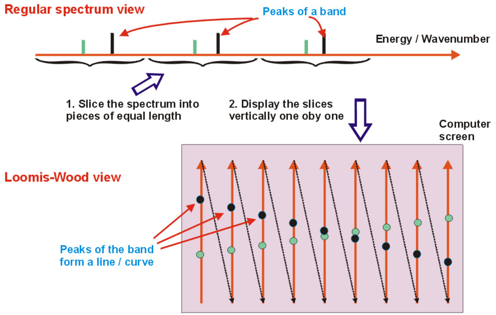

# Creating the INFIA Spectrum Analysis Software in 1996-1998

**After some false starts, I finally found success in my Physical Chemistry research from unexpected direction, when I started gradually improving the old software tools our lab used for spectrum analysis in 1996 when I was 23.**


After the dead-end of [my first project of vibrational wavefunctions](/post/starting-on-a-career-in-computational-quantum-chemistry) and the grinding to halt of my [Arsine vibrations project](/post/death-by-fortran-common-block) at the Physical Chemistry laboratory, there was a need to try something with higher probability of success. To this end professor **Lauri Halonen** proposed spectrum analysis in January 1996. Halonen had available Deuterobromoacetylene (DCCBr) high-resolution infrared spectra which had been measured by **Olavi Vaittinen** (in group of Halonen) and **Oliver Polanz** (from Wuppertal University in Germany) but not yet analyzed.

Such spectra contain thousands of absolution peaks at specific wavelengths in the infrared area. These peaks correspond to transitions in the vibrational and rotational state of the molecule. Quantum mechanical vibration-rotation model allows derivation of mathematical relationship between the vibration and rotation parameters or the molecule and the wavelengths of its infrared spectrum. The molecular properties include force strengths of bonds between atoms and rotational moments of inertia along its axes.

Below Figure 1 shows one band-system out of five that I analyzed from DCCBr spectrum. Three levels of magnification demonstrate the high density of absorption peaks:


Analysis of the spectrum means assignment of each spectrum peak to the vibration-rotation quantum transition it corresponds to. After the assignment of as many peaks as possible, the quantum mechanical model can be used to calculate molecules vibration and rotation parameters from the peak wavelengths.

Other researchers in the group of Halonen (Olavi Vaittinen and **Maria Saarinen**) had already earlier analyzed in a similar way many spectrum band-systems of *Bromoacetylene* (HCCBr). In DCCBr the hydrogen is swapped with Deuterium (heavy hydrogen), leading to slightly different vibrational and rotational parameters, but the method of analysis should be essentially same. Olavi had software and instructions for me to use. The amount of work in such project is quite large and tedious because of the large number of spectrum peaks. But such work is also easy, predictable and low-risk in the sense that it doesn't depend on any new theoretical innovations and has high probability of leading to publishable results.

I was given the spectrum as a paper printout of 100+ pages and a computer file listing about 20 000 peak wavelengths. Olavi also provided two Fortran programs that had been used in pre analyses. One was used to determine initial peak assignments based on some preliminary guesses with *Combination Difference Prediction* algorithm. The other one was used for calculating the vibration-rotation parameters of the molecule based on final assignments. Both were command-line programs reading input files listing peak wavelengths printing text output. I quite soon learned from Olavi the operation of these programs and could proceed in the analysis work independently. Professor Halonen was also going to be still 6 months in USA, so I proceeded in the work in that sense quite independently as well. I don't have records on how many hours per week I was able to put to the effort, but probably less than 20 since I was simultaneously studying on several courses in chemistry, physics and mathematics for my Masters degree, acting as teaching assistant in Physical Chemistry laboratory courses, as the editor of Chemist Student association HYK magazine "Esitisle" and as a weekly tutor for an Open University Computer-science course.

## Making a spectrum viewer

Just few weeks into the project, it became apparent that using the command-line tools was quite tedious and error-prone. Browsing through the spectrum from the 100+ page printout was slow. Browsing through the peak-list file and copying values of wavelengths to another file for the assignment and calculation programs was slow and error-prone. I decided I need to make a small visual to display a zoomable view of the spectrum to make the work reasonable.

I was also curious to try Borland Delphi for something real. Borland had been releasing in 1995 their integrated Windows Application development tool Delphi 1.0 , the next evolution from Borland Turbo Pascal for Windows [I had used in Atlantic College](/post/logistic-map-fractal). I had completed some hobby game project with Delphi and become fascinated by the ease of Delphi drag & drop UI-development. Delphi was also using the Borland Object Pascal language which was a reasonably advanced language at the time. Big limitation of Delphi 1.0 was that it could only produce 16-bit Windows programs, limiting sizes of variables to 65 kB. This was too little for the spectrum datasets that contained 30 000+ samples with 4-byte floating-point values. Luckily Delphi 2.0 come in 1996 allowing 32-bit programs and virtually unlimited size for all data.

So, during spring 1996 I started to divide my research time into progressing with the spectrum assignment on one hand and developing the spectrum viewer window with Delphi 2.0 on the other. Here is early simple spectrum view with selection and zoom capabilities:


In Delphi visual components like windows consists of binary Form files produced Delphi UI editor and corresponding Pascal files defining functionality. For spectrum window these are [SpecWin.dfm](https://github.com/rbrother/Infia/blob/master/SPECWIN.dfm) and [SpecWin.pas](https://github.com/rbrother/Infia/blob/master/SpecWin.pas). The final version of SpecWin.pas is about 700 lines, but the initial version just showing the spectrum waveform was much shorter. ObjectPascal is object-oriented strongly-typed language and separates each file to publicly visible interface containing class-definitions (think of C++ header-file) and private implementation part which contains method implementations (think of C++ *.cpp file):

```delphi
unit Specwin;

interface

type
TSpectraWindow = class(TForm)
    WavenumberPanel: TPanel;  // Subcomponents from designer
    ...
    procedure FormPaint(Sender: TObject); // Events from designer
    procedure FormMouseDown(...; X, Y: Integer);
    procedure FormMouseMove(...; X, Y: Integer);
    ...
    SpectrumLoaded : boolean; // variables
    DrawLineMarkers, DrawPredMarkers : boolean;
    ViewStart, ViewEnd : double;
    ...
    procedure DrawSpectra(startx, endx : integer);
    procedure DrawSpectraLow(startx, endx : integer);
    procedure DrawSpectraHigh(startx, endx : integer); 
    procedure DrawPeakMarkers(StartWn, EndWn : double);
    ...
end;

var
SpectraWindow: TSpectraWindow;  // Variable for the class instance

procedure TSpectraWindow.DrawGraphics(startx, endx : integer);
    var
        drawstart, drawend : double;
    begin
        drawstart := WindowXtoWave(startx-20); 
        drawend := WindowXtoWave(endx+20);
        if DrawLineMarkers then DrawPeakMarkers(drawstart,drawend);
        DrawSpectra(startx, endx); // draw the spectra
        if (Bands.count > 0) and DrawPredMarkers and DrawAllBandLabels then
            DrawPredLabels(drawstart,drawend);
        ...
end;
...
```

I would expect that for any current or past OO-programmer ObjectPascal should appear quite clean and self-explanatory in its syntax. The root event procedure is **FormPaint** which Delphi framework calls for custom-rendering of window content. This in turn calls **DrawGraphics** which calls **DrawSpectra**. I realized quite quickly that with a very wide scale of zoom levels, single algorithm for rendering the spectrum was not enough. On high zoom levels where density of screen pixels is higher than density of spectrum samples the method of interpolating one y-position per pixel x-position works well:

```delphi
procedure TSpectraWindow.DrawSpectraHigh(startx, endx : integer);
begin
xstep := (ViewEnd - ViewStart) / ClientWidth;
x := ViewStart + xstep * (startx-SpectraRect.Left);
repeat
    y := WaveToWindowY(x);
    screenx := WaveToWindowX(x);
    ...
    Canvas.LineTo(screenx, y);
    x := x + xstep;
until screenx >= endx;
end;
```

However, on low zoom levels, where there are 10's or 100's spectrum samples per pixel x-position, this approach would fail to capture the peaks and valleys that occur *within each pixel*. Therefore, when the samples per pixel exceeded 5 I switched to another rendering which takes multiple samples withing the x-pixel and then *renders vertical line* between the minimum and maximum sampled values.

```delphi
procedure TSpectraWindow.DrawSpectraLow(startx, endx : integer);
begin
    xstep := (ViewEnd - ViewStart) / ClientWidth;
    screenx := startx;
    x := ViewStart + xstep * (startx-SpectraRect.Left);
    repeat
        // Find the minimum and maximum y-value in the pixels range
        maxy := MySpectra.Value(x); miny := maxy;
        xx := x - xstep * 0.6;
        repeat
            y := MySpectra.Value(xx);
            if y > maxy then maxy := y;
            if y < miny then miny := y;
            xx := xx + 0.001; // Take samples near each other to not miss peaks
        until xx > x + xstep*0.6;
        Canvas.MoveTo(screenx, IntensityToWindowY(miny));
        Canvas.LineTo(screenx, IntensityToWindowY(maxy)-1);
        x := x + xstep;
        inc(screenx);
    until screenx >= endx;
end;
```

The spectrum zooms in Figure 1 above demonstrate these rendering routines: first one is rendered with low-zoom-level version and the middle and bottom ones with the high-zoom-level version.

## View of peak assignments

Completing the spectrum view helped a lot: Instead of browsing through the 100-page printout I could see the whole spectrum one the screen and then with the mouse zoom in and zoom out to any location quickly.  But after proceeding bit further with the peak assignments, another limitation started to disturb me. When many peaks from the spectrum have already been assigned to some band, then those peaks should not be anymore considered when trying to find yet more assignments. But in my spectrum window all the peaks looked the same without distinction to assigned and unassigned ones.

So, I added labelling of the peaks to the software. The peaks of a spectrum band-system can be grouped into multiple *bands* and each band has multiple *peaks* with integer index and approximate constant separation. In the five band-systems I was analyzing there was about 50 detectable bands per system and about 70 detectable peaks per band. I started with single color for a band label, but soon run out of colors, so I opted for a two-color scheme for the labels:


With this new data for peak assignments, I needed new files to store the data. Classic fortran-style input files were simply numbers separated by whitespace and hence very prone to index-errors that go undetected. I wanted something more robust and hence *structured*. But 1996 was time before JSON and YAML (even JavaScript 1.0 itself was only released in the middle of 1996 in Netscape 2). Even XML only become standard in 1998 and wider tool support for it only come around 2000. So I opted for custom semi-structured syntax that was *Comma Separated Values* (CSV) on top-level, but used still named attributes for each atomic value. This provided some robustness, readability and extensibility similar to XML/JSON/YAML attributes. Here is excerpt from the [nu4_assignments.csv](https://github.com/rbrother/Infia/blob/master/DemoProjects/DCCBr/nu4_assignments.csv) file from my DCCBr analysis:


At runtime the bands and their assignments were modeled by classes in [BandUnit.pas](https://github.com/rbrother/Infia/blob/master/BandUnit.pas):

```delphi
unit BandUnit;

TBand = class(TSaveListItem)
    Assignments : TAssignments;
    Name, Comment : string;
    ColorIndex1, ColorIndex2 : integer;
    BandType : TBandType;
    Molecule : TMolecule;   // Reference to mole
    UpperState, LowerState : TState; // References to the state list
    // Methods
    procedure DrawBandLabel(MyCanvas : TCanvas; x,y : integer; ...);
    function AddAssignment(NewM : integer; ...);
    ...
end;

TBands = class(TSaveList)
    function Band(n : integer) : TBand;
    function FindBand(TestBandName : string) : TBand;
    ...
end;
```

Note the inheritance of **TBands** from **TSaveList** and **TBand** from **TSaveListItem**: I implemented these base classes in [AdvancedList.pas](https://github.com/rbrother/Infia/blob/master/AdvancedList.pas) to implement common functionality when I started to have more types of data objects that should be saved in the tagged-CSV syntax discussed above and displayed in UI grids. These classes provided shared generic code that could display and serialize multiple lists of different object-types inheriting from **TSaveListItem**, demonstrating the reasonably advanced OO-programming capabilities of Delphi in 1996:

```delphi
TSaveList = class(TGridEditList)
    procedure LoadFromTextFile(filename : string);
    procedure SaveToTextFile(filename : string);
    function CreateItem(fields : tstringlist) : TSaveListItem; virtual;
    procedure LoadChildren(filename, keyfield : string; ...);
    function FindName(NameToFind : string) : TSaveListItem;
end;

TGridEditList = class(TAdvancedList)
    procedure ConnectDrawGrid(Grid : TDrawGrid); override;
    procedure GridDrawCell(Sender: TObject; Col, Row: Integer;...);
    procedure DrawGridHeader(Col : integer; Rect : TRect;...);
    ...
end;

TAdvancedList = class(TList)
    function CreateEmptyItem : TAdvListItem; virtual; abstract;
    function Nearest(ItemValue : TObjectValue; value : double) : integer;
    procedure BubbleSort(Compare: TListSortCompare);
    ...
end;

procedure TSaveList.LoadFromTextFile(filename : string);
    // Reads a data text file of format:
    // valename1=value1,valuename2=value2,...,
begin
    assignfile(tablefile, filename);
    while not eof(tablefile) do begin
        Fields := TStringList.create;
        readln(tablefile, line);
        Fields.commatext := line; // Parse line into field values and names
        NewItem := TSaveListItem(CreateItem(fields));
        add(NewItem);
    end;
    closefile(tablefile);
end;

function TSaveList.CreateItem(fields : tstringlist) : TSaveListItem;
begin
    NewItem := TSaveListItem(CreateEmptyItem);
    NewItem.SetFieldsFromStrings(Fields);
    CreateItem := NewItem;
end;
...
```

I worked quite long time on the DCCBr spectrum analysis with this version of the software, at least until summer 1996 when professor Halonen returned to Finland from his sabbatical in USA. Spectrum-view with assignment labels provided good *bang for the buck* in terms of improved productivity in analysis work with limited programming effort. All peak predictions and band-calculations were at this point still performed with the command-line Fortran-programs, necessitating working with their input- and output files.

## Integrating calculations

During the autumn 1996 I took the relatively bigger step if integrating most of the calculations to the software: the combination difference branch prediction algorithm and the calculation of molecular properties with linear least squares fitting.  This covered 95% of all calculations that were needed for spectrum bands of DCCBr.

Adding these calculations to the software was much bigger effort than the previous work with the spectrum window, also requiring adding new views to the UI and extending the original spectrum view. But the additions removed almost completely need to use any command-line Fortran programs with manually written input-files. Predicting new peak positions based on polynomial fit to existing peak positions proved especially convenient. Assigning new peaks to a band become just matter of (1) selecting predicted peak from *Band assignments* table, (2) verifying visually from spectrum window that the blue prediction line corresponds to a clear peak in the spectrum and (3) double-clicking the prediction to change it to assignment. This would add the peak to the band and trigger automatic recalculation and adjustment of the predicted peak positions.

Below is typical window setup when assigning peaks to new band. Predicted peak with m=57 has been selected and can be assigned to the band with one click:


For the linear-least-squares polynomial fit required implementation of linear algebra operations with **Matrix**, **SquareMatrix** and **Vector** objects, which I implemented in 500-line [LINALG.PAS](https://github.com/rbrother/Infia/blob/master/LINALG.PAS) exemplified below:

```delphi
type

TMatrix = class(TPersistent)
    Element : PHugeArray;
    function GetE(x,y:integer) : double;
    procedure SetE(x,y:integer; v:double);
    xsize, ysize : integer;
    property EVal[x,y : integer] : double read GetE write SetE; default;
    procedure MulConst(c : double);
    procedure Add(b : TMatrix);
    procedure Sum(a,b : TMatrix);
    procedure RightMultiply(b : TMatrix);
    procedure LeftMultiply(a : TMatrix);
    procedure Transpose;
    ...
end;

TSquareMatrix = class(TMatrix)
    procedure Invert;
    ...
end;

TVector = class(TMatrix)
    ...
end;

implementation

procedure TMatrix.Product(a,b : TMatrix);
SetSize(b.xsize, a.ysize);
for x := 1 to xsize do
    for y := 1 to ysize do begin
    sum := 0.0;
    for n := 1 to a.XSize do
        sum := sum + a[n,y]*b[x,n];
    EVal[x,y] := sum;
    end;
end;

procedure TSquareMatrix.Invert;
    Size := XSize;
    Inv := AllocMem(size*size*sizeof(double));
    ErrorCode := InvMatrix(Size, Element, Inv);
    for n := 1 to size*size do Element^[n-1] := Inv^[n-1];
    FreeMem(Inv, size*size*sizeof(double));
end;

function InvMatrix(var MatrixSize : longint; M, Inv : PHugeArray) 
    external 'imslmath.dll' name '_INVERT_MATRIX@12';
```

Note in the last function **InvMatrix** the *external* declaration: Delphi allows calling functions from external windows DLLs, so for the heavier linear algebra I did that. For matrix inversion (and later matrix diagonalization) I created a small C-program which called the powerful routines in [IMSL math library](https://www.imsl.com/products/imsl-c-libraries) and then compiled this program to **imslmath.dll** that I could call from Delphi.

Integration of the *Combination Difference Prediction* method to the UI was also very efficient in eliminating tedious trial-and-error manual work. Since the method involved *guessing* of bands correct vibrational lower state *and* rotational J-value, it might require many attempts (say 20) to find correct guess and evaluating whether guess is correct takes a long time of manual checking (say 15 mins). The automated code of Infia can calculate 100+ most likely guesses and evaluate all with good accuracy in one second, finding the correct combination with high probability.

Below example of Infia Combination Difference Prediction report listing best 10 best predictions for lower state and delta-m, reducing hours of work to seconds:


The capability to calculate band upper vibrational state parameters also called for new data structures, new files for saving the data and a new "Vibrational State parameters" window collecting the results of the calculations, shown below:


In case multiple bands have the same vibrational upper state, user can choose to use the parameters from the highest quality band.

## Getting hands dirty in the lab

During spring 1997 I completed the analysis if 𝜈<sub>3</sub> and 𝜈<sub>4</sub> band-systems of the DCCBr spectrum. But I also learned to make experimental measurements of the infrared spectrum of DCCBr myself with the [Bruker IFS 120 HR FTIR Spectrometer](https://www.bruker.com/en/products-and-solutions/infrared-and-raman/ft-ir-research-spectrometers/ifs-125hr-high-resolution-ft-ir-spectrometer.html) professor Halonen had in his lab:


We had still some DCCBr sample left, and I set the goal of measuring the 𝜈4 band-system with higher resolution than the spectrum that had been measured in Wuppertal University and I had used in the analysis. In FTIR Spectrometry several *scans* are measured of the sampled molecule and then a *Fourier Transform* is calculated to produce the final spectrum. The higher the number of scans, the higher the resolution one can obtain for the spectrum. So, I scanned the sample whole day and the following night as well until I estimated I had enough scans for a significant resolution improvement.

Excerpt from the 𝜈<sub>4</sub> band-system below shows the dramatic effect of even slight improvement in resolution. The original spectrum from Wuppertal (bottom) has resolution of about 0.004 cm<sup>-1</sup> whereas my new measurement in Helsinki (top) has resolution of about 0.002 cm<sup>-1</sup>. The doubling of the resolution more than doubles the number of detectable peaks, which allows many more bands to be analysed from any band-system:


## Master Thesis and graduation

I had at some point agreed with professor Halonens suggestion that I would aim to graduate with Master's Degree in spring 1997. That would mean graduating after four years at the university out of which two I had worked as research- and lab-assistant. In autumn 1996 my spectrum-analysis software and the DCCBr analysis work were far enough that we could agree that I could write my Master Thesis on those.

Sprint 1997 become quite hectic. I had still many courses in Chemistry and Mathematics to complete for the degree and I was still working as laboratory course assistant in Physical Chemistry. I had not progressed much in writing of the thesis when Halonen asked me in March, how are the plans about graduating in spring going. I said I have not progressed very far with the thesis, that it might be better that I would finish it in the summer when I would have more time from the other study- and lab-activities. Halonen replied: "*Let's stay with the original schedule, shall we?*" So we did. There was a period of about ten days in May when I locked myself to my apartment with 10 frozen pizzas in the freezer and just kept writing the thesis from morning to evening every day with only occasional pizza-break. I did manage on the evening of the last possible day deliver [my 87-page thesis](https://github.com/rbrother/Infia/blob/master/documentation/DCCBr_master_thesis.pdf) directly to the home of professor Halonen:

[](https://raw.githubusercontent.com/rbrother/Infia/refs/heads/master/documentation/DCCBr_master_thesis.pdf)

The thesis remains perhaps the best source describing the theory behind the Infia-software, so if you are interested in digging bit deeper to the fascinating quantum-mechanical world of molecular vibrations and rotations, check it out.

I declared the version of the software at the time of submitting the thesis "version 1.0" and kept [its executable](https://github.com/rbrother/Infia/tree/master/Binaries%201997-05-20%20-%20Version%201.0) so that it would always correspond to the descriptions in the thesis despite later modifications.


## "Infia" name

After I graduated with Master's Degree in beginning of summer 1997, professor Halonen arranged for me funding to continue research in Physical Chemistry towards a PhD degree. Halonen suggested returning from spectrum analysis to more theoretical research by application of more advanced vibrational quantum-mechanical models to methane ( CH<sub>4</sub> ). While working on this, I nevertheless continued occasional improvements to the software as a lower-priority side-project.

One change that I made only after publishing my master thesis was inventing a less generic name of the software. If you look at the master thesis document, you can see that the name "Infia" does not appear there yet. I just call it "software for spectrum analysis" and in the user manual use a temporary name "Win Analyse". In autumn 1997 it started to seem plausible that the software could get accepted for publication in some scientific magazine separately instead of just being mentioned in the planned article describing the results of the DCCBr spectrum analysis. I also started to give presentations and posters about the software in various meetings and conferences, all of which added to the need to invent a more specific name to distinguish the software from others.

So I played with words related to the topic and come with "Infia" from "**IN**frared **FI**tting **A**pplication" which I used in subsequent presentation and publications. I have no memory how well the new name stuck, but at least for the wider research community that learned about the software through my later articles and posters it probably was useful to have a specific name to use. Here is a [slideset of Infia Software](https://github.com/rbrother/Infia/blob/master/documentation/slides/infia-slides.pdf) I used in some conference posters and presentations in 1998 (click for the full slideset):

[](https://raw.githubusercontent.com/rbrother/Infia/refs/heads/master/documentation/slides/infia-slides.pdf)

## Adding resonance-band calculations

While most of the improvements to Infia after the thesis-version were minor, I still occasionally added more significant features when opportunity arose.

One such opportunity arose during autumn 1997 when professor Halonen sent me to work for one month to the University of Wuppertal in Germany. Halonen had been co-operating with the spectroscopy group of professor **Hans Bürger** in Wuppertal. I was to learn the experimental method for synthesis of DCCBr from Burgers PhD student **Wolfgang**. During days we proceed in the steps of the synthesis, which succeeded to sufficient degree that I got confident I could reproduce it later in Helsinki. Here is Wolfgang working on the vacuum-line which formed the basis of the gas-phase synthesis:


But in the long evenings I spent in my residence I had spare time. And I had been long time been bit bothered by the fact that calculation framework in Infia 1.0 was incomplete: it lacked the *matrix diagonalization calculation* and *non-linear least squares method* for handling spectrum bands that exhibited *resonance* (*l-resonance*, *coriolis-resonance* or *fermi-resonance*) and were therefore not suitable for the simple polynomial formulas. Because of this, I had written in my thesis:

> The resonance bands were analyzed with a
> Fortran program provided by Olavi Vaittinen
> and modified by the author to the Fortran90 specification.

The rational for initial omitting of resonance calculations was clear: they were only needed in less than 10% of all bands and the calculations involved mathematics and algorithms that were much more complex than the ones for the non-resonant bands. But this omission kept bugging me. Especially considering the prospect of publishing article about Infia it seemed unacceptable that users of the software would have to resort to some arbitrary external tools.

So, in Wuppertal during evenings I wrote two new modules to Infia:

1. [NonlinearOptimization.pas](https://github.com/rbrother/Infia/blob/master/NonlinearOptimisation.pas) having general implementation **TNewton** of *Newtons method* for non-linear least-squares optimization in 220 lines, building on matrix-classes I had earlier implemented in [linalg.pas](https://github.com/rbrother/Infia/blob/master/LINALG.PAS).

1. [ResonanceUnit.pas](https://github.com/rbrother/Infia/blob/master/ResonanceUnit.pas) implementing in 530 lines:

   - UI table and data structures storing resulting parameters from resonance calculation.

   - Class **TResonanceFit** which uses inherits **TNewton** and specifies the value-function to be optimized  (YObs and YCalc)

The implemented calculations are general in the sense of being able to handle any number of bands in mutual resonance (and hence Hamiltonian matrix of any size) despite in the DCCBr systems I analysed there was only two bands in resonance at any system. Below is summary of the **TResonanceFit** class and excerpt from its core **CalculateValues** method:

```delphi
TResonanceFit = class(TNewton)
public
    ResBands : TBands;
    Resonances : TResonances;
    Assignments : TAssignments; // Assignments of *all* res. system bands
    // Implement optimization interface defined in TNewton
    function DataCount : integer; override;
    procedure CalculateValues; override;
    function YObs(n : integer) : real; override;
    function YCalc(n : integer) : real; override;
    function Weight(n : integer) : real; override;
    procedure Calculate;
    procedure PredictPeaks;
end;

...

procedure TResonanceFit.CalculateValues;
var
    Hamilton : TSymmetricMatrix;
    UpperResEnergies : TVector;
    b : TBand; Upper, Lower : TState;
begin
    // Determine the position of resonance elements in Hamiltonian matrix
    with ResBands do for n := 0 to count-1 do with band(n) do
        with Resonances do for m := 0 to count-1 do begin
            if UpperState = res(m).State1 then res(m).HamiltonX := n+1;
            if UpperState = res(m).State2 then res(m).HamiltonY := n+1;
    end;
    // Create and diagonalize hamilton matrix for each J:
    for J := 0 to MaxUpperJ+20 do begin
        Hamilton := TSymmetricMatrix.Create(ResBands.count);
        // Diagonal values from unperturbed wavenumbers
        with ResBands do for n := 0 to count-1 do begin
        b := ResBands .band(n);
        UpperEnergy := b.UpperState.TotEnergy(J);
        Hamilton[n+1,n+1] := UpperEnergy;
    end;
    // Add the resonance matrix elements to off-diagonal locations
    for n := 0 to Resonances.count-1 do
        with Resonances.res(n) do
        Hamilton[HamiltonX, HamiltonY] :+= ElementValue(J);
    // Solve the post-resonance energy values of upper states
    UpperResEnergies := Hamilton.OrderedEigenvals;
    // Store the resonance energies to state arrays
    with ResBands do for n := 0 to count-1 do
        with ResBands.band(n).UpperState do
        ResEnergy[J] := UpperResEnergies[n+1];
    end;
    // Set assignment calculated wavenumbers based on resonance energies
    for n := 1 to Assignments.count do with Assignments[n] do
        WnCalc := TBand(Band).UpperState.ResEnergy[J1] - 
            TBand(Band).LowerState.TotEnergy(J0);
end;
```

Critical call in the function above is **Hamilton.OrderedEigenvals** which is calculating the *Eigenvalues* (energy levels) of the resonance system with *matrix diagonalization*. This is a complex mathematical operation and one of the main reasons I did not implement resonance calculations in Infia 1.0. But at the time of making these extensions in Wuppertal, I had taken to use the powerful IMSL math-library (discussed earlier above), and I could leverage the work to IMSL library-routine DIAGONALIZE_SYM_MATRIX:

```delphi
function TSymmetricMatrix.OrderedEigenvals : TVector;
begin
    Diagonalize(EigenVals, EigenVecs); // Get eigenvalues
    // Do the ordering
    ...
    OrderedEigenvals := OrdVals;
end;

procedure TSymmetricMatrix.Diagonalize(var EigVecs : TSquareMatrix);
    begin
    Size := XSize;
    EigVals := TVector.Create(size);
    EigVecs := TSquareMatrix.Create(size);
    ErrorCode := DiagSymMatrix(Size, Element, 
            EigVals.GetElements, EigVecs.GetElements);
    if ErrorCode <> 0 then ErrorMessage('Diagonalize: failed to converge');
end;

function DiagSymMatrix(var MatrixSize : longint;
    M, EigVals, EigVecs : PHugeArray) : longint; stdcall;
    external 'imslmath.dll' name '_DIAGONALIZE_SYM_MATRIX@16';
```

## Loomis-Wood view of a band-system

I did last major new feature to Infia quite close to publication of the results. Professor Halonen encouraged me to check some articles on "Loomis-Wood" diagrams (after the original paper by **F. Loomis** and **R. Wood** in 1928). The idea is to slice the spectrum energy axis to regular pieces (reflecting the semi-regular spacing of peaks) and then tilt the pieces to vertical slices. When spectrum peaks are marked on these slices, the peaks belonging to different bands become more easily visible like pearls on a necklace:



Loomis-wood diagrams in earlier software tended to be black & white printouts on paper. The Infia version had several visual improvements over previously published versions:

1. Peaks are colored according to the band-defined color levels
1. Peak intensities are represented by scaling of the corresponding spheres
1. The diagram can be zoomed and generated at any resolution instantly  

Infia interactive Loomis-wood view of the 𝜈<sub>4</sub> Band-system of DCCBr:


I implemented the interactive Loomis-Wood diagram in [LoomisUnit.pas](https://github.com/rbrother/Infia/blob/master/LoomisUnit.pas). The simplicity of the beautiful idea of the diagram is evident in the main function being only 50 lines long in Deplhi. Condensed here:

```delphi
procedure TLoomisForm.DrawPlot;
    TempBitmap := LoomisImage.Picture.Bitmap;
    // Locate X- ans Y-origin of the plot
    center.x := 10 + round((-mMinusCol - StartCol) * xstep);
    center.y := round(-StartOffset/(EndOffset - StartOffset) * height);
    with TempBitmap.Canvas do begin // Black background    
        brush.Color := clBlack;
        FillRect(rect(0,0,TempBitmap.Width,TempBitmap.Height));
    end;
    FirstPeak := Peaks.NearestIndex(WnOrigin[StartCol]);
    LastPeak := Peaks.NearestIndex(WnOrigin[EndCol]);
    // Draw unassigned peaks as white balls
    for peak := FirstPeak to LastPeak do 
        DrawPeak(TempBitmap.canvas, Peaks.peak(peak), clWhite, clBlack);
    // Draw assignments using respective band colors
    with Bands do for n := 0 to count-1 do with Band(n) do
    for m := 1 to Assignments.count do with Assignments[m] do
        if AssType = assigned then
        DrawPeak(TempBitmap.canvas, peak, col1, col2)      
end;
```

The value of the Loomis-Wood view in India was enhanced by its interactive nature: could use it not only to look at the spectrum but assign peaks by clicking. And it works together with the spectrum-view and band-assignments view: selecting a peak in any of these views automatically shows the peak in all three views. The most productive way of working in Infia was hence to tile these different sub-windows withing the main window as shown here:


## Publications

While I had been able to use Infia and the relate DCCBr analysis for my Master Thesis, aim from the beginning of the project had been to publish the DCCBr results in Journal of Molecular Spectroscopy, in similar way as [corresponding analysis of HCCBr](https://www.sciencedirect.com/science/article/abs/pii/S0022285284712185) by my colleague Olavi Vaittinen in 1994.

So, in Spring 1998 professor Halonen suggested taking a pause from my ongoing CH<sub>4</sub> vibrational model development to finish last bits of the DCCBr analysis and write and article to the JMS. This article still remains the most carefully crafted and edited text of my entire life. After my first draft - which I already tried to write the best I could - I had two rounds of review and editing with Olavi Vaittinen. After that I had at least three rounds review and editing with professor Halonen. Every word was considered and re-considered, every piece of content discussed for expanding, reducing or re-ordering. Every explanation, formula, table and footnote were ruthlessly edited and re-edited in aim for utmost clarity. And finally, finally, everything seemed perfect, and I sent the article to the magazine for publication. And then, after a while, the magazine sent back the reviewers' comments and I started the editing process again... Tedious and slow though this process was, there was some perverse masochistic enjoyment in the way of pushing the text perfection so far.

The whole process took almost a year, though much of that was waiting for reviews and other publication delays. The article "**High-Resolution Infrared Spectrum of 𝜈<sub>5</sub>, 𝜈<sub>4</sub>, 𝜈<sub>3</sub>, 𝜈<sub>4</sub> + 𝜈<sub>5</sub> and 2𝜈<sub>4</sub> Band Systems of Deuterobromoacetylene**" was finally published in January 1999 as [R. Brotherus, O. Vaittinen, L. Halonen, H. Burger, O. Polanz, J. Mol. Spectrosc. 193, 137-149 (1999)](https://github.com/rbrother/Infia/blob/master/documentation/dccbr-article.pdf):

[](https://raw.githubusercontent.com/rbrother/Infia/refs/heads/master/documentation/dccbr-article.pdf)

The article abstract with citation-links is also available in [ScienceDirect service](https://www.sciencedirect.com/science/article/abs/pii/S0022285298977311).

While the review-process of the DCCBr article was still going on, professor Halonen encouraged me also to write another article about Infia-software itself. I am grateful for that encouragement since this latter article become in the end more significant, more unique and more defining of my career in research and later in software industry. The magazine chosen for the attempt was *Journal for Computational Chemistry*, which I was told is more famous than JMS, but also more challenging one to get accepted for publication.

The acceptance for publication was indeed more close call. I sent the first manuscript with [simple cover letter](https://raw.githubusercontent.com/rbrother/Infia/refs/heads/master/documentation/article_saatekirje.pdf) in August 1998 to founding editor of the magazine, [Dr Norman L. Allinger](https://en.wikipedia.org/wiki/Norman_Allinger). I later received response from another editor of the magazine [Professor Gernot Frenking](https://en.wikipedia.org/wiki/Gernot_Frenking). He sent me comments from two additional anonymous reviewers. The first reviewer provided extensive feedback and suggestions, provisionally supporting publication of the article. The other reviewer was *not* recommending publication based on the article in his opinion not fitting the theme of the Journal of Computational Chemistry.

Luckily for me, professor Frenking concluded: "*I tend to agree with the first reviewer.*" So I sent the extensively amended manuscript [with extended cover letter](https://raw.githubusercontent.com/rbrother/Infia/refs/heads/master/documentation/article_Saatekirje_2.pdf) to professor Frenking in November 1998 and the article "**INFIA - Program for Rotational Analysis of Linear Molecule Spectra**" got published in March 1999 as [R. Brotherus, J Comput Chem 20: 610-622, 1999](https://raw.githubusercontent.com/rbrother/Infia/refs/heads/master/documentation/article.pdf):

[](https://raw.githubusercontent.com/rbrother/Infia/refs/heads/master/documentation/article.pdf)

Abstract with citation-links is also available at [Wiley Online](https://onlinelibrary.wiley.com/doi/abs/10.1002/(SICI)1096-987X(19990430)20:6%3C610::AID-JCC7%3E3.0.CO;2-W).

## Other researchers take Infia to use

Infia was adopted to some later analysis projects by other researchers in professor Halonens Physical Chemistry group, at least *Maria Saarinen*, *Olavi Vaittinen* and *Kirsi Pulkkinen*. The publications and conference presentations sparked also interest in the wider chemistry community: more than 50 researchers from all over the world contacted me to get the software for testing in their particular spectroscopic analysis.

Some early users included **Mark M Law** from University of Aberdeen in UK, **Juan-Franco Di Lonardo** from University of Bologna in Italy, **Peter Paplewski** from Wuppertal University in Germany, **Winther Flemming** from University of Kiel in Germany (author of an earlier MS-DOS Loomis-Wood program from 1992), **Rohidas Kshirsagar** from NASA Ames Research Center in USA, **Dominique Appadoo** from Monash University Australia, **Michaël Lecoutre** from University of Lille in France, **Olga Naumenko** from University of Tomsk at Russia, **Maurits van der Schaar** from ASML Measurement Systems Development in Netherlands, Professor **Ricardo Metz** from University of Massachusetts, **Pavlo Korsun** from University of Kiev in Ukraine (astronomer studying spectra of comets), **Serguei Raspopov** from University of Toronto in Canada, **James Hornkohl** from University of Tennessee Space Institute, **Marcel Snels** from Istituto Materiali Speciali in Rome (studying CH<sub>2</sub>Cl<sub>2</sub>), **Janne Hautala** from University of Oulu in Finland (analysing Methane-derivatives), **Dhia Al-Amiedy** from University of Bagdad in Iraq, **Madhu Kumar** from India (studying Plasma Spectroscopy). As a typical example of emails I received, here is the initial email from Rohidas Kshirsagar:

```plaintext
Date: Mon, 21 Sep 1998 16:52:37 -0700 (PDT)
From: Rohidas Kshirsagar <rohidas@hertz2.arc.nasa.gov>
To: ROBERT@IKI.FI
Subject: Computer Program

To: Dr. Robert Brotherus
    Laboratory of Physical Chemistry
    P.O. Box 55, 00014 Helsinki University, FINLAND.        
Dear Dr. Brotherus,
    It was very nice to meet you and see and discuss your posters 
    at the High resolution spectroscopy conference at Prague in August 1998. 
    I am very impressed about your work, posters and the software
    program for analysis of the vibration-rotation spectra. 
    Will you please send me the computer program and zerox copy 
    of the posters explaning the program in detail. I will also be very
    grateful if you could send me the zerox copy of the posters of
    theory part of the analysis of the linear molecules.
    Thanking you very much and hope to hear from you.
Sincerely,
Rohidas Kshirsagar
NASA/Ames Research Center
Moffett Field, MS 245-4, CA 94035-1000, U.S.A.
```

Many new uesrs expressed particular interest in the Loomis-Wood view (discussed above) so I'm glad I had been adding that to the software. Since the Loomis-Wood view had been relatively easy to implement on top of the existing program framework, it probably provided in the end the best *bang-for-the-buck* for the entire community. Many users had projects that did not involve linear molecules like DCCBr but *symmetric top* molecules such as water (H<sub>2</sub>O) or methane-derivatives. Symmetric tops have more complex shape than linear molecules and hence more complex rotational physics and spectra. Nevertheless their spectal bands are still simple enough for the logic in Infia to be useful for peak assignment although separate external programs are then needed for the final calculations.

## Usage of Infia in Physical Chemistry student lab-course

Chemistry Major students in Helsinki University need to complete basic courses in all areas of chemistry. The basic courses in the area of Physical Chemistry include laboratory work in thermodynamics, dynamics and molecular structure. As discussed above, I was also in 1995-1997 member of the teaching assistants instructing these laboratory courses.

I was later told by Olavi Vaittinen that the set of lab-work on these courses was later extended with an excercise of spectrum analysis, where Infia was used by the students to analyze the spectrum of some molecules to obtain their molecular parameters. So one generation of chemistry students was getting to use the software.

## Leaving academia

I did not make any further development to Infia after 1998. In 1999 I first continued development of the CH4 vibrational model, but that work had to be abandoned when another researcher published a model that went in sophistication even beyond the plans that Halonen and myself had. Having now experienced three dead-end projects in vibrational-model development, my frustration in the prospects of such research increased to the point that in end of 1999 I left academic world for my first software-development job in private industry.

While preparing this blog-post in 2024 I have collected all Infia source-files, compiled binaries, documentation, articles and demo-projects to GITHUB for historical reference. These are available freely and publicly at the hopefully permanent URL [https://github.com/rbrother/Infia/](https://github.com/rbrother/Infia/) . Nevertheless, if you check the program, feel also fee to drop me note at [robert@iki.fi](mailto:robert@iki.fi) or WhatsApp +358 45 1145602.

## Later uses of Infia

Scientific articles are immutable artifacts, but *citations* (or references) to them are ever evolving: citations to old articles from new articles continue to gather year by year, forming an ever-growing web of knowledge. The DCCBr article is cited in 3 later review-articles on high-resolution spectroscopy. But more interesting are the citations on the Infia JCC-article listed in [Wiley online page for the Infia article](https://onlinelibrary.wiley.com/doi/abs/10.1002/(SICI)1096-987X(19990430)20:6%3C610::AID-JCC7%3E3.0.CO;2-W). These fall into three categories:

1. *Studies that used Infia wholly or partly for the spectrum analysis work*. These include works at professor Halonens laboratory such as continuation study on other parts of DCCBr spectrum:
   1. **Vibration–rotation Fourier transform infrared spectrum of the C–D and CC stretching fundamental, ν1 and ν2, band systems of deuterated monobromoacetylene** by Olavi Vaittinen, R.Z. Martinez, Piritta Suero, Karoliina Isokoski, Lauri Halonen, *Journal of Molecular Spectroscopy*, 236, 1, (16-20), (2006).
   1. Example work from other labs using Infia include **N<sub>2</sub>O weak lines observed between 3900 and 4050cm−1 from long path absorption spectra** by Hervé Herbin, Nathalie Picqué, Guy Guelachvili, Evgeni Sorokin, Irina T. Sorokina, *Journal of Molecular Spectroscopy*, 238, 2, (256-259), (2006).
1. *Review-articles and books on spectroscopy* such as **Fundamentals of Rotation–Vibration Spectra** article in in *Handbook of High‐resolution Spectroscopy* by Sieghard Albert, Karen Keppler Albert et al (2011)
1. *Later more advanced spectrum analysis software packages that took inspiration from Infia and/or compare their methods to Infia*. These include, among others:
   1. **An expert system for identification of lines in vibrational-rotational spectra** by  A. D. Bykov, O. V. Naumenko, A. M. Pshenichnikov, L. N. Sinitsa, A. P. Shcherbakov, Optics and Spectroscopy, 94, 4, (528-537), (2003)
   1. [**Advanced graphical software for assignments of transitions in rovibrational spectra**](https://lww.amu.edu.pl/files/LWWpaper.pdf) by W. Łodyga, M. Kręglewski, P. Pracna, Š. Urban, *Journal of Molecular Spectroscopy*, 243, 2, (182-188), (2007).

Of particular interest in the last category is the "LWW" software by the Czech researcher [Petr Pracna](https://www.researchgate.net/scientific-contributions/P-Pracna-31924339) and his colleagues. In their [2007 JMS paper on their spectrum analysis software](https://lww.amu.edu.pl/files/LWWpaper.pdf), they write: 

> The INFIA program [2] provides a very good graphical user interface,
> but its use is restricted to linear molecules and with certain
> limitations to symmetric top molecules [...] The current program
> package has been inspired, as for the plot of the analyzed spectrum,
> by that of the INFIA program.

This inspiration is quite easy to recognize by comparing Infia screenshots shown earlier in this post to the LWW screenshot from the [LWW Software web-page](https://lww.amu.edu.pl/index.html):


We can see that the LWW software indeed has very similar tiled design with spectrum view, Loomis-Wood view and Assignment-list as Infia. There is also eerie resemblance even in details like main menus which for Infia and LWW respectively:

  1. **File, Spectrum, Peaks, View, Loomis-Wood, Window, Help, Band, Resonance, Vibrational** (Infia)
  2. **File, Spectrum, Peaks, View, Loomis-Wood, Window, Help, Branches, Tools** (LWW)

While LWW is in many ways more advanced than Infia, in one area its developers decided to proceed to direction where I would have taken different path. As discussed earlier above, in Infia I tried to integrate all possible calculations directly to the software for maximum usability and ease of installation instead on relying on external calculation programs with input/output-files. LWW, however, explicitly chooses to rely on external fitting programs. The authors write:

> These energies [...] can be imported from any external
> general fitting program through reading files generated
> by such programs. This is achieved by the built-in intuitive
> and flexible user-programmed import interface.
> Similar procedures are used also for exporting assigned
> data to external fitting.

Of course, automatic import and export of the files to external programs is still a great improvement compared to manual writing of such files, but nevertheless involve additional steps and possibilities for errors compared to more seamless integration. But more importantly, usage of external calculation programs assumes that the user has available to them such programs or have the scientific and programming ability to develop such - something that can be potentially big hurdle.

LWW Software has been actively developed at least until 2014 and it has been cited as the tool used in spectrum analysis in [62 research papers](https://www.sciencedirect.com/science/article/abs/pii/S0022285207000331#preview-section-cited-by), hence indirectly extending the legacy of Infia.

## Reflecting on Infia project in 2024

There is some irony in the fact that it took almost three years to get to the final publication from the starting of the project when the main aim of the Infia software was to *speed-up the analysis process*. Part of the reason was of course the delays due to my course-studies, master-thesis, lab-assistant work and publication peer-review process. Part of the reason was also conscious moving of focus to CH4 model development before publication of the DCCBr results. But I think the *beef* was still in the fact that the development of Infia gradually evolved to be for me *the main project* and the DCCBr analysis become a *side-project*.

With the initial steps of creating the spectrum window I still believed (perhaps rightfully so), that the time invested in the tool-making would pay itself off: that the increased productivity would reduce the analysis hours more than the hours spent for the tool-development. But the further Infia grew, the more often I found myself thinking: "*Hmmm, this is quite difficult spectrum band. I **could** try to proceed with its assignment now, but it would be **really nice** to first make this improved feature to help in it.*"

Eventually in case of many features it become clear that developing the feature would take significantly *more hours* than the incremental time-savings it would produce in my DCCBr spectrum analysis. And the final most complex features like non-linear analysis of resonance-bands discussed above produced *zero reduction* in my own analysis work, since I had already fully calculated the resonance-bands with the traditional tools. The only reason for further development of Infia at this point was to make it more complete for its own sake. But luckily in the end there were enough other researchers using the software or taking inspiration from it that all the hours spent seems worthwhile in retrospect.

### Doing Agile before I knew Agile

Infia taught me that *evolution can lead to revolution*: big good things can grow organically from small things step by step without upfront major planning. Many good big things in the world and in my career have developed similarly in this way, instead of being designed from the beginning in their final form. This is the essence of modern *Agile software development*: make something small working quickly, then review, improve and extend in iterative manner. While developing Infia in 1996-1998 I had on my computer-science courses only heard of the *Waterfall model*: that extensive requirement specification and architectural design was imperative before doing any coding. So, although I felt satisfied how my incremental and evolutionary development of new features was going, I occasionally felt a *pang of guilt*, breaking the accepted rules of good software development.

It was only in 2000 when I had started in my first industry job when I heard from my new team of the "Agile" revolution that had just started to blow through the industry. First as [Extreme Programming](https://en.wikipedia.org/wiki/Extreme_programming) - I read all the books - and later as Scrum. Reading the 2001 [Agile Manifesto](https://agilemanifesto.org/) by heroes like **Kent Beck**, **Robert C. Martin**, **Andrew Hunt** and **Martin Fowler**, I was immediately on board with the recommendations like "*Responding to change over following a plan*" and valuing "*Working software over comprehensive documentation*". The manifesto remains as good remainder to return to original simplicity of Agile when confronted by later more convoluted pseudo-agile processes.


With the Agile revolution I realized that the way I had learned to developed software like Infia was becoming the officially preferred way of the world after all 😀. My later experience has confirmed the core wisdom of agile development, which I like express in the following way: "Trying to make comprehensive requirement specification before starting the implementation is often futile since often people do not realize what they really want *until they get something that they do not want.*" That's why it's critical to make something small fast and start the loop of iterative improvement. Every week in my work in industry I get for our softwarenew new ideas and feedback on improvements that could not have been thought of before having working software.

Of course, when developing Infia, unlike the later agile-teams I was part of, I was alone the *development team* (doing the programming), the *Product Owner* (choosing priority of features to implement), the *Scrum Master* (organising the work), *UI Designer*, and the *subject area expert*. Talk of having no communication overhead at all 😀.

Another habit that I developed during Infia coding but only later learned the proper word or was *refactoring*: continuous improvement of the code and architecture quality to keep it clear, maintainable and extensible. *Martin Fowler* published his seminal book [Refactoring](https://martinfowler.com/books/refactoring.html) in 1999 when I moved to industry. Refactoring was another one of those things that just felt right in my gut as I added more features and noted code duplication or other possibilities for improving the code. I loved the code and wanted to take good care of it. And with 5000+ lines, the project become larger than any of my previous projects, forcing new level of architectural thinking and careful separation of code to different modules that is not necessary in small programs.

### Launching of a career

The importance of developing Infia to the launching of my software-development career was great. It was *the main thing* I could demonstrate in my job interview at [Thermo Labsystems](https://fi.wikipedia.org/wiki/Labsystems) (today Thermo-Fisher Scientific) to get my first industry job in end of 1999.

I think that demonstration carried some weight partly because in my Infia-development years 1996-1998 there was still not much programming information and code examples available in the internet. And the little information there was could no be found since Google was launched only in late 1998 and the preceding search-engines were so bad as to being almost useless. So, becoming a lonely Delphi-expert at the time required some grit in form of purchasing and reading of some 1000-page paper books on Delphi. 

My career as software developer in industry since 2000 has been wide and rewarding and I am planning to write later in this blog about some projects at various companies, like I have written before about [my experiece at Nitor](/post/from-a-product-company-to-a-consulting-company). I have attempted during my 24 years since leaving University to find, if possible, programming jobs that have some scientific or mathematical aspect to them, to take some advantage of my natural science background. In that I have succeeded with variable success, more again at my current job at [Sartorius](https://www.sartorius.com/).

[Short video promotion of my job at Sartorius in 2022](https://www.youtube.com/watch?v=xX0hwqSnlW0):

[](https://www.youtube.com/watch?v=xX0hwqSnlW0)

### Love of Software, Love of Science

But that was of course not the career that I had envisioned for myself when I started [my first Physical Chemistry research project in 1995 summer](/post/starting-on-a-career-in-computational-quantum-chemistry). I then envisioned an academic career in Physical Chemistry, striving towards true understanding of molecules and reactions, walking in the steps of my father. After two dead-end projects were followed by the success with Infia, the low-risk path forward would have been to further expand the software to different types of molecules and spectra. There was higher risk of additional failure in the alternative path of dropping Infia further development in favour of another CH<sub>4</sub> vibrational model project as suggested by Professor Halonen. In the end that risk was realized, being the last straw in causing my career-pivot.  

I have remained in occasional contact with Professor Halonen during the years since 1999 and he has several times expressed regret that I left the University and academic career. In 2023 Halonen wrote me:

> Now afterwards it is easy to see, that the right project for you would have been to continue to develop the [Infia] program you wrote for linear molecules, for convenient analyzing of their infrared spectra. You could have easily added support for more types of molecules there. I would have had knowledge about symmetrical and unsymmetrical tops. I would have helped you in this to get you going. You could have included in the program different options for example for handling Raman-spectra. There would have been many possibilities. Later this kind of programs have been written by other people. Well-written program would have been beneficial to several spectroscopy researchers in various laboratories. [...] But perhaps all this can be finally let go - you have been building in the industry a great career that one can surely be proud of!

It is indeed interesting to speculate on how my career might have proceeded with more encouragement and focus of developing Infia further. Perhaps my research career in academia would have lasted many more years or throughout my career. But it is difficult to guess whether that would have been better in the end, whether I would have been more happy on such career than my current one. My industry projects have had interesting programming challenges and interesting subject-matters and I have been able to retain science as a beloved hobby. And at the University I was often severely stressed and deeply unhappy with the various project dead-ends. And I have come to think that perhaps my idea of academic career was from the beginning partly based on an unhealthy obsession.

But there were definitely also moments of loving the science and loving the math and loving the software-development that combined it all, most exemplified in Infia. So leaving University and career in research was also bit like breaking up with ones first love: it seemed to be the right thing to do, but one always retains a small nagging thought about how life might been if luck and circumstances lead to a different path.
