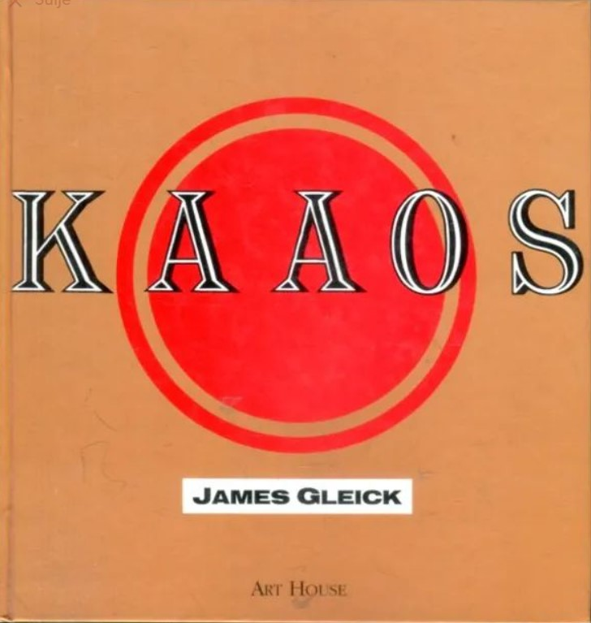
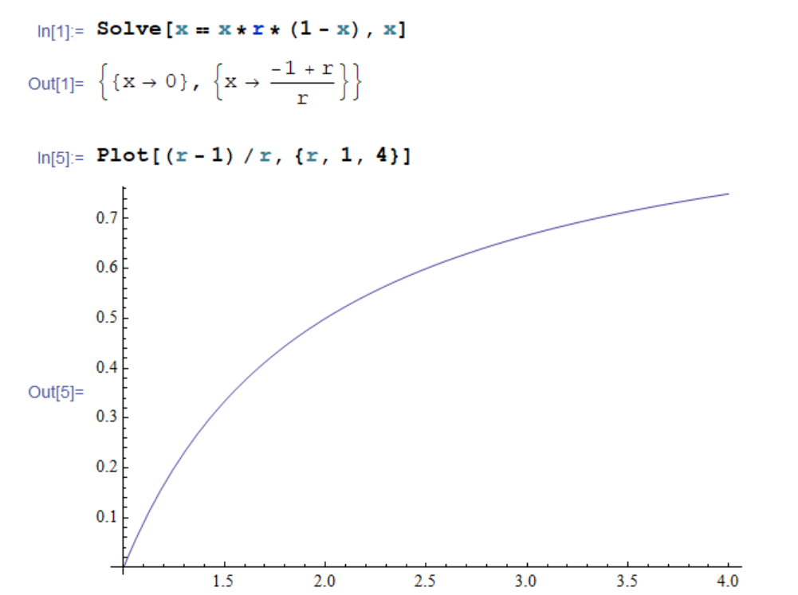
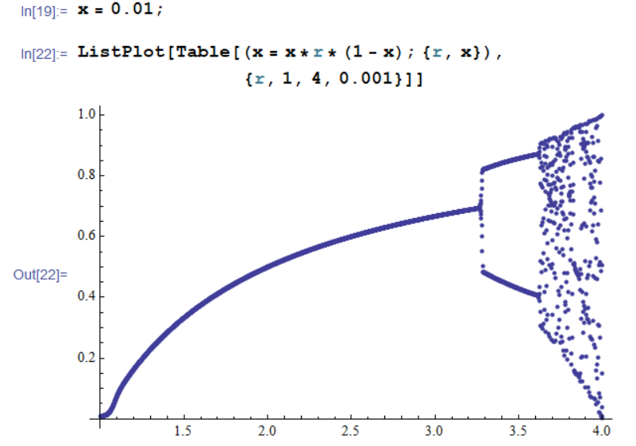
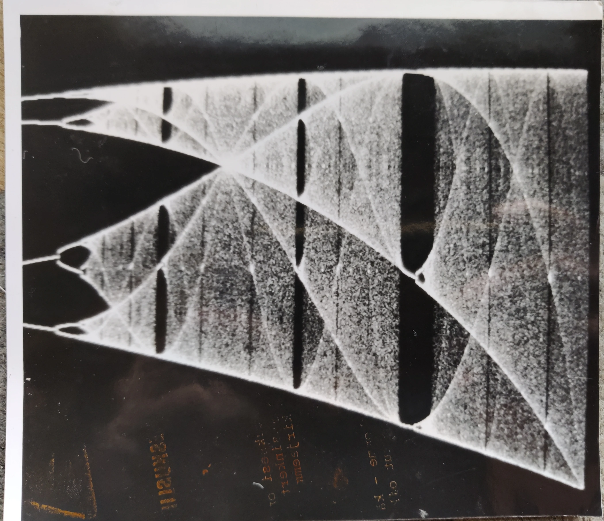
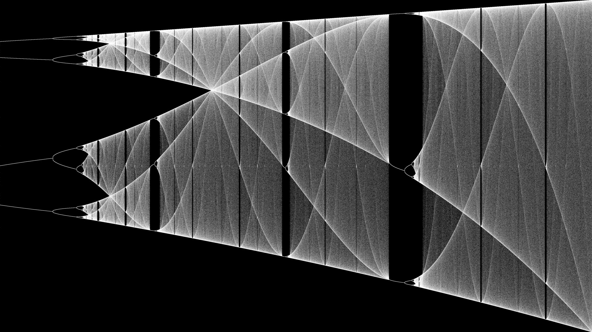
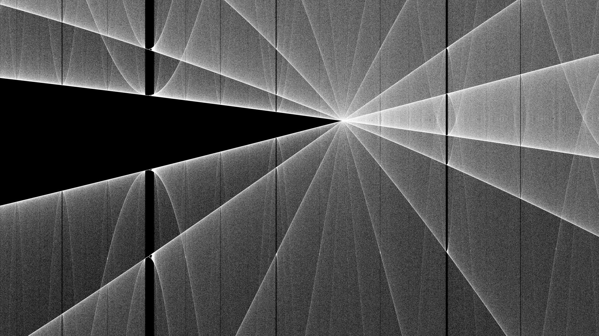
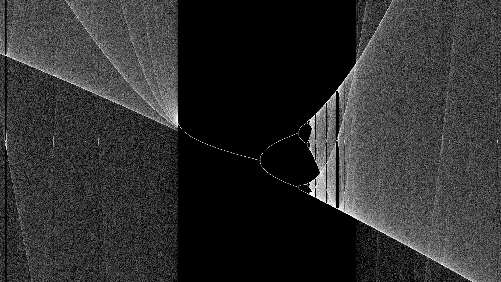

# Logistic Map Fractal



In 1989, when I was 16 years old, I got as a christmas gift a Finnish translation of James Gleicks popular science book [Chaos](https://en.wikipedia.org/wiki/Chaos:_Making_a_New_Science) (original english version published in 1987). It was an inspiring gift from my wise grandfather Robert "Oppe" Brotherus, who had been few years earlier introduced me to the hobby of programming with [my first computer VIC-20](/post/humble-beginnings-the-vic-20).

The book was a fascinating description about the new science of *Dynamic Systems*, *Strange Attractors* and *Fractals*. And for a computer-geek like me it was remarkable that chaotic behavior could be found from very simple formulas that could be implemented with very simple computer programs. So I did.

Soon after, in 1990-1992, I went to study at [Atlantic College](https://www.atlanticcollege.org/). The school had a computer room with early PC:s with VGA-graphics (640 x 480 resolution and 16 colors) running Windows 2.1. I spent some of my free time learning new programming languages and frameworks. Most importantly, I was able to use [Borland Turbo Pascal for Windows IDE](https://en.wikipedia.org/wiki/Turbo_Pascal#Turbo_Pascal_for_Windows) and compiler (predecessor of Borland Delphi) which used [Object Pascal](https://en.wikipedia.org/wiki/Object_Pascal). This served as my introduction to Object-Oriented programming - a significant upgrade from my earlier projects with [C64 Basic](/post/blast-from-my-commodore-64-past) and [Excel-macros](/post/excel-revolution-at-steel-factory-in-1989).

## From simple formula to complex chaos

On Atlantic College (AC) project-weeks the students were encouraged to work on various science/learning-projects of their choosing. I worked on making a graphical Windows-program for generating plots of the [logistic map](https://en.wikipedia.org/wiki/Logistic_map) fractal I had been reading about in the Chaos-book. The logistic map was originally popularized by a 1976 paper by the biologist **Robert Maywhich** and it remains one of the simplest formulas displaying chaotic behavior:

*x*<sub>n+1</sub> = *x*<sub>n</sub> · *r* · (1 − *x*<sub>n</sub>)

The formula can be thought as a model of a population of animals (*x*) varying between 0 and 1 as an iterative time-series. The new level of the population *x*<sub>n</sub>+1 is calculated from previous level *x*<sub>n</sub> by multiplying it with two factors having opposite effects. The factor *r* (eg. 2.5) represents exponential growth when single animal produces on average more than one offspring. The other factor (1 − *x*<sub>n</sub>) represents starvation with large population and approaches zero when population increases towards limit 1.

One can solve (using *Mathematica* here) as a function of the growth-parameter *r* the expected stable value of population where *x*<sub>n+1</sub> == *x*<sub>n</sub> :



When iterating consequent value in the series x<sub>1</sub>, x<sub>2</sub>, x<sub>3</sub>, ...  the iterated x<sub>n</sub> series indeed converges to the stable value (*r* − 1)/*r*, *but only when r* < 3.3. Surprisingly, for r > 3.3, the x<sub>n</sub> series does *not* converge to a single point but instead leads to oscillation between two or more values, eventually infinite set of values, becoming chaotic:



The program I wrote during the AC project-week in 1991 used Turbo Pascal for Windows to plot the logistic function in some range of r and x to a zoomable window. We had no good graphical printers available, but I had a film camera and took some pictures of the plots directly from the monitor. The black & white film I could then develop to photos myself in the schools photography dark-room. Here is reproduction of the original 1991 paper photo showing logistic map between 3.5 < *r* < 4.0 with many chaotic regions:



Like in other chaos/fractal programs, the part for iterating the function itself was trivial, just one line of code. Most of the code was devoted for creating and managing of windows, converting values of the function to visual coordinates of the screen and handling user-interaction for zooming and navigating the image.

## Revisiting the Logistic map in 2022

Unfortunately the original code from my Atlantic College program was eventually lost. But I made now a small new C# program re-creating these plots in high resolution. The main function is:

```csharp
readonly double r_min = 3.5, r_max = 4.0;
readonly double x_min = 0.0, x_max = 1.0;
readonly double step = 0.00000003;

double Intensify(double level) => level + (1.0 - level) * 0.2;

protected override void DoPlot() {
    double x = 0.1;
    double[,] plot = new double[PixelWidth+1, PixelHeight+1];
    for (double r = r_min; r < r_max; r += step) {
        x = x * r * (1 - x);
        var relScreenX = (r - r_min) / (r_max - r_min);
        var relScreenY = (x - x_min) / (x_max - x_min);
        var screenX = Convert.ToInt32(relScreenX * PixelWidth);
        var screenY = Convert.ToInt32(PixelHeight * (1 - relScreenY));
        plot[screenX, screenY] = Intensify(plot[screenX, screenY]); 
    }
    DrawPixels(plotLevel); 
}
```

At the line `x = x * r * (1 - x)` you can see the core logistics function iteration. With the values for `r_min`, `r_max` and `step` in the beginning of the code, there are about 50 million iterations of the formula, which amounts to 10 000+ iterations for each pixel-column on a 4K screen. This takes about 5 seconds on a modern PC, orders of magnitude faster than in 1991. Output is shown below:

[](https://raw.githubusercontent.com/rbrother/articles/refs/heads/main/logistic-map-fractal/logicstic-new.jpg)

At this level of detail, we can clearly see the defining feature of a *fractal*: *self-similarity* - The general structure of the plot with lines bifurcating to more lines and finally into chaos is repeated on smaller scale in the "islands of stability" between the chaotic regions. The higher fidelity compared to the 1991 version is mainly due to following factors:

1. the higher resolution of the image (4K 3860 x 2160 compared to the original VGA 640 x 480)
1. I render each pixel with various shades of gray (generated with the `Intensify`-function) instead of just black and white like the original. This creates a super-sampling effect, simulating even higher resolution.
1. The image can be reproduces here directly without using a film photograph as an intermediate.

The better processing power of todays computers allows generation of zooms on the plot in a way that would have been prohibitively slow on the 286 PCs of 1991. Here, for example, zoom from the intensive "star crossroads" region in the range 3.65 < r < 3.70, 0.6 < x < 0.8 :

[](https://raw.githubusercontent.com/rbrother/articles/refs/heads/main/logistic-map-fractal/logicstic-new-zoom.jpg)

Another zoom from 3.80 < r < 3.88, 0.4 < x < 0.6 where chaos abruptly converges to an "island of stability" and then expands again to chaos through miniature version of the main bifurcation pattern:

[](https://raw.githubusercontent.com/rbrother/articles/refs/heads/main/logistic-map-fractal/logicstic-new-zoom2.jpg)

It is fascinating how just repeating such simple formula can produce such variety of complex patterns and shapes - in very similar way to natural processes forming mountains and fern leaves. Even more amazing shapes can be found in the famous *Mandelbrot Set* I explored later, but that's a story for another time.
