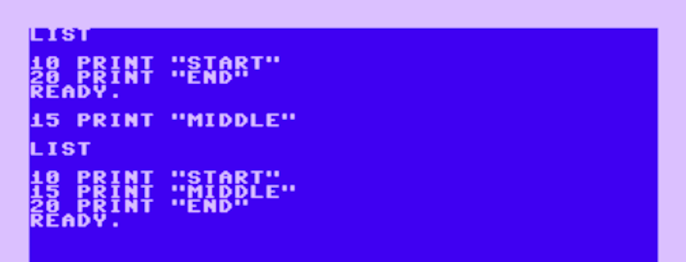
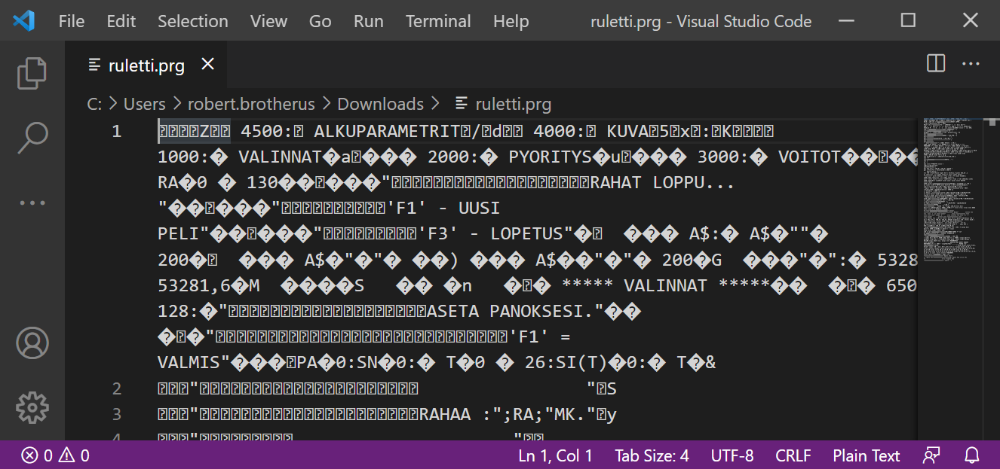
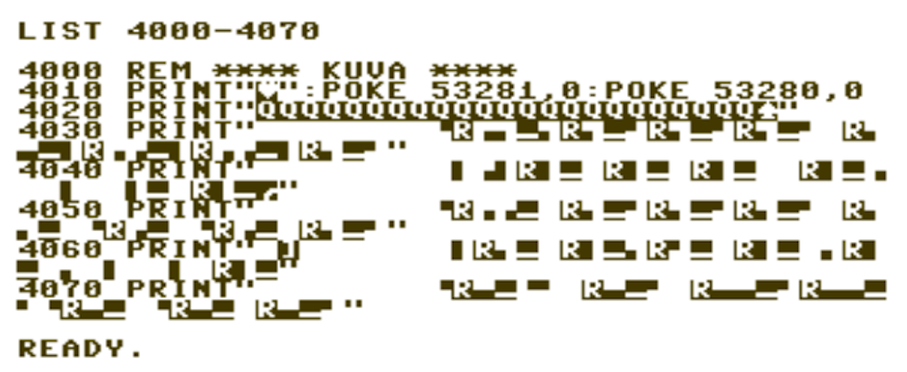
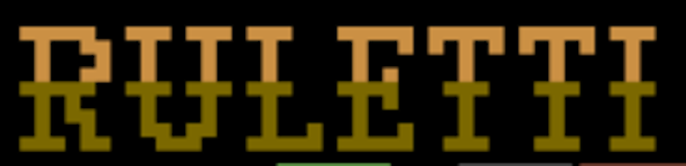
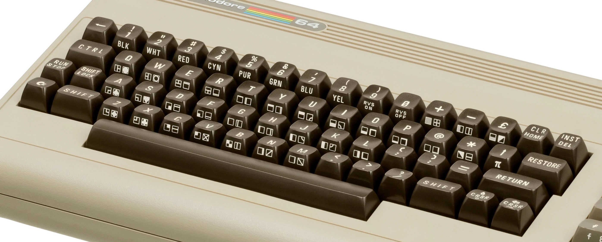
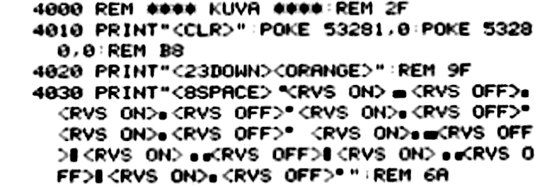

# Diving into Ruletti-64 code

**After finding and reviving my long-lost [Ruletti-64](/post/blast-from-my-commodore-64-past) game for Commodore 64, I wanted to take a bit deeper look on the kind of Basic code that I was writing in 1987 and remind myself of the challenges of coding at that time compared to today.**

When writing C64 Basic there was no *text editor* like the term is currently understood. In a modern text-editor like VSCode or Notepad, one can scroll up and down in a text file (or *buffer*), move cursor to any row and column in the buffer and modify text. This is very different (and much easier) than the way we needed to edit the programs in 1987. In C64 there is no view of the program where you can move up and down in the program listing. The mode of writing/editing the program resembles more like using command line like Windows CMD or Unix Bash. The LIST-command displays some or all lines of the program like Unix CAT-command prints lines from a file.

To add or edit line you need to write the full content of that line (starting with line-number) and press RETURN. This stores the line to memory to location indicated by the line number. If you have program with lines 10 and 20 and you want to add a line between them, you cannot simply move cursor visually between the these lines and write a new line. Instead you write a new line anywhere on the screen, but you use a line-number between 10 and 20 so then when you press RETURN, the new line will be stored in Basic memory between the lines 10 and 20.



## Investigating the source-code

Although the Ruletti-game is written in Basic as text, the original binary file [ruletti.prg](https://github.com/rbrother/ruletti64/blob/main/ruletti.prg) is not immediately readable with a text editor on PC, here is attempt to open with VSCode:



This is because of three reasons:

1. C64 uses for characters PETSCII encoding which uses different codes for several characters compared to the modern ASCII/UNICODE-encoding that modern PC:s use. 
1. Many C64 graphical/control characters do not have any equivalent in ASCII/UNICODE at all.
1. To save memory and improve performance, C64 stores basic keywords like PRINT as shorthand byte-tokens instead of readable text.

The most authentic and original way to view the source code - and the only available way during the years of the Commodore 64 era - is to stop the program in emulator and list some lines with `LIST`-command. Command `LIST` alone will list all the lines and for example command `LIST 4000-4070` will print to the screen subroutine that print the title text "RULETTI" for the game:



The execution of these lines creates the title text with graphical block-characters:



The way I was programming these lines was to first draw the desired block-configuration on a piece of paper and then determine the correct block-symbols for each character.

## Special characters galore

From the source code one can recognize the graphical block-characters where character has block in top-left, top-right, bottom-left, bottom-right, top-side or bottom-side. Looking at the C64 keyboard below, one can further spot that these graphical characters are found from keys C, D, F, V, I and K. To enter them with the C64 keyboard one presses the Commodore-character (bottom-left) and then the respective key with the symbol.



But the listing contains also other symbols that are more weird: inverse-heart, inverse Q:s and inverse R:s. What are they and how would one type them on the C64 keyboard? They are *control characters* with custom byte-codes and they encode for some non-visual action:

1. Inverse-heart denotes control character CLR with byte-value 147 and printing it results in the screen being cleared.
1. Inverse Q:s on line 4020 denote control-character DOWN with byte-value 17 and cause cursor to move one row down. 
1. Inverse spade in the end of line 4020 denote control-character ORANGE and change the color of subsequent printed text to be orange (the color of the top of the title-text)
1. Inverse R:s in the lines 4030-4070 denote control-character REVERSE and cause subsequent printed text to have inverse of the background/foreground colors.

The need to use such control-characters extensively in C64 basic-program print-statements has been surely causing tons of frustration to many young wannabe-programmers or even just kids wanting to enter to their computer some listing from computer-magazine like MikroBitti. Originally MikroBitti was printing C64 Basic listings exactly in the form that the C64 LIST-command prints them like the image above.

But a novice person trying to write such program from the listing with his C64 gets confused. How would he try to write, for example, the inverse heart on line 4010? They keyboard *does* contain heart-symbol in side of the S-key, but adding that to the print-statement would be incorrect: that produces character code 114 which represents the actual heart-symbol, which when printed will print out heart and not clear the screen. The actual correct way to produce the CLR control-code (*represented* by the inverse-heart) to the print statement is by pressing the CLR-key. Normally the CLR-key immediately clears the screen, but inside a print-statement it generates the control-character that is shown as inverse-heart, but when printed will clear the screen. Similarly for other control-characters: for example to enter the control-character DOWN (represented by inverse-Q) one presses INST followed by CURSOR-down key (which in the normal mode moves cursor down). Novice person without experience of writing such control-characters will surely fail.

One can wonder why such complex and unintuitive way of using embedded control-characters and representing them with weird inverse-symbols was chosen by Commodore for their Basic-programming. For example changing text color to orange could have been supported with a more friendly command like TEXTCOLOR ORANGE. And clearing the screen could have been supported with command like CLEAR. My guess is that the cryptic way was done because it makes the underlying *implementation* in the Basic-interpreter is very simple: implementing control-character execution becomes identical to execution of the control keypress. Furthermore, the basic-programs done using such control-characters use very little memory with only one byte needed for things like changing color. With only few kilobytes of memory available for the Basic-implementation and Basic-programs (especially in the earlier VIC-20 and PET-computers), low consumption of memory was valued over painful struggles of confused users.

## More clear ways for control-characters

Due to many complaints to MikroBitti from users failing to write the C64 listings to their computer, the magazine shifted to a representation that converts control-characters to more readable representation. In the [printed magazine version of the Ruletti-game](https://github.com/rbrother/ruletti64/blob/main/ruletti.JPG), the lines 4000-4030 look like this:



Here one can see control-characters being represented by their name in parenthesis like `<CLR>` or `<ORANGE>`. Of course writing such program to your C64 verbatim does not produce the desired outcome since it will print verbatim "`<CLR>`" and "`<ORANGE>`" instead of doing the desired action. So it still requires skill from the person entering the code to know right keys to press, but at least they get now hint to the actual texts on the buttons to press.

For modern PC-users wanting to inspect Commodore 64 Basic-programs there is set of [VICE (Versatile Commodore Emulator) tools for Unix](https://vice-emu.sourceforge.io/), including [petcat-command](http://manpages.ubuntu.com/manpages/bionic/man1/petcat.1.html) for converting PRG-files to ASCII-text. The result I have saved as [ruletti.txt](https://github.com/rbrother/ruletti64/blob/main/ruletti.txt) with 167 lines of BASIC. For example,
Line 4030 print-statement petcat ASCII version if looks like:

```basic
4030 print" {CBM-C}{rvon}{CBM-D}{CBM-F}{rvof}{CBM-F}
{rvon}{CBM-F}{rvof}{CBM-V}{rvon}{CBM-F}{rvof}{CBM-V}
{rvon}{CBM-F}{rvof}{CBM-V} {rvon}{CBM-F}{CBM-I}{rvof}
{CBM-K}{rvon}{CBM-D}{CBM-D}{rvof}{CBM-K}{rvon}{CBM-D}
{CBM-D}{rvof}{CBM-K}{rvon}{CBM-F}{rvof}{CBM-V}"
```

Since ASCII/UNICODE does not include the kind of block-characters used in C64, petcat simply uses `{CBM-X}` (with X in C, D, F, V, I, K) to represent them in addition to the textual representation of control-codes used by MikroBitti like `{rvon}`.

## Memory manipulation

Another challenging feature of C64 Basic is the extensive need to use direct memory manipulation with `POKE`-commands to achieve some effects. Just like the used of control characters, usage of general `POKE`-command instead of separate more clear commands allows for smaller and simpler Basic-interpreter at the cost of programming difficulty and program readability. Typical example is the poke-commands on line 4010:

```basic
4010 print"{clr}":poke 53281,0:poke 53280,0
```

The memory locations 53280 and 53281 determine the color of the screen border and screen background. Setting both to zero make the whole screen background black - typical for the style of many games. A more extensive Basic (with larger memory footprint) would surely include some user-friendly command like "COLOR" for such common setting.

For effectively write Basic-games for C64, one needs to learn dozens of these kind of memory-addresses and their relevant value-ranges. Today internet has [good reference-pages for those](http://sta.c64.org/cbm64mem.html), but back in 1987 one had to gather bits and pieces from various printed sources.

The other POKE-addresses and operations used in the Ruletti-game are:

* `POKE 198,0`  →  Keyboard buffer length to zero before keyboard input
* `POKE 646,v2`  →  Set current cursor color value 0-15
* `POKE 650,128`  →  Keyboard repeat behavior: prevent single keypress generating many strokes
* `POKE 781,y(t):POKE 780,0:POKE 782,0:SYS 65520` →
Set cursor position to beginning of row Y by calling respective Kernal routine at memory 65520. Memory locations 780, 781 and 782 define the processor register values for the call.
* `POKE 1024+x(t)+y(t)*40,170` →
Write single character directly to x/y-position in screen memory

## Primitive Arrays

Commodore 64 Basic data types are very simple by today's standards, but of course I knew of nothing better at the time. The complete set of data types is: (1) float, (2) integer, (3) string, (4) array of float, (5) array of integer, (6) array of string. That's it. No structured types, custom types, maps, etc. Also arrays are of fixed size predefined in code.

It does not help that variable-names can be only 2 characters long. At my university-times I was working on Fortran77 that had 6-character limitation on variable names. Even that was painfully short by modern standards, but sheer luxury compared to the 2 char limit of C64 Basic.

In the Ruletti-game there is need to store some information for all 23 pieces in the roulette-wheel: the number in the piece, the x-coordinate and y-coordinate. The modern way would be to have an array of objects (tuples, structs, maps, etc.) with each object containing tile number, x and y. For example in Clojure:

```clojure
[ {:n 0 :x 17 :y 5}  {:n 8 :x 23 :y 5} {:n 1 :x 27 :y 5 }
  {:n 16 :x 31 :y 5} {:n 5 :x 31 :y 8} ... {:n 13 :x 11 :y 5} ]
```

But since C64 does not have such structures and arrays cannot contain other arrays, one needs to use three separate arrays for n, x and y and just *by convention* store properties of items in the three arrays with matching indexes:

```clojure
n:  [ 0   8  1 16  5 ... 13 ]
x:  [ 17 23 27 31 31 ... 11 ]
y:  [ 5   5  5  5  8 ...  5 ]
```

Furthermore, since the language does not have array-literals, to initialize the array values, they need to be `READ` with a loop from a flat list of `DATA`-statements:

```basic
4540 dim n(23),x(23),y(23),si(27)
4550 for t=0 to 22:read n(t),x(t),y(t):next t
4560 data 0,17,5,8,23,5,1,27,5,16,31,5

4565 data 5,31,8,10,31,11,7,31,14

4570 data 20,31,17,3,31,20,12,27,20

4575 data 17,23,20,14,19,20,19,15,20

4580 data 6,11,20,9,7,20,2,3,20

4585 data 21,3,17,22,3,14,11,3,11

4590 data 18,3,8,15,3,5,4,7,5,13,11,5
```

Since the data in DATA-statements is read in the loop three at a time (N, X,Y) the groups of three consequent numbers belong logically together. But due to the limitation of the language, this grouping cannot be expressed with the language syntax which makes the data confusing to read.

## Subroutines... sort of

Modern languages have ways of structuring programs to set of files and set of functions inside a file. Commodore 64 Basic has just one single file per program. A basic program loaded from a file cannot refer to code in another file. Furthermore, code in this single file is syntactically just continuous sequence of lines without any structure. 

However, in addition to the [infamous `GOTO`-statement](https://homepages.cwi.nl/~storm/teaching/reader/Dijkstra68.pdf), the Basic has command `GOSUB` for jumping to a line so that next `RETURN`-statement will return execution to the line after `GOSUB`. So this allows "poor man's subroutines": blocks of code that are not syntactically distinguished but are at runtime executed as a group since the first line in the block is called with subroutine and the block ends in `RETURN`.

If you look at the [Ruletti-game source code](https://github.com/rbrother/ruletti64/blob/main/ruletti.txt), you can see some attempts to establish primitive sections of the code to different subroutines. Indeed, the beginning of the program defines "main loop" that consists only of calls to subroutines:

```basic
90 gosub 4500:rem alkuparametrit

100 gosub 4000:rem kuva

130 gosub 1000:rem valinnat

140 gosub 2000:rem pyoritys

150 gosub 3000:rem voitot

160 if ra>0 then 130
```

I chose the line-numbering of the subroutines so that new subroutine starts with round number 1000, 2000, 3000, etc. and the step of line-numbers inside the subroutine are 10 apart (so there could be maximum of 100 lines in a subroutine). Furthermore I have added some empty lines as space between subroutines and some REM (remark) statement as the title and name of the subroutine. For example the subroutine at lines 2000-2190 "pyöritys" (rotation) performs spinning of the light when roulette is running and has 23 lines:

```basic
2000 rem ***** pyoritys *****

2015 r=int(rnd(0)*23)+40

2030 t=0:k=0:vi=1

2050 poke 781,y(t):poke 780,0:poke 782,0:sys 65520

2055 if int(t/2)=t/2 then v1=2:v2=10:goto 2060

2057 v1=11:v2=12

2060 if t=0 then v1=5:v2=13

2065 if k>r then vi=vi*1.5

2070 poke 646,v2

2080 print tab(x(t))"{rght}{rvon}  {CBM-M}{rvof}"

2085 print tab(x(t))"{rvon} {rght}{rght}{CBM-M}{rvof}"

2090 print tab(x(t))"{rvon}{CBM-P}{CBM-P}{CBM-P}{SHIFT-@}{rvof}{up}{up}{up}"

2095 poke 646,v1:for tt=1 to vi:next tt

2097 if vi>800 then 2160

2100 print tab(x(t))"{rght}{rvon}  {CBM-M}{rvof}"

2105 print tab(x(t))"{rvon} {rght}{rght}{CBM-M}{rvof}"

2110 print tab(x(t))"{rvon}{CBM-P}{CBM-P}{CBM-P}{SHIFT-@}{rvof}"

2120 t=t+1:if t=23 then t=0

2130 k=k+1

2150 goto 2050

2160 t=n(t)

2170 vv=t

2190 return
```

## Imperative galore

I have in recent years become advocate of *functional programming* with *immutable values*, where most of the program logic is done with *pure functions* that return values computed from their input parameters and have no side-effects. In such style manipulation of program state is kept at minimum and when necessary done in controlled way. This is the style advocated and supported by [Clojure language](https://clojure.org/). 

The opposite of functional programming is *imperative programming*, where program logic is done with *commands* that *modify program/computer state*. The style of Commodore 64 Basic-programs, including my Ruletti-game, is *maximally imperative*: *every single statement of the whole program manipulates global state in one of four ways*:

1. Printing stuff to the screen (modification of screen state)
1. Assigning value of a global mutable variable
1. Direct modification of mutable memory with POKE
1. Jumping to another program line with GOTO, GOSUB and RETURN (modification of program current location state)
1. Imperative index-variable looping with FOR/NEXT

## Comparison of Stone-age and Space-age

Other programming languages than the in-built Basic and machine language were developed for Commodore 64. There are multiple versions of [Basic , Pascal, Forth, Prolog and LISP](https://www.lyonlabs.org/commodore/onrequest/collections.html) existing, for example [Micro-Lisp for C64](https://www.lyonlabs.org/commodore/onrequest/micro-lisp.pdf) was published in the [Transactor Magazine](https://en.wikipedia.org/wiki/The_Transactor) at the same exact time in 1988/05 as Ruletti-game. But with lack of internet for spreading information or copies of these, most hobbyists like me were not even aware of their existence, even less possible to use them.

It is intriguing idea to someday re-write Ruletti-game with same options and same logic but using the best tools, editors, languages and functional styles available on PC today instead of the very limited C64 Basic to really compare ease and power of development compared to typical hobbyist setup 35 years ago. If programming was delightful even with the formidable limitations and challenges of Commodore 64 Basic (and it was!) then it is even more delightful with best tools available today 😄 (I did exactly this later and wrote [another article](/post/ruletti-re-born-after-34-years) on the result).
