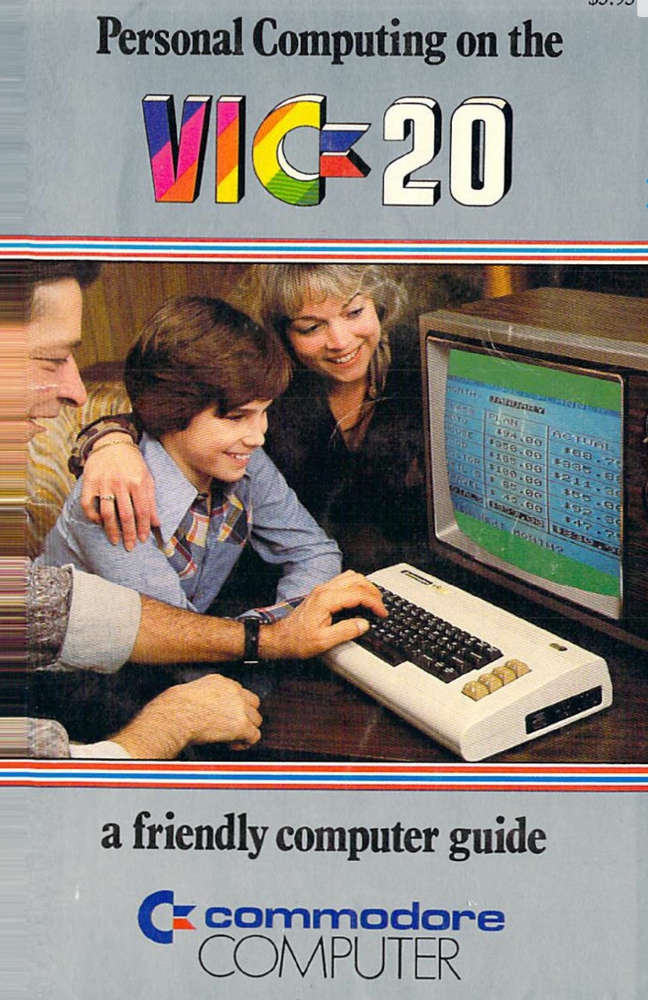
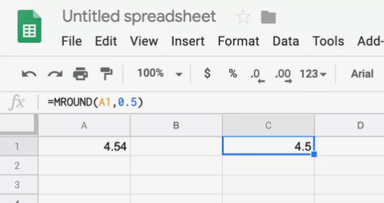
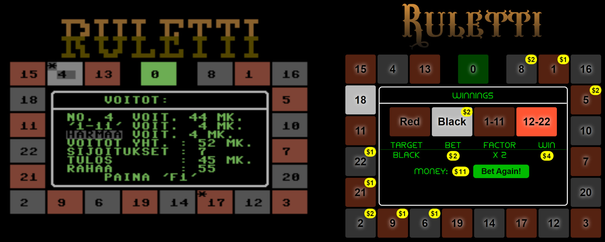
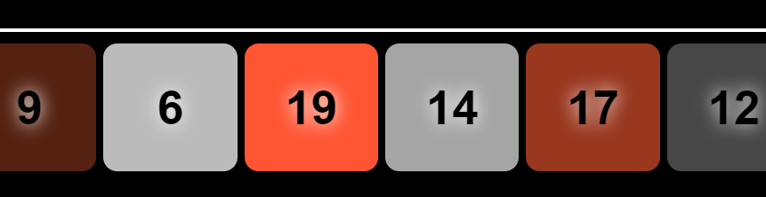
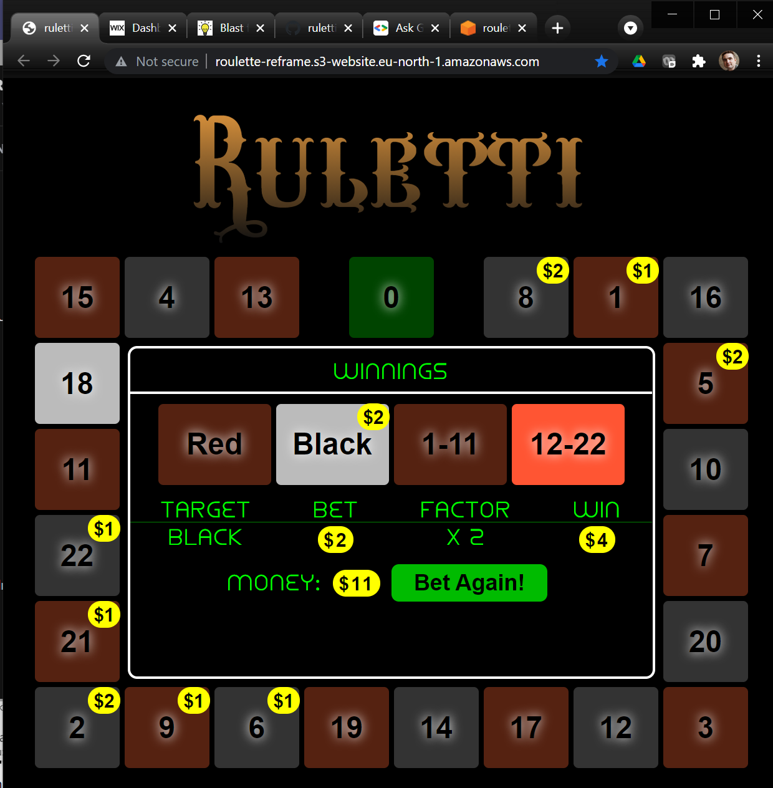

# From imperative C64 Basic to functional-reactive programming

**Comparing the programming style of my 1987 Commodore 64 Basic Roulette-game to a modern functional-reactive re-implementation with ClojureScript, Re-frame and React reveals a world of difference in the ways in which we can command our computers.**

In the preceding posts I have been describing [a roulette-game I wrote for Commodore 64 in 1987](/post/blast-from-my-commodore-64-past), the [re-creation of the game with modern tools and languages](/post/ruletti-re-born-after-34-years) and the [difference in development experience now and then](/post/developer-experience-in-1987-with-c64-vs-modern-tools). Here I want to go deeper to core meat of programming: to compare at source-code and architectural level the Commodore64 imperative Basic program with PRINT-based UI to the modern functional-reactive Clojure-version with React / Re-Frame -based UI.

## Basic, Basic, Basic, ...

After [I got my VIC-20 computer in 1982](/post/humble-beginnings-the-vic-20) at age of 9 and later Commodore 64 in 1984, I continued to learn more and more Basic-programming. Initially my only source of learning was finnish-language version of the [VIC-20 user manual](http://cini.classiccmp.org/pdf/Commodore/VIC-20%20User's%20Manual.pdf). From 1984 I started to get more examples from program-listings in [MikroBitti-magazine](https://www.mikrobitti.fi/) which also later published my 1987 game.

[](http://cini.classiccmp.org/pdf/Commodore/VIC-20%20User's%20Manual.pdf)

Quite early in my learning-process I thought of a metaphor for computer program execution which I also used to describe to family and friends: it is like a tiny man walking downward in the program, stepping from one code-line to the next and executing each one in turn. `GOTO` and `GOSUB` statements would then instruct the man to jump to a different line and continue stepping down from there.

This metaphor is still quite valid and can be used to describe programming to kids, but I understand today that it really only describes the *imperative programming* style that the Commodore 64 Basic represents. Within the imperative paradigm, an essential aspect of executing programs is the *current location* in the code where execution is happening and equally important is the *order* in which the program commands are executed. Even the very word *program* has original meaning of *schedule* of a day, indicating a sequence of actions that should be carried out at determined times. But in the *functional programming* paradigm that the modern Re-frame version the game represents, the concept of current execution location becomes, if not completely non-existent, almost irrelevant, making the metaphor for little man obsolete.

## Functional-reactive programming: the Spreadsheet metaphor



Functional-reactive programming is sometimes compared to how a spreadsheet software like MS Excel operates. Making a spreadsheet is simple: One enters some input data to set of cells and some formulas (functions) to other cells. Calculated cells can us as input cells with constant values or other calculated cells, forming a tree of calculations that ends up with final result cells.

Person developing an Excel-sheet specifies (declares) the input data and the calculated relationships (functions) between cells. The developer does not need to specify - and indeed *is not allowed* to specify - the execution order or scheduling of the calculations. Excel will internally do all the imperative heavy lifting: after any change to the input data, Excel uses clever internal algorithms to determine which calculated cells are "dirty" (need to be re-calculated) and then automatically calculates them in optimal order. This completely frees the spreadsheet developer from writing any update-code, which is a huge win considering how complex, error-prone and badly performing such UI-update code can become in large UI-applications.

We do not usually call a person developing Excel-spreadsheets a *programmer*, but what he does is actually quite close to functional programming. But then again, perhaps functional programming should not be called *programming* since that word invokes the invalid imperative metaphor of ordered execution of series of steps. Perhaps terms like *functional coding* or *functional software development* would be more appropriate. In any case we rarely talk any more of *programmers* (whether imperative of functional) as job descriptions but rather more generally *software developers* or *coders*.

Functional-reactive programming (FRP) of a Web-application is similar to making a spreadsheet but without limitations of spreadsheet. Like in Excel, content of the UI is formed by the FRP framework with automatic evaluation of nested functions starting from initial state values. But in FRP the input values and intermediate results of the functions can be any complex data structures instead of just primitive strings and numbers. And while in Excel UI is represented as tables, in FRP the final UI can combine any HTML/CSS/SVG elements to any visual forms. And while in Excel the state of the application can be modified by user manually editing values of input-cells, in FRP the application state can be updated by functions connected to any UI-actions.

## UI constructed in imperative Steps

Consider the visual roulette-wheel with 23 tiles in my [Commodore 64 Basic Ruletti-64 game](/post/blast-from-my-commodore-64-past) and in the [*Ruletti-reframe* remake](/post/ruletti-re-born-after-34-years):



How is the roulette-wheel and its tiles produced in each program? In the [Ruletti-64 source code](https://github.com/rbrother/ruletti64/blob/main/ruletti.txt) the creation of the roulette-wheel is spread into various subroutines that represent different phases of the game. Subroutine on line-numbers 2000-2190 handles "rotation" of the wheel where tiles light up one by one along the wheel (see [my original article on the C64 version](/post/blast-from-my-commodore-64-past) for more explanation on the code):

```basic
2000 REM ***** PYORITYS ***** 
2015 R=INT(RND(0)*23)+40 
2030 T=0:K=0:VI=1 
2050 POKE 781,Y(T):POKE 780,0:POKE 782,0:SYS 65520 
2055 IF INT(T/2)=T/2 THEN V1=2:V2=10:GOTO 2060 
2057 V1=11:V2=12 
2060 IF T=0 THEN V1=5:V2=13 
2065 IF K>R THEN VI=VI*1.5 
2070 POKE 646,V2 
2080 PRINT TAB(X(T))"{RGHT}{RVON}  {CBM-M}{RVOF}" 
2085 PRINT TAB(X(T))"{RVON} {RGHT}{RGHT}{CBM-M}{RVOF}" 
2090 PRINT TAB(X(T))"{RVON}{CBM-P}{CBM-P}{CBM-P}{SHIFT-@}{RVOF}{UP}{UP}{UP}" 
2095 POKE 646,V1:FOR TT=1 TO VI:NEXT TT 
2097 IF VI>800 THEN 2160 
2100 PRINT TAB(X(T))"{RGHT}{RVON}  {CBM-M}{RVOF}" 
2105 PRINT TAB(X(T))"{RVON} {RGHT}{RGHT}{CBM-M}{RVOF}" 
2110 PRINT TAB(X(T))"{RVON}{CBM-P}{CBM-P}{CBM-P}{SHIFT-@}{RVOF}" 
2120 T=T+1:IF T=23 THEN T=0 
2130 K=K+1 
2150 GOTO 2050 
2160 T=N(T) 
2170 VV=T 
2190 RETURN
```

The highly imperative nature of the code is apparent from these factors:

1. The UI is produced with PRINT-commands which mutate the *current content of the screen* directly. Lines 2080-2090 print a tile with highlighted color and lines 2100-2110 print it again with regular darker color.
1. Even within individual PRINT-commands there are control characters that mutate the internal state of the printing-system. For example {RGHT} is a control-character moving *current cursor position* one character right.
1. Even worse, the UI building uses POKE-commands that set (mutate) values of individual RAM-memory locations. For example on line 2080 the statement POKE 646,v2 sets the current printing color to one of the 16 colors of Commodore 64.
1. Line 2095 has an imperative busy-loop for producing delay of varying length between the bright-printing and dark-printing.
1. There are lot of GOTO-statements and other jumps to line-numbers making the current line of execution important part of the program state.
1. The whole clip intermixes in delicate order steps of modifying the screen-state (using print-statements and pokes) with steps modifying the core application state like variable T representing currently highlighted tile.

What is worse, the code above is not the only place printing tiles. Later on lines 4085-4170 is part of subroutine that prints the whole roulette wheel tile by tile as part of initialization of the game:

```basic
4085 FOR T=0 TO 22:POKE 781,Y(T):POKE 780,0:POKE 782,0:SYS 65520 
4090 V=11:IF T=0 THEN V=5:GOTO 4110 
4100 IF INT(T/2)=T/2 THEN V=2:GOTO 4110 
4110 POKE 646,V:A$=STR$(N(T)):A$="{RVON}"+A$ 
4120 PRINT TAB(X(T))"{RVON}   {CBM-M}{RVOF}" 
4130 PRINT TAB(X(T))"{RVON}   {CBM-M}{RVOF}" 
4140 PRINT TAB(X(T))"{RVON}{CBM-P}{CBM-P}{CBM-P}{SHIFT-@}{RVOF}" 
4150 PRINT"{UP}{UP}";TAB(X(T))A$ 
4170 NEXT T
```

This part is logically completely independent of the earlier code, showing how the visual representation of the wheel and tiles is not in one place but multiple, confusing the structure of the program. Mutable state of imperative programming makes such duplication easy to happen. Furthermore the fact that we need any kind of visual *initialization* of the wheel at all speaks to the stateful imperative way is used to construct the wheel.

All parts of the code that print roulette-wheel tiles use global arrays n, x and y for printing the tiles to hard-coded absolute character positions. These are initialized in data-statements on lines 4540-4590:

```basic
4540 dim n(23),x(23),y(23),si(27)
4550 for t=0 to 22:read n(t),x(t),y(t):next t 
4560 data 0,17,5,8,23,5,1,27,5,16,31,5
4565 data 5,31,8,10,31,11,7,31,14
4570 data 20,31,17,3,31,20,12,27,20
4575 data 17,23,20,14,19,20,19,15,20
4580 data 6,11,20,9,7,20,2,3,20
4585 data 21,3,17,22,3,14,11,3,11
4590 data 18,3,8,15,3,5,4,7,5,13,11,5
```

## UI As a *function* of *state*

The representation of the roulette-wheel and its tiles in the Clojure-code of the new functional-reactive version is radically different:

```clojure
(defn roulette-wheel []
  [:div.wheel
    [tile 20] [tile 21] [tile 22]   [tile 0]  [tile 1] [tile 2] [tile 3]
    [tile 19] [center-area]                                     [tile 4]
    [tile 18]                                                   [tile 5]
    [tile 17]                                                   [tile 6]
    [tile 16]                                                   [tile 7]
    [tile 15] [tile 14] [tile 13] [tile 12] [tile 11] [tile 10] [tile 8]])

(defn tile [index]
  (let [{:keys [number style]} (get data/tile-info index)]
    [:div.center-content {:style style}
    [tile-core {:content number}]]))
        
(defn tile-core [{:keys [content style]}]
  [:div.tile {:class (?? :tile-style content) :style style }
  [:div.tile-text content]
  [:div.tile-money [c/money-ball-opt (?? :bet content)]]])
```

The functional design is apparent in several ways:

1. The `roulette-wheel`, `tile` and `tile-core` are nested *functions* (defined with Clojure `defn`) that return as result the corresponding UI as pseudo-HTML "hiccup" data.
1. These functions do not modify/mutate any state internally or on the screen. This means they can be executed at any time and any order from any caller.
1. These functions are the *only* functions that produce the roulette wheel and tiles in the whole program, regardless of the current game phase or program state. This means that exact same functions are used for tiles in startup, betting, roulette-rotation and winning phases, naturally removing duplication.
1. Since these functions produce pseudo-HTML and HTML is *declarative* language, the UI defined with these functions is also declarative. We can see the correspondence of the layout of the roulette wheel directly in the structure of the wheel-function code because HTML order corresponds to the visual order of elements on the screen.
1. The code is describing *only* the visual appearance of the wheel and is completely decoupled from any *state-changing* code, for example code that performs rotation of the highlighted tile.

Although the Clojure-code above tries to show some comparison to the earlier code of the C64 version, these versions don't of course really correspond to each other exactly. The C64 snippet shows tiles being printed *while rotating the wheel*. There is no code-snippet in the C64 version that corresponds simply to the visual UI of the wheel and tiles since imperative UI-code necessarily couples execution of UI-construction with state-mutating logic. In the imperative paradigm one block of code corresponds to a *game phase* with everything that relates to that phase (output, input, state-change). Hence the difficulty in comparing so vastly different programming paradigms: We cannot simply take a small code-snippet from one version and find a corresponding code-snippet from the other version since the structure and interleaving of the code is so different.  

The `tile`-function refers to `tile-info` data which is bit similar to the C64 data statements in providing static info about individual tiles in the wheel:

```clojure
(def tile-info
  [{:number 0, :color :green, :style {:grid-column-end "span 2"}},
    {:number 8, :color :black} {:number 1, :color :red}
    {:number 16, :color :black} {:number 5, :color :red}
    {:number 10, :color :black} {:number 7, :color :red}
    {:number 20, :color :black} {:number 3, :color :red}
    {:number 12, :color :black} {:number 17, :color :red}
    {:number 14, :color :black} {:number 19, :color :red}
    {:number 6, :color :black} {:number 9, :color :red}
    {:number 2, :color :black} {:number 21, :color :red}
    {:number 22, :color :black} {:number 11, :color :red}
    {:number 18, :color :black} {:number 15, :color :red}
    {:number 4, :color :black} {:number 13, :color :red}])
```

These contain the tile numbers like the C64 `DATA`-statements but with a more clear syntax. They do not need contain the tile x/y-coordinates like in the C64 version since they HTML-layout is based on logical grid where browser is calculating positions automatically and programmer does not need to worry coordinates.

The wheel and tile UI-functions are supplemented by a separate pseudo-CSS style-definitions which are also just static declarative Clojure-data. Keeping the style-attribute details in separate CSS-classes allows the UI-components to concisely focus only on the logical layout:

```clojure
[:div.wheel
  {:display :inline-grid
  :grid-template-columns "auto auto auto auto auto auto auto auto"
  :grid-template-rows "auto auto auto auto auto auto"}]
[:div.tile (merge center-base
    {:border "solid 3px black" :border-radius "12px"
    :width "90px" :height "86px" :color :black
    :font-size "32px" :font-weight "bold" :font-family "sans-serif"
    :letter-spacing 0, :position "relative"})]
[:div.tile:hover {:border-color "#880"}]
[:div.tile-text {:text-shadow "0 0 12px #fff"}]
```

## Global state and Functional state updates

The C64 version of rulette-wheel rotation on lines 2000 - 2190 listed above combines visual update code with imperative mutation of the game state:

Slowing down of the rotation speed by conditional increasing of duration-variable VI:

```basic
2015 R=INT(RND(0)*23)+40
...
2065 IF K>R THEN VI=VI*1.5 
2095 ...FOR TT=1 TO VI:NEXT TT 
```

Moving to next tile to light up:

```basic
2120 T=T+1:IF T=23 THEN T=0 
```

Moving away from the wheel-spinning loop when speed has slowed down below given threshold:

```basic
2097 IF VI>800 THEN 2160 
```

Such mutation code is absent from the Clojure-version view-functions listed above. Handling necessary state like currently lit tile is obviously needed also in the modern re-frame version, but in the functional-reactive approach such state-modifying code is fully separated from the UI-view code and also implemented as pure functions. The updating functions are called events and following code shows declaration of events related to the roulette-wheel spinning:

```clojure
(defn inc-rolling-index [index] (if (= index 22) 0 (inc index)))

(rf/reg-event-fx :fast-roll
  (fn [{{:keys [step-delay steps-to-slowdown] :as db} :db} _]
    (let [slow-down? (= steps-to-slowdown 0)
        next-event (if slow-down? [:slow-down-roll] [:fast-roll])]
      {:db (-> db (update :rolling-index inc-rolling-index)
            (update :steps-to-slowdown dec))
      :dispatch-later [{:ms step-delay, :dispatch next-event}]})))

(rf/reg-event-fx :slow-down-roll
  (fn [{{:keys [step-delay] :as db} :db} _]
    (let [next (if (> step-delay 2000) [:winnings] [:slow-down-roll])]
      {:db (-> db (update :rolling-index inc-rolling-index)
            (update :step-delay #(* % 1.5)))
      :dispatch-later [{:ms step-delay, :dispatch next}]})))
```

This code implements the two-phase rotation of the wheel in following way:

1. There are two events, defined with `reg-event-fx`: `fast-roll` which handles the initial period of fixed-speed rotation and `slow-down-roll` which then takes over the period of slowing down of the rotation.
1. Each event is implemented as a *pure anonymous function* with Clojure `(fn ...)`. These event-functions take the current application state (called "db" here) as input parameter and return a structure with updated application-state. For example `slow-down-roll` event is producing increased value of `rolling-index` attribute by applying `inc-rolling-index` function to it and larger value of `step-delay` attribute by multiplying it with 1.5.
1. The event-functions as pure functions do not themselves modify the application state but just *describe* how such modifications can be done. The actual application of the event-function to the application state is taken care by the re-frame framework behind the scenes.
1. Re-frame applies the event-function to the application state as an *atomic swap* to the new value. That means that the application state will never be in some invalid intermediate state: all attribute-changes in the application state happen *at the same time* from programmers point-of-view. Contrast this with the C64 version which is separately at different times mutating the global `T` and `VI` variables. In a large-scale program the atomic updating is important to ensure that the global state is never in a temporarily invalid state due to a half-finished update.
1. Each event-function describes a *dispatch* (a trigger of a another event) after a delay `step-delay` with re-frame `dispatch-later`. The `fast-roll` event can recursively trigger another `fast-roll` or move to the next phase by triggering `slow-down-roll`. The `slow-down-roll` in turn can recursively trigger another `slow-down-roll` or end the rotation phase by triggering `winnings`. The recursive triggering of events creates repetitive behavior in the UI without need of imperative stateful loop of the C64 version.

It is worth noting that in the functional-programming version, there is no manipulation of *current* contents of the screen, *current* location of cursor or *current* value of index variables. Only the true external state of the program (like current phase of the game and currently lit tile) need to be managed at all whereas all the superfluous aspects of state that were present in the imperative C64 basic simply vanish. This removal of unnecessary concerns means that programmer can focus more on the core definition of the software, increasing productivity and avoiding multiple categories of bugs that can easily hit imperative logic.

## Connecting state to the UI with subscriptions



<small>Ruletti re-frame Tiles "lighting up" one by one and then slowly dimming</small>

Keeping the logic that updates the application state separate from the UI-functions simplifies the software architecture and eliminates many possibilities of bugs. But in the end the UI still needs to depend on the application state. Here the functional-reactive paradigm uses the "Excel-like" automatic calculations discussed earlier. In re-frame these "calculated cells" are called *subscriptions* and they are unsurprisingly also created with pure functions.

Using again the tiles in the roulette-wheel as an example, we want to connect the application state attribute `rolling-index` to the tile brightness. We saw in the discussion of events above how this attribute is incremented by the wheel rolling events. Following code is the other side of the coin: subscriptions that cause the tile corresponding to the current `rolling-index` to be highlighted:

```clojure
(rf/reg-sub :rolling-index (fn [db _] (:rolling-index db)))

(rf/reg-sub :tile-style :<- [:rolling-index]
  (fn [rolling-index [_ content]]
    (let [level (if (target-match? content rolling-index) :bright :dim)
        {:keys [color]} (get data/tile-map content)]
    (get-in data/colors [level color]))))

(defn tile-core [{:keys [content style]}]
  [:div.tile {:class (?? :tile-style content) :style style ...}
  [:div.tile-text content] ...])

(def colors
  {:dim {:green "fade-green" :red "fade-red" :black "fade-gray"}
    :bright {:green "green-bright" :red "red-bright" :black "gray-bright"}})

;; Pseudo-CSS
[:.green-bright {:background-color "#2F2"}]
[:.red-bright {:background-color "#F53"}]
[:.gray-bright {:background-color "#BBB"}]
[:.fade-green (assoc fade-animation-base :animation-name "fade-green")]
[:.fade-red (assoc fade-animation-base :animation-name "fade-red")]
[:.fade-gray (assoc fade-animation-base :animation-name "fade-gray")]
```

Here is how the code transforms the rolling-index to the highlight of the corresponding tile:

1. Line `(rf/reg-sub :rolling-index  ...)` creates a *subscription* `rolling-index` as a function which simply returns the value of the rolling-index attribute in the application state (called "db" here). Subscriptions are like calculated Excel-cells that are re-calculated by re-frame automatically when their source-data changes. `rolling-index` is called *first level* subscription since it uses the raw application state (db) as its input.
1. Next `(rf/reg-sub :tile-style :<- [:rolling-index] ...)` defines subscription which takes `rolling-index` subscription as input. It is called *second level subscription* because it does not depend directly on the raw application state but from other subscription(s), like calculated Excel-cell using another calculated cell as input. In addition to the input from another subscription, the subscription takes another input-parameter content which will be given when the subscription is used in the UI.
1. The `tile-style` subscription returns the CSS style-class for the tile based on the tile base `color` (green, black, red) and level (dim, bright). The level is bright when `target-match?` function determines the rolling-index to be correspond to the target-tile content.
1. The UI view `(defn tile-core ...)` is subscribing to the tile-style subscription with in `(?? :tile-style content)` using our custom ?? shorthand for re-frame subscribe-call. The resulting class-name is set as the CSS-class of the tile.
1. Whenever `rolling-index` is changed by some event in application state, that triggers automatic update of the value of `rolling-index` subscription which triggers update of `tile-style` subscriptions. Programmer does not need to manage this, everything is automatic.
1. The tile-style subscription updates in turn triggers update of the UI-view functions of the tiles, but intelligently *only for those tiles whose tile-style subscription value changed*.
1. View-function updates automatically trigger higher-level view-updates which propagates all the way to top-level main-view which returns the pseudo-HTML for the whole page.
1. Finally the *React*-framework (which is part of the re-frame framework) analyses the resulting HTML intelligently updates any changes to the actual HTML-page in the browser.

## Towards Functional Future

I have been focusing above on the view and logic of the roulette-wheel rotation in the original Commodore 64 based Ruletti-64 and the new Ruletti re-frame. This aspect of the game is particularly suitable for comparison because the feature itself is almost identical in both versions - just implemented in very different way. Other parts of the programs could be compared in similar way but I leave that to the reader with the [Ruletti-64 source code](https://github.com/rbrother/ruletti64/blob/main/ruletti.txt) and [Ruletti re-frame source code](https://github.com/rbrother/ruletti-reframe).

Some other features of the game I have re-designed significantly for better UX, which makes technical code-level comparison less applicable. For example the betting UI system in the re-frame version uses quite intuitive and quick method of clicking the tiles with mouse or touch-screen whereas Ruletti-64 had to implement a less convenient keyboard based betting selection logic since Commodore 64 had no mouse or touch-screen.

Even if I would have known about the benefits of functional programming in 1987, the limitations of Commodore 64 Basic would have made it close to impossible to apply that knowledge in making the game. The C64 Basic has almost no support of functions let alone first-class functions or higher-order functions. A stubborn functional programmer with C64 Basic might still try to use `GOSUB` / `RETURN` subroutines as poor-mans functions, but the final nail in the coffin would have been the lack of structured data types: the language has only primitives and static arrays of primitives. When one cannot return - let alone construct - nested structured values, then one is left with imperative all the way down.

While the C64 Basic and Clojure Re-Frame implementations of Ruletti are in  many way night and day on level of code and architecture, it's good to remember that today there are more shades of gray available. All modern languages support functional programming much better than what C64 Basic did even if they are not designed to be functional programming languages from the ground-up like Clojure. Functional programming features and related immutable data-structures have in recent years been creeping to many mainstream languages like Java, C#, Python and JavaScript and their libraries. So world is moving towards reaping more advantages of functional programming and functional-reactive UIs both by adopting new languages and by expanding old languages.

Meanwhile, have fun playing a few rounds of Roulette 😊:

[](http://roulette-reframe.s3-website.eu-north-1.amazonaws.com/)
