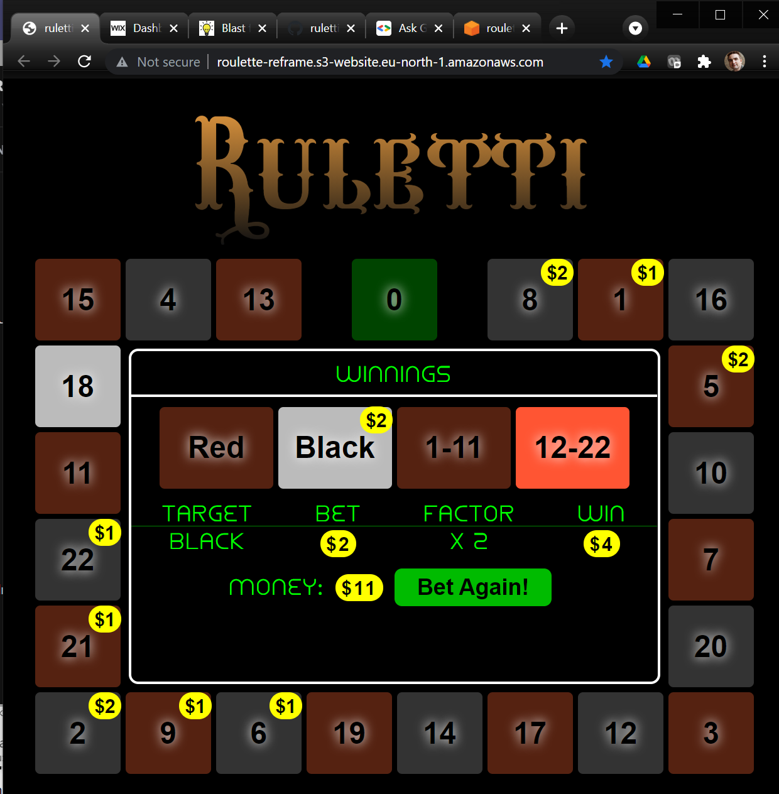
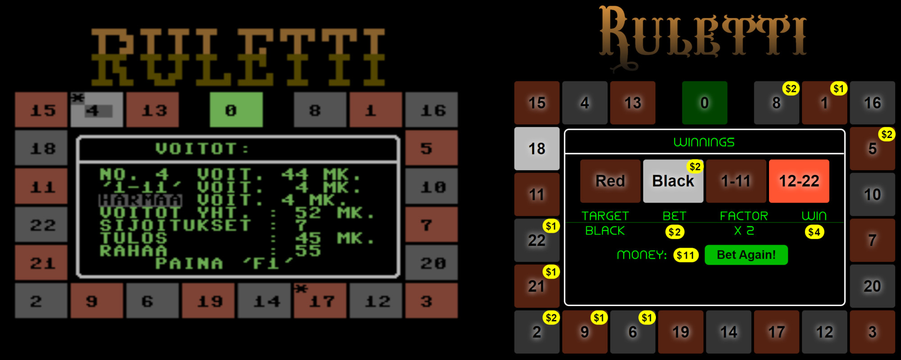
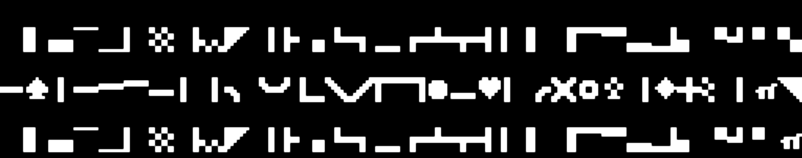
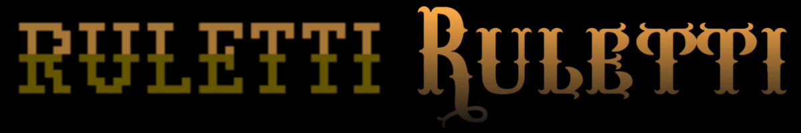
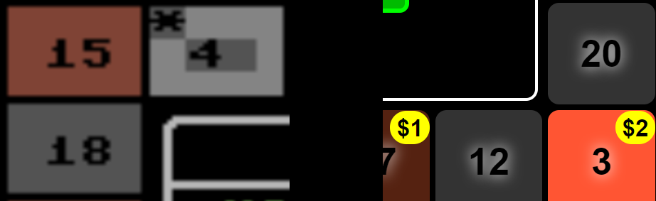
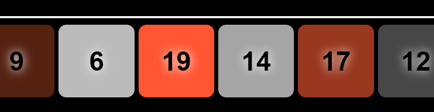

# Ruletti re-born after 34 years

**I re-created my small Commodore 64 game with modern technologies to get a stunning reminder of how much the available tech and tools have evolved in the past decades.**

In 2020 I re-discovered [the small roulette-game I did in 1987](/post/blast-from-my-commodore-64-past) (when I was 13) and got published in the Finnish computer magazine MikroBitti. Looking back at [its source-code](https://github.com/rbrother/ruletti64/blob/main/ruletti.txt) made me think how challenging writing programs was then for hobbyists compared to what is available now. And I started to think it would be interesting to make a new version of the game with a modern UI-tech stack and programming languages for comparison of available UX and implementation technologies.

*Now I have done just that*. The new "Ruletti 2021" version is done in Functional-Reactive style as a SPA (Single-Page App) Web-Application with ClojureScript and React/Re-frame frameworks. I have deployed it to AWS cloud S3-service.

You can [play the new game here](http://roulette-reframe.s3-website.eu-north-1.amazonaws.com/) and inspect the source code at [its GitHub repo](https://github.com/rbrother/ruletti-reframe). For comparison, you can check the [original C64 version here](/post/blast-from-my-commodore-64-past).

[](http://roulette-reframe.s3-website.eu-north-1.amazonaws.com/)

My aim has not been to create pixel-by-pixel replica of the original game or artificially limit myself in ways that Commodore 64 Basic-programming was limited. I rather wanted to make the game as I would make it today, with essentially same high level features. So I was for example choosing not to use the original C64 font (although that is also available as web-app compatible TTF-format) but rather pick suitable fonts from the vast set of freely available choices today. That said, in choices of layout and features I did try to follow the original as much as possible to make comparison easy and connect to the nostalgia of the original project.

## Programming as hobby then and now

There are many interesting ways in which the original Ruletti C64 and the new rewrite can be compared:

1. The User-Experience (UX) from user of the game:
   1. How easy is it to use start the game?
   1. How simple and intuitive is it to play the game?
   1. How pleasant and beautiful does the game look and sound?
1. Developer Experience
   1. How easy it is to set up development environment?
   1. How good and supportive are the tools for viewing, writing and editing code?
   1. How good are tools for testing, debugging and modifying code?
   1. How good are tools for deployment and distribution of app?
1. Programming language and architecture
   1. What data structures does the language support?
   1. What programming paradigms are used?
   1. What syntactical constructs are programs built from?
   1. How is program state and changes to the state managed?
   1. What libraries and tools does the programming platform support?

I will focus on the User-Experience (1) in this article, since that is likely to be most generally interesting topic. I might later articles dig more to the technical programmer-oriented topics of developer experience and programming tech.

## User-experience (UX) then and now

Original Commodore 64 Ruletti and the new Ruletti Re-Frame:



There are several limitations regarding UX of Commodore 64 Basic in 1987 compared to today's world and tech. Most obvious at the time was the *lack of simple and efficient means to deploy and distribute your programs*. Whereas Ruletti 2021 can be launched from anywhere in the world with any device by just [clicking this link](http://roulette-reframe.s3-website.eu-north-1.amazonaws.com/), hobbyist wanting to play the C64 game back in 1980's was facing formidable challenges. This was time before availability of internet and even the simple modems and BBS-servers to swap software were rarely available for the home hobbyist. The main way used then - and the one for Ruletti - was to buy a computer-magazine with printed code-listing and *write the program from the listing to your computer*. Typing the program from listing took many hours at best and any typing errors risked the final program not working. Such typing errors happened easily with the hazardous control-character system of Commodore 64 as I discuss in the [Ruletti 64 code-review article](/post/ruletti-code).

After the poor user manages to finally successfully write the program code and start the program, next challenge comes from *lack of mouse or touch input* in the C64 system: only keyboard and (optionally) joystick is supported. For some types of software and games keyboard or joystick is perfect choice, but for a roulette-game where the main interaction is to choose tiles to bet on, it is obvious that the most natural and fast way to do that is to click or touch those tiles and that is exactly what I implemented in the new Ruletti 2021. The C64 version uses two keys `/` and `@`  to change the betting target and two keys `+` and `-` to increase and decrease bets on the selected target. This is clumsy and slow and, what is worse, the game does not display what buttons to use, so this has to be told to the user with a separate document. Although, since the poor user has been typing the lines of the program to his computer with his own fingers, we might hope he has noticed the relevant keys to use from the source code...

The simplicity of touch / mouse -based use is demonstrated by the fact that my 4-year son was able to play the new version successfully without any guidance from me and quickly understood the betting logic.

## From Blocks to Beauty

Commodore 64 is from time before widespread use of *Graphical User Interfaces* (GUI). While C64 does have 320 x 200 pixel "High Resolution" (!) graphics mode on hardware level (and there was later even GUI Operating System [GEOS](https://en.wikipedia.org/wiki/GEOS_(8-bit_operating_system)) developed for it) this was not accessible from the simple Basic, so *character-based* programs were the norm. In the character-mode the screen is divided to 25 rows and 40 columns, with 8x8 pixel characters.

For rudimentary graphics, the C64 "PETSCII" character-set contains several glyphs for making borders, lines and blocks, similar to the early IBM-PC DOS graphical characters. Ruletti 64 uses these to create the large title-text and white rounded borders inside the roulette-wheel:



 On PC-side, character-based programs were also the norm before widespread use of GUI in Windows OS. While native GUIs based on Windows, Mac OS and Linux are still popular, the top-place in UI-world has been since taken by HTML/CSS-based Web-UIs use by Ruletti 2021. While HTML was not initially meant for fully interactive applications, its capabilities with rise of JavaScript and CSS have grown tremendously during the years. With the arrival of React-based Single-Page-Applications (SPAs) it's not a stretch to say that the have surpassed native UIs in many ways, making them the best choice for many types of applications even if their original advantages - ease of distribution and installation - is not taken into account.

## CSS Elegance

Ruletti 2021 uses HTML/CSS-based UI which means the UI is vector-based and infinitely scaleable within the browser to any display resolution. Any element of the UI can be scaled and positioned with sub-pixel-level accuracy. The white rounded borders inside the roulette-wheel are now done with more straightforward way with `border` and `border-radius` CSS-attributes (using the ClojureScript [CSS Garden](https://github.com/noprompt/garden) syntax):

```clojure
[:div.center-area
    {:margin "6px", :border "solid white 3px", :border-radius "10px", ...
```

Unlimited number of free fonts are available for Web-app developers, so I replaced the C64 title painstakingly constructed from block-characters with similarly "Western Saloon"-styled font [Wacamoler Caps](https://www.dafont.com/wacamoler-caps.font) with a color-gradient:



CSS-styling allows for better representation of he roulette number-tiles, the bread-and-butter of the game. In Ruletti 64 these tiles consists of 3 rows and 4 columns of characters. One immediate visual discrepancy from this is that numbers in the tiles are not always properly centered. For numbers with two digits like 20 the digits are located in columns 2 and 3 of the tile, making them centered. But for single-digit numbers the digit must be placed either in column 2 (too left) or column 3 (too right). In Ruletti 2021 we can use CSS flex-box centering attributes for pixel-perfect centering of any number with any font:

```clojure
(def centered-tile {:display "flex", :align-items "center", 
                    :justify-content "center"})
```

Number tiles of Ruletti-64 and Ruletti-reframe:



The higher resolution, graphical UI and CSS allows Ruletti 2021 to draw brighter blurry background behind the numbers of the tiles, allowing the black characters to better stand out from the darkish background. Also the space and resolution allows to display the number of dollars placed on tiles with yellow circles whereas Ruletti 64 could only afford to place an asterisk (*) on such tiles.

## Animations for the final touch

In addition to the rolling of the wheel itself, Ruletti 64 has two rudimentary animations in the startup-intro: The moving of the title-text from bottom to top of the screen and intro text scrolling left after that. Since both have been done with character-based UI, the movement can only occur in increments of one character row/column (or 8 pixels) at a time, creating somewhat jerky motion.

For both of these intro-animations, Ruletti 2021 leverages powerful CSS-animation attributes that allow declarative animation of CSS-attributes without any imperative loops. For the title-animation, with few simple lines we achieve not only flying of the title to the top, but simultaneous transform from transparent to opaque and increase in font-size:

```clojure
[:div.title
    {:animation-name "title-start"
     :animation-fill-mode "forwards"
     :animation-duration "3.0s"
     :color "#642"}]    
```

```css
@keyframes title-start {
    from { top: 500px; opacity: 0; font-size: 50px; }
    to { top: 0px; opacity: 1; font-size: 120px;}
}
```

CSS Animation are also used for the rotating of the roulette-wheel to more realistically simulate lamps in the tiles being switched on and off. When a lit tile is being switched off, we use animation that fades the color to dark version in 0.5 seconds, creating a pleasant "tailing" effect for the rotating highlight. Here is code for one of the "fade"-animations for the red tiles:

```clojure
(def fade-animation-base
    {:animation-fill-mode "forwards"
     :animation-duration "0.5s"})

[:.fade-red (assoc fade-animation-base :animation-name "fade-red")]
```

```css
@keyframes fade-red {
    from { background-color: #F53; }
    to { background-color: #521; } 
}
```

In the example below tile 6 is currently lit but tiles 19,  14, 17 and 12 have still varying shades of "afterglow" of being recently lit:



## Gimme music

The original Ruletti 64 had no music or sounds at all. This is not so much because of limitations of Commodore 64 hardware - in 1982 when the computer was launched it's sound-chip "SID" had relatively advanced capabilities - but the lack of sound-related commands in the simple Basic-language.

Here also the modern web-app provides both more powerful features and simple API to play any piece of sound or music. This combined with vast online selection of free sound clips in services like [freesound.org](http://freesound.org/) allowed spicing up the game with music and sound effects in matter of minutes. For example the start of the betting phase is accompanied with "Western Saloon" honky-tonk piano music with quite straightforward code:

```clojure
(rf/reg-fx :play-sound 
  (fn [name] (.play (js/Audio. (str "sounds/" name)))))

(rf/reg-event-fx :start-betting
  (fn [{db :db} _]
    { :play-sound "saloon-piano.ogg"
      :db (-> db (assoc :phase :betting)
                 (dissoc :bets))}))
```

## Outside and Inside both count

While I have been focusing here on visible improvements in Ruletti-reframe compared to the original Commodore 64 version, I have shown also some glimpses to the code. To me the evolution of the coding languages, paradigms, architectures and libraries is possibly even more interesting than the evolution of visible UIs. "What's inside is what matters" is important to many programmers and striving for elegance, simplicity and concise and clear expression provides joy and pride to our work. Hence I am planning to write later more on the code-level comparison of Ruletti 64 and Ruletti 2021.
