# Tarinoita juuristasi, Brotherus-suvusta

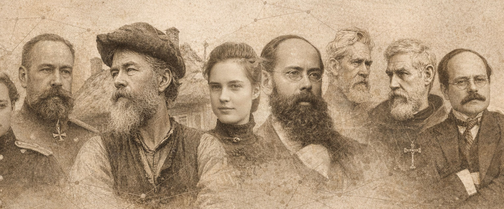

[TOC]

## Lapsenlapselleni

Pyysit kerran minua kertomaan milloin ja miten Brotherukset tulivat Suomeen, ja tässä minä nyt koetan kertoa siitä.

Oikeastaan Brotherukset eivät milloinkaan ole tänne tulleet, vaan ovat aina olleet täällä. Sillä tämän, ehkä hieman hankalasti äännettävän ja kirjoitettavan nimen, otti itselleen joskus 1600-luvun alussa talonpojan poika Vantaan pitäjän Tikkurilan kylästä noustessaan pappissäätyyn.

Jos Sinä joskus haluat palata "juurillesi", niin Sinun pitää mennä Vantaan kaupungin kirkonkylään katsomaan sen keskiajalla rakennettua harmaakivistä kirkkoa, jonka päädyt ja oven- sekä ikkunanpielet ovat punatiilillä kirjotut. Se on kaunis kirkko, vaikka tiilikirjonta lienee siihen joskus myöhemmin muurattu, ehkäpä 1800-luvulla, jolloin se tulipalon jälkeen jouduttiin perusteellisesti korjaamaan. Nykyään se on palautettu tuohon 1800-luvun hahmoonsa. Vanhimpia aikoja aikoja edustavat kirkossa muutamat keskiaikaiset puuveistokset ja lähinnä kuoria oleva kattokruunu, joka on lahjoitettu samana vuonna, jolloin seurakunnan kirkkoherra Sigfridus Stephani Brotherus kuoli. Se ei kuitenkaan millään tavoin liity tähän esi-isääsi, joka oli ensimmäinen Sinun sukunimesi käyttäjä.

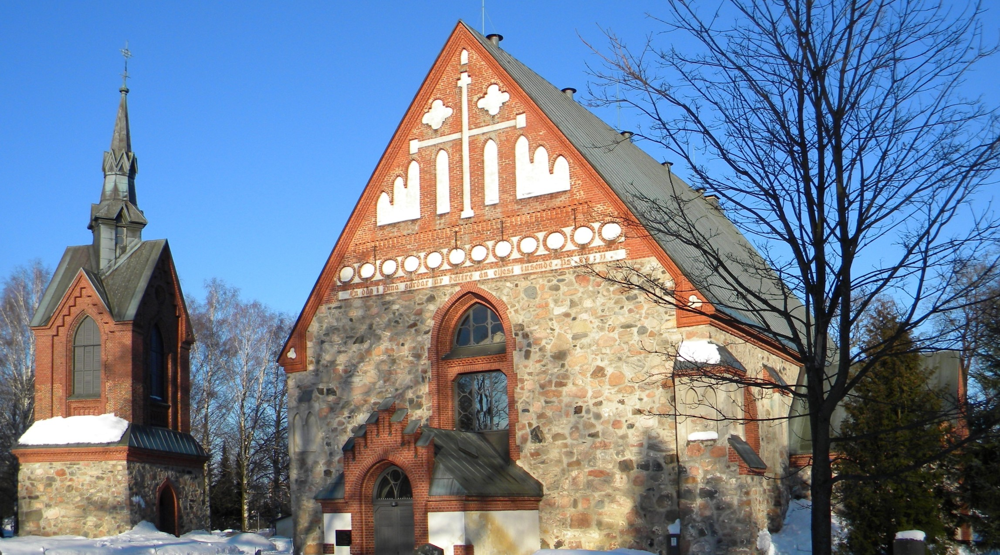

<small>Vantaan pitäjän kirkonkylän kirkko eli Pyhän laurin kirkko</small>

Kun katselee tuollaisen keskiaikaisen luonnonkivistä rakennetun kirkon korkeuksiin kohoavaa seinää, ja näkee siellä valtavia järkäleitä toinen toisiinsa liitettyinä, nousee mieleen suuri kunnioitus kirkon rakentajia kohtaan, kun he silloin käytettävissä olleilla alkeellisilla työkaluilla ovat saaneet sen aikaan. Vanhat kansansadut kertovatkin milloin jättiläisen, milloin peräti paholaisen rakentaneen kirkon, niin uskomattomalta on tällainen suoritus tuntunut. Kun taas katsoo tämän tarinani liitteenä olevaa taulukkoa Suomen väkiluvun kehityksestä vuodesta 1550 lähtien, ja palauttaa mieleensä ne vaikeudet ja kärsimykset, jotka noihin vuosiin ovat sisältyneet, on sanottava että esi-isämme ovat olleet sisun ja elämänhalun jättiläisiä pystyessään jättämään meille tämän kukoistavan maan.

Tämän kohta alkavan tarinan perustana on ollut valtiotieteen maisteri, sukututkija Heikki Soininvaaran vuonna 1968 valmistunut tutkimus, jota olen täydentänyt isäni **Karl Robert Brotheruksen** vuonna 1932 kirjoittaman sukuselvityksen sekä setäni **Harry Brotheruksen** vuonna 1953 julkaistun kirjan "Nimineuvos ja hänen vaimonsa" tiedoilla. Hajatietoja olen poiminut myös Valtionarkistosta ja Helsingin yliopiston kirjastosta. Taustakuvaa olen saanut vuonna 1936 julkaistusta "Suomen kulttuurihistoriasta".

Kiitos miniälleni **Ulla Brotherukselle** tekstin tarkistamisesta ja puhtaaksikirjoittamisesta.

Toivotan Sinulle kiinnostavia lukuhetkiä. Ehkä tämä parhaassa tapauksessa innostaa Sinut tutkimaan vaikkapa jonkun tämän tarinan henkilön vaiheita perusteellisemmin, sillä näistä asioista on vielä saatavissa paljon lisätietoa.

Kuohijoella, helmikuun 24 päivänä 1982

Vaari, [Robert Siegfrid "Oppe" Brotherus, s. 1914](https://www.geni.com/people/Robert-Oppe-Brotherus/6000000000232433342)

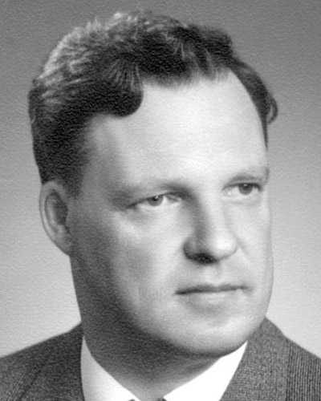

### Web-julkaisun 2026 alkusanat

> Mieleni minun tekevi, aivoni ajattelevi  
> lähteäni laulamahan, saa'ani sanelemahan,  
> sukuvirttä suoltamahan, lajivirttä laulamahan.  
> Sanat suussani sulavat, puhe'et putoelevat,  
> kielelleni kerkiävät, hampahilleni hajoovat.  
>
> Niit' ennen isoni lauloi kirvesvartta vuollessansa;  
> niitä äitini opetti väätessänsä värttinätä,  
> minun lasna lattialla eessä polven pyöriessä,  
> maitopartana pahaisna, piimäsuuna pikkaraisna.  
>
> Kalevala, Ensimmäinen Runo

Minä tai siskoni **Elina Brotherus** oli se Oppe-vaarimme lapsenlapsi, joka aikoinaan pyysi vaariamme kertomaan milloin ja miten Brotherukset tulivat Suomeen ja siten kirvoittamaan tämän kirjan syntyyn 1982 johtaneen työn. 1982 minä olin 9-vuotias ja siskoni 10.

Oppe kirjoitti mekaanisella kirjoituskoneella kirjan luonnoksen, jonka äitimme **Ulla Brotherus** kirjoitti toisella kirjoituskoneella puhtaaksi. Kirjasesta tehtiin pieni, ehkä noin sadan kappaleen painos sukulaisille jaettavaksi. Vuonna 1982 ei ollut vielä internettiä julkaisua varten ja tietokoneetkin olivat harvinaisia, mutta Oppe viisaana visionäärinä aavisti tietokoneiden merkityksen tulevaisuudessa ja [hankki samana vuonna 1982 kaikille meille lapsenlapsilleen VIC-20 kotitietokoneet](/post/humble-beginnings-the-vic-20). Tuosta lahjasta alkoi oma tietokoneharrastukseni, joka laajeni myöhemmin ohjelmointi-uraksi ja osaltaan mahdollistaa nyt 44 vuotta myöhemmin tämän tekstin netti-julkaisun [koodaamallani blogi-alustalla](/post/blog-platform) brotherus.net sivullani.

Lisämotivaatiota uudelleenjulkaisulle tuo se, että tässä välissä on uusi sukupolvi uljaita Brotheruksia varttunut aikuisiksi ja mahdollisesti pohtimaan sukunsa historiaa. Uutta sukupolvea edustaa poikani *Arttu Tapio Brotherus* (s. 2000), jolle kiitos alkuperäisen kirjasen sivujen skannaamisesta ja muuntamisesta PDF-muotoon, josta tein OCR-teksti-muunnoksen ja oikoluvun.

Oikoluku korjasi muutamia kymmeniä alkuperäisen tekstin kirjoitusvirheitä. Sen lisäksi olen lisännyt joukkoon muutamia kuvituskuvia, linkkejä tekstissä mainittujen sukulaisten [Geni-sukupuu](geni.com) sivuihin sekä kuva-otteita Geni-sukupuun osista hahmottamaan sukulaisuus-suhteita. Tässä yhteydessä täydensin myös Genissä olevaa sukupuutamme tämän tekstin tuomien tietojen valossa. Vanhojen 1600- ja 1700-luvun sukupuiden visuaalista hahmottamista helpotin generoimalla Geniin noiden polvien sukulaisille tekoälyllä heidän ammattiaan, aikaansa ja jälkeläistensä kasvonpiirteitä mukaelevat hypoteettiset profiilikuvat. Näin ihmiset, joiden todellisesta ulkomuodosta ei ole kuvia säilynyt eivät ole puussa vain harmaita laatikoita vaan meillä on jokin visuaalinen kiinnekohta yrittäessämme hahmottaa vanhoja sukupuita. Tämä vastannee sitä tositapahtumiin *perustuvaa* tyyliä, jota Oppekin näissä tarinoissa käyttää, lisäten kertomuksiin tunnettujen faktojen  väriä ja elävyyttä tuovia yksityiskohtia.

Kriittisin tekemäni täydennys Geniin oli [**Samuel Samuelinpoika Brotheruksen (~1690)**](https://www.geni.com/family-tree/index/6000000109311572526) liittäminen [**Henrik Brotheruksen (1718-1794)**](https://www.geni.com/family-tree/index/6000000010988739380) isäksi. Tätä on useassa sukututkimuksessa pidetty perusteltuna ja hyvin todennäköisenä sukulais-suhteena, mutta Genissä linkkiä ei aiemmin ollut merkitty, jolloin suvun kanta-isät ovat jääneet irralliseksi saarekkeeksi. Nyt tämän perustellun kytköksen kautta tulevat kaikki nykyiset Brotherukset Genissä kytketyksi suvun kantaisän kirkkoherra [**Sigfridus Stephani Brotherukseen**](https://www.geni.com/family-tree/index/6000000011424485926) jälkeläisiksi. Genissä voi menneiden polvien sukupuita tutkia vapaasti ilman kirjautumista. Kirjautumalla (ohjeet minulta!) pääsee sitten tarkastelemaan myös nuorempia polvia ja editoimaan oman lähipiirinsä tietoja.

Oppe-vaarimme toivotti lukijoille kiinnostavia lukuhetkiä ja sitä ne ovat totisesti olleet ainakin minulle tämän uudelleenjulkaisu-prosessin aikana. Erityisen vaikuttavana pidän sitä, miten Oppe päätössanoissa näkee suvun henkilöiden yksittäisistä tarinoista kohoavan suuremman tarinan, suvun tarinan, jossa näkyy punainen lanka Brotherusten historiallisesti merkittävästä roolista Suomen, Suomalaisen identiteetin, Suomen kielen, Suomen valtion, Suomen oikeuslaitoksen ja Suomalaisen kulttuurin nousussa. Tästä on perusteltua olla ylpeä ja Brotherus-suvun jäsenyys antaa nyt 2000-luvullakin henkistä selkänojaa kohdata uudet haasteet, joita maailma eteemme heittää yksilöinä ja kansakuntana.

Sydäntäni lämmittää myös se, miten meille aikoinaan erityisen tärkeä sukulainen, vaari, Oppe, elää edelleen tämän kirjasen sanoissa kuten myös lukuisissa muissa kirjoitelmissaan ja kirjeissään. Hänelle Brotherus-suku oli rakas ja innoituksen lähde ja hänen muistoaan voimme parhaiten vaalia sukurakkauden ja -tutkimuksen perinteitä vaalimalla.

[Robert Johannes "Roope" Brotherus (s. 1973)](https://www.geni.com/people/Robert-Brotherus/6000000002238825075), [robert@iki.fi](mailto:robert@iki.fi), +358 451145602

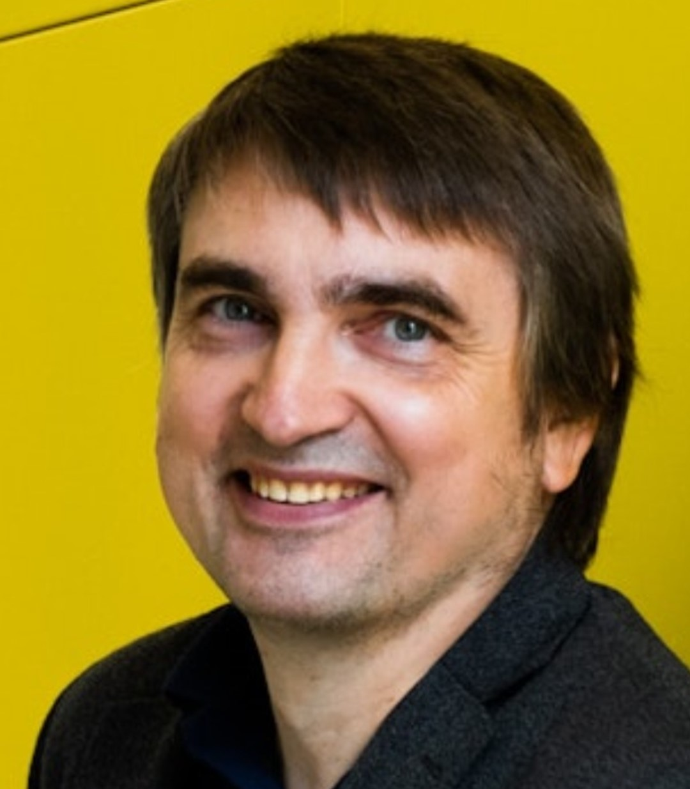

## 1. Kantaisät

Jos Sinä pääsisit ajassa taaksepäin noin 450 vuotta, ja joutuisit paikkaan, missä nykyinen ydin-Helsinki sijaitsee, vaikkapa Töölön kaupunginosan kohdalle, niin olisitpa keskellä asumatonta korpea. Kaivopuiston kohdalla löytäisit ehkä jonkun kala-aitan, mutta lähin asuttu kylä sijaitsee sen kosken partaalla, missä Vantaanjoki kuohuen purkautuu merenlahteen sen pohjukassa olevan saaren molemmin puolin. Helsingin kaupungista ei tuolloin ole vielä merkkiäkään, sillä vasta toistakymmentä vuotta myöhemmin rakennetaan Ruotsin kuninkaan Kustaa Vaasan määräyksestä Vantaanjoen suulle, lähelle Koskelan kylää kaupunki, jonka on määrä asettua kilpailemaan vientikaupasta Suomenlahden etelärannalla olevan Tallinnan kaupungin kanssa. Kuningas haluaa, että sisämaasta saatavat tuotteet voitaisiin myydä maan omien kauppiaiden toimesta, ja sen vuoksi hän määrää kauppiaita Porvoon, Tammisaaren ja Ulvilan kaupungeista muuttamaan perustettavaan kaupunkiin ja ottamaan haltuunsa ulkomaankaupan.

Lähellä Koskelan kylää kulkee kuninkaan kuriiritie Turusta Viipuriin, mutta tärkein kulkureitti sisämaahan on Vantaanjoki sivuhaaroineen. Sen partaalla polveileva kinttupolku lienee tuskin ratsainkaan kuljettavissa. Jos lähdet tätä kinttupolkua sisämaahan päin, ja joen haarautuessa seuraat sivuhaaraa, Keravanjokea, tulet noin seitsemästä kahdeksaan kilometriä kuljettuasi Vantaan pitäjän kirkonkylään, jota mahtava, noin 50 vuotta aikaisemmin rakennettu kivikirkko hallitsee. Kylän 12 taloa ovat melko lähellä toisiaan, sen halki polveilevan kylänraitin molemmin puolin. Jokaiseen taloon kuuluu ainakin toistakymmentä erilaista rakennusta. Lähinnä kylänraittia on asuinrakennus, ja sitä vastapäätä, tilavan pihan toisella laidalla ovat talli, navetta, lampola ja ehkä sikalakin. Pihan molemmilla siivillä ovat asuin- ja varastoaitat, kylpy- ja mallassaunat, liiterit ja varastosuojat niin, että kukin talo muodostaa pihansa ympärille miltei umpinaisen, ei kuitenkaan säännöllisen neliön.

Kylää ympäröivät sen viljelykset, ja niiden keskellä siellä täällä niitä pilkuttamassa ovat talojen riihet. Kaikki talot ovat maalaamattomia, joten kylän yleisväri on sangen harmaa Asuinrakennuksissa on yleensä joko turvekatto tai tuohikatto, muissa rakennuksissa taas enimmäkseen halkaistuista puunrungoista tehty "pelkkakatto". Rakennukset on rakennettu ilman kivijalkaa, ja asuinrakennusta kiertää kolmen hirren korkuinen, seinästä 30-40 sentin päässä oleva salvos. Tämän salvoksen ja seinän väli on täytetty maalla, ja samanlainen salvos maatäytteineen, ns. ["multiainen"](https://www.saatsi.fi/blogi/multapenkki/), on myös seinän sisäpuolella.

Asuintilana on vain yksi kookas huone, tupa jossa ovea vastapäätä on savupiippua vailla oleva kiuas. Sitä lämmitettäessä pidetään ovi ja ikkuna-aukot auki, joten paksu savu peittää näkyvistä huoneen katon ulottuen aina oven kamanaan saakka. Kiukaan ja oven välillä on vain maalattia, mutta pääosa lattiasta on kuitenkin peitetty halotuilla paksuilla hirsillä. Milloin ovea ja ikkuna-aukkoja talvisaikaan pidetään lämmitysten välillä kiinni, on tuvan ainoana valonlähteenä seinänrakoon tai pärepihtiin pistetty palava päre. Tässä talon ainoassa lämmitettävässä huoneessa asuivat talvella kaikki talon asukkaat. Vain suurimmissa taloissa oli kaksi erillistä tupaa, joita yhdisti niiden välissä oleva lämmittämätön porstua. Tuvassa suoritettiin talvella kaikki talon askareet lukuun ottamatta keittämistä, joka tapahtui pihalla olevassa keittokodassa.

Jokaisella taloon kuuluvalla aikuisella oli oma makuuaittansa, mutta kun aitat olivat lämmityslaitteita vailla, ei niissä voinut keskitalvella nukkua, jollei nyt sitten nuoripari nahkasten sisässä löytänyt yhteistä lämpöä.

### Sigfridus Stephani Brotherus

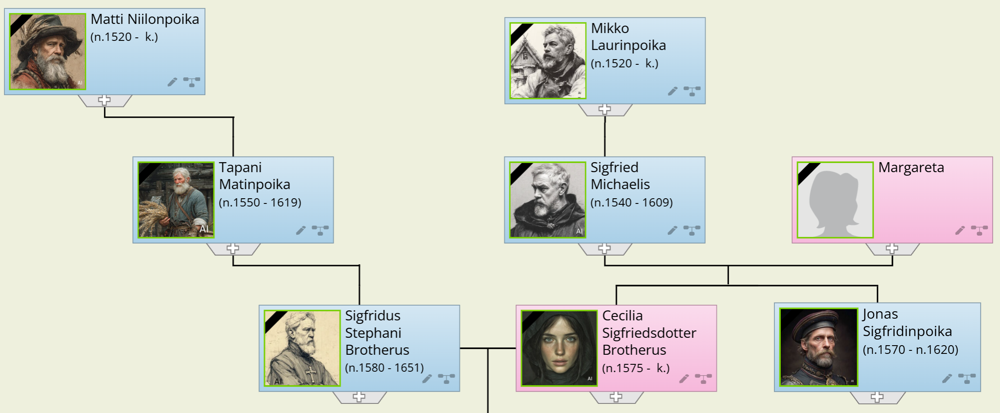

Kuningas Kustaa Vaasa halusi saattaa järjestykseen veronkannon valtakunnassaan, ja pani alulle maakirjojen pidon. Niihin luetteloitiin valtakunnan kaikki verokuntoiset talot ja niiden pitäjät. Näistä luetteloista tuli sitten ensimmäinen jotenkin luotettava tietolähde valtakunnan asukkaista. Vantaan pitäjässä maakirjojen pito alkoi vuonna 1540. Tämän luettelon mukaan on erään kirkonkylän verokuntoisen talon pitäjänä talollinen [**Mikko Laurinpoika**](https://www.geni.com/people/Michal/6000000012798937226). Hänen talonsa, joka myöhemmin saa nimen "Backas", perii [**Sigfrid Mikonpoika**](https://www.geni.com/people/Sigfried-Michaelis/6000000023682779421), joka puolestaan astuu pappissäätyyn ja sen merkkinä käyttää itsestään juhlavalta kajahtavaa nimeä **Sigfridus Michaelis**. Vuonna 1571 tämä "herra Sigfrid" ostaa Tapanilan kylän talonpojilta "Trullmåse kärr" nimisen alueen - tunnettu nimellä Tattarisuo - ja vuonna 1572 Sigfridus Michaelis nimitetään Vantaan pitäjän kirkkoherraksi. On syytä muistaa, että Kustaa Vaasan aloitteesta on valtakunnassa suoritettu uskonpuhdistus, ja Sigfridus Michaelis on Vantaan seurakunnan ensimmäinen luterilainen kirkkoherra.

Sigfridus Michaelin vaimosta ei ole säilynyt tai tullut esille tietoja, ja vain kaksi hänen lapsistaan on saavuttanut aikuisen iän: tytär **Cecilia** ja poika **Jonas**. Sigfridus Michaelis kuolee vuonna 1610.

Kirkonkylää lähinnä sijaitseva kylä on Tikkurila, joka on vain parin kilometrin päässä siitä, Keravanjokeen laskevan Ristipuron varrella. Tässä kylässä on 11 verokuntoista taloa, ja niistä erästä viljelee **Niilo Martinpoika**. Häneltä perii talon ensin poikansa **Sipi Niilonpoika**, ja tämän kuoltua pojista seuraava, **Matti Niilonpoika**. Matti Niilonpojan kuoltua jää kotitalo vuonna 1594 hänen pojalleen **Tapani Matinpojalle**, jolla jo talon periessään on poika, **Sipi Tapaninpoika**. Sipi aloittaa uransa ratsumiehenä E. Pärttylinpojan lippukunnassa, mutta jo vuonna 1610 hän jakaa yhdessä "herra Matti Caplanin" kanssa Tikkurilan kylässä autioituneen **Tuomas Tönnenpojan** tilan. Molemmat puolikkaat saavat verovapauden ratsutiloina. Tällöin Sipistä käytetään nimitystä "herra Sigfredh". Varmaankin jo ennen tätä tilanpuolikkaan haltuunottoa on hän solminut avioliiton kirkkoherran tyttären, Cecilian kanssa, ja aloittanut siirtymisensä hengelliseen säätyyn.

Kirkkoherra Sigfridus Michaelin kuoltua siirtyy Backaksen ratsutila perintönä hänen pojalleen, katselmuskirjuri **Jonas Sigfridinpojalle**, ja tämän kuoltua edelleen Sigfridus Michaelin vävylle herra Sigfredhille. Tällä tavoin herra Sigfredh muuttaa perheineen vaimonsa kotitilalle, ja jättää Tikkurilan kylässä olevan tilansa [lampuotien](https://fi.wikipedia.org/wiki/Lampuoti) viljeltäväksi. Kirkonkylässä Sigfredh sitten ottaa viljelykseensä vielä toisenkin, nimeltä tuntemattoman tilan vuonna 1621.

Vuonna 1630 on herra Sigfredh saanut nimityksen Vantaan seurakunnan kappalaiseksi ja ryhtynyt käyttämään itsestään nimeä [**Sigfridus Stephani Brotherus**](https://www.geni.com/people/Sigfridus-Stephani-Brotherus/6000000011424485926). Tätä vuosilukua voitaneen pitää varmimpana ajankohtana sukunimemme syntymiseen. Cecilia ja Sigfridus Stephani ovat ennen tätä nimitystä saaneet jo kolme poikaa ja kolme tytärtä, ja vaikka Cecilian terveys alkaa heiketä, syntyy heille muutaman vuoden kuluttua vielä tytär. Pian sen jälkeen kun Sigfridus Stephani vuonna 1640 on saanut nimityksen Vantaan seurakunnan kirkkoherraksi, Cecilia kuolee, ja myöskin Sigfridus Stephanin terveys alkaa heiketä. Hän ennättää kuitenkin vielä saada poikansa Johanneksen, joka on ollut sotilaspappina 30-vuotisessa sodassa, avukseen ja seurakuntansa kappalaiseksi. Vanhoilla päivillään Sigfridus Stephani solmii vielä uuden avioliitonkin Anna Henrikin-tyttären kanssa, mutta tästä avioliitosta ei ole lapsia. Kanta-isämme ja sukunimemme ensimmäinen käyttäjä kuolee vuonna 1651.

Mistä sitten kantaisämme on mahtanut saada tämän sekä ääntämisessä että kirjoittamisessa vaikeuksia tuottavan sukunimen? Ensimmäinen olettamus kohdistuu aina kotitaloon, kotikylään tai muuhun vastaavaan nimen ottajalle merkitykselliseen paikkaan. Vaikka Vantaan pitäjässä onkin ollut kylä nimeltä Brutuby (nykyisin Voutila) ja Sipoon Gästerbyssä paikka nimeltä Brottarbacka, ei näistä kumpikaan millään tavoin liity herra Sigfredhin taustaan. Sukua eivät liioin ole olleet Porvoossa tuolloin Broter tai Bråtar nimeä käyttäneet henkilöt.

Latinankielessä on sana *Frater*, joka pienin muutoksin on siirtynyt mm. Ruotsin, Englannin, Saksan ja Ranskan kieliin. Nykyruotsissa se kirjoitetaan *broder*, mutta 1600-luvulla ja pitkästi sen jälkeenkin *brother*. Hengellisessä säädyssä on tuolloin ollut "veljeskuntia" enemmän kuin muissa säädyissä, ja ehkäpä myös läheinen ja lämmin suhde lankoon, Jonas Sigfridinpoikaan, on houkutellut tuohon sukunimen valintaan. Pääte "*us*" kuuluu sen ajan kirkolliseen muotiin.

Jos edellä hahmoteltu sukunimemme alkuperä pitää paikkansa, niin se antaa ehkä myös vihjeen nimemme ääntämiseksi. Frater- ja ilmeisesti myös brother-sanassa on korko ollut ensimmäisellä tavulla, ja ensimmäinen vokaali samoin kuin toinenkin on äännetty lyhyenä. Vihjeen tähän suuntaan antaa mielestäni sekin, että eräs sukuhaara, Erik jälkeläisineen, käytti muotoa *Broterus* ja *Brotterus*, vaikka tämänkin sukuhaaran jäsen Turun yliopistossa opiskellessaan käytti alkuperäistä virallista muotoa Brotherus. Edelleenkin on siis syytä pitää korkoa ensimmäisellä tavulla ja ääntää th kuten tavallinen t. Myöskään e-kirjaimen ei pitäisi antaa venyä kaksois-e:ksi.

## 2. Perinnön jako

<small>Sigfridus Stephani Brotheruksen perilliset (pojat)</small>

Kun kirkkoherra Sigfridus Stephani Brotherus vuonna 1651 kuoli, jäi häntä kaipaamaan ainakin kolme tytärtä ja kolme poikaa. Kirkonkirjat tietävät *Hebla*-tyttären menneen naimisiin Helsingin kaupungin kappalaisen, *Bartholdus Canutin* kanssa, ja yhden tyttäristä avioituneen helsinkiläisen krouvarin *Simo Laurinpojan* kanssa. Kun perinnönjakoa vuodenvaihteessa 1660-61 suoritettaessa vain nuorin tyttäristä, Maria, on ollut mukana, on siis todennäköistä että toinen vanhemmista sisarista, joko Margareta tai Elisabet, on sitä ennen kuollut; toinenhan heistä oli Simo Laurinpojan puoliso. Ennen perinnönjakoon ryhtymistä kuitenkin muutama sana veljesten vaiheista sitä ennen.

### Johannes Sigfridi Brotherus

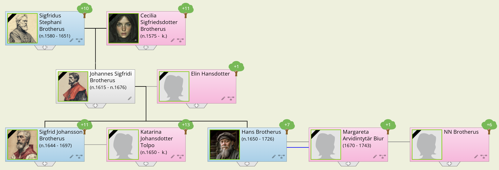

[*Johannes Sigfridi Brotherus*](https://www.geni.com/people/Johannes-Sigfridi-Brotherus/6000000011424533814) kirjoittautui oppilaaksi Tarton yliopistoon sen perustamisvuotena 1632, ja nautti ylläpitoa sen ylioppilaskommuniteetissa vuosina 1632-33. Opiskelunsa päätettyään hän palveli saarnaajana 30-vuotisessa sodassa yhdeksän tai kymmenen vuotta kenraalimajuri Torsten Stålhandsken johtamassa Uudenmaan ja Hämeen ratsuväkirykmentissä. Kun tieto isän nimittämisestä kirkkoherraksi ja kappalaisen viran näin vapautumisesta tuli hänen korviinsa, kiirehti hän kotiin ja saikin nimityksen kappalaiseksi jo ennen vuotta 1646. Äiti Cecilia oli tuolloin kuollut, ja isä mennyt uusiin naimisiin Anna Henrikintyttären kanssa.

Kappalainen Johannes solmi avioliiton pian kotiin palattuaan **Elin Hannuntyttären** kanssa, ja isänsä kuoltua 1651 Johannes nimitettiin Vantaan kirkkoherraksi. Seuraavana vuonna kuitenkin kirkkoherran virka siirrettiin pois Vantaan seurakunnasta Helsingin kaupungin seurakuntaan, joka vuonna 1650 oli siirtynyt nykyiselle paikalleen Vironniemelle. Tällöin Johannes pyynnöstään siirrettiin kirkkoherraksi Mikkelin seurakuntaan vuonna 1653, ja sai nimityksen Suur-Savon lääninrovastiksi vuonna 1660. Lapsia oli hänelle syntynyt kaksi: Sigfrid ja Hans. Syntymäaikoja eivät senaikaiset kirkonkirjat pitäneet tarpeellisina rekisteröidä. Johanneksen pappilassa Mikkelissä oli jo lasi-ikkunat ja savupiipulliset uunit, ja ehkäpä jokunen kamarikin. Se kun oli aikansa "upeimpia".

### Axel Sigfridsson Brotherus

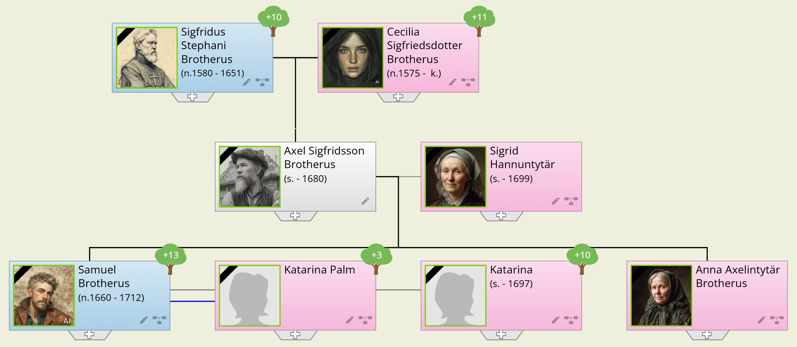

[**Axel Brotherus**](https://www.geni.com/people/Axel-Brotherus/6000000011424877219) ei lähtenyt opintielle, vaan jäi koti-tilaa hoitamaan, ja solmi avioliiton kälynsä, Johanneksen vaimon sisaren kanssa pari, kolme vuotta veljensä avioliiton jälkeen. Axelin puoliso **Sigrid Hannuntytär** mainitaan sokeaksi, mutta hän eli aina vuoteen 1699 saakka. Heille syntyi kaksi lasta, Anna ja Samuel, molemmat todennäköisesti ennen vuotta 1650.

### Erik Sigfridsson Brotherus 

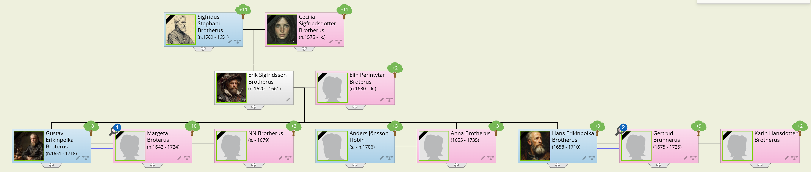

[**Erik Brotherus**](https://www.geni.com/people/Erik-Brotherus/6000000011424642567) oli veljeksistä nuorin, ja astui sota-palvelukseen vuonna 1648 - veljensä Johanneksen jo ollessa kappalaisena ja perheenisänä - ryhmän johtajaksi eversti **Frans Knorringin** johtamaan Hämeen eli Itä-Uudenmaan jalkaväkirykmentin kapteeni **Joakim Schmidtin** komppaniaan. Hän kohosi kersantiksi vuonna 1651 ja vänrikiksi 1656 toimien oman toimensa ohella myös katselmuskirjurina vakinaisen kirjurin karattua palveluksesta.

Ruotsin sotilaallinen suurvalta-asema oli silloin vankimmillaan, ja emämaasta Ruotsista sekä Suomesta ankaralla kädellä ja tiheällä kammalla kootut sotavoimat kahakoivat ja vartioivat vallattujen alueiden äärilaidoilla kaukana kotimaasta. Sotilasleirien mukavuus ja hygieenisyys olivat sangen puutteelliset, ja sotilaat olivat sen vuoksi erittäin alttiit kulkutaudeille ja muille sairauksille. Kuolleisuus sairauksiin sotilasleireissä olikin moninkertainen verrattuna vihollisen taisteluissa aiheuttamiin tappioihin.

Se rykmentti, jossa Erik palveli, oli sijoitettuna Narvaan. Kun Erik oli havaittu kielitaitoiseksi ja nokkelaksi, käytettiin häntä usein lähettitehtävissä aina Moskovaa ja Novgorodia myöten. Matkustaminen tuohon aikaan oli sekä hankalaa että erittäin raskasta, varsinkin lähettitehtävissä, jotka edellyttivät kovaa kiirettä. Matkat oli useimmiten suoritettava ratsain, ja esim. matka Narvasta Moskovaan ja takaisin nousi jo tuhansiin kilometreihin. Vain vähän voitiin matkoja joustaa säiden ja vuodenaikojen mukaan. Majoituspaikat pitkillä taipaleilla olivat syöpäläisiä viliseviä, kylmiä ja vetoisia hollitupia.

Sotilasleiri Narvassa oli siinä määrin vakiintunut, että Erik oli perustanut perheen solmimalla avioliiton **Elin Pietarintyttären** kanssa, ja heille olivat syntyneet lapset Anna v. 1655, Gustaf v. 1656 ja Hans v. 1658.

Keväällä 1660 Erik teki kenraalikuvernöörin käskystä matkan Vanhaan Novgorodiin, ja todennäköisesti tämän matkan rasitusten uuvuttamana hän katsoi ajan tulleen järjestää perheensä taloudellinen tulevaisuus. Perintö isän jälkeen oli vielä jakamatta, ja sen vuoksi oli matkustettava kotimaahan, mihin sitten järjestyikin tilaisuus jo jouluksi 1660.

### Perinnönjako

Jaettavana olivat irtaimen omaisuuden lisäksi Staffansin tila Tikkurilan kylässä, Backaksen ratsutila kirkonkylässä ja Sigfridus Stephanin v. 1621 viljelykseen ottama, nimeltään tuntematon tila kirkonkylässä sekä vielä epämääräinen oikeus Tattarisuohon, jonka kirkkoherra Sigfridus Michaelis aikanaan oli hankkinut ja perinnöksi jättänyt.

Mitään kirjallisia tositteita siitä, miten perintö todella jaettiin, ei ole säilynyt, mutta vähäiset tiedot perheenjäsenten myöhemmistä vaiheista ja omaisuuden kohtaloista viittaavat seuraavanlaisen jaon mahdollisuuteen:

1. Staffansin tila oli joutunut lampuotien viljelykseen, joten sen palauttaminen perillisten haltuun olisi tuottanut vaikeuksia. Se on ilmeisesti myyty lampuotien omistukseen, ja siitä saaduilla varoilla on maksettu perintöosuudet naimisiin menneille tyttärille. (Naimisissa olevan tyttären osuus oli tuolloin puolet poikien osuudesta.)
2. Erik on saanut v. 1621 viljelykseen otetun tilan ja todennäköisesti jo silloin järjestänyt sen myynnin - ehkäpä lahjakkaan veljensä Johanneksen avustuksella.
3. Johannes on ottanut huoltoonsa ja holhoukseensa nuorimman sisarensa Marian, joka on hänen kanssaan muuttanut Mikkeliin, ja hänen sekä omana osanaan saa omistukseensa Backaksen ratsutilan ja oikeuden Tattarisuohon, mitä oikeutta hän myöhemmin on - kaiketikin tuloksetta - valvonut.
4. Axel jää näin ollen vaille kiinteää omaisuutta tässä perinnönjaossa, mutta hän saa sen sijaan oikeuden elämänsä loppuun saakka asua ja viljellä Backaksen ratsutilaa, mikä oikeus siis jäi rajoittamaan Johanneksen omistusoikeutta.

Näin sovittuaan veljekset eroavat, mutta Erik saa kuitenkin sairauskohtauksen ja joutuu ennen paluutaan Narvaan makaamaan Axelin ja Sigridin hoivissa kolme viikkoa. Palattuaan Narvaan helmikuun 6 päivänä hän sairastuu uudelleen niin että nenästä vuotaa verta neljä ja puoli vuorokautta yhtä mittaa.

Erik on arvannut oikein loppunsa lähenemisen, sillä jo kesäkuun 14 päivänä 1661 hän kuolee Narvassa varmaankin huomattavasti alle 40 vuoden ikäisenä. Leski Elin Pietarintytär matkustaa kolmen lapsensa kanssa Suomeen ja saa matka-avustusta armeijan rahastosta. Erikin perinnön turvin he kuitenkin selviytyvät taloudellisesti hyvin, sillä tytär Anna omistaa aikanaan tilan Lappeella, Gustaf ratsutilan Laitilassa, ja Hansista tulee kruununvouti Lappeelle ja aikanaan Viipurin kaupungin kauppapormestari. Hän on mm. tehnyt lahjoituksen Mäntyharjun ensimmäisen kirkon rakennusrahastoon.

Johanneksen vaimo Elin Hannuntytär kuolee ja Johannes solmii uuden avioliiton v. 1665 **Johanna Carstensin** kanssa. Johannes saa lopultakin poikansa Sigfridin suorittamaan papintutkinnon, ja saa jopa ennen kuolemaansa 1676 nähdä hänet seurakuntansa kappalaisena.

Axelin elämä sujuu ilmeisesti tasaisesti ilman suurempia nousuja tai laskuja. Hänen oma perheensä pysyy pienenä. Tytär Anna viedään emännäksi naapuripitäjään Espooseen, ja poika Samuel tuo kotiin vaimon, Katarinan. Neljä, ehkä viisikin lasta ennättää Samuelille ja Katarinalle syntyä ennen kuin Axel jolloinkin 1680-luvun puolimaissa kuolee.

## 3. Kantaisien äidinkieli

Mitä kieltä ovat nämä varhaisimmat kantaisämme ja heidän naapurinsa eteläisen Uudenmaan talonpojat mahtaneet keskenään puhua? Jo yli vuosisadan vallinneen käsityksen mukaan Uudenmaan rannikkoseutu kuului ruotsinkieliseen, Ruotsista käsin asutettuun alueeseen. Tämän teorian mukaisesti Helsingin seudun olivat asuttaneet ja kaupungille nimen antaneet Helsinglandin maakunnasta sinne muuttaneet asukkaat. Asian todellinen laita lienee kuitenkin toinen.

Kun kuningas Kustaa Vaasa määräsi perustettavaksi kaupungin nykyisen Helsingin paikalle tarkoituksella saada Suomenlahden pohjois-rannalle kilpailija Tallinnalle lähinnä Venäjänkaupan välittäjänä, oli hän alunperin suunnitellut sen perustamista erinomaiseen satamapaikkaan, nykyisen Santahaminan paikalle, mutta laamanni **Erik Jaakkimanpoika Flemingin** vaikutuksesta se perustettiinkin Vantaan-kosken äärelle, jotta se olisi lähellä Turun-Viipurin kuriiritietä.

Tällä paikalla kaupunki kuitenkin oli vain sata vuotta, kunnes se oli pakko siirtää tarkoitustaan paremmin vastaavalle paikalle lähemmäksi merta ja merenkulkua Vironniemelle. On todennäköistä, että kaupunkisuunnittelijat, jotka laativat asemakaavan myös antoivat kaupungille nimen. He olivat harmissaan siitä, että kaupunki tuli liian ahtaaseen paikkaan sille suunniteltua tehtävää ajatellen; ahtaan pullonkaulan taakse mereltä katsottuna. Oli ehkä puhuttu kauniista ja kalaisasta koskesta, mutta heille se koski oli vain "Hälsingafors" ((pullon) kaulan takana oleva koski), joka oli liian ahtaassa paikassa satamakaupungiksi.

Juutinrauman molemmin puolin olevat kaupungit Helsingborg ja Helsingör muodostavat - sotilaallisesti ainakin - eräänlaisen "pullonkaulan" purjehdittaessa Pohjanmereltä Kattegatin ja Skagerrakin kautta Itämerelle. Nähdäkseni sanasta hals muodostui sana hälsing tai helsing aivan samoilla perusteilla kuin mm. sanasta lat sana lätting tai sanasta hov sana hövding. Tätä käsitystä tukee myös Helsinki-nimisen kylän löytyminen lähellä Turkua sijaitsevassa Taivassalon (alkuaan Tavisalo) kunnassa. Se nimittäin sijaitsee mantereen ja sen edustalla olevan suuren saaren välisen salmen rannalla.

Edellä mainitun avulla olen koettanut osoittaa, että Uudenmaan rannikkoseudun asukkaat ovat noina kaukaisina aikoina Hämäläistä talonpoikaisalkuperää olevina puhuneet suomea. Virkakunnan, ylempää sotapäällystöä ja papistoa myöten, on täytynyt hallita myös ruotsinkieli, sillä ruotsinkielellä he olivat tilivelvolliset esimiehilleen. Myöskin kaupunkien porvarit, joilla siihen aikaan tarkoitettiin lähinnä vientikauppaa harjoittavia "suurliikemiehiä", joutuivat liiketoimissaan käyttämään molempia kieliä, kuitenkin ennen kaikkea ruotsia. Maakauppiaat sen sijaan olivat ensisijaisesti suomenkielisiä.

Tämänkaltaisina lienevät kieliolot kantavanhempiemme syntymäseuduilla säilyneet aina 1700-luvun loppupuolelle saakka, jolloin jatkuva vuorovaikutus emämaan Ruotsin kanssa, virkamiehistön lisääntyminen ja koululaitos muuttivat niitä. Paluu takaisin alkuperäisiin kieliolosuhteisiin tapahtui sitten taas noin sata vuotta myöhemmin suomalaisen kansallistunnon herätessä, mutta ennen kaikkea kun maaseutu teknisen kehityksensä myötä ja teollisen kehityksen turvin vyörytti liikakasvunsa sen ajan "Ruuhka-Suomeen".

## 4. Maanmittarin perhe: Samuel Brotherus

Axel oli siis perinnönjaossa saanut elinikäisen asumis- ja viljelemisoikeuden kotitilaansa Backaksen ratsutilaan Vantaan pitäjän kirkonkylässä. Kun näin ollen poika [**Samuel Brotheruksella**](https://www.geni.com/family-tree/index/6000000011424592037) ei ollut tiedossa perintönä maata, vaan päinvastoin häntä maattomana uhkasi sen ajan maaseutuväestön painajainen, sotaväkeenotto, oli hänellä painavat syyt etsiä itselleen tointa kruunun palveluksessa.

Vähän ennen Samuelin syntymää oli valtakuntaan ja Suomeenkin ilmaantunut uusi virkakunta. Vuonna 1628 annetulla kuninkaallisella johtosäännöllä oli **Kustaa II Adolf** antanut **Andreas Burelle** tehtäväksi laatia kartat ja niihin liittyvät selvitykset koko valtakunnasta. Vuonna 1633 valtuutettiin **Olof Gangius** maanmittariksi Suomeen tehtävänään mitata kunkin kylän maat. Näin oli maanmittauslaitos saanut alkunsa, ja tähän virkakuntaan hakeutui Samuel Axelinpoika joko tietoisesti tai sattuman ohjaamana. Virkakuntaan hakeutuminen oli melko yksinkertaista: oli päästävä maanmittarin apulaiseksi ja saatava siinä toimessa riittävä määrä käytännön kokemusta, minkä jälkeen suoritettiin Ruotsissa maanmittarin tutkinto. Tämän  jälkeen avautui mahdollisuus viran saantiin. Mutta helppoa se ei ollut.

Tiedossa ei ole milloin Samuel aloitti harjoittelukautensa maanmittarin kisällinä. On hyvinkin todennäköistä, että hän osallistui isänsä rinnalla Backaksen viljelemiseen vielä pitkään sen jälkeen kun oli solminut avioliiton Katarinan kanssa, ja mahdollista myös, että aluksi hänen harjoittelunsa käsitti vain tilapäisiä maanmittarin apuna suoritettuja tehtäviä. Samuel perheineen asui edelleen vanhempiensa taloudessa, ja Katarinalle ja hänelle oli ennättänyt syntyä jo neljä lasta ennen hänen ensimmäistä tiedossa olevaa harjoittelukauttaan.

Vuonna 1673 syntyi vanhin lapsista, Sigrid, 1675 Samuel, 1677 toinen poika Elias ja 1679 toinen tytär Katarina. Seuraava lapsista, Barthold-poika potkiskeli jo äitinsä kohdussa kun Samuel sai syyskuun 30 päivänä 1681 määräyksen matkustaa maanmittaustehtävissä Skooneen. Seuraava Ruotsin-komennus suuntautui Bohus-lääniin ja alkoi 31 maaliskuuta 1683. Siellä Samuel suoritti kuuden pitäjän mittauksen Söderteljessä tarkastaja P. Geddan lukuun ja oli samanaikaisesti asessori **Abraham Cronströmin** palveluksessa.

Samuel ennätti toimia vielä Västmanlandissakin 1687 ennen kuin hän viimein v. 1689 suoritti maanmittarin tutkinnon ja sai kesäkuun 17 päivänä 1689 valtakirjan ylimääräiseksi maanmittariksi Uudenmaan ja Hämeen läänin lääninhallituksen maanmittausosastolle.

Perheen elämä näinä Samuelin pitkiksi venyneinä harjoitteluvuosina oli varmaan aika vaikeaa. Lasten lukumäärä oli lisääntynyt: Barthold syntyi 1682, Anna Lisa 1687 ja Gustaf samana vuonna kuin isänsä valmistui eli 1689. Isä Axel oli sillä välin kuollut, ja kun myös setä Johannes, Mikkelin kirkkoherra ja Suur-Savon lääninrovasti oli kuollut v. 1676, oli Backaksen omistusoikeus siirtynyt serkuille Sigfridille ja Hansille, ja oikeus siellä asumiseen ja sen viljelyyn päättynyt. Serkut möivät tilan, jonka ostamiseen Samuelille ei vielä ollut kertynyt tarpeeksi varoja. Sokea äiti, Sigrid Hannuntytär muutti Espoon Mankkaalle tyttärensä Annan luokse, ja Samuel perheineen etsi katon päänsä päälle kirkonkylästä joko vuokralaisina tai mahdollisesti Katarinan vanhempien kodista. Edellinen vaihtoehto näyttää kuitenkin todennäköisemmältä, sillä Samuel oli jo yli 40:n ikäinen, ja hänen appivanhempansa varmaan liian vanhoja voidakseen majoittaa äkkipäätä niin suuren perheen.

Kiertäessään maanmittarina ympäri pitäjiä Samuelilla oli tilaisuus tutustua moniinkin erilaisiin tiloihin. Kun 1690-luvun alkupuolella oli ollut useita huonoja vuosia sai hän varmaan melko edullisesti ostaa Öster-Mankansin ratsutilan Espoosta kornetti *Jakob Friisiltä*. Kauppa tehtiin helmikuun 23 päivänä 1694, jolloin perhe lopultakin pääsi omaan taloon asumaan.

Maanmittarin toimi on kiertolaisen elämää, ja tuohon aikaan olivat kiertolenkit vieläkin pitemmät kuin nykyisin. Siitä on hyvänä esimerkkinä, että vuonna 1700 Samuel Brotherus jätti maanmittauskonttoriin kartat sekä Porvoon että Tammisaaren kaupungeista. Toisaalta saman ammatin harjoittajat ovat aina tunteneet vahvaa yhteenkuuluvaisuuden tunnetta ja seurustelleet omassa piirissään. Vanhin lapsista, Sigrid, solmi avioliiton helsinkiläisen maanmittarin kisällin **Gustaf Nycopensiksen** kanssa ja muutti Helsinkiin. Toinen poikajoukosta, Elias, kävi Helsingissä triviaalikoulua ja aloitti maanmittausharjoittelun tarkoituksenaan suorittaa maanmittarin tutkinto v. 1697, mutta luonnonvoimat nousivat häntä vastaan, ja tutkinto jäi suorittamatta.

Katovuosista 1690-luvun toisella puoliskolla kertoo perimätieto seuraavaa: 

> 1690-luvulla tuli useita huonoja satoja, ja vuonna 1695 oli kato miltei täydellinen. Seuraava vuosi oli sääoloiltaan aivan luonnoton, ja tuskin mitään viljaa saatiin koko Suomessa sinä syksynä korjatuksi. Seurauksena oli ankara nälänhätä, joka pitkin talvea paheni ja oli keväällä 1697 kauheimmillaan. Karja teurastettiin loppuun, kokonaisia kyliä tuli autioiksi, ruumiit makasivat pitkin kirkkomaita ja tienvarsia, kun ei ollut maahanpanijaa. Jäljelle jääneet varastivat ja ryöstivät mistä vähänkin ruokaa käteensä saivat. Ne viljamäärät, jotka lähetettiin kansalle jaettavaksi, hukkuivat mereen tai myöhästyivät, ja ennen kaikkea olivat aivan riittämättömät. Hallitus kehotti parempiosaisia antamaan almuja köyhille ja komensi sotaväkeä suojelemaan rauhallisia kansalaisia ryöstöiltä, mutta avustustoimenpiteissä se oli yhtä saamaton kuin se oli seuraavana vuonna kärkäs vaatimaan verorästejä maksettaviksi. Nälkää seurasivat taudit, jotka aiheutuivat sopimattomasta ravinnosta, kuten oljista, niinistä, raadoista ja nahkoista, sillä ankaran talven vuoksi ei edes pettua voitu kiskoa puusta, ja vehkajuuret oli jo edellisinä vuosina tyystin käytetty... Koko väestön vähennykseksi on arvioitu 130 000 henkeä eli runsas neljännes osa kansasta... Henkiluetteloihin merkitty väestö väheni Turun ja Porin läänissä noin 17%, Hämeen-Uudenmaan läänissä 20%, Viipurin läänissä ja Pohjanmaalla noin 30% ja Käkisalmen läänissä noin 40%".

Hätä ei ollut vaikeimmillaan lähellä rannikkoa ja satamakaupunkeja, minne laivoilla saatu vähäinenkin apu oli helpoimmin tuotavissa, mutta varsinkin nälkään liittyvät väkivaltailmiöt ja sairaudet koettelivat myös Espoon asukkaita ankarasti. Perheen äidin, Katarinan, kuolema v. 1697 on hyvinkin voinut olla yhteydessä näihin koettemuksiin, ja äidin kuolema sekä nälkävuodet yhdessä ovat saattaneet katkaista Eliaksen opintosuunnitelmat.

Katarinan kuoltua 1697 solmii Samuel v. 1698 avioliiton **Katarina Palmin** kanssa, ja tästä avioliitosta syntyy vielä kaksi lasta. Näistä ensimmäinen kuolee pian syntymänsä jälkeen v. 1699 ennen kuin häntä ennätetään edes kastaa, mutta toinen, v. 1700 tai 1701 syntynyt **Karl Nils Brotherus** varttuu aikuiseksi kuten Samuelin kaikki muutkin lapset. On aivan ilmeistä että molemmat Katarinat ovat olleet poikkeuksellisen toimekkaita perheenäitejä, sillä tuohon aikaan oli lapsikuolleisuus yleensä suuri, ja sen yhtenä syynä oli usein puutteellinen hygienia.

Nälkäkaudesta selvittyä seuraa maanmittarin perheessä muutama rauhan ja hyvinvoinnin vuosi. Samuel Samuelinpoika vanhimpana poikana vastaa varmaan tilan hoidosta isän viipyessä monilla virkamatkoillaan, mutta tilanhoidon ohella hän hankkii perheeseen rahatulojakin toimimalla veronkantokirjurina. Barthold on antautumassa sotilasuralle, mutta ennen lähtöään hän v. 1704 joutuu niin voimalliseen tappeluun ylioppilas **Henrik Forsmarkin** kanssa, että hänet haastetaan siitä oikeuteen. Asia kuitenkin sovitaan ennen oikeudenkäyntiä. Vuonna 1709 on Barthold (käyttää itsestään myös nimeä Bertil) vääpelinä Helsingen ja Gästriklandin jalkaväkirykmentin Arbron komppaniassa. Vuonna 1711 hän on vänrikki ja 1712 luutnantti. Barthold kuolee tammikuussa 1713.

Rauhan ja hyvinvoinnin kausi on kuitenkin lyhyt. Vuonna 1709 Kaarle XII on kärsinyt raskaan tappion Pultavan taistelussa, ja samana vuonna aloittavat tsaari Pietarin sotavoimat hyökkäyksensä kohti Karjalan kannasta, missä Viipuri valloitetaan vuonna 1710. Vuosi 1710 tuo tullessaan toisenkin koettelemuksen: kulkutauti, rutto, ahdistaa Suomen kaupunkeja, niin että Turussa, missä tuolloin oli noin 5600 asukasta, kuolee noin 2000 henkeä, ja 1800 asukkaan Helsingissä kuolee 1185 henkeä. Tietenkään kaikki kuolleet eivät ole olleet vakituisia asukkaita, vaan joukossa on myös tilapäisiä kävijöitä. Samuelin perheestä Sigrid ja hänen miehensä Gustaf Nycopensis ovat surmansa saaneiden joukossa.

Sotatoimien työntyessä yhä lähemmäksi ja lähemmäksi tulee isä Samuel levottomaksi. Hän on jo lähes 65-vuotias ja rasittavan elämäntyön vanhentama. Vaimo on kuollut nälkävuosien painoon, tytär ruttoon, ja nyt lähestyvät armottomat vihollislaumat. Toukokuun 1 päivänä 1712 maanmittari Samuel Brotherus ottaa vanhimman poikansa turvakseen ja matkustaa Tukholmaan. Olikohan matka ainoastaan pakenemista sodan jaloista vai uskoikohan hän saavuttavansa sillä jotain hyötyäkin? Vai oliko niin, että hän oli sairas, ja matkusti Tukholmaan lääkärin apua saamaan? Kesällä 1712 Samuel kuolee Tukholmassa, minne hänet haudataan.

Samuel nuorempi oli aikonut palata Suomeen syksyllä, mutta isän kuolema ja sen aiheuttamat toimet viivästyttivät paluuta. Kun venäläiset seuraavana vuonna tekivät hyökkäyksen Helsingin seudulle, kävi paluu mahdottomaksi, ja Samuel nuorempi jäi toistaiseksi oleskelemaan Tukholmaan monen muun suomalaisen pakolaisen tavoin. Näiden joukossa Samuel tapasi naapurin tytön, Otaniemen [säterin](https://fi.wikipedia.org/wiki/S%C3%A4teri) pehtorin, luutnantti **Johan Bångin** tyttären **Barbro Elisabetin** ja solmi tämän kanssa avioliiton. Tukholmassa heille syntyi kaksi poikaa: Bertil ja Henrik. Bertilin syntymävuosi ei ole tiedossa, mutta Henrik syntyi 1718. Perustaessaan perheen oli Samuel nuorempi jo 40 vuoden ikäinen.

Kun Samuel Samuelinpoika sodan päätyttyä 1721 palaa vaimoineen ja lapsineen kotimaahan, tapaa hän kotitilalla Öster-Mankansissa vain äitipuolensa Katarina Palmin ja velipuolensa Karl Nilsin, jotka molemmat ovat hänelle oikeastaan aika vieraita. Muut sisarukset ovat sodan jaloissa hävinneet kuka minnekin, eikä äitipuoli tiedä mitään muiden paitsi Gustafin kohtalosta. Gustaf on joutunut mukaan **Pietari Långströmin** maineikkaaseen - ehkä pahamaineiseenkin - sissijoukkoon, ja osallistunut vielä Norjan-retkeenkin suorittaen siellä monia menestyksellisiä tiedustelutehtäviä, mutta kuollut tuhoisalla vetäytymismatkalla.

Samuel Samuelinpojalla on vaikeata saada otetta uuteen elämään. Sisaruksia odotellaan kotiin palaaviksi, ja Samuel toimii komissaarina eli asioitsijana vailla lainopillista koulutusta. Öster-Mankas on päässyt rappeutumaan, eikä hän viihdy siellä äitipuolen ja velipuolen kanssa, vaan on asettunut perheineen toistaiseksi appivanhempiensa luo Otaniemeen. Kun aika kuluu eikä muita lapsia kuulu, myyvät Katarina Palm, Samuel ja Karl Nils Öster-Mankasin joulukuun 5 päivänä 1726 **Henrik Henrikinpojalle**, ja siinä yhteydessä julistetaan ennen vuotta 1727 kuolleiksi Elias, Katarina ja Gustaf. Anna Lisaa ei haeta kuolleeksi. Ilmeisesti hän jostain muusta syystä on menettänyt perintöoikeutensa.

Appiukko **Johan Bång** saa viimein hankittua vävylleen toimipaikan Vehkalahdella Sippolan säterin [pehtorina](https://fi.wikipedia.org/wiki/Pehtori). Samuel perheineen muuttaa sinne joskus 1720-30 lukujen vaihteessa. Joulun alla 1736 ilmestyy Espooseen Ruotsista Husby-Rekarnen kirkkoherra **Laurentius Jonae Hjortsberg** vaimonsa Katarinan (omaa sukua Brotherus) kanssa tutustumaan vaimon kotitilaan. Ihmeekseen he huomaavat sen myydyksi. Kun Katarina puolisoineen ryhtyy kyselemään Katarinan perintöoikeutta, päättyy juttu siihen, että Katarinan perintöosa Öster-Mankansista myydään kauppakirjalla tammikuun 27 päivänä 1737.

## 5. Karl Brotterus ja Henrik Brotherus

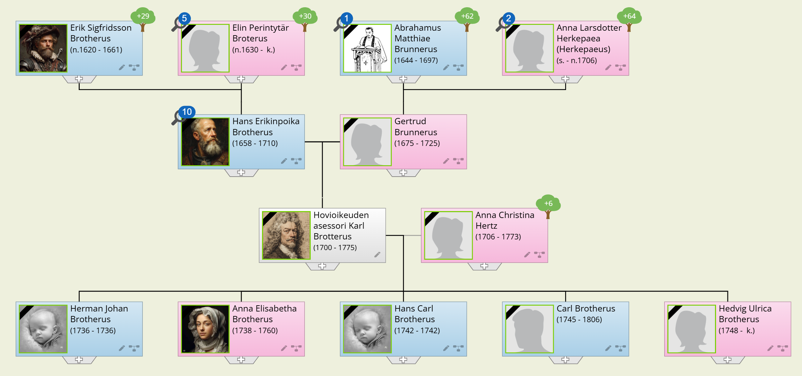

Eletään vuotta 1742, ja lokakuun loppupuolen lyhyt päivä on hämärtymässä iltaan Turun hovioikeuden asessorin [**Karl Brotteruksen**](https://www.geni.com/people/Hovioikeuden-asessori-Karl-Brotterus/6000000098213669844) katsellessa miettiväisenä ikkunastaan. Nuori sukulaismies on juuri astunut ovesta ulos pihalle ja kävelee kohti hevospuomia, jonka äärellä häntä hiukan vanhempi mies pitelee kahta ratsuhevosta. Karlin nuoren sukulaisen Henrik Brotheruksen tullessa hevosten luo vanhempi mies ojentaa hänelle toisen hevosen suitset. Sitten molemmat miehet nousevat ratsaille ja ohjaavat hevosensa ulos pihasta.

Henrikin vierailu ja hänen kuvauksensa kuluneen vuoden tapahtumista, varsinkin Sippolan säteritilan tuhosta, olivat herättäneet eloon niin paljon muistoja. Olihan Karlin varttuminen itsenäiseksi tavallaan alkanut melkein samanlaisen tuhon merkeissä, suuremman vain, nimittäin Viipurin valloituksen vuonna 1710 hänen ollessa ainoastaan kymmenen vuoden ikäinen. Karl muisti väläyksittäin jo neljä vuotta aikaisemmin tapahtuneen piirityksenkin, jonka kaupungin porvareista koottu puolustusjoukko oli onnistunut torjumaan. 10-vuotiaana hän oli jo itse osallistunut kaupungin puolustukseen, aseettomana lähettipoikana tosin vain. Sitä tehtävää suorittaessaan hän oli joutunut vihollisen käsiin ja hänet oli viety vankina kauas Venäjälle. Hän muisti vielä selkeästi piirityksen raskaat viikot: vinkuvat tykin luodit, jotka näyttivät murskaavan kaiken tielleen osuvan, palavat talot ja asukkaiden epätoivoiset sammuttamisyritykset, vihollislaumojen ryntäykset päin puolustajien kiväärinluoteja ja jalkajousien nuolia, ja lopuksi vangiksi joutumisensa tällaisen ryntäyksen aikana.

Näin oli alkanut 14 vuotta kestävä sotavankeus, jonka kuluessa monasti oli tuntunut siltä kuin hänet olisi kokonaan unohdettu Venäjänmaalle. Sellaiselta oli tuntunut varsinkin silloin kun tieto rauhan solmimisesta oli tullut vuonna 1721, mutta vasta kolme vuotta myöhemmin Karl oli viimeisten sotavankien mukana saanut palata kotimaahansa.

Viipurissa Karl oli vain pysähtynyt ohimatkallaan. Sehän ei enää kuulunut hänen kotimaahansa, vaan oli osa Venäjää, ja miltei täysin tuhoutuneenakin venäläisen sotaväen tiukasti käsissään pitämä. Karlin isä oli kuollut piirityksessä saamiinsa vammoihin, ja äiti makasi toivottomasti sairaana eikä edes tuntenut poikaansa. Äiti olikin sitten kuollut vajaan vuoden kuluessa. Karlin velipuoli Erik Johan eli perheineen Viipurissa niukoissa, miltei kurjissa oloissa. Hän asui kaupungin ulkopuolella ja oli enimmäkseen virkamatkoilla. Karlin lähin tiedossa oleva sukulainen oli täti Anna, joka omisti maatilan Lappeella, ja sinne Karl nyt oli mennyt.

Anna-täti otti Karlin ystävällisesti vastaan. Täti oli jo lähes 70 vuoden ikäinen. Hänen miehensä oli kuollut eikä heillä ollut ollut lapsia, joten Karlia pidettiin talossa miltei kuin omaa poikaa. Huomattuaan Karlin nokkelaksi nuorukaiseksi, olihan hän silloin jo 24 vuoden ikäinen ja maailmaa nähnyt, antoi Anna-täti hänen hoitoonsa monia asioitaan, ja lähetti jo samana vuonna Ruotsiinkin asioilleen.

Tämä matka kulki Haminan tapulikaupungin kautta, ja siellä Karl tapasi nuoremman sisarensa Sofian, joka oli naimisissa kauppias **Henrik Teschen** kanssa. Mennen tullen oli mukava vierailla kauppiaan perheessä, ja lankomies tutustutti miltei samanikäisen sukulaisensa mielellään laajaan tuttavapiiriinsä. Tämän innoittamana Karl päätti yrittää kauppiaan ammattia, ja perusti kaupan Lappeenrantaan tätinsä varallisuuden turvin.

Kauppiaan ura ei kuitenkaan kauan jaksanut kiinnostaa Karlia, ja parin kokeiluvuoden kuluttua hän ryhtyi hakeutumaan lakimiehen alalle. Hän pääsi seuraamaan kihlakunnan tuomaria käräjille ja sai sitten paikan Kyminkartanon läänin lääninkonttoristina ja myöhemmin Lappeenrannan kämnerioikeuden notaarina. Lopulta, harjoittelun ja vailla akateemista ohjausta suoritetun tiiviin opiskelun tuloksena, hänet hyväksyttiin 30 vuotiaana Turun hovioikeuteen auskultantiksi. Näin avautuivat kaikki mahdollisuudet niin ammatilliseen kuin sosiaaliseenkin nousuun: auskultantista notaariksi, notaarista kanslistiksi, ja sillä välin, marraskuun 4 päivänä 1735, avioliitto hovioikeuden asessori **Herman Hertzin** tyttären **Kristina Hertzin** kanssa. Tilaisuus tuomiokunnan hoitoon tuli Karlille 40 vuotiaana hänen lankonsa Maskun ja Mynämäen kihlakunnantuomari **Henrik Thuroniuksen** saatua nimityksen hovioikeuden asessoriksi. Juuri sodan kynnyksellä oli Karl saanut nimityksen hovioikeuden aktuaariksi, ja nyt tänä syksynä olivat miehitysviranomaiset määränneet hänet hoitamaan hovioikeuden asessorin virkaa.

Naimisiin mentyään ei Karlilla ollut ollut juuri mahdollisuuksia matkoihin. Siitä olivat sekä perhe että virka tehokkaasti pitäneet huolen, mutta sitä ennen oli hänellä toki ollut tilaisuus sukulaistensa tapaamiseen, niin kaukana kuin nämä asuivatkin. Anna-täti oli vanhoilla päivillään muuttanut Sääminkiin, missä hän kuoli vuodenvaihteessa 1734-35, ja hänet haudattiin siellä tammikuun 12 päivänä 1735. Ankarasta vuodenajasta ja pitkästä matkasta huolimatta oli Karl katsonut velvollisuudekseen olla läsnä vanhan sukulaisensa ja hyväntekijänsä hautajaisissa. Anna-täti oli testamentannut Karlille koko huomattavan omaisuutensa, minkä turvin Karl sitten pystyi ostamaan Björkön ratsutilan Paraisilta. Anna-tädin testamentti oli muutoinkin pohjana Karlin kasvavalle varallisuudelle, joka puolestaan auttoi Karlia sosiaalisessa nousussa ja varmaan avioliiton solmimisessakin.

Menomatka hautajaisiin oli ollut kiireellinen, niin että Karl ei ollut ennättänyt pysähtyä pitemmäksi aikaa sisarensa ja lankonsa luona Haminassa, mutta tulomatkalla hän oli sitten viipynyt sitäkin pitempään. Lanko kuljetti häntä tuttavissaan vierailuilla ja oli silminnähtävän iloinen saadessaan esitellä heille lupaavan lakimiehen Turun hovioikeudesta. Sisar Sofia oli vaatinut, että heidän piti välttämättä käydä myös Sippolan säterissä, minne heidän sukulaisensa Samuel Brotherus oli otettu pehtoriksi.

Sippolan säteri ja sen asukkaat olivat tehneet Karliin voimakkaan vaikutuksen. Säterin oli omistanut vuonna 1726 kuollut maamarsalkka ja valtioneuvos, kreivi **Johan Creutz**. Se oli nyt perikunnan hallussa ja sitä emännöi kreivin leski **Gertrud Sofia von Trejden**. Kuultuaan Karlin ja Teschien vierailevan pehtorinsa luona oli kreivitär kutsunut heidät myös kartanon puolelle, sillä haminalainen kauppias oli tunnettu ja arvostettu laajalti ympäristössä, ja hovioikeuden nuorta nousevaa virkamiestä oli mielenkiintoista tavata. Kartanossa oli ollut muitakin vieraita, säätyläisiä pitkienkin matkojen takaa ja Creutzin perikunnan jäseniä yksi pojista sekä naapuripitäjässä asuva tytär **Chistina Natt och Dag** miehensä kanssa. Keskustelu oli ollut vilkasta ja säkenöivää. Enimmäkseen oli puhuttu politiikkaa, varsinkin miesten kesken. Maamarsalkka Hornia, valtakunnan todellista johtajaa oli toisaalta kiitetty, toisaalta moitittu, ja Suomen asemasta valtakunnan osana oli käytetty varsin kiivaita puheenvuoroja niin puoleen kuin vastaan.

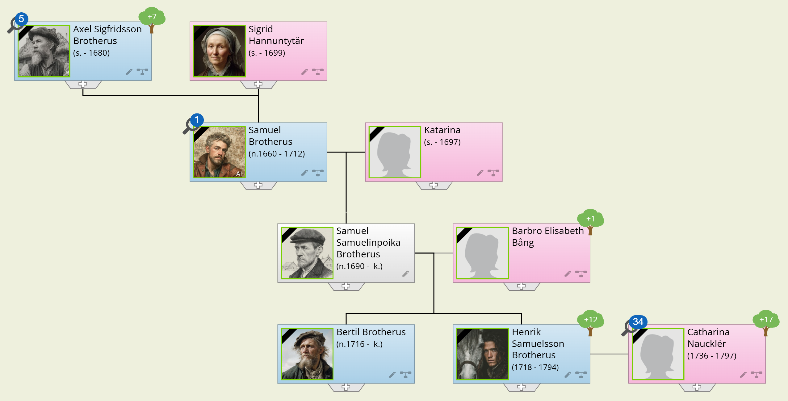

Täällä Karl oli nähnyt [**Henrik Brotheruksenkin**](https://www.geni.com/people/Henrik-Brotherus/6000000010988739380), Samuelin pojan, joka oli häntä 18 vuotta nuorempi ja silloin 16 vuotias, suorittamassa kaikenlaisia palvelutehtäviä vieraille. Henrikin käytös oli ollut hyvin huoliteltua, kohteliasta ja varmaa, ja hän oli näyttänyt olevan emäntänsä suuressa suosiossa, mutta selvästi käskyläisenä, ei vertaisena.

Ja nyt oli Henrik istunut tuossa hänen edessään kertoen isänsä Samuelin ja kreivitär Gertrud Sofian kuolemasta, Sippolan säterin polttamisesta, seikkailuistaan sotivassa maassa säterin omistajia etsien ja lopuksi siitä merkillisestä toimeksiannosta, jonka oli kapteeni **Johan Karl Natt och Dagilta** saanut, ja mitä toimittamaan hän tännekin oli tullut. Tietysti Karlkin oli lukenut keisarinna Elisabetin manifestin maaliskuun 18 päivältä 1742, sen jossa keisarinna oli kehottanut suomalaisia irrottautumaan Ruotsista ja perustamaan itsenäisen suuriruhtinaskunnan. Kyllä Karlkin oli miettinyt asiaa, ja Henrikin perustelut hänen suositellessaan manifestin hyväksymistä tuntuivat Karlista vastaansanomattomilta.

Mitä muuta Henrik Karlilta halusi? Suosituskirjaa, oli Henrik vastannut. Karlilla oli nimittäin suuri vaikutusvalta Turussa ja kaukana sen ympäristössäkin, niin että hänen suosituksellaan oli merkitystä. Lisäksi Henrik tarvitsi luettelon henkilöistä joiden puoleen hänen asiassaan oli syytä kääntyä. Niinpä Karl oli lopulta tarttunut kynään ja tarkoin harkittuaan laatinut luettelon sellaisista eri säätyihin kuuluvista henkilöistä, joiden mielipiteillä oli painoa, ja jotka Henrik ehkä voisi saada puolelleen. Ja sitten Karl oli kirjoittanut seuraavan suosituskirjan:

> Tämän suosituskirjan haltija on pikkuserkkuni Henrik Brotherus, palvellut sodassa tuhotulla Sippolan säteritilalla (kreivi Creutzin), ja monien Suomessa asuvain säätyläisten toivomuksesta sekä myös miehitysviranomaisten luvalla tullut keskustelemaan oikeasta suhtautumisesta hänen majesteettinsa keisarinna Elisabetin maaliskuun 18 päivänä 1742 Suomen kansalle osoittamaan manifestiin. Suosittelen häntä rehellisenä, vireänä ja kaikkien säätyjen parasta tarkoittavana miehenä.  
Turussa, 28 päivänä lokakuuta, 1742  
*Karl Brotterus*  
Hovioikeuden asessori Turun kaupungista

Joulukuun 20 päivänä 1749 astuu tyytyväinen mies ulos Lappeenrannan kaupungin maistraatin istuntosalista. Hän on Henrik Brotherus, joka juuri on saanut nimityksen rajaratsastajaksi ja tällä nimityksellä vapautunut erittäin kiusallisesta tilanteesta sekä viimeinkin, monien vuosien epävarmuuden jälkeen, saanut selkeän toimintalinjan. Hän on vielä melko nuori mies, 31 vuoden ikäinen ja syntynyt Tukholman kaupungissa, vaikka siitä hänellä ei kuitenkaan ole minkäänlaista muistikuvaa. Hänen isänsä Samuel Brotherus palasi perheineen takaisin kotiseudulleen Espooseen hänen ollessaan vasta kolmen vuoden ikäinen.

Öster-Mankansin ratsutilalta on Henrikillä vain satunnaisia, välähdyksenomaisia muistikuvia. Hän muistaa vanhat ja rapistuneet rakennukset sekä alati äkäisen isänsä äitipuolen, Katarina Palmin, jonka kanssa hänen vanhemmillaan näytti olevan jatkuvaa riitaa talon hoidosta ja siitä saadun tuoton omistuksesta ja käytöstä. Henrik on kahdeksan vuoden ikäinen, kun Öster-Mankans myydään ja perhe muuttaa Otaniemen säterin pehtorinasuntoon, jossa äidin vanhemmat Johan Bång ja isoäiti Anna Sofia asuvat. Isoisä Johan on tilan pehtori ja luutnantti arvoltaan.

Veli Bertil, joka on setävainajansa kaima ja ehkä hiukan tämän luonteinenkin, on muutamaa vuotta Henrikiä vanhempi, ja jo Öster-Mankansissa osallistunut täytenä miehenä talon kaikkiin ulkotöihin. Niinpä hän Otaniemessäkin viihtyy parhaiten pelloilla, metsissä ja talleilla. Henrik puolestaan on saanut nimensä äitinsä suvusta, ja isoäiti ottaa kahdeksan vuotiaan pojan hoitoonsa ja kasvatettavakseen.

Isoäidin mielestä lukemisen ja kirjoittamisen taito, merkittävimpien vieraiden kielten hallitseminen ja hyvät hovitavat ovat Henrikin tapaiselle lahjakkaalle, vaan ei kovin vankkarakenteiselle pojalle, tärkeimmät eväät elämäntaipaleelle. Niitä Henrik sitten joutuu harjoittelemaan noin viiden vuoden ajan. Isä on paljon poissa kotoa. Hän on ollut veronkantokirjurina jo kauan ennen kuin yhdessä isoisä Samuelin kanssa matkusti Ruotsiin. Hän tuntee pitäjän ja pitäjäläiset, jotka uskovat asioitaan hänen hoidettavakseen, ja hänestä käytetään komissaarin titteliä.

Henrik on jo kolmentoista ikäinen kun isä Samuel saa toimen Sippolan säterin pehtorina Vehkalahdella, ja perhe muuttaa sinne vuonna 1731. Sippolan säterin suurin loistoaika on takanapäin maamarsalkan ja valtioneuvoksen, kreivi **Johan Creutzin** kuoltua vuonna 1726, mutta talon ohjakset ovat vankasti hänen leskensä **Gertrud Sofian** käsissä, ja yhä vielä pitävät säätyläiset laajalta alueelta Itä-Suomea sitä tärkeimpänä tapaamispaikkanaan. Bertil auttaa isäänsä säteritilan laajojen viljelysten ja karjan hoidossa, mutta Henrikin ottaa emäntä Gertrud Sofia talon sisäpalvelijaksi niiden taitojen ansiosta, jotka isoäiti on Henrikille opettanut.

Sippolan säterin sisäpalvelustöissä aluksi palveluspoikana, sitten lakeijana ja lopuksi hovimestarina, ja siis koko sisäpalvelushenkilöstön päällikkönä ollen Henrik joutuu näkemään monia huomattavia henkilöitä ja kuulemaan monia tärkeitä keskusteluja. Henkilökohtaisesti mielenkiintoisia, joskaan eivät yhteiskunnalliselta asemaltaan merkittäviä, ovat olleet haminalainen kauppias **Henrik Tesche** ja hänen vaimonsa Sofia, viimeksi mainittu kun osoittautui olevan Henrikin kaukainen sukulainen, vaikka tällä ei aikaisemmin ollut ollut siitä vähäisintäkään tietoa. Sofia oli sitten kerran, talvella 1735, tuonut taloon vieraaksi ohikulkumatkalla olleen veljensä Karlin, turkulaisen hovioikeuslakimiehen, josta oli tullut tärkeä tekijä Henrikin myöhemmissä vaiheissa. Isä Samuel oli kuollut muutama kuukausi tämän käynnin jälkeen ja hänen tilalleen oli säteriin otettu uusi pehtori, mutta Bertil oli säilyttänyt asemansa pehtorin oikeana kätenä. Seuraavana vuonna kuoli myös talon emäntä, Gertrud Sofia, ja tila jäi toistaiseksi kreivi-vainajan lasten haltuun ilman tarkemmin yksilöityä isäntää. Henrik joutui työskentelemään omassa valtakunnassaan varsin itsenäisesti ja järjestämään tilapäisille kävijöille tilat ja tarjoomukset. Kreivin lapset kävivät kyllä edelleen talossa, kaikkein useimmin ehkä tytär Christina miehensä **Johan Carl Natt och Dagin** kanssa, he kun asuivat naapuripitäjässä Pyhtäällä.

Sitten oli syttynyt sota Ruotsin ja Venäjän välille 1741. Sen alkamista oli kyllä osattu pelätä jo useamman vuoden ajan, varsinkin täällä rajan tuntumassa. Maamarsalkka **Arvid Bernhard Hornin** jouduttua eroamaan vuonna 1738 saivat tsaari Pietarille kärsittyjen tappioiden hyvityksestä haaveilevat nuoret ruotsalaiset yltiöpäät tuulta siipiensä alle, ja vierailuillaan Sippolassa puhuivat niin kreivi Creutz-vainajan lapset kuin heidän vieraansakin yhä ja jatkuvasti huolestuneina sodan mahdollisuudesta. Rajan pinnassa elävinä heillä oli toisenlaiset ajatukset sodasta ja sen tuomista mahdollisuuksista kuin Tukholman krouveissa ja salongeissa kannuja valavilla ja maljoja kallistelevilla nuorilla hurjapäillä. Näiden panos sodan vaakakupissa olisi aivan toinen kuin täällä Sippolassa elävien.

Hyökkäys Venäjälle kääntyi pian perääntymiseksi, ja venäläiset työntyivät rajan yli. Lehdet olivat vielä vihreinä puissa, kun Sippolan säterin kohtalonhetki koitti. Venäjän armeijan pääjoukot oli suunnattu Lappeenrantaan, mutta pienempi yksikkö eteni miltei vastarintaa kohtaamatta rannikkoa pitkin Turun - Viipurin kuriiritien tuntumassa. Kartanon asukkaat ja alustalaiset olivat saaneet sen verran aikaisemmin tiedon lähestyvästä vihollisosastosta, että suurin osa heistä oli vähin varustein ennättänyt paeta metsän suojaan venäläisten saapuessa. Venäläiset tekivät raivoisaa ja järjestelmällistä tuhoa. Se osa karjaa, jota ei pystytty ottamaan mukaan, teurastettiin ja syötiin tai poltettiin rakennusten mukana. Kartanon väki katseli metsän pimennosta kauhistuen, kuinka heidän asuntonsa, aittansa, latonsa ja riihensä pienimpiä varastosuojia myöten roihusivat tulimerenä niin ettei mitään jäänyt jäljelle.

Kun tuhotyö oli tehty, poistui vihollisosasto paikalta, ja asukkaat saattoivat palata entisille asuinsijoilleen savuavia raunioita katsomaan ja etsimään, löytyisikö mitään sellaista tarvekalua tai esinettä, joka helpottaisi uuden elämän aloittamista. Henrik Brotherus totesi, että hänen olisi saatava käsiinsä joku isäntäväestään, joku Creutzin pojista tai hänen vävynsä, kertoakseen tuhosta ja saadakseen ohjeita siitä, miten edelleen menetellä. Tihutyön syyksi oli kuulema esitetty, että tilalla tai jossain sen alustalaisten asunnoista olisi piiloteltu ruotsalaista vakoilijaa tai sissijohtajaa. **Tapani Löfving** toimi tuolloin Viipurin seuduilla Ruotsin armeijan ylipäällikön toimeksiannosta.

Seuranneita kuukausia ei Henrik Brotherus mielellään muistele. Creutzin veljekset ovat Ruotsin armeijan palveluksessa, mutta eivät niissä joukko-osastoissa, jotka on komennettu Suomeen. Kevät on jo pitkällä, kun Henrik lopulta saa käsiinsä kreivi Creutzin vävyn, joka helmikuun alussa 1743 oli saanut komennuksen Savon rykmenttiin kapteenin arvolla. Hänelle Henrik selvittää tilannetta. Sippolan säteritilalla ei ole paljoakaan tehtävissä. Alustalaisista ne, joita sota ei ole temmannut mukaansa, ovat yritelleet aloittaa jonkinmoista uutta elämää rakentamalla itselleen tilapäissuojia ja koettaen keinolla tai toisella pitää itseään ja perhettään hengissä yli talven. Tilan pehtori on jättänyt toimensa katsoen siitä suoriutumisen mahdottomaksi, mutta veli Bertil, joka on mennyt naimisiin **Maria Mikkelintyttären** kanssa, on alustalaisten mukana yrittämässä uuden elämän alkuun.

Juuri samaan aikaan kun Henrik Brotherus viimeinkin saa kiinni Johan Carl Natt och Dagin, on Suomeen leviämässä Venäjän keisarinna Elisabetin suomalaisille osoittama manifesti, joka suomalaisia kiinnostavimmassa kohdassaan kehottaa heitä irtaantumaan Ruotsista ja olemaan "*nijncuin yxi wapa ja eij cennengän wallan alla olewainen ma*".

Johan Carl Natt och Dag pystyy vain vaivoin hillitsemään innostustaan, niin että rykmentissä palvelevat ruotsinmaalaiset upseerit eivät liian selvästi huomaisi hänen kiinnostustaan asiaan. Mutta Henrikin hän lähettää ottamaan selvää suomalaisten säätyläisten mielipiteistä ja keskustelemaan heidän kanssaan keisarinnan ehdotuksesta. Hän käy Henrikin kanssa yhä uudelleen läpi Sippolassa **Arvid Hornin** vallasta luopumisen jälkeen käydyt keskustelut, joissa Suomen vaikeaa asemaa kahden suurvallan välisenä rajamaana kerta kerran jälkeen oli pohdittu. Hän selostaa Henrikille myös asemaansa Creutzin perikunnan jäsenenä: Jos sota päättyisi Ruotsin ja Venäjän väliseen rauhaan, tulisi rauhansopimukseen sisältymään lisää alueluovutuksia Ruotsilta Venäjälle, sillä sehän oli jo selvää, että Ruotsi tulisi häviämään tämän sodan. Ja alueluovutuksessa tulisi Sippolan säteri aivan varmasti siirtymään Venäjän puolelle. Olivathan venäläisten mielipiteenilmausten mukaan jo tämän sodan alkuvaiheet osoittaneet, että Viipurin turvallisuus vaati ehdottomasti rajan siirtämistä kauemmaksi näin tärkeästä venäläisestä kaupungista. Ja rauhanteossa eivät ruotsalaiset pystyisi - jos halusivatkaan - valvomaan luovutettavan alueen asukkaiden etuja. Niinhän oli käynyt Uudenkaupungin rauhassakin vain 20 vuotta aikaisemmin. Silloin tulisivat perikunnan jäsenet käytännöllisesti katsoen menettämään Sippolan säterin. Oliko heillä enää mitään syytä olla uskollisia sellaiselle hallitsijalle, joka niin huonosti valvoi heidän etujaan?

Lopuksi oli kapteeni Natt och Dag antanut Henrikille rahaa kulujen peittämiseksi, mutta huomautti samalla, että näin hyvän sanoman kuljettajalle säätyläiset varmaan ilomielin tarjoaisivat ilmaisen ylöspidon. Seuraavat kuukaudet olivatkin sitten kuluneet ympäri Suomea kierrellessä. Kuten Natt och Dag oli arvellutkin, enimmäkseen oli vastaanotto ollut suopeaa, jopa innostunuttakin, mutta oli myös taloja, joista hänet oli perään sylkäisten heitetty ulos ovesta, hyvä kun sai nahkansa pitää ehjänä. Mutta sen jälkeen kun venäläiset olivat miehittäneet koko maan ei hänen nahkansa enää ollut ollut vaarassa. Henrik oli aloittanut kierroksensa idästä päin, ensin Karjalasta, sitten Savosta, Hämeestä, Uudeltamaalta ja syksyllä lopulta päätynyt Turkuun. Myös oli hän tehnyt ennen Turkuun tuloaan kierroksen Pohjanmaalle, missä hän oli kuullut Ison Vihan tuhojen olleen kaikkein suurimmat, ja näin ollen arveli vastaanoton olevan myönteistä.

Turussa Henrik oli sitten ensimmäisenä - heti miehitysviranomaisten jälkeen - ottanut yhteyden sukulaiseensa hovioikeudenasessori Karl Brotterukseen joka, paitsi että oli sukulainen ja vuosien takainen tuttu, oli kaupungissa arvostettu ja omasi laajan tuttavapiirin. Tilanne oli Henrikin tehtävän osalta sikälikin selkiintynyt, että saatuaan suotuisia tietoja manifestin vastaanotosta venäläiset miehitysviranomaiset olivat päättäneet kutsua koolle Turussa ja Vaasassa maakuntakokoukset keisarinnan ehdotusta käsittelemään. Näin oli Henrikin keskusteluille tullut konkreettisempi aihe. Ja hyvin oli asia mennytkin eteenpäin maakuntakokouksissa sekä Turussa että  Vaasassa oli selvästi tullut voitolle suomalaisten halu itse hoitaa asiansa, ja Turussa oli jopa valittu Suomelle suuriruhtinaskin, keisarinna Elisabetin serkku, Holsteinin herttua **Kaarle Pietari Ulrik**. Elämä Turussa oli ollut kuin juhlaa, ja siellä Henrik olisi halun- nut viipyä pitempäänkin, mutta toisin kävi.

Tammikuun puolivälissä Henrik kutsutaan hiljattain perustettuun "Hänen keisarillisen majesteettinsa Suomen suuriruhtinaskunnan kansliaan", missä hänelle ilmoitetaan, että rauhanneuvottelut Venäjän ja Ruotsin välillä alkavat helmikuun alkupäivinä Turussa, ja näiden neuvottelujen suotuisan sujumisen kannalta on välttämätöntä, että hän sitä ennen poistuu Turusta. Hänelle ja hänen rengilleen Olavi Eerikinpojalle annetaan passi Viipuriin tästä kansliasta tammikuun 26 päivänä 1743. Keskitalven pakkaset ovat purevat kun he venäläisestä sotaväenosastosta muodostetun "turvasaattueen" suojassa ratsastavat päästä päähän pitkän kuriiritien Turusta Viipuriin. Sippolan säterin ohikin kulkee Henrikin tie, ja siellä hän ennättää kertoa matkansa syyn ja päämäärän veljelleen Bertilille, ja lupaa perille tultuaan tiedottaa, minkälaiset olisivat elämisen mahdollisuudet Viipurissa päin. Sippolassa näet eletään vielä aivan kurjissa oloissa puolentoista vuoden takaisen tuhon jälkeen.

Viipurin ajassa ei ole paljoakaan muistelemisen arvoista. Tekemistään "palveluksista" keisarinnan asialle saa Henrik eräänlaisen elatusapurahan, mutta ollen samalla sekä "suojeluksessa" että valvonnassa hänen liikkumismahdollisuutensa ovat varsin pienet. Ja keisarinna tekee rauhan Ruotsin kanssa juuri sellaisin ehdoin, kuin Johan Carl Natt och Dag on pelännytkin, ja hallitsijoiden tapaan unohtaa kaikki suomalaisille antamansa lupaukset. Henrik onnistuu lähettämään raportin toimistaan kapteeni Natt och Dagille tiedottaen samalla olinpaikastaan ja olosuhteistaan.

Karl Brotteruksen velipuolen poika Erik elää leskiäitinsä ja kahden nuoremman sisaruksensa kanssa kaupungin ulkopuolella ahtaasti ja köyhinä kunnes Erik saadessaan 1745 maakomissaarin toimen Käkisalmen läänissä muuttaa perheineen toimialueelleen. Ainoa ilonpilkahdus tässä sodan runtelemassa ympäristössä on, että Henrik suhteillaan onnistuu järjestämään Bertilille perheineen elämisen mahdollisuudet Koiviston Alvattilassa. Näin kuluu neljä pitkän pitkiltä tuntuvaa vuotta.

Kesän kynnyksellä 1747 leviää Viipurissa tieto, että Kyminkartanon provinssi on saamassa suomalaissyntyisen käskynhaltijan, ja ennen pitkää ilmenee, että tämä on Henrikin entinen isäntä ja toimeksiantaja, nyttemmin majurin arvolla Ruotsin armeijasta eronnut Johan Carl Natt och Dag. Henrikin toiveet elämänmuutoksesta heräävät, sillä nyt on viimeinkin ilmestynyt lähietäisyydelle sellainen tuttu, jolla on sekä syytä että mahdollisuuksia auttaa häntä. Kun kuukausi toisensa jälkeen kuluu ilman että mitään tapahtuu, tekee Henrik lopulta itse aloitteen matkustamalla käskynhaltijan luokse Lappeenrantaan. Mutta hän tapaakin katkeroituneen miehen, joka ei enää paljoakaan arvosta sitä työtä, minkä Henrik hänen aloitteestaan teki keisarinnan manifestin hyväksymisen puolesta. Ajat ovat muuttuneet. Häntä on alettu katsoa syrjinkarein Suomessa juuri noiden ajatusten vuoksi. Sotaneuvos, kreivi **Svante Creutz** on toisten perillisten suostumuksella myynyt Sippolan säteritilan liiviläiselle maaneuvokselle **Otto Reinhold von Stackelbergille** pilkkahintaan, mutta Natt och Dag oli senkin vähäisen kauppahinnan jakamisessa syrjäytetty. Kauppa tehtiin lokakuun 18 päivänä 1746, ja huhtikuussa 1747 Natt och Dag lopulta veti tarpeelliset johtopäätökset, sanoutui irti Ruotsin armeijasta ja ilmoittautui keisarinnan palvelukseen. Ja mitä tämä käskynhaltijan toimi sitten merkitsi? Olikohan lopulta oma nenäliina ainoa asia tässä maankolkassa mihin hän sai pistää nenänsä toisilta lupaa kysymättä? Vanhojen muistojen vuoksi hän kuitenkin voisi antaa Henrikille paikan lakeijanaan. Sen kaltaisiin tehtäviin Henrik jo Sippolassa oli oppinut. Siihen Henrik sai tyytyä.

Henrikin työ käskynhaltijan lakeijana alkaa vuonna 1748, mutta jo seuraavana vuonna tulee asiaan muutos. Keisarinna Elisabet on määrännyt Natt och Dagille lahjoitusmaan Kerimäen pitäjästä käskynhaltijan palkkausta varten. Tälle lahjoitusmaalle N och D on antanut nimen Moisundin kartano - pehtoriksi käskynhaltija nimittää Henrikin. Tehtävä on mieluisa ja suurin toivein Henrik matkustaa Kerimäelle, missä häntä odottaa yllätys: Moisundin kartanoa ei ole olemassa! Lahjoitusmaan muodostaa joukko itsenäisiä talonpoikaistaloja, joista saatavat verotulot (ja niiden perimisen) keisarinna on määrännyt käskynhaltijan nautintaan. Tämä selviää vähitellen Henrikin käännyttyä Kerimäen nimismiehen, vanhan **Daniel Scheiningin** puoleen. Mitään omaa viljelystä ei ole, eikä siis Moisundin hoitamiseen tarvita pehtoria, vaan verovouti, ja sellaiseen tehtävään Henrikillä ei ole pienintäkään halua eikä varmaan kykyäkään. Nimismies Scheining ymmärtää Henrikin pulman, ja niin he sopivat siitä, että Moisundin osuudelle tulevat verotulot kerätään muun verotuksen yhteydessä, mutta tilitetään käskynhaltijalle. Ja mitä Henrikin asemaan tulee niin Scheining tietää Lappeenrannan kaupungin tarvitsevan rajaratsastajaa, ja lupaa suositella Henrikiä tähän tehtävään. Viipyessään ystävällisen nimismiehen kodissa Henrik tapaa siellä Daniel Scheiningin tyttärentyttären, 13-vuotiaan neito **Katarina Nauklerin**, joka on naapuripitäjän nimismiehen **Elias Nauklerin** ja hänen vaimonsa **Katarina Scheiningin** tytär.

Astuessaan alas Lappeenrannan kaupungin maistraatin portaita joulukuun 20 päivänä 1749 Henrik hymyilee iloisesti muistellessaan Katarina Nauklerin hämmentävän kirkkaita harmaita silmiä ja pientä kättä, joka erotessa oli unohtunut hänen käteensä hiukan pitemmäksi ajaksi kuin hyvästely itse asiassa olisi edellyttänyt.

Lopuksi vielä muutama sana käskynhaltijastakin. Johan Carl Natt och Dag oli syntynyt vuonna 1698. Hänen ainoat vielä elossa olevat lapsensa - jotka muuten molemmat kuolivat lapsettomina - olivat pojat Johan Carl sekä Svante Natt och Dag. Molemmat palvelivat upseereina Ruotsin armeijassa isän siirtyessä Venäjän keisarinnan palvelukseen. Myöskään vaimo Christina ei seurannut miestään Kymenkartanon provinssiin. Kun käskynhaltija kuolee vuonna 1751 vain 53 vuoden ikäisenä, palautuu lahjoitusmaa Venäjän kruunulle häviten niin tietymättömiin, ettei Kerimäen historiaa myöhemmin kirjoitettaessa tiedetä sellaista olleen olemassakaan. Moisundin nimi lienee liittynyt johonkin käskynhaltijalle rakkaaseen muistoon.

## 6. Vähäosaisia 1700-luvulla

### Sigfrid Johansson Brotherus

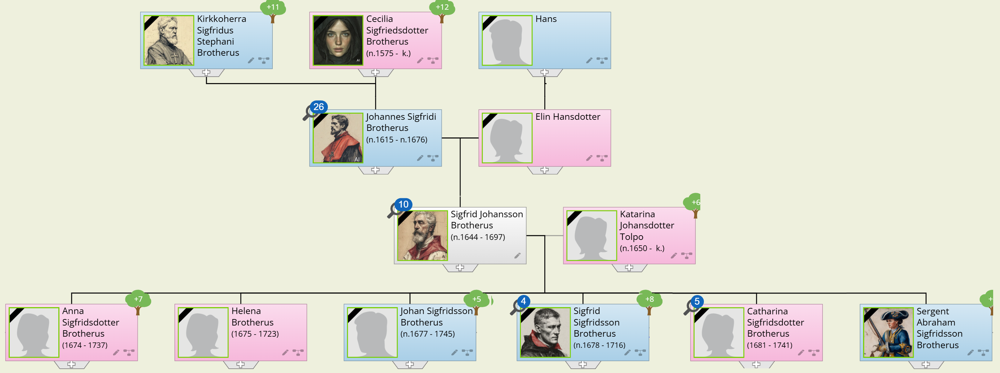

Perinnönjakoa koskevan tarinan lopussa mainitsin, että Johannes Sigfridin poika [**Sigfrid Johansson Brotherus**](https://www.geni.com/people/Sigfrid-Brotherus/6000000012798772671) juuri ennen isänsä kuolemaa oli viimein nimitetty kappalaiseksi isänsä seurakuntaan. Hän ennätti olla vuoden päivät tässä toimessa ennen isänsä kuolemaa, mutta kesti kokonaista 15 vuotta ennenkuin hän lopulta sai nimityksen seurakunnan kirkkoherraksi, ja pian sen jälkeen hänestä tuli Suur-Savon lääninrovasti kuten isänsäkin oli ollut.

Ennen kappalaiseksi nimittämistään oli Sigfrid solminut avioliiton turkulaisen kauppiaan tyttären, **Katarina Tolpon** kanssa, ja heille syntyi kuusi lasta, jotka kaikki kasvoivat aikuisiksi. Vanhin, Helena syntyi 1675, sitten Anna 1677, Sigfrid 1678, Johan 1679, Katarina 1681, ja viimeksi, monen vuoden väliajan jälkeen Abraham joskus 1790-luvun alkuvuosina. Kaipa syntymään vaikutti ilo kirkko-herran-nimityksestä, ja nimikin on sen mukainen.

Lääninrovasti Sigfrid Brotherus kuoli 1697, ja oli kuollessaan todennäköisesti vasta, tai sanoisinko enintään 50-vuotias. Kaikki muut lapset olivat silloin vielä kotona paitsi Anna, joka oli solminut avioliiton Mikkelin 2. kappalaisen, **Paulus Molleruksen** kanssa. Melko pian jättivät kotinsa myös pojat Sigfrid ja Johan, jotka molemmat olivat tulleet ylioppilaiksi Viipurista, ja jatkoivat opintojaan Turussa antautuen myöhemmin pappisuralle. Lopulta lähti kotoa myös Katarina solmien avioliiton Ristiinan kappalaisen kanssa. Näin jäivät kotiin äidin kanssa vain vanhin tytär Helena sekä kuopus Abraham, joka isän kuollessa ei vielä ollut kymmentään täyttänyt.

Isoisä Johannes Sigfridi oli pitänyt hyvin puolensa perinnönjaossa, ja ehkäpä osittain sen vuoksi saattoi jättää molemmille pojilleen, Sigfridille ja Hansille kummallekin perinnöksi maatilan. Läänin-rovastin leski Katarina Brotherus saattoi siis armovuoden päätyttyä vetäytyä yhdessä tyttärensä Helenan ja poikansa Abrahamin kanssa perintötilalle Mikkelin Paukkulaan, missä heidän tiedetään asuneen vielä vuonna 1711. Abraham on mainittu asuvaksi siellä hänen kanssaan vuonna 1707, mikä viittaisi siihen, että Abraham tuolloin on täyttänyt 15 vuotta. Lasten katsottiin nimittäin tuohon aikaan aikuistuvan siinä iässä ja sen vuoksi heidät vasta silloin merkittiin asukasluetteloon.

### Abraham Sigfridsson Brotherus

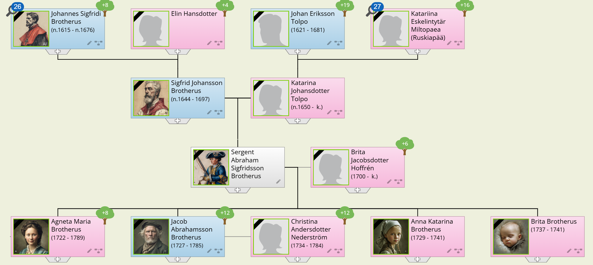

Ei ole toistaiseksi löytynyt mitään merkintää siitä, milloin [**Abraham Sigfridsson Brotherus**](https://www.geni.com/people/Sergent-Abraham-Sigfridsson-Brotherus/6000000047314716886) on saanut kutsun astua sotapalvelukseen, mutta kovin kauan ei sitä liene tarvinnut odottaa, koska hänestä ei seuraavina vuosina löydy merkintää, ja aikuiseksi varttuminen merkitsi myös sotapalvelukseen astumista ellei erityisen pätevää estettä ilmaantunut.

Seuraava tieto Abrahamista on, että hän vuonna 1717 oli Savon ja Savonlinnan läänin jalkaväkirykmentin Iisalmen komppanian lippumies, ja seuraavana vuonna saman komppanian kersantti. Tämä oli luultavasti hänen  vakanssinsa edelleen, kun hän vuoden viimeisenä päivänä v. 1722 erosi sotapalveluksesta ja asettui asumaan Iisalmeen.

Miksi sitten Abraham ei sotapalveluksesta vapauduttuaan palannut kotiseudulleen? Ilmeisesti siksi, ettei enää ollut, minne palata, kun kotitila äidin kuoltua oli autioitunut. Sisar Helena oli jäänyt Mikkeliin, mutta eli ilmeisesti varsin huonoissa oloissa, koska hän vajaat kymmen kuukautta myöhemmin, elokuun 20 päivänä 1723 kuoli. Sisar Katarina tosin oli leskeksi jäätyään palannut Mikkeliin, mutta tämä ei enää vetänyt sinnepäin, jos Abraham sitä edes tiesikään. Monien sotavuosien aikana oli sen sijaan syntynyt vankka ystävyys Iisalmen asetoverien kanssa.

On oikeastaan aika luonnollista, että Abraham niin hyvin viihtyi uusien, sodan aikana saamiensa ystävien parissa. Iisalmi ei suinkaan siihen aikaan ollut mikään kaupunki, vaan kirkkopitäjä, joka 75 vuotta ennen Abrahamin sinne muuttamista oli erotettu Tavisalmen kirkkopitäjästä, nykyisestä Kuopion seurakunnasta, joka puolestaan oli perustettu 75 vuotta aikaisemmin eli v. 1552 (samoihin aikoihin siis kuin Vantaan pitäjässä kaukana etelässä pitivät isännyyttä taloissaan kirkonkylässä ja Tikkurilan kylässä Mikko Laurinpoika ja Niilo Martinpoika).

Noihin aikoihin 1500-luvun puolivälissä oli Suomen asukasluku vain noin 250 000 henkeä. Kiinteä asutus oli kapeahkolla kaistaleella pitkin Pohjanlahden rantaa, sen viivan eteläpuolella, joka saadaan, kun vedetään käsivaraisesti ja hieman aaltoilevana viiva Tampereelta Jyväskylän ja Varkauden kautta Savonlinnan pohjoispuolitse Kerimäen-Kesälahden kautta. Tämän viivan pohjoispuolella ja Pohjanmaan ranta-asutuksen itäpuolella oli vain hajanaista uudisasutusta ja kiertelevää paimentolaiskansaa, joka vaelsi porolaumojensa perässä - lappalaisia. Osittain varmistaakseen valtakuntansa alueen laajentumisen, osittain lisätäkseen verotulojaan, suosivat valtakunnan kuninkaat uudisraivauksen levittämistä näille seuduille. Kuninkaiden kehotuksia seurasivat muita innokkaammin savolaiset Suur-Savon alueelta, jonka tärkeimpänä keskuksena oli Mikkelin seutu. Savolaisten into uudisasutukseen - muilta se miltei tyystin puuttuikin - johtui heidän asumis- ja viljelytavastaan. Kun länsisuomalaiset asuivat tiiviisti rakennetuissa kylissään ja viljelivät suurelta osin kiinteitä viljelyksiään, asuivat savolaiset hajallaan ja harjoittivat metsästyksen ja kalastuksen ohella pääasiassa kaskiviljelystä. Siksi ei muuttaminen kaukaisillekaan uudistiloille ollut heille vieras ajatus. Kaskiviljely puolestaan vaati peltoviljelyä laajemmat tilat, mikä väkiluvun lisääntyessä teki välttämättömäksi uusien alueiden valtaamisen.

Kun Abraham Brotherus joutui yhteen iisalmelaisten kanssa, tutustui hän uudisraivaajien jälkeläisiin, joiden esi-isät vain kaksi tai kolme sukupolvea aikaisemmin olivat lähteneet liikkeelle Mikkelin seudulta. Näiden joukosta lienee löytynyt sellaisiakin, jotka aikanaan olivat tunteneet hänen isoisänsä Johannes Sigfrid Brotheruksen, joka oli ollut erittäin arvostettu ja pidetty "sekä ylhäisten että alhaisten parissa". Ei siis ihme, että Abraham jäi iisalmelaisten joukkoon asumaan varsinkin, kun hän vielä sai puolisokseen Iisalmen kirkkoherran tyttären **Brita Hoffrénin**. Voidaan kai sanoa, että sen parempaa naimakauppaa ei Iisalmella kukaan toinenkaan olisi voinut tehdä - ainakin päällisin puolin katsottuna - mutta olihan Abraham kersantti ja lääninrovastin poika rikkaasta Mikkelin pappilasta.

Avioliiton solmimisajasta ei löydy merkintää, ei liioin tietoja siitä, millä tavoin nuori perhe hankki toimeentulonsa avioliiton ensi vuosina. Todennäköisesti avioliitto solmittiin melko pian sen jälkeen kun Abraham oli tullut Iisalmeen, sillä ensimmäinen lapsi, Agneta Maria, syntyi viimeistään v. 1726, seuraava, Jakob, syntyi nimittäin 1727. Tämän jälkeen Abraham ja Brita saivat vielä kaksi tytärtä: Anna Katarina, s. 1729 ja äidin kaima Brita, s. 1737. Perheen toimeentulo lienee ollut niukka, sillä samana vuonna kun Abraham kesäkuun 17 päivänä 1741 sai nimityksen Iisalmen lukkariksi, kuolivat heidän molemmat nuorimmat tyttärensä: tammikuussa Anna Katarina 12 vuoden ikäisenä ja kesäkuun 26 päivänä Brita 3 vuoden ja 8 kuukauden ikäisenä. Abraham oli silloin noin 50 vuoden ikäinen.

Nyt seuranneet vuodet näyttävät perheellä sujuvan seesteisemmissä merkeissä. Tytär **Agneta Maria Brotherus** solmii avioliiton korpraali **Olof Ketolinin** kanssa. Tämä on alkuaan ollut yksinkertaisesti Olli Kettunen, mutta ehkäpä hienoon sukuun tullessaan on "sivistänyt" nimensä. Poika Jakob perustaa myös perheen, ja hänen vaimonsa on sotamies **Anders Nederströmin** tytär **Kristina Nederström**. Tästä avioliitosta ennättää vanha Abraham nähdä vielä lapsenlapsiakin: Brita syntyy 1752 ja Andreas 1757. Näyttääpä siltä kuin enempää ei tulisikaan, sillä kun Abraham v. 1765 kuolee, ei lastenlasten joukko ole tästä kasvanut.

### Jacob Abrahamsson Brotherus

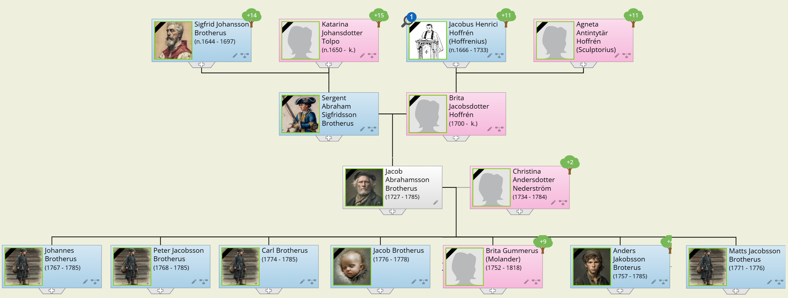

Kun Abrahamin leskellä Britalla oli armovuosi toukokuun 1 päivästä 1766 huhtikuun 30 päivään 1767 sai hän nauttia miehensä palkan ja hänen poikansa [**Jakob Abrahamsson Brotherus**](https://www.geni.com/people/Jacob-Brotherus/6000000058462052931) hoiti sinä aikana lukkarin virkaa. Hyvin poika virkansa hoiti, ja ilmeisesti hän kuten isänsäkin oli paikkakuntalaisten suuresti suosima, sillä lukkarin virkaa isän jälkeen täytettäessä sai Jakob enimmät äänet. Porvoon tuomiokapituli kumosi kuitenkin vaalin, sillä se havaitsi, ettei Jakob tuntenut nuotteja, "*...mutta lauloi kumminkin tavallisia virsiä jotenkin hyvästi, ei tainnut kirjoittaa, tavasi ja luki sisältä huonosti, mutta omisti hyvän äänen. Hän oli jo vanha ja ruumiiltaan kömpelö, eikä siis voinut oppia suonen avaamista*". Uuteen lukkarinvaaliin Jakobia ei enää pantu ehdolle, mutta siitä huolimatta hän sai siinä enimmät äänet jälleen. Tuomiokapituli ei heltynyt, vaan antoi lukkarin valtakirjan toiselle.

On vaikea näin kaukaa katsoen yhtyä tuomiokapitulin perusteluihin. Eihän Jakob tuolloin ollut kuin vasta 40 vuoden ikäinen, kun isänsä oli tämän viran saadessaan ollut jo 50-vuotias. Ja kuka oli kertonut tuomiokapitulille Jakobin olevan liian kömpelö suonen avausta oppimaan? Jakobille viran menetys merkitsi ratkaisevaa elinmahdollisuuksien vaikeutumista. Hän oli varmaankin jo monen vuoden ajan auttanut vanhenevaa isäänsä lukkarin toimissa, mistä hänen suosionsakin johtui, eikä ollut sinä aikana paneutunut muun ammatin mahdollisuuteen, kun isän jälkien seuraaminen oli tuntunut niin luonnolliselta, kuten seurakuntalaisistakin. Niin Jakobista sitten tuli torppari.

Perhe lisääntyi: v.1767 syntyi Johannes, seuraavana vuonna Petrus; v. 1771 jatkuu apostolien luettelo, kun Matias näkee päivänvalon. Karl syntyy 1774 ja perheen kuopus, isän kaima Jakob 1776. Lapsista kuitenkin Matias eli vain viisi vuotta ja kuoli vähän ennen Jakobin syntymää. Jakob puolestaan eli kaksi vuotta ja kuoli joulun alla v. 1778.

Ainoa tytär, Brita, solmi avioliiton sotamies **Petter Molanderin** kanssa 22-vuotiaana v. 1774, ja kun Petter neljä vuotta myöhemmin kuoli, meni Brita toiseen avioliittoon siltavouti **Gustaf Gummeruksen** kanssa. Vanhin pojista, Andreas, perusti myös perheen. Hän solmi avioliiton v. 1782 talollisen tyttären **Kristina Eskelisen** kanssa. Puolitoista vuotta myöhemmin, toukokuun lopussa 1784, he saivat tyttären joka kasteessa sai nimen Anna Kristina.

Vaikka vuosi 1784 onkin näin alkanut valoisasti, niin lopullansa se tuo perheelle tuhon. Joulukuun 9 päivänä kuolee perheen äiti, Kristina. Helmikuun 21 päivänä 1785 kuolee Andreas ennenkuin hänen tyttärensä on ehtinyt edes vuoden vanhaksi. Johannes, joka työskentelee jo pappilan renkinä, kuolee 20 päivänä maaliskuuta, vain kuukautta jälkeen Andreaksen. Sitten kaksi viikkoa ja 9-vuotias Karl kuolee huhtikuun 3 päivänä. Veljeksistä viimeisenä kuolee Petrus toukokuun 22 päivänä. Isä Jakob elää yli kesän, mutta kuolee kaikki poikansa menettäneenä syyskuun 25 päivänä 1785 ja on kuollessaan 58 vuoden ikäinen. Perheen tuho vajaan vuoden kuluessa on miltei täydellinen. Sen välttävät vain tytär Brita sekä pojan- tytär Anna Kristina - ja ilmeisesti myös viimeksi mainitun äiti, vaikka hänestä ei olekaan tarkempaa tietoa. Mistään yleisestä katovuodesta tai kulkutaudista ei tuolta ajalta ole tietoa. Sen vuoksi voidaan tapausten kulkua vain arvailla niiden yleisten perusteiden puitteissa, jotka meille ovat tarjolla.

Elämä tuohon aikaan yleensäkin, mutta varsinkin sellaisella sivistyksen etuvartiopaikalla kuin Iisalmi oli, perustui suuressa määrin "kädestä suuhun" -periaatteeseen. Minkäänlaisia muonavarastoja ei pystytty kokoamaan, vaan tavoitteeksi riitti pyrkimys elämään satokaudesta toiseen. Kuvaavaa tälle elämäntavalle on sananlasku: "Kevät keikkuen tulevi, suvi suuta vääristellen". Suu vääristyi nälästä ja ruuansulatukselle hankalien ravintoaineiden - oikeammin vatsan täyttämisaineiden - aiheuttamista vatsanväänteistä ja keripukista, ja maailma tuntui keikkuvan nälästä heikentyneen silmissä. Myös savolainen elämänmuoto oli omiaan lisäämään riskitekijöitä. Talot olivat kaukana toisistaan, eikä sellainen naapuriavun saaminen, mikä oli mahdollista tiheästi rakennetuissa länsisuomalaisissa kylissä, ollut mahdollista, jos odotettuakaan. Hajallaan asuttaessa korostuu tarve tukeutua vain omaan apuun ja torjua ajatus muiden osallistumisesta käsillä oleviin huoliin.

Lopullinen tai pääasiallinen syy katastrofiin lienee kuitenkin piillyt Jakobin taustassa. Abraham oli ollut varakkaan pappilan kuopus-poika, ainakin yli kymmenen vuotta edellistä lasta nuorempi, vanhenevan pariskunnan ehkä vähän odottamatonkin "herran lahja", jonka ei todennäköisesti tarvinnut paljonkaan puurtaa maatöissä ennenkuin Ison Vihan sotatoimet olivat temmanneet hänet pyörteisiinsä. Kun komppaniaa sitten Iisalmessa purettiin, oli hän ollut paikkakunnalla sotilasarvoltaan yläpään miehiä, ja tunnettujen lääninrovastien poikana ja pojanpoikana oli hän saanut lämpimän vastaanoton kaukaisen erämaakylän pappilassa, jota ei liene kaukaisten vieraiden runsaudella hemmoteltu. Mitään sotilaspuustellia ei hänellä ole ollut, koska hän erosi armeijasta, joten hän lienee jäänyt pappilaan kotivävyksi mentyään jokseenkin pian eroamisensa jälkeen naimisiin pappilan tyttären kanssa. Varmaankin nimitys lukkariksi on ollut enemmänkin avioliiton kuin pätevyyden ansiota. Sukulaisuus, ystävyys ja puoluetoveruus ovat kautta aikojen olleet vaikuttavina tekijöinä virkanimityksissä aika ajoin tapahtuneista tervehdyttämistoimista huolimatta.

Lukkarilan poikana ja elätellessään toiveita isänsä viran perimisestä ei Jakobillakaan liene ollut suurempaa halua ja painetta maanviljelijän ja uudisraivaajan taitojen kartuttamiseen. Porvoon tuomiokapitulin odottamattoman kielteisen asenteen johdosta - lieneeköhän päätöksentekijällä ollut "oma kandidaatti", kun Jakobin äidinisäkään ei enää ollut tukeaan antamassa - on Jakob äkkiä joutunut vaihtamaan ammattiin, jota hän ei aikaisemmin ole harjoittanut, eipä hänen isänsäkään, isoisänsä, isoisoisänsä tai isoisän isoisäkään. Ei siis ihme, että hän selvisi tuossa toimessa muita heikommin. Onko sitten viran menetys katkeroittanut mieliä puolin ja toisin, on sitten eri kysymys, jolla ei tässä yhteydessä ole suurempaa merkitystä.

Perheen katastrofiin voi olla toinenkin, arkisempi selitys. Keuhkotauti eli tuberkuloosi oli tuohon aikaan erittäin yleinen kuolinsyy, ja varsinkin sitä esiintyi heikoissa asunto-oloissa, missä hygieenisyyden ylläpitäminen tuotti vaikeuksia. Jakobin huonekunta kuului maan vähäosaisiin, ja vaikka asunto-olot yleensä tarinani alkuvaiheista lähtien olivat parantuneet huomattavasti, ei parantuminen ollut ulottunut siihen väestönosaan, jota Jakob perheineen edusti. Heillä oli tuskin talvella muuta asuntoa kuin savupirtti ilman lasi-ikkunaa, missä koko perhe sijasi yöksi makuupaikkansa lattialle. On siis aivan mahdollista, että syynä katastrofiin oli keuhkotauti, joka helposti tarttuvana niitti satoa perhekunnittain.

Miniän, Andreaksen vaimon Kristinan kohtalosta ei ole tietoa, mutta kun heidän tyttärensä Anna Kristina säilyi hengissä, on ilmeistä että äiti Kristina vei hänet pois talosta, ehkäpä entiseen kotiinsa, niin pian kuin tilanne hänelle selvisi; viimeistään kuitenkin miehensä Andreaksen kuoltua helmikuun 21 päivänä 1785. Voimme kuvitella Kristinan kauhun hänen huomatessaan kammotun kehkotaudin uhkaavan pienokaistaan, ja toisaalta Jakobin sekä hänen jäljellä olevien poikiensa masentavan harmaan kevään ilman emäntää taudin tehdessä askel askeleelta tuhoaan. Uskoisin kuitenkin, että Jakob, kaikkien poikiensa kuoltua kevään kuluessa on saanut viimeisen kesänsä ajaksi turvapaikan tyttärensä Britan luona.

Anna Kristina meni 20-vuotiaana naimisiin torppari **Antti Halosen** kanssa, joka myös oli Iisalmelaisia. He asuivat Iisalmen Varpaisjärven Horsmamäessä, missä Antti kuoli 1833 ja Anna Kristina 1836. Molemmat olivat kuollessaan vähän yli 50 vuoden ikäisiä. Tiedossani ei ole, oliko heillä lapsia, mutta ehkäpä Sinua kiinnostaisi selvittää tämä kysymys.

### Hans Johannesson Brotherus

Pietari on eurooppalaiseksi suurkaupungiksi hämmästyttävän nuori, Helsinkiäkin vielä sataviisikymmentä vuotta nuorempi. Se onkin rakennettu, suunniteltu ja kehitetty rikkaan suurvallan yksinvaltiaiden hallitsijoiden tahdosta, heidän taloudellisia ja sotilaallisia tarpeitaan palvelemaan ja kunnianhimoaan täyttämään. Sitä silmälläpitäen se julistettiin valtakunnan pääkaupungiksi ja vuonna 1712, vain yhdeksän vuotta sen jälkeen kun kaupungin rakentaminen Nevajoen matalaan suistoon oli aloitettu.

Pietari on aina ollut suomalaisten kannalta tärkeä kaupunki. Se on rakennettu vanhan suomalaisen asutuksen keskelle, ja kätkee alleen viidettäkymmentä suomalaiskylää. Siellä on jatkuvasti asunut suomalaisia, joille kaupungin perustaja tsaari Pietari vuonna 1734 myönsi luvan rakentaa oman kirkon. Vielä tämän vuosisadan alussa suomalaisella seurakunnalla oli 15 000 jäsentä, minkä lisäksi Pietarissa asui vielä seurakuntaan kuulumattomiakin suomalaisia. Pietarin suomalaisessa koulussa oli vuosisatamme alussa yli tuhat oppilasta. Suomen suuriruhtinas hallitsi maata Pietarista käsin, ja siellä oli silloin maamme korkein virkakunta. Nopeasti kasvava suurkaupunki on luonut ympäristölleen työ- ja ansiomahdollisuuksia, joita suomalaiset runsain joukoin ovat käyttäneet hyväkseen. Niiden joukossa, jotka ovat etsineet Pietarista onnea ja vaurautta, on myös useampia Brotherus-suvun jäseniä. Tässä kerron eräästä jolla ei ollut menestystä.

Mikkelin kirkkoherran ja Suur-Savon lääninrovastin Johannes Sigfidi Brotheruksen toinen poika [**Hans Brotherus**](https://www.geni.com/family-tree/index/6000000023682569471) ei lähtenyt veljensä tavoin opintielle, vaan tyytyi hankkimaan elannon itselleen ja perheelleen vuokraajana Mikkelin kirkonkylässä. Hän oli kahdesti naimisissa. Ensimmäisen vaimon nimi ei ole tiedossa, mutta tästä avioliitosta syntyi kolme lasta: Sigfrid v. 1690, Sofia v. 1692 ja Elias v. 1700. Toisen avioliittonsa Hans solmi v. 1705 **Margareta Biurin** kanssa, ja tästä avioliitosta syntyi vielä poika Gabriel v. 1708.

[**Gabriel Hansinpoika Brotherus**](https://www.geni.com/people/Gabriel-Brotherus/6000000197915320841) kuoli naimattomana v.1732, [**Sofia Hansintytär Brotherus**](https://www.geni.com/people/Sofia-Brotherus/6000000197915329846) taas mainitaan vain rippikirjoissa vuosina 1707-1716, minkä jälkeen hänestä ei ole mainintaa. Hän on ilmeisesti lähtenyt kotoaan ja siinä tapauksessa todennäköisesti mennyt naimisiin. Kun merkintää kuolemasta ei ole, ja noin 24-vuotias tytär häviää kotoa, on avioliitto suurin todennäköisyys.

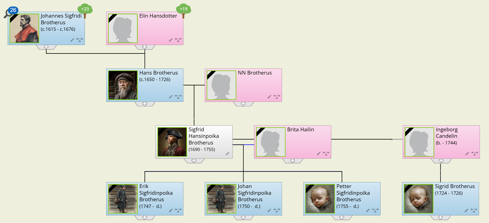

[**Sigfrid Hansinpoika Brotherus**](https://www.geni.com/family-tree/index/6000000197915429849) palveli varusmestarina samassa rykmentissä kuin serkkunsa Abraham kersanttina, ja hänet vapautettiin palvaluksesta miltei samana päivänäkin, mutta hän palasi Mikkeliin ja meni siellä naimisiin [**Ingeborg Candelinin**](https://www.geni.com/people/Ingeborg-Candelin/6000000197941906841) kanssa. Tästä avioliitosta syntyi poika Sigfrid, joka kuitenkin kuoli jo kaksi ja puoli vuotiaana. Kun myöskin Ingeborg myöhemmin kuoli, meni Sigfrid uudestaan naimisiin [**Brita Hailin**](https://www.geni.com/people/Brita-Hailin/6000000197942194822) kanssa, ja tästä avioliitosta syntyi kolme poikaa: Erik v. 1747, Johan v. 1750 ja Petter v. 1755.

Samana vuonna kun Petter syntyi, kuoli Sigfrid Brotherus ja oli kuollessaan 65 vuoden ikäinen. Petter oli tuolloin vain kolmen kuukauden ikäinen. Leski Brita muutti Mikkelistä Helsinkiin helmikuun 6 päivänä 1757, mutta hänestä ei ole löytynyt Helsingin kirkonkirjoista merkintää, ei liioin pojista, jotka seurasivat äitiään. Matkustaminen Mikkelistä Helsinkiin keskellä talvea on ollut tuollaiselle perheelle ehkä ylivoimainen tehtävä, ja matka siksi tavalla tai toisella keskeytynyt.

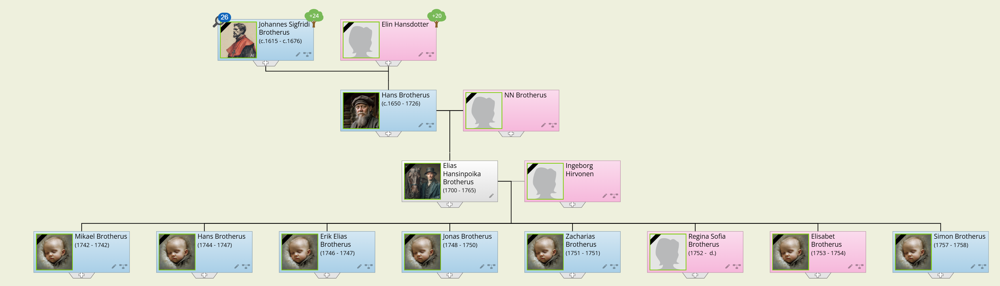

[**Elias Hansinpoika Brotherus**](https://www.geni.com/people/Elias-Brotherus/6000000197915386833) katoaa näköpiiristämme vuosikymmeniksi, ja kun lopulta tapaamme hänet Pietarista, hän on jo 42 vuoden ikäinen. Hän on ammatiltaan palvelija - mm. eräässä vaiheessa arkkitehti Tressinin kuski - ja on **Ingeborg Hirvosen** kanssa saanut pojan syyskuun 5 päivänä 1742. Poika saa nimen Mikael, ja kuolee jo lokakuun 23 päivänä samana vuonna. Elias ja Ingeborg vihitään avioliittoon kesäkuun 12 päivänä 1743.

Miten Elias sitten on saattanut joutua Pietariin, ja vielä niin heikkoon asemaan, kuin missä hänet löydämme? Kaksi mahdollisuutta näyttää muita todennäköisemmiltä. Hän on saattanut 15 vuotta täytettyään joutua sotapalvelukseen, ja sodan kestäessä venäläisten vangiksi. Vapauduttuaan hän on löytänyt Pietarista suomalaisia ystäviä ja jäänyt sinne sen enempää suunnittelematta.

Todennäköisemmältä kuitenkin tuntuu, että kun sodasta palannut veli Sigfrid saa naimisiin mentyään ja isä Hansin kuoltua v. 1726 kotitilan, jää Elias vaille kiinteää toimeentuloa. Mikään ei sido häntä Mikkeliin, ja niinpä hän monen muun tavoin lähtee hakemaan onneaan alati kasvavasta suurkaupungista, Pietarista. Mitään koulutusta saamattomana ja ehkä muutoinkin hieman saamattomana hän sitten päätyy kaikkein halpa-arvoisimpiin töihin.

Avioliitossaan saavat Elias ja Ingeborg Brotherus Mikaelin lisäksi vielä seitsemän lasta, joista kuitenkin kuusi kuolee alle kolmen vuoden ikäisinä ja seitsemännenkin Regina Sofian kohtalo jää tuntemattomaksi.

Uudenvuodenpäivänä 1765 Elias Brotherus murhataan! Hän on tuolloin 65-vuotias, siis olosuhteet huomioonottaen suhteellisen iäkäs mies. Ingeborgin kohtalota ei ole tietoa.

Ei siis mitään äkkinäistä katastrofia niinkuin Iisalmen erämaassa, hiljaista nakertavaa kurjuutta vain. Miksi näin? Kotoaan ei Elias ilmeisesti saanut riittävästi virikkeitä tietojen tai taitojen hankkimiseen, ja sota-aika, joka kattoi hänen nuoruutensa päivät, ei myöskään siihen juuri innoittanut. Pietari taas oli suurkaupunki jo silloin, ja siellä kulkevat loisto ja kurjuus käsi kädessä. Kuin peilikuvat ne hakevat toisiaan. Myös väkivalta ja levottomuus kasvavat siellä, missä ihmiset tungetaan liian ahtaalle taistelemaan paikasta auringossa, ja matalalle jokisuistolle rakennetussa Pietarissa tunkeutuvat talven kosteat, jäätävät viimat köyhien hatariin asumuksiin.

## 7. Elämää vanhassa Suomessa

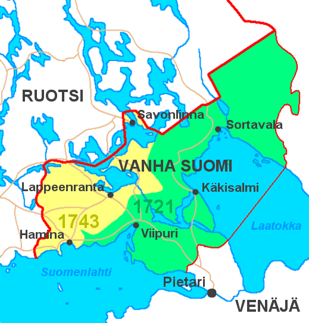

Ennen kuin ryhdyn kertomaan Sinulle esi-sedistäsi ja esi-isistäsi, on syytä koettaa kuvata niitä olosuhteita, jotka vallitsivat niin kutsutussa ["Vanhassa Suomessa"](https://fi.wikipedia.org/wiki/Vanha_Suomi), sillä ne olivat varsin poikkeavat muusta Suomesta. Vanhalla Suomella tarkoitetaan niitä alueita, jotka Ison Vihan ja Pikkuvihan seurauksena liitettiin Venäjään 1721 ja 1743, ja jotka sitten tsaari Aleksanteri I:n toimesta vuonna 1811 liitettiin Suomen suuriruhtinaskuntaan. Siis alueita, joilla ikimuistoisista ajoista alkaen oli asunut ja asui edelleen valtaosaltaan suomalaista väestöä. Aluksi joitakin piirteitä Suomen kaikkein omaleimaisimman ja mielenkiintoisimman kaupungin, Viipurin, vaiheista.

Saimaan vedet eivät aina ole laskeneet Laatokkaan, niin kuin nyt, vaan vielä keskiajalla laski eräs Vuoksen sivuhaaroista Suomenveden-pohjaan, ja sen suulla, entisen Monrepos'n tai Pikiruukin paikalla on uplantilaisen, 1000-luvulta peräisin olevan riimukiven maininnan mukaan sijainnut linnoitus, missä viikingit idänretkillänsä ovat pysähtyneet uhraamaan matkansa onneksi tai kiitokseksi onnellisesta paluusta. Siihen viittaa kaupungin nimikin: *vi* = uhripaikka, *borg* = linna.

Nykyinen Viipurin linna rakennettiin 1200-luvun lopulla Ruotsin itään suuntautuneen laajentumispolitiikan tueksi sekä idän kauppatien turvaksi, ja ennen pitkää sen suojiin kasvoi porvariasutus. Olihan Viipurin sijainti kauppiaan kannalta erinomainen idän merkittävän kauppatien suulla ja Vuoksen yhdistäessä sen voimakkaasti kasvavaan savolaisasutukseen sisämaassa. Myös lähiympäristön karjalais-asutus on jo silloin ollut vakiintunut ja verraten taaja. Niinpä Viipuri sai kaupunkioikeudet v. 1403, ja samoihin aikoihin sen kuvaa elävöittämään tuli vielä kaksi luostariakin, dominikaanien ja fransiskaanien.

Kauppaa käytiin idässä Narvaan, Pihkovaan ja Novgorodiin, ja lännessä Tallinnan ja Tukholman ohella hansakaupunkeihin Danzigiin ja Lyypekkiin sekä Flanderiinkin saakka. Hansa-liitolla oli Viipurissa suuri vaikutusvalta, ja kaupungin porvaristo oli pääosaltaan saksalaista. Se loi kaupungin hallinnolliset tavat ja perinteet.

Kaupungin ohella Viipuri oli kuitenkin, ja ennen kaikkea, myös rajalinnoitus. Viipurin linna ja kaupunki joutuivat venäläisten piiritykseen vuosina 1351, 1411, 1555, 1556, 1572 ja 1592, mutta valtausyritykset torjuttiin joka kerta. Linnassa oli 1500-luvulla 600-800 miehen suuruinen varuskunta, mutta sen lisäksi joutuivat kaupungin porvaritkin osallistumaan kaupungin puolustukseen. Tämä sotainen asema ilmeisesti jarrutti kaupungin kasvua, sillä kun sen asukasluku jo keskiajalla oli noussut noin 1300:aan, oli se kaupallisesta merkityksestään huolimatta vuonna 1600 vain noin 1600 edelleen.

Stolbovan rauha 1617 vapautti Viipurin lähes sadan vuoden ajaksi rajalinnoituksen asemasta. Nopeasti kasvoi sen väkilukukin yli kaksin- kertaiseksi, niin että se 1650 oli jo noin 3500 - kolme kertaa suurempi kuin 1550 perustetun Helsingin kaupungin asukasmäärä. Saksalaiset ja hollantilaiset porvarissuvut nousivat jälleen yhdessä ruotsalaisten sukujen kanssa johtavaan asemaan. Lukumääräisestä enemmistöstään huolimatta joutuivat suomalaiset porvarissuvut kunnalliselämässä syrjään vähävaraisempina, vaikka olivatkin vielä sotaisella 1500-luvulla joskus olleet näkyvässä asemassa. Varuskuntakaupunki muuttui kauppakaupungiksi, sen linnoituslaitteet rapistuivat ja varusväkikin supistui korpraalin johtamaksi 24:ksi mieheksi. Suuret nälkävuodet 1600-luvun lopussa koettelivat ankarasti Viipuriakin, niin että sen väkiluku uudelle vuosisadalle tultaessa oli laskenut jälleen noin 2200:aan.

Suuri Pohjansota, jota Suomessa kutsuttiin Isoksi Vihaksi, muutti Viipurin jälleen rajalinnaksi, kun tsaari Pietarin joukot valloittivat ja tuhosivat Nevanlinnan v. 1703. Kiireesti paranneltiin linnoituslaitteita, ja sotilaalliseksi johtajaksi saatu majuri organisoi komppanian puolustusväkeä kaupungin porvareista. Ensimmäinen piiritys v. 1706 saatiin torjutuksi, mutta kesäkuun 13 päivänä 1710 joutui kaupunki antautumaan 12 viikkoa kestäneen piirityksen jälkeen. **J. W. Ruth** kuvaa kirjassaan "Viipurin kaupungin historia" tilannetta piirityksen ja valloituksen jälkeen näin:

> Kun asukkaat vihdoin piirityksen jälkeen uskalsivat astua esiin maanalaisista lymyistään, kohtasi heitä kauhea hävityksen näky. Tuomiokirkko, tuo pyhä rakennus, minkä rauhallisten holvien alla monet sukupolvet heidän esi-isiään lepäsivät, oli nyt kokonaan raunioina, niin ettei kukaan rohjennut ajatellakaan sen uudestaan rakentamista. Huone, jonka rakentamien aikoinaan oli ottanut yhden sukupolven työn, seisoi rikki-ammuttuna tyhjine ikkuna-aukkoineen niin kuin haamu edellisistä ajoista. Entäpä jokaisen omat kodit ja talot. Kaikkialla seisoivat kivikartanot kammottavine aukkoineen seinissä ja katotta. Monessa paikassa oli muuri hajonnut ja vierinyt kadulle, peittäen sen laajalti soralla ja tiilikivillä. Puurakennukset olivat suurimmaksi osaksi palaneet: varsinkin näkyy Vallin kaupunginosa muuttuneen kokonaan autioksi täynnä tuhkaläjiä ja mustia kekäleitä. Mitä oli jäljellä Siikaniemen kukoistavasta esikaupungista, oli vieraitten vallassa ja Panssarlahdesta ei löytynyt jälkeäkään.

### Oikeuskomissaari Erik Johan Brotterus Viipurissa

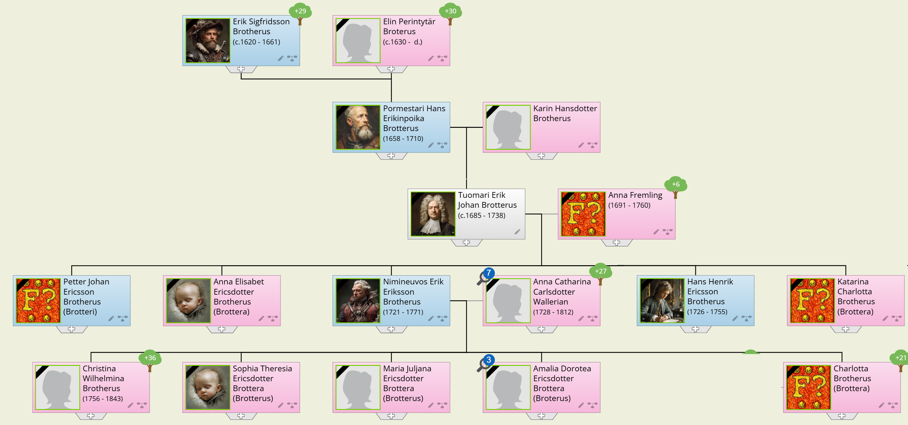

Osallistuiko Viipurin silloinen kauppapormestari [**Hans Brotterus**](https://www.geni.com/profile/index/6000000007588047213) poikineen kaupungin puolustamiseen, ei ole tiedossa. Todennäköiseltä kuitenkin näyttää, että hän sekä 25-vuotias Erik Johan ja 10-vuotias Karl ovat aktiivisesti olleet mukana. Karl-poika joutuu valtauksessa vangiksi, ja kun isä-Hansin kohdalla on merkintä, että hänet on elo-syyskuussa 1710 haudattu Viipurissa, saattaa se hyvinkin merkitä sitä, että hän on kuollut valtauksen yhteydessä saamiinsa haavoihin. Mahdollista on myös että hän sortui ruttoon, joka tuona vuonna koetteli Suomen kaupunkeja. Kuollessaan Hans Brotterus oli noin 52 vuoden ikäinen.

Erik Johan Brotterus oli Viipurin valloituksen aikaan kaupungin virassa, notaarina. Hän oli opiskellut Turun yliopistossa, missä hän muuten suvun alkuperäistä mallia noudattaen oli kirjoittanut nimensä h:lla: Brotherus.

Kun Viipurin kaupunki ja sen "takamaat" Viipurin ja Käkisalmen läänit olivat joutuneet venäläisen sotaväen haltuun, oli näille alueille sodan yhä jatkuessa järjestettävä jonkinlainen hallinto ja järjestys, mikä tuli miehitysjoukkojen johdon huoleksi. Hallintoa ja järjestystä toimeenpanemaan tarvittiin henkilöitä, joilla olisi riittävä koulutus, paikallisten olojen tuntemus sekä taito ymmärtää ja ilmaista itsensä asukkaiden kielellä. Miehitysajalta ennen Uudenkaupungin rauhaa v. 1721 ei ole tietoa siitä, millä toimilla Erik Johan hankki toimeentulonsa. Mutta kun hän v. 1717 on uskaltanut solmia avioliiton neito **Anna Fremlingin** kanssa, on hänellä silloin täytynyt olla ainakin tieto luotettavasta tulolähteestä. Erik Johanin nuori vaimo oli huomattavasta perheestä, v. 1705 kuolleen Viipurin oikeuspormestarin **Petter Fremlingin** tytär.

Tiedämme, että Erik Johan on toiminut rajakomissaarina vuoteen 1729 saakka, saanut oikeuskollegiolta 1724 ja senaatilta 1725 valtakirjan Käkisalmen läänin oikeuskomissaariksi (kihlakunnan tuomari) sekä "myöhemmin hoitanut samaa tointa Viipurin läänissä". Kun toisaalta ei ole tiedossa, että kukaan toinen olisi Viipurin valtauksen ja muun maakunnan miehityksen jälkeen ennen häntä hoitanut näitä tehtäviä, on sangen luultavaa, että ne ovat olleet hänen vastuullaan miehitysviranomaisten toimeksiannosta jo melko pian miehityksen tapahduttua, ellei sitten alussa Viipurin raastuvanoikeuden toiminta-aluetta ole tilapäisesti laajennettu.

Erik Johan oli suorittanut lainopin opintonsa Turun yliopistossa perehtyen siellä sekä myöhemmin myös käytännössä ruotsalaiseen oikeuskäytäntöön, mihin myös paikallinen asujaimisto oli tottunut. Näin ollen oli luonnollista, että hän oikeudenkäytössään noudatti sitä. Tässä hän kohtasi vaikeuksia, joista ensimmäisiä oli ylemmän oikeusasteen eli valitusasteen puuttuminen. Luottamus oikeudenkäyttöön, jopa tuomioiden täytäntöönpanomahdollisuuskin edellyttää sitä, että tuomarilla on tukenaan valtakunnan hallitsijan arvovalta. Tämä merkitsee sitä, että tuomiosta voidaan vedota hallitsijaan tai hänen valtuuksillaan toimivaan tuomioistuimeen, joka noudattaa samaa oikeusjärjestelmää kuin alioikeuskin. Tämä puuttui.

Uudenkaupungin rauhassa v. 1721 oli Baltian maille taattu vanhan ruotsalaisen oikeusjärjestyksen säilyttäminen, mutta Suomesta erotetut alueet, Viipurin ja Käkisalmen läänit asukkaineen oli tässä sopimuksessa unohdettu. Tilanne korjaantui lopulta, kun täällä suoritettavaa verotuksen tarkistamista valmistelemaan oli 1728 määrätty balttilainen **Anton von Saltza** ja entinen kamreeri **Johan Schmidt**, ja heidän apulaisekseen vuosina 1729-30 määrättiin **Johan Brotterus**. Tämä komitea sai vakiinnutetuksi Ruotsin-aikaisen verotus- ja hallintojärjestelmän, sekä sen lisäksi aikaan sen, että heinäkuussa 1735 Senaatti määräsi, että myös "Viipurin maakunta" oli oleva vasta perustetun saksankielisen ylemmän tuomioistuimen, "Reichs-Justiz-Collegium zur Abhelfung derer Lieff- und Estländischen Sachen", alaisena valitus- ja muutoksenhakuasioissa. Tämä oikeuskollegio nojautui vanhaan ruotsalaiseen oikeusjärjestykseen. Jo lokakuussa samana vuonna kiirehtii Erik Johan kääntymään kirjeellä tämän oikeuskollegion puoleen:

> Osoitan Keisarilliselle Oikeus-kollegiolle alamaisen pyyntöni, ettei kukaan Viipurin provinssissa oleskelevista korkean Kauppakollegion palvelijoista tai lahjoitus-maiden hoitajista rohjetko toimia tai yrittää toimia minun alhaisena oikeusasteena rikos- tai siviiliasioissa maassa vallitsevan lain mukaan antamieni ratkaisujen viivyttämiseksi, muuttamiseksi tai mitätöimiseksi ja siten estää minua laillisesti jakamasta oikeutta entisessä järjestyksessä. Vaan mikäli hävinneellä riitapuolella on toinen käsitys oikeudestaan kuin mikä ilmenee oikeuden päätöksestä, voi hän sen jälkeen välillisesti ja hakemalla muutosta pätevän oikeuden päätökseen saattaa määräajan kuluessa muistutuksensa tutkittavaksi Keisarilliseen Oikeuskollegioon Viron ja Liivinmaan asioita varten.

Jo heti Viipurin ja Käkisalmen läänien valtauksen jälkeen 1710 tsaari Pietari alkoi antaa lahjoitusmaita sotapäälliköilleen ja muille ansioituneille virkamiehilleen. Osa lahjoitusmaista peruutettiin kruunun etujen vuoksi 1720, mutta niiden antamista jatkettiin saman vuosikymmenen loppupuoliskolla, ja ulotettiin 1740 muun Suomen yhteyteen. Kun Vanha Suomi 1811 liitettiin luvulla myös Turun rauhassa saadulle alueelle, oli sen alueella lahjoitusmaina 2500 tilaa, ja 60 000 talonpoikaa lahjoitusmaatalonpojan asemassa.

Alunperin oli tarkoitus, että lahjoitusmaan saaja, donataari, sai vain tilojen kruunulle menevät verot, e. m. 1728 suoritetun verorevision tarkoituksena oli rajoittaa asukkaiden verot pysyviksi. Venäläisen oikeusjärjestelmän vaikutuksesta tämä tarkoitus kuitenkin tsaari Pietarin jälkeen hämärtyi, ja syntyi pyrkimys jäljitellä Venäjän ja Puolan maaorjuus alueiden järjestelmää. Niinpä v. 1734 kreivi Soltykov sai "ikuiseksi ja perinnölliseksi omaisuudeksi" Pyhäjärveltä 110 tilan maat "asukkaineen ja talonpoikineen". 1790-luvun asiakirjat taas puhuivat "sieluista" ja "miespuolisista sieluista", mikä siis sisälsi omistusoikeuden myös maan asukkaisiin. Donataareille syntyi näin oikeus, tai ainakin mahdollisuus maan entisten omistajien mielivaltaiseen verotukseen, heidän estämiseensä muuttaa muualle, kuin myös rankaisemiseen niskuroinnista. Vapaaehtoisesti eivät talonpojat suinkaan tähän alistuneet, mutta heidän vastarintansa ei tuottanut menestystä, ja niinpä tsaari Aleksanteri I totesi v. 1802, että Vanha Suomi oli miltei yhtä kurjassa tilassa kuin Ison Vihan jälkeen.

Sen jälkeen kun Vanha Suomi oli yhdistetty muuhun Suomeen yritettiin v. 1817 saada asioihin järjestystä, mutta donataarien ja heidän tukijoidensa takia ei aiottua muutosta onnistuttu toimeenpanemaan. Kun talonpojat v. 1826 kieltäytyivät maksamasta uusia kohtuuttomaksi katsomiaan veroja, syntyi verisiä mellakoita, joita tukahduttamaan tarvittiin sotaväkeä, ja v. 1838 donataarit saivat oikeuden käyttää myös raipparangaistusta. Vasta 1867 säädyt hyväksyvät 12 000 000 markan valtiolainan ottamisen lahjoitusmaiden lunastamiseen. Muutamia lahjoitusmaita oli jo yksityisesti lunastettu, mutta vuodesta 1871 tiloja alettiin lunastaa valtion lainoilla, ja kahdessa vuosikymmenessä lunastukset oli loppuun suoritettu niin että talonpojat viimeinkin saivat perintökirjat omille tiloilleen. Näin lahjoitusmaaorjuus oli torjuttu ja vapaus saavutettu muun Suomen tuella juuri niin ajoissa, että yksi sukupolvi oli ennättänyt kasvaa vapaalla maaperällä maamme itsenäistyessä.

Erik Johan Brotteruksen edellä olevasta kirjeestä näkyy, että suurimmat vaikeudet oikeudenhoidossa muodostivat Kauppakollegion palvelijat ja lahjoitusmaiden hoitajat. Mutta vaikeudet eivät olleet vain henkisellä tasolla. Käräjämatkat olivat monet, pitkät ja hankalat. Matkustamisen hankaluutta noihin aikoihin ja kauan jälkeenpäinkin kuvaa hyvin se, kuinka Räisälän hovin haltija **Jakob Tiessen** haastettuna Käkisalmen käräjiin marraskuulla 1777 anoo jutun lykkäämistä: "*koska tähän vuodenaikaan on tunnetusti mahdotonta ilman hengenvaaraa matkustaa Räisälästä Käkisalmeen virtojen, koskien, ylitsepääsemättömien vuorien ja laajojen soiden poikki*". Ja kuitenkin Räisälästä Käkisalmeen on vain noin 25 kilometrin matka. Eräällä käräjämatkalla Erik Johan Brotterus tapaa kohtalonsa kotimatkalla Kärstilään elokuun 17 päivänä 1738. Ruotsintaipaleen kylän kohdalla hän putoaa hevosen selästä, ja hänen ohimonsa murskautuu kivien välissä niin pahoin että hän kuolee.

### Nimineuvos Erik Eriksson Brotterus

Kun Erik Johan Brotterus vasta 52 vuotta täytettyään tapaturmaisesti kuolee, jää Anna Brotterus leskeksi kolmen alaikäisen lapsen kanssa. Lapsia on kaikkiaan syntynyt perheeseen seitsemän, mutta kolme on kuollut ennen isän kuolemaa, ja vanhin, 20 täyttänyt Petter Johan on jo jättänyt yhteisen kodin. Kotiin jääneistä lapsista on vanhin 17-vuotias [**Erik Eriksson Brotterus**](https://www.geni.com/profile/index/6000000002497681094). Seuraava järjestyksessä, Hans Henrik, on 12 ja nuorin, Charlotta kymmenen vuoden ikäinen. Perhe jää taloudellisesti ahtaaseen asemaan. Sen ahdinkoa kuvannee se, että Erik joutuu lainaamaan tulevalta apeltaan rahaa vihkisormuksen ostoon solmiessaan avioliiton **Anna Katarina Wallerianin** kanssa. Erik Johan on ollut tunnollinen oikeuden palvelija, eikä ole onnistunut ponnisteluistaan huolimatta turvaamaan perheensä toimeentuloa äkillisen ja yllättävän poismenonsa varalta.

Ankeat ajat ovat edessä "Viipurin provinssin" asukkailla, kun Pikkuvihan mainingit lyövät yli maan 1741-42. Hävitystä kylvävät sekä ruotsalaisten partioretket että maakunnan läpi marssivat venäläiset sotajoukot. Vasta 20 vuotta on maakunta kuulunut Venäjän valtakuntaan, ja epäluuloa sen asukkaita kohtaan tuntevat venäläiset kohtelevat heitä kuin vihollista. Erikoisesti hyökätessään Lappeenrantaan ja sieltä palatessaan ryöstävät ja polttavat sotajoukot kyliä ja taloja. Maakunnan väkiluku laskee tuntuvasti, mm. Viipurin kaupungissa 1300:aan, lukuun missä se oli viimeksi ollut keskiajalla, noin kolmesataa vuotta aikaisemmin.

Erik ja Anna Katarina Brotteruksen elämässä alkaa käänne valoisampaan suuntaan kun Erik pian avioliiton solmimisen jälkeen saa nimityksen maakomissaariksi Käkisalmen lääniin. Maakomissaarin tehtäviin kuuluu veronkanto ja ulosmittaukset, hän on nimismiehen esimies ja toimii joskus itsekin syyttäjänä, esiintyy häätöjutuissa, katselmuksissa, kaikenlaisissa kielloissa ja sopimusten teossa sekä antaa lausuntoja erilaisissa toimialaansa kuuluvissa asioissa. Virka vastaa suunnilleen nykyistä kruununvoudin virkaa, ulkonaiset olosuhteet vain ovat toiset.

Maakomissaarina ollessaan Erik Brotterus alkaa kerätä itselleen huomattavaa omaisuutta. Lieneekö sitten luontainen toimeliaisuus vai köyhän nuoruuden muisto vaikuttanut siihen, että ainakin näin kaukaa katsoen, näyttää siltä kuin omaisuuden kokoaminen olisi muodostunut hänelle suoranaiseksi himoksi, joka viimein nielee hänet kokonaan.

Saatuaan nimityksen maakomissaariksi Erik nuorikkoineen hankkii itselleen ensimmäisen kodin Härskiänsaaresta, mutta huomaa pian että varsinkin kelirikon aikaan tällainen asuinpaikka ei hänelle sovi. Vuonna 1747 hän vuokraa itselleen keskeisellä paikalla sijaitsevan Räisälän hovin, jonka rakennukset ovat tuhoutuneet, ja rakennuttaa tuota pikaa paitsi asuinrakennusta myös kaikki maatalouden pitoon tarvittavat rakennukset ryhtyen virkansa ohella harjoittamaan maataloutta. Tärkeätä osaa rakennusten joukossa esitti saunan yhteyteen rakennettu viinanpolttimo, missä myös pantiin olutta. Talossa pidettiin kapakkaa, missä niin käräjärahvas kuin kirkonkävijäkin sai suunsa kosteaksi ja mielensä huolettomaksi Anna Katarinan tarjoillessa talon tuotteita. Tämä lienee ollut ensimmäinen siemen varallisuuden kasvuun.

Veronkantajana ja ulosmittaajana Erik Brotterus pääsee pian selville toimialueensa varallisuussuhteista, ja niinpä kun vuokranantaja jo viiden vuoden vuokra-ajan kuluttua haluaa purkaa vuokrasopimuksen - olihan Erik Brotterus rakentanut tilalle mainiot maatilarakennukset - ostaa Erik lähistöltä toisen tilan liittäen siihen vähitellen edullisesti saamiaan muitakin tiloja. Viinanpolttoa ja kapakanpitoa Erik jatkaa edelleen.

Erikin isällä, Erik Johan Brotteruksella, oli ollut harmia lahjoitusmaiden hoitajista, jotka halusivat asettua maassa noudatettavien lakien yläpuolelle. Myöskin Erik joutui tällaisen lahjoitusmaanhoitajan kanssa vastakkain saaden tarmokkaan kihlakunnan tuomarin ja ystävänsä **Peter Pomoellin** avulla ja Oikeuskollegion tuella lahjoitusmaanhoitajan lopulta tuomituksi pitkän ja vaiheikkaan oikeudenkäynnin jälkeen.

Toimittuaan toistakymmentä vuotta maakomissaarina Erik Brotterus saa 1758 ylennyksen Käkisalmen läänin lääninrahastonhoitajaksi ja samalla kertaa nimineuvoksen arvonimen. Lääninrahasto sijaitsi läänin "pääkaupungissa" Käkisalmessa, minne Erik perheineen joutuu muuttamaan. Ennen muuttoaan hän myy taitavalla pöytäkirjalla, jonka laatimisessa hänellä ilmeisesti on ollut apuna ystävänsä kihlakunnantuomari Peter Pomoell, kaikki Räisälässä hankkimansa tilukset - kauppa, josta riitti käräjöimistä useaksi vuodeksi.

Käkisalmen linna, vanha "Korela", oli vuosisatojen kuluessa monesti vaihtanut omistajaa, ja sen liepeille versonnut kaupunki kerta kerran jälkeen tuhoutunut. Ison Vihan aikana tuhoutui kaupunki niin perusteellisesti, että vielä 1740-luvulle tultaessa sen asukasluku oli vain 45 henkeä - tietenkin linnoitusalueella olevaa venäläistä varusväkeä lukuun ottamatta. Venäläiset olivat pitäneet linnoitusta hallussaan sen valtauksesta 1710 lähtien. Erik Brotteruksen muuttaessa perheineen kaupunkiin, oli sen väkiluku (porvareita ja kalastajia) noussut jo kahteensataan. Mikään varsinainen kaupunki se ei kuitenkaan ollut, sillä kun ei ollut omaa raastuvanoikeutta ja maistraattiakaan. Se kuului Räisälän ja Kaukolan pitäjien käräjäkuntaan.

Tavallisella kaupungin porvarilla ei ollut oikeutta asettua asumaan sotaväen varuskunta-alueelle, mutta siellä sijaitsi lääninrahasto, ja sinne rakennutti Erik Brotterus myös tilavan talonsa virkansa puolesta. Tilavaa asuntoa tarvittiinkin, sillä Anna Katarina ja Erik olivat Räisälässä saaneet seitsemän lasta, joista viisi oli elossa, ja Käkisalmessa syntyy vielä kuusi vuosien 1760-1767 välillä. Näistä kolme kuolee pienenä.

Erik Brotterus on levoton sielu, jolle viran hoitaminen ei yksin riitä. Lieneekö Räisälä hovi jäänyt hänen mieleensä onnellisten mahdollisuuksien maana, sillä jo 1759 hän on hankkinut sen hallintaoikeuden itselleen ja ryhtynyt tarmolla viljelemään sitä.

Hän ottaa uusia torppareita, tekee raivaussopimuksia ja palkkaa työväkeä karjatalouteen. Saadakseen halpaa työväkeä hän tekee 1761 matkan Liivinmaalle, ja ostaa sieltä viisi maaorjaa, hinta 160 ruplaa! Tämä kauppa ei kuitenkaan kannata, sillä jo samana vuonna orjat karkaavat suomalaisten naapurien heitä piilotellessa. Nimineuvos oli tarmokkuudessaan mennyt liian pitkälle ja unohtanut, että maaorjuus kyllä oli mahdollinen venäläisen, vaan ei ruotsalaisen oikeusjärjestyksen mukaan. Ja kuitenkin hän vain 12 vuotta aikaisemmin oli puolustanut suomalaisia talonpoikia lahjoitusmaanhoitajan mielivaltaa vastaan!

Toimeliaisuudessaan Erik laiminlyö vaimonsa, joka jatkuvien lapsi-vuoteiden takia on sidottu Käkisalmeen eikä voi seurata miestään tämän matkoilla. Venäläinen varuskunta Käkisalmessa on huomattava, ja sen upseeristo suurelta osin balttilaista, jotkut jopa luterilaisia. Nimineuvos Brotteruksen talo on tilava ja vieraanvarainen, ja sen emäntä ikävuosistaan ja suuresta lapsiluvustaan huolimatta verevä ja elämänhaluinen. Syksyllä 1766 varuskuntaan tulee nuori kornetti, josta tulee Anna Katarinan kohtalo. Heidän välilleen syntyy hehkuva suhde, joka tosin päättyy kornetin kadotessa näyttämöltä, mutta ennättää perinpohjaisesti rikkoa aviopuolisoiden välit saattaen heidät kolme vuotta kestävään avioero-oikeudenkäyntiin. Oikeudenkäynnin aikana Anna Katarina katoaa, ja häntä etsitään kaikkialta kunnes lopulta tulee raportti: löydetty kuolleena, murhattuna maantiellä lähellä Pihkovan kaupunkia Puolan rajalla. Tiedonanto on allekirjoitettu Viipurissa marraskuun 1 päivänä 1770.

Viimeiset merkinnät nimineuvos Brotteruksesta itsestään ovat hänen seuraavan helmikuun 5 päivänä päiväämänsä kirje, joka liittyy eräästä puutavaran ostosta annettuun 78 ruplan suuruiseen maksuosoitukseen, sekä maaliskuun 16 päivänä 1771 kihlakunnanoikeuden pöytäkirjaan tehty merkintä, että nimineuvos ja lääninrahastonhoitaja Erik Brotteruksen kuoleman jälkeen maakomissaari Tavast oli vainajan tileissä ilmenneen vajauksen johdosta luetteloinut hänen jälkeensä jättämän omaisuuden. Erik Brotterus oli kuollessaan 50 vuoden ikäinen.

### Isak Gottfrid Brotherus, lasitehtaan isännöitsijä

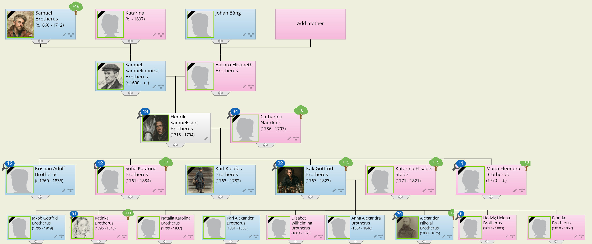

Muistanet varmaan Henrik Brotheruksen, joka oltuaan Kymenkartanon läänin käskynhaltijan Johan Karl Natt och Dagin lakeijana ja kartanonvoutina pääsi rajaratsastajaksi juuri joulun alla vuonna 1749. Rajaratsastajana ollessaan hän asui ensin Savonlinnassa, mutta muutti 1754 Kerimäelle, missä hän oli ollut kartanonvoutina Moisundin kartanossa ennen nimitystään rajaratsastajaksi. Voutina ollessaan Henrik ilmeisesti oli tutustunut Kerimäen nimismieheen, **Daniel Scheiningiin**, ja ennen kaikkea hänen viehättävään tyttärentyttäreensä, 12-vuotiaaseen Katarinaan, joka oli naapuripitäjän, Säämingin, nimismiehen **Elias Nauklerin** ja tämän vaimon **Katarina Scheiningin** tytär. Tämä tuttavuus johtikin 1753 avioliittoon Henrikin ollessa tuolloin 35 ja Katarinan 17 vuoden ikäinen. Vihkiminen tapahtui Kerimäellä, minne nuoripari sitten asettui asumaan. Noin kymmenen vuotta myöhemmin isoisä Daniel Scheining kuoli jättäen tyttären-tyttärensä miehelle perinnöksi sekä puolet omistamastaan Kupialan ratsutilasta että virkansa, sillä Henrik nimitettiin hänen jälkeensä Kerimäen nimismieheksi kesäkuun lopusta 1765 alkaen.

Kaikesta päättäen Henrik ja Katarina ovat luoneet onnellisen perheen. Heille syntyi kaikkiaan kahdeksan lasta, joista puolet saavutti aikuisen iän. Vanhempi pojista, **Kristian Adolf Brotherus**, jäi asumaan kotiseudulleen. Hänestä tuli aikanaan Säämingin nimismies, ja hän sai kollegireistraattorin arvonimenkin. Tyttäristä vanhempi meni naimisiin Lappeenrannan kaupunginsihteerin kanssa muuttaen asumaan Lappeenrantaan. Nuoremmat lapset taas, **Isak Gottfrid Brotherus** ja **Maria Eleonora Brotherus** muuttivat 1792 Karjalan Kannakselle, Johanneksen pitäjässä olevan Kukkolan eli Rokkolan lasitehtaan palvelukseen. Kuollessaan 1794 oli Henrik Brotherus 76 vuoden ikäinen, ja vaimonsa Katarina kuoli kolme vuotta myöhemmin 1797 täytettyään 61 vuotta.

Kaksi sotaa oli hävittäen vyörynyt Karjalan kannaksen yli, ja kahden sukupolven ajaksi suurten sotavuosien alkamisesta lukien olivat sen asukkaat jääneet kaiken muun yhteiskunnan huolenpidon ulkopuolelle,  niin että käytännöllisesti katsoen ainoa ulkopuolinen viranomainen, joka heitä muisti oli veroviranomainen. Rauhanteossa oli entinen hallitsija täysin unohtanut heidän tulevaisuudestaan huolehtimisen, ja uudelle ruhtinaalle he olivat vierasta rajakansaa, jonka luotettavuutta saattoi epäillä. Heidän asumansa alue oli rajamaata vihamielistä valtakuntaa vastassa, jota sinne sijoitetut sotavoimat käsittelivät kuin omaansa entisistä omistajista täysin piittaamatta. Viipurin linnaa vahvistettiin ja uusia linnoituslaitteita rakennettiin, mutta sen asukasluku ei noussut, vaan oli vuosisadan puolivälissä edelleen vain noin 1300 henkeä, sama kuin Pikkuvihan jälkeen sata vuotta aikaisemmin. Sota oli hävittänyt Viipurin lähettyville orastaneen teollisuuden, Juvankosken ja Huppoisten rautaruukit, ja Uudenkaupungin rauhassa piiritetty raja oli katkaissut tien Viipurin entisen varallisuuden lähteille, tervan ja turkiksien Savoon. Hallituksen ajatukset eivät riittäneet uusien alamaisten huoliin, vaan sen huomio oli täysin kiinnittynyt uuden pääkaupungin, Pietarin, rakentamiseen ja sen turvallisuuden sotilaalliseen vahvistamiseen. Vasta vuosisadan lopulla tuli aika kiinnittää huomiota myös rajan asukkaiden tarpeisiin ja mahdollisuuksiin, ja talous alkoi hitaasti elpyä, kun Venäjän talouspolitiikka ja Pietarin jatkuva rakentaminen teki kannattavaksi perustaa sahoja.

Myöskin lasiteollisuutta syntyi Karjalan kannaksella, valtakunnan alati kasvavan pääkaupungin läheisyyden ansiosta. Menekki oli taattu, kuljetusmatka lyhyt, ja metsää riitti suuren lämmitystarpeen tyydyttämiseen. Metsästä tuli näin Vanhan Suomen elpymisen ensimmäinen voimanlähde.

Kun kantasuomessa virkakielenä ja kaupan pääasiallisena kielenä oli ruotsi, niin Vanhassa Suomessa se oli muuttunut saksankieleksi. Oikeuden pöytäkirjoissahan se oli aivan luonnollista jo senkin vuoksi, että valitusasteena alioikeuksien päätöksiin oli balttilainen Oikeuskollegio, ja Viipurissa oli jo vanhoilta ajoilta ollut vahva saksalaisten hansakauppiaiden vaikutus. Kun tsaari Pietari myös suosi saksalaisia käsityöläisiä ja yrittäjiä saadakseen vanhoillisen ja takapajuisen maansa nostetuksi eurooppalaiselle tasolle, oli luonnollista että tämä heijastui myös Vanhan Suomen oloihin. Niinpä Viipurissakin saksalainen vaikutus porvaristossa lisääntyi voimakkaasti, ruotsalainen väheni, ja vaikka suomalaiset porvarit olivatkin enemmistönä, hävisivät suomenkieliset sukunimet miltei tyystin. Viipurin sivistyskieleksi tuli saksankieli.

Tällaiseen ympäristöön tuli siis [**Isak Gottfrid Brotherus**](https://www.geni.com/people/Isak-Gottfrid-Brotherus/6000000003099630447) astuessaan 1792 Kukkolan lasitehtaan palvelukseen Johanneksen pitäjässä. Hän oli tuolloin 26 vuoden ikäinen, ja toiminut kotipitäjässään sitä ennen rajaratsastajana, joten on todennäköistä (vaikkakaan mitään tietoa siitä ei ole), että hän tuli sinne tehtaan pehtoriksi.

Lasinpuhaltajaksi hän ei voinut tulla, sillä se oli ammattityötä, joka vaati pitkän kokemuksen. Kaikki lasinpuhaltajat tuotiinkin Saksasta, ja heidän ammattitaitonsa varassa seisoi koko niin sanottu tehdas. Tuskin Isak Gottfrid olisi tullut sinne ammattitaidottomaksi apumieheksikään niillä taidoilla, mitä hänellä oli, sillä jo 1795 hän on tehtaan kirjanpitäjä, ja myöhemmin hän kohoaa tehtaan isännöitsijäksi.

Kovin kummoinen tämä "tehdas" ei ollut, eikä se nykyään tehtaan nimellä kulkisikaan, vaan sitä nimitettäisiin lasinpuhaltamoksi. Siihen kuului yksi tai enintään kaksi sulatusuunia ja uunia kohti kuusi lasinpuhaltajaa, joilla oli apumiehinään uunin lämmittäjät ja potaskan keittäjät. Lisäksi oli vielä Kukkolan kosken vesivoimalla toimiva lasin hiomo. Ehkäpä alkuperäisessä lasitehtaassa ei vielä tätä hiomoa ollutkaan, mutta ainakin vuodesta 1794 lähtien, jolloin viipurilainen kauppias **Jakob Lund** osti tehtaan ja kunnosti sen. Samana vuonna kun lasitehdas uudistetaan Isak Gottfrid solmii avioliiton **Katarina Elisabet Staden** kanssa. Katarinan isä on sahankirjuri **Erik Stade**. Isak Gottfridin sisar **Maria Eleonora** solmii myös samana vuonna avioliiton lasinpuhaltaja **Mikael Rebitzerin** kanssa.

Lasitehdas menestyy aluksi hyvin. Sen tuotanto myydään miltei kokonaisuudessaan Pietariin, ja vuosi tuotannon arvo on alussa noin 35 000 ruplaa, mutta 1800-luvun alkupuolella jo 50 000 ruplaa; artikkeleina ikkunalasin lisäksi hiottu käyttölasi. Kun Eurooppa sitten joutuu Napoleonin sotien pyörteeseen, supistuu ylellisyystavaroiden menekki rajusti, ja tehdas joutuu vaikeuksiin, lopulta niin suuriin, että Venäjän kruunu v. 1811 lunastaa itselleen omistusoikeuden tehtaaseen siitä summasta, mihin sen velka valtiopankkiin on kohonnut. Velka on silloin 263 530 ruplaa, moninkertaisesti vuosituotannon arvo. Tehtaan toiminta jatkuu vielä 11 vuotta valtion omistuksessa, ja kun sen toiminta 1822 lopetetaan, on syynä todennäköisesti isännöitsijä Isak Gottfrid Brotheruksen heikentynyt terveys, sillä Isak Gottfrid kuolee 1823. Tehtaan toiminta aloitetaan uudelleen hänen kuoltuaan. Palveluksestaan lasitehtaan isännöitsijänä Isak Gottfrid on saanut kollegireistraattorin arvonimen. Venäjän tsaari oli herkkä palkitsemaan alamaisiaan arvonimillä ja kunniamerkeillä. Ne eivät maksaneet tsaarille mitään, mutta synnyttivät alamaisissa mielihyvää ja kiintymystä.

Isak Gottfridin sairastumiseen ja kuolemaan - hänhän oli kuollessaan vasta 57 vuoden ikäinen - on varmaan vaikuttanut häntä viisi vuotta nuoremman puolison Katarina Elisabetin kuolema vuodenvaihteessa 1821-22. He olivat avioliittonsa aikana saaneet peräti 11 lasta, joista vain kaksi oli kuollut lapsena. Tosin näiden lisäksi oli ennen vanhempiaan kuollut myös vanhin poika, **Jakob Gottfrid**, mutta hän oli kuollessaan jo 24-vuotias ja valmis proviisori. Äidin kuollessa oli nuorin, Blondina Sofia, vain kolmen vuoden ikäinen.

Minkälainen oli sitten se ympäristö, missä tämä suuri perhe kasvoi ja varttui? Siitä eivät aikalaiset anna juuri kovin lohdullista kuvaa. Tosin kaupalliset ja teolliset elinkeinot olivat päässeet hienoisen nousun alkuun, mutta venäläinen yhteiskuntajärjestelmä vallassäätyineen ja lahjoitusmaainstituutioineen oli saanut asukkaista lujan otteen huolimatta kaikista ponnistuksista ja periaatteellisesta luvasta säilyttää vanha oikeusjärjestys.

Sodassa 1808-09 sotavangiksi joutunut upseeri **Herman Wärnhjelm** kertoo, kuinka suomalaiset talonpojat epävarmojen oikeusolojen ja muun sorron pakottamina ovat jättäneet viljelyksensä ja rakennuksensa rappiolle, kuinka likaisuus ja siivottomuus on ollut kamalaa, ja venäjää on puhuttu jokseenkin yhtä yleisesti kuin suomea. Erittäin värikkään ja lohduttomankin kuvan Vanhan Suomen oloista antaa ministerivaltiosihteeri **Robert Henrik Rehbinder**:

> Turhaan johdatimme mieleemme, että vielä astuimme Suomen mannerta ja että olennot, joiden keskellä liikuimme, olivat vanhoja veljiä. Kaikki oli muuttunut, tai oikeammin sanoen näytti muuttuneelta: kaikki tavat, puvut, opetus, ajatustapa, ja vielä kielikin (suomi), jota puhuttiin, oli jotakin sekasotkua, jota tuskin ymmärsimme. Näimme, ettei suomalaisesta kansallisluonteesta ollut enää säilynyt jälkeäkään, tahi pikemmin, että kansalla ei ollut enää luonnetta lainkaan ja että se sekoitus, joka oli tapahtunut, ei ollut vaikuttanut edullisesti hallitukseen eikä asukkaisiin. Meidän tästä keskustellessamme astui palvelustyttö, talon ainoa palvelija, ihan parahiksi huoneeseen, jossa olimme koossa; hän oli puvussa, joka johti mieleen lappalaiset, hän puhui saksaa ja teki ristinmerkin kreikkalaisen kirkon tapaan, ja kuitenkin tämä likainen, typerä vaimoparka oli talonpojan tytär lähiseudulta.

Tässä kuvauksessa näemme toisaalta heitteille jätetyn, olemassaolonsa rippeistä kiinni pitävän kansansirpaleen, ja toisaalta ylhäältäpäin tarkastelevan, liioittelemaankin pyrkivän tarkkailijan, joka on herkkä tuomitsemaan, jos tarkkailtava ei täytä juuri hänen ennakko-odotuksiaan. Ja kuitenkin, molempien arvostelijoiden toiveet kohdistuvat suomea puhuvan suomalaisen kansanluonteeseen. Tässä he ovat asettaneet vaatimukset, joiden täyttämiseen vasta kaksi sukupolvea myöhemmin luodaan ensimmäiset edellytykset antamalla mahdollisuudet vapautua maaorjuudesta.

## 8. Tsaarin virkamies: Alexander Nikolai Brotherus

Napoleonin sodat vetävät kaukaisen Suomen jälleen kerran suurvalta-politiikan kohteeksi, ja johtavat siihen, että venäläiset sotavoimat 1808-09 miehittävät Suomen kolmannen kerran sadan vuoden kuluessa. Kohtalon jumalattaret ovat kuitenkin tällä kertaa esi-isillemme suopeita. Miehittävä sotaväki karttaa tarpeettomia julmuuksia, ja Suomen siviilivirkamiehistökin jää miehityksen aikana hoitamaan tehtäviään maan omien lakien pohjalta. Kun koko Suomi on jo vallattu kokoontuvat säädyt tsaarin kutsusta Porvooseen valtiopäiville. Ruotsin kuningas **Kustaa IV Adolfin** luovuttua valtaistuimesta, ovat säädyt vapaat vannomaan uskollisuudenvalan Venäjän tsaarille, joka antamansa lupauksen täyttäen ei liitä Suomea Venäjän osaksi, vaan antaa maallemme autonomisen aseman hänen henkilökohtaisen hallitsijavaltansa alaisena. Ja vielä lisää kohtalon suopeutta: kaksi vuotta myöhemmin, vuonna 1811, liitetään Vanha Suomi muun Suomen yhteyteen Suomen suuriruhtinaskuntaan kuuluvaksi.

Vielä 1700-luvun puolivälissä oli Brotherusten suku monilukuinen ja moniaalle haarautunut. Johannes Sigfridin jälkeläisiä oli Mikkelissä, Iisalmessa ja Vaasassa sekä myös Ruotsissa Kalmarissa ja Venäjällä Pietarissa. Erik Brotheruksen jälkeläisiä oli Turussa ja Käkisalmessa, Axel Sigfridinpojan jälkeläisiä taas Kerimäellä, mahdollisesti myös Pyhtäällä ja Koivistossa. Vuosisadan loppua lähestyttäessä kuitenkin sukuhaara toisensa jälkeen sammui.

Kun Alexander Nikolai Brotherus syntyi maaliskuun 6 päivänä 1809, oli suku supistunut hyvin pieneksi. Hänen lähiomaistensa lisäksi olivat elossa vain Erikin sukuhaaraa olevat luutnantti Johan Erik Brotterus Säämingissä, hänen kaksi poikaansa ja yksi tyttärensä. Pojat antautuivat upseerin uralle ja katosivat aikanaan laajan Venäjänmaan helmaan jälkiä jättämättä. Kun tytärkin vuonna 1830 kuoli naimattomana, jäivät sukua jatkamaan vain lasitehtaan isännöitsijä Isak Gottfrid Brotheruksen jälkeläiset.

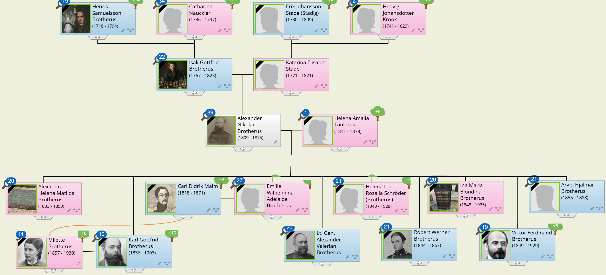

[**Alexander Nikolai Brotherus**](https://www.geni.com/people/Alexander-Nikolai-Brotherus/6000000007511822881) on kahdeksas Isak Gottfrid ja Katarina Elisabet Brotheruksen lapsista. Hänen jälkeensä syntyy vielä kolme tytärtä, joista tosin toinen kaksoistyttäristä kuolee aivan pienenä. Alexander Nikolain kymmenen ensimmäisen elinvuoden aikana - hänen parhaan lapsuutensa ajan - on perheessä yhdeksän lasta, ja siis varmasti aikamoinen vilske. Nuorin lapsista, Blondina Sofia, on vain puolentoista vuoden ikäinen kun sisarussarjan vanhin, jo valmis proviisori, mutta edelleen kotona asuva **Jakob Gottfrid Brotherus** kuolee 24 vuoden ikäisenä toisena joulupäivänä 1819. Toiseksi nuorin **Hedvig Helena Brotherus** on silloin 6-vuotias, ja varmaan muistaa koko pitkän elämänsä ajan vanhimman veljensä.

Orvoksi jäädessään on Alexander Nikolai 14 vuoden ikäinen. Hänen ainoa elossa oleva veljensä, Karl Alexander, on valmistunut proviisoriksi ja työskennellyt Turussa, mistä hän isänsä kuolinvuotena siirtyy Pietariin. Vanhin sisarusparven tyttäristä **Katarina Dorotea Brotherus** on 1821 mennyt naimisiin lasimestari **Georg Heinrich Seitzin** kanssa. Näyttää siltä, että 5-vuotiaan **Blondina Sofia Brotheruksen** on vanhin sisar Katarina Dorotea ottanut huostaansa, sillä hän on käynyt koulunsa Viipurin saksalaisessa tyttökoulussa. Sen sijaan hänestä seuraava ikäjärjestyksessä ylöspäin lukien, 10-vuotias **Hedvin Helena Brotherus**, on käynyt koulunsa Pietarissa niin, että ilmeisesti hänen poikamieheksi jäänyt vanhempi veljensä **Karl Alexander Brotherus** on ottanut hänet siipiensä suojaan. Muut tyttäret ovatkin jo täysikasvuisia: **Anna Alexandra Brotherus** 18 vuotta, **Elisabet Wilhelmina Brotherus** 20 vuotta ja **Natalia Karolina Brotherus** 24 vuotta vanha. He ovat siis voineet tulla toimeen omin avuin, ja niin ilmeisesti tehneetkin, mutta helppoa se ei ole ollut. Elisabet Wilhelmina solmii avioliiton 1825, mutta ennättää olla naimisissa vain kaksi viikkoa ennen kuolemaansa, ja hän on silloin vain 22 vuoden ikäinen. Natalia Karolina kuolee Johanneksessa 38 vuoden ikäisenä, ja Anna Alexandra on 1846 kuollessaan hänkin vasta 42-vuotias. Hänkin kuolee kotipitäjässään Johanneksessa. Koko suuresta sisarusparvesta vain Alexander Nikolai ja Katarina Dorotea saavat jälkeläisiä. Karl Alexander jää poikamieheksi.

Minulle kävi kerran sillä tavalla, että osallistuessani Kuusankosken Rotaryklubin vuosijuhlaan siellä oli juhlaesitelmää pitämässä tunnettu tähtitieteilijä **Gustav Järnefelt**. Istuessamme juhlaseremonioiden ja esitelmän jälkeen pienissä piireissä erillisten kahvipöytien ääressä sain kutsun saapua Gustav Järnefeltin pöytään, jopa hänen viereensä. Hän selvitti siinä minulle, että olemme sukulaisia, ja savukelaatikon kanteen hän sitten piirsi sen sukupuun, joka osoitti sukulaisuutemme. Se oli hyvin hauskaa, sillä hän oli erittäin mukava ihminen, eloisa, viisas ja ystävällinen. Valitettavasti se tupakkalaatikon kansi vain joutui myöhemmin hukkaan, niin etten vuosiin osannut selvittää, miten sukulaisuutemme oli johdettavissa. Tätä kirjoitusta laatiessani asia on taas valjennut minulle isäni **Karl Robert Brotheruksen** aikanaan tekemästä sukuselvityksestä: isoisäni isän sisarella **Katarina Dorotea Seitzilla** oli tytär Amalia, joka meni naimisiin **Gustaf Johan Järnefeltin** kanssa. Näiden lapset olivat siis isäni pikkuserkkuja ja heidän lapsensa minun pikkuserkun serkkujani. Kun joskus tapaat jonkun Järnefeltin, voit ruveta laskeskelemaan hänen kanssaan, minkälaisia pikkuserkun pikkuserkkuja te saattaisitte olla.

Miten Alexander Nikolai sai toimeentulonsa orpoutensa ensimmäisinä vuosina, ja mikä hänen koulutuksensa on saattanut olla, siitä ei ole säilynyt minkäänlaisia tietoja. Ensimmäisen kerran tapaamme hänet kirjurina Haminassa 1826. Kolme vuotta myöhemmin, 1829, hän muuttaa Lappeenrantaan ja astuu Suomessa toimivan venäläisen muonitus-komissionariaatin palvelukseen. Lappeenrantaan tullessaan on Alexander Nikolai siis 20-vuotias, ja siellä hän tutustuu itseään kaksi vuotta nuorempaan **Helena Amalia Taulerukseen**, Lappeenrannan ja Lappeen seurakunnan kappalaisen tyttäreen. Kun hän sitten 1832 saa siirron muonavarikon makasiininhoitajaksi toiselle puolelle Suomea, Kastelholmaan Ahvenanmaan Sundin pitäjässä, solmii hän ennen matkaan lähtöä avioliiton Helena Amalian kanssa elokuun 26 päivänä 1832.

Matka uuteen toimipaikkaan ei tuohon aikaan suinkaan ollut niin yksinkertainen kuin nyt ensivaiheessa luulisi. Matkatavarat, koko maallinen irtaimisto, on saatava mahtumaan hevoskuormaan, ja itse nuorikkoineen vielä mahduttava mukaan. Hevosella körötellään sitten syyssateen liottamia kärryteitä joko Viipuriin tai Haminaan. Siellä on saatava käsiinsä purjelaiva, ehkäpä ei paljon purjevenettä suurempi, joka vie kuorman perille halki myrskyävän meren. Mutta niinpä päästäänkin samalla kyydillä uuteen kotisatamaan saakka.

Kastelholma oli vanha, jo keskiajalla rakennettu ja tulipalossa 1745 miltei täysin tuhoutunut linna Ahvenanmaan mantereella pitkän suojaisen lahden pohjukassa. Se oli nähnyt loistoaikansa Kustaa Vaasan poikien aikana mm. Juhana herttuan kunnostaessa sen kesäasunnokseen, ja sen kuuluisin vanki lienee ollut Juhanan veli Erik. Nyt siitä ei ollut jäljellä muuta kuin venäläisten kunnostuttama muonamakasiini, ja makasiininhoitaja sai hakea asuntonsa kylältä.

Ahvenanmaan komennus kesti 18 vuotta - 18 vuotta ja 12 lasta. Se on ollut vilkasta ja perheenäidin kannalta sangen rasittavaakin aikaa. Suuren lapsilaumansa kaitsemisessa hänellä oli kyllä apuakin. Kälyt Hedvig Helena ja Blondina Sofia ovat viettäneet siellä ainakin jonkun aikaa, ja kun molemmat myöhemmin toimivat menestyksellisesti opettajina Turussa, on ilmeistä että he osasivat taidolla käsitellä lapsia. Eniten ja pysyvintä apua on kuitenkin antanut Helena Amalian sisar "moster" Maria, jonka hellästä huolenpidosta isäni kertoo "kertomatietoja" säilyneen.

Vanhimmille pojille, v. 1836 syntyneelle **Carl Gottfrid Brotherukselle**, 1838 syntyneelle **Alexander Valerian Brotherukselle** ja ehkä vielä 1844 syntyneelle **Robert Werner Brotheruksellekin** lienee ollut suurena mielenkiinnon kohteena saman pitäjän toiseen päähän aloitettu Bromarsundin linnoituksen rakennustyömaa. Se pantiin alulle samana vuonna kuin Carl Gottfrid syntyi, ja työt jatkuivat vielä kun perhe sai komennuksen Helsinkiin. Bromarsundin linnoituksella oli lyhyt elinaika. Se valmistui 1853. Krimin sodan aikana englantilais-ranskalainen laivasto pommitti sitä 21.6.1854 ja 8.8.1854 nousi 10.000 miehen vahvuinen ranskalaisten osasto maihin. Taistelun jälkeen se valtasi linnoituksen 16.8. ja räjäytti sen.

Ehkäpä Kastelholman muonavarikko oli venäläisen sotilashallinnon kannalta hyvinkin tärkeä paikka, sillä siellä palvellessaan Alexander Nikolai sai nimineuvoksen arvonimen 1844 ja kollegiasessorin arvonimen 1847. Vuonna 1850 Alexander Nikolai sai komennuksen vastaavaan tehtävään Helsinkiin. Sitä komennusta kesti seitsemän vuotta ja sinä aikana syntyi perheeseen vielä kaksi lasta, joista toinen kuoli noin puolen vuoden ikäisenä. Kun Sundissa syntyneistä kuoli siellä kolme lasta ja kaksi pian Helsinkiin muuton jälkeen, kasvoi lapsista kahdeksan aikuisen ikään. - Helsingissä Alexander Nikolain arvonimi kohosi hovineuvokseksi 1855.

Kun Alexander Nikolai ja Helena Amalia vuonna 1857 muuttivat Hämeenlinnaan, seurasi heitä sinne enää viisi lapsista. Vanhimmat Carl Gottfrid ja Emelie Wilhelmina Adelaide (Emma) jäivät opiskelemaan yliopistoon - joka vuonna 1840 oli siirretty entisestä pääkaupungista Turusta uuteen pääkaupunkiin Helsinkiin - ja iältään seuraava, Alexander Valerian (Sassa) aloitti samana keväänä opintonsa Haminan kadettikoulussa.

Muutto Helsingistä Hämeenlinnaan tapahtui vielä hevospelillä niin kuin muutto Lappeenrannasta Kastelholmaankin oli alkanut - tsaari Aleksanteri II oli kyllä jo vahvistanut rautatierakennuksen Helsingistä Hämeenlinnaan aloitettavaksi, mutta työt pääsivät alkuun vasta seuraavana vuonna, 1858. Tämä Suomen ensimmäinen rautatie avattiin liikenteelle vuonna 1862 niin, että kun perhe 1859 kävi Helsingissä vanhimman tyttären Emman häissä elokuun 2 päivänä 1859, oli kyytineuvona edelleen hevonen. Matkaa maanteitse oli ehkäpä 130 kilometriä, joten sen taittamiseen tarvittiin kaksi vuorokautta, mihin sisältyi yöpyminen majatalossa. Sulhasena näissä häissä oli everstiluutnantti **Carl Didrik Malm**, joka tykistörykmentteineen oli vuoden 1857 lopussa saanut komennuksen Puolasta Hämeenlinnaan ja siellä muonavarikonhoitaja Brotheruksen kotona oli tutustunut tulevaan vaimoonsa. Carl Didrik oli Puolassa ollessaan mennyt naimisiin **Emilie Karolina Lovisa Julia Paczynska von Tenczinin** kanssa, mutta tämä hänen ensimmäinen vaimonsa oli kuollut esikoisensa synnytykseen. Tämä esikoinen oli pieni tyttö, joka kasteessa sai nimekseen **Emilia Karolina Malm**, ja omaisten sekä suvun piirissä myöhemmin tunnettiin nimellä Milette. Hänen äitinsä puolalaiset sukulaiset eivät olleet olleet suopeita avioliitolle, minkä hyvin voi ymmärtää, kun ottaa huomioon venäläisen armeijan - ja siis myöskin siinä palvelleiden suomalaisten upseereiden - tehtävän Puolan vapautus pyrkimysten tukahduttajana. Pieni Milette tuli siis isänsä mukana Suomeen, ja seurasi aikanaan isäänsä ja äitipuoltaan isän tullessa komennetuksi uusiin tehtäviin.

Hämeenlinnassa vietettiin myöskin häitä. Ikäjärjestyksessä seuraava tyttäristä, **Helena Ina Rosalia Brotherus** vihittiin kesäkuussa 1861 Raaseporin kruununvoudin **Waldemar Schröderin** kanssa, ja joutui avioliittonsa myötä muuttamaan Tammisaareen.

Perhe pieneni edelleen, kun ikäjärjestyksessä seuraava pojista, **Robert Werner Brotherus**, meni Haminan kadettikouluun kesäkuussa 1863. Lapsista oli siis kolme enää kotona, kun Alexander Nikolai vuonna 1864 nimitettiin suomenmaalaisen sotilaspiirin intendenttihallinnon osastopäälliköksi ja muutti takaisin Helsinkiin. Osastopäällikkönä hän työskenteli vielä yhdeksän vuotta, mutta terveytensä heiketessä siirtyi eläkkeelle 64-vuotiaana vuonna 1873. Silloin hän oli jo kahden vaimonsa Helenan kanssa. Ina Maria Blondina oli suorittanut tutkinnon musiikin teoriassa ja työskenteli laulunopettajana **Hilja Tawaststjernan** yksityisessä tyttökoulussa, **Viktor Ferdinand Brotherus** oli juuri promovoitu filosofian maisteriksi ja haki opettajan paikkoja, ja **Arvid Hjalmarkin** päässyt ylioppilaaksi Helsingin normaalikoulusta.

Ei ole ihme, että Alexander ja Helena päättivät palata takaisin sinne, mistä olivat pitkälle kierrokselleen lähteneet, ja vetäytyivät eläkepäiviään viettämään Lappeenrantaan. Sinnehän pääsi nyt jo junallakin, sillä vuonna 1870 oli avattu junaliikenne suuriruhtinaskunnan pääkaupungin ja keisarikunnan pääkaupungin välille.

Lappeenranta ei kuitenkaan vastannut Alexanderin ja Helenan muistikuvia. Vanhat tuttavat olivat joko kuolleet tai muuttuneet aivan erilaisiksi kuin mitä olivat nuoruuden aikana olleet, ja lapset asuivat niin perin kaukana. Emma Malmin puoliso Carl Didrik oli kuollut Novgorodissa 1871 ja Emma itse oli muuttanut Tammisaareen reaalikoulun venäjänkielen opettajaksi; ja myös Helena (Schröder) asui Tammisaaressa. Sieltäpä siis Alexander ja Helena hankkivat itselleen lopullisen eläkepäivien kodin. Alexander vain ei sinne milloinkaan ehtinyt muuttaa. Hän kuoli Lappeenrannassa kesäkuun 7 päivänä 1875, mutta hautansa hän sai Tammisaareen, minne myös Helena kolme vuotta myöhemmin haudattiin.

Alexanderista ja Helenasta on säilynyt valokuvat; vanhoilla päivillä otetut tietenkin, sillä koko valokuvaustaito oli heidän elinaikanaan kehittynyt. Kuvat on todennäköisesti otettu ranskalaisen Daguerren 1835 kehittämää menetelmää käyttäen, ja valotusaika on ollut useita sekunteja ehkäpä minuuttejakin. Tästä varmaan johtuu isoisänisäni tiukka ilme ja hänen herttaisen näköisen vaimonsa hiukan tuijottava katse.

## 9. Humanisti ja sotilaan tytär: Carl Gottfrid Brotherus

Ennen kuin rupean kertomaan Sinulle Alexander Nikolain ja Helena Amalian aikuiseksi varttuneen lapsisarjan vanhimmasta, isoisän iso-isästäsi Carl Gottfrid Brotheruksesta, kerron lyhyesti sisarussarjan muista lapsista.

Emilia Wilhelmina ja Carl Didrik Malm saivat kolme lasta: Emilia Charlotta, Aina ja Carl Wilhelm, jonka viimemainitun kautta Malm-niminen sukuhaara edelleen elää.

Kaksi Alexander Nikolain pojista valitsi sotilasuran ja astui Tsaarin armeijan palvelukseen käytyään Haminassa kadettikoulun. Vanhempi heistä, Alexander Valerian, kohosi vähitellen kenraaliksi palveltuaan eri puolilla laajaa Venäjän valtakuntaa Puolasta aina Itä-Siperiaan saakka. Hän oli naimisissa kaksi kertaa, puolalaisten Ljubitzky-sisarusten kanssa, mutta ei saanut lapsia, jäi eläkkeelle vuonna 1901 asettuen asumaan Riikaan, missä kuoli 1903 ja oli kuollessaan 64-vuotias. Nuorempi taas, Robert Werner, ennätti urallaan vasta luutnantiksi, kun hän 1871 kuoli Krasnoje Selossa vain 27 vuoden ikäisenä poikamiehenä.

Helena Ina Rosalia ja Waldemar Schröder saivat neljä lasta: tyttären, joka kuoli lapsena, ja pojat Ernst, Karl ja Hannes. Waldemar Schröder kuoli Tammisaaressa jo 1868 vain 38 vuoden ikäisenä.

Nuorin tyttäristä, **Ina Maria Blondina Brotherus**, ei milloinkaan mennyt naimisiin, vaan jäi, siirryttyään eläkkeelle 1913, asumaan yhdessä ystävättärensä **Sigrid Lindforsin** kanssa. Nämä ystävykset, "faster Ina" ja "tant Sigrid" asuivat pienessä kaksiossa Punavuorenkadulla, Fredrikintorin kulmassa. Huoneet olivat ahdinkoon asti täytetyt vanhoilla huonekaluilla. Tuolit olivat punaisella plyysillä verhoillut, ja mustaksi maalattujen pöytien ja jakkarain jalat pyöreiksi sorvatut pallokuvioin. Lapset saivat siellä vieraillessaan kovia purkkikaramellejä ja piparkakkuja. Kun "tant Sigrid" kuoli, muutti hänen tilalleen asumaan "faster Inan" vanhempi sisar, leskeksi jäänyt Helena Schröder eli "faster Nena". Faster Nenan kuoltua 1928 jäi faster Ina viimeisiksi elinvuosikseen yksin. Hän muutti lopulta asumaan Helsingin Diakonissalaitoksen vanhainkoti-Elimiin, missä hänen elämänsä sammui tammikuun 8 päivänä 1935.

Nuorimmat pojat, **Viktor Ferdinand Brotherus** ja **Arvid Hjalmar Brotherus** lukivat kumpikin luonnontieteitä. Arvid Hjalmar oli jonkin aikaa kahden vaiheilla elämän uransa valinnassa, ja sai jo 1883 apurahankin harjoittaakseen eläinlääketieteellisiä opintoja ulkomailla, mutta kasvitiede kuitenkin voitti. Hän julkaisi kolme kasvitieteellistä kirjoitelmaa ja teki opintomatkoja Kaukasiaan. Vuonna 1887 hän sai nimityksen Pietarin keisarillisen kasvitieteellisen puutarhan 1. amanuenssiksi, mutta ura katkesi kesken kun Arvid Hjalmar seuraavana vuonna kuoli vain 33-vuotiaana. Hän oli kuollessaan poikamies.

Ahvenanmaalla syntynyt Viktor Ferdinand ei ollut ennättänyt täyttää vielä seitsemäätoista vuotta, kun hän kesäkuun 7 päivänä 1866 tuli ylioppilaaksi Hämeenlinnan siviililukiosta. 20-vuotiaana hän oli filosofian kandidaatti ja 24-vuotiaana suorittanut kasvatusopin tutkinnon. Viktor Ferdinandin uranvalinta oli alusta alkaen selvä. Hänestä tuli luonnontieteen ja matematiikan opettaja Helsingin ja Vaasan ruotsalaisissa tyttökouluissa, mutta tämän opettajantoimensa ohessa hänellä oli tilaisuus toteuttaa todellinen harrastuksensa, sammalten tutkiminen. Lukuisilla keruu- ja tutkimusmatkoillaan sekä kotimaassa että sen ulkopuolella Kaukasiaa ja Keski-Aasiaa myöten hän keräsi sammalia noin 15 500 eri lajia, eli miltei kaikki tuolloin tunnetut lajit. Hänelle lähetettiinkin määritettäväksi sammalkokoelmia kaikkialta maailmasta, sillä häntä pidettiin aikansa etevimpiin kuuluvana sammaltutkijana. Vuonna 1884 Viktor Ferdinand väitteli tohtoriksi Kaukasian sammalilla. Tieteellisten ansioittensa vuoksi hänet pyydettiin erinäisten koti- ja ulkomaisten tieteellisten seurojen kunniajäseneksi tai jäseneksi sekä nimitettiin korkeakoulujen professoriksi tai kunniatohtoriksi.

Elämäntavoiltaan "farbror Viktor" oli hyvin vaatimaton. Hän oli Uudenvuoden onnittelukierroksella kolmas järjestyksessä, ja muistan hänet erikoisesti kilttinä vanhana herrana, jota isäni suuresti kunnioitti. Hänestä kuuluvat oppilaansakin koulussa kovasti pitäneen.

Viktor Ferdinand meni naimisiin 1879 **Aline Matilda Sandmanin** kanssa, ja heillä oli neljä lasta, joista **Gerda Matilda Brotherus** solmi avioliiton KHT-tilintarkastaja **Klas Anton Edvin Sederholmin** kanssa. Myöskin Sven Alexander ja Georg Viktor perustivat perheen, joten Sinulla on tästäkin sukuhaarasta sukulaisia. Vanhin lapsista **Mildrid Helena** jäi naimattomaksi, ja hoiti isänsä taloutta aina tämän kuolemaan saakka. Viktor Ferdinand oli jäänyt leskeksi jo 1894, ja kuoli itse v. 1929.

Kun Alexander Nikolai vuonna 1850 muutti Ahvenanmaalta Helsinkiin, oli hänen vanhin poikansa Carl Gottfrid neljäntoista vuoden ikäinen, ja hänet pantiin käymään koulua Helsingfors Lyceum -nimiseen, lähinnä yliopisto- ja virkamiespiirien ylläpitämään yksityiseen oppikouluun. Valinnanvaraa ei juuri ollut, sillä tämän lisäksi oli poikia varten vain aikaisemman triviaalikoulun perinteitä jatkavat ala- ja yläalkeiskoulut (ruotsinkieliset) sekä tytöille kaksi ruotsinkielistä tyttökoulua. Helsinki oli ollut valtakunnan pääkaupunkina jo lähes 40 vuotta, ja yliopistokaupunkinakin yli 20 vuotta, mutta sen väkiluku oli vasta vähän yli 20 000 henkeä. Asuttua aluetta rajoitti etelässä linja Sepänkatu - Tehtaankatu, ja pohjoisessa kulki asutuksen raja suunnilleen linjaa Siltavuorenranta - Unioninkatu - Kaisaniemenkatu - Kaivokatu - Simonkatu - Ruoholahdenkatu - Ruoholahdenranta. Aseman kohdalla kimalteli Kluuvinlahti. Eira sekä Töölö olivat asumatonta erämaata, samoin kaikki maat Pitkänsillan ja Töölönlahden itäpuolella. Liikenteen melu ei korvia rasittanut. Ainoat siitä kertovat äänet olivat kesällä hevosten kavioiden kapse kadun nupukivillä ja talvella kulkusten kilinä, mitkä varoittivat jalankulkijaa lähestyvistä ajoneuvoista. Niin sanottu Vanha kirkko oli Helsingin ainoa kirkko, kun nykyisellä Senaatintorilla sijainnut Ulrika Eleonoran kirkko oli vuonna 1826 purettu. Rakenteilla oli jo Nikolainkirkko - nykyinen Tuomiokirkko - joka valmistui 1852.

Helsingin ja helsinkiläisten elämään löivät leimansa neljä vaikuttavaa tekijää: Helsinki oli suuriruhtinaskunnan pääkaupunki, jonne olivat keskittyneet kaikki suuriruhtinaskunnan hallintovirastot, se oli yliopistokaupunki, jossa sijaitsi suuriruhtinaskunnan ainoa yliopisto "Keisarillinen Aleksanterin Yliopisto", se oli varuskunta-kaupunki, jossa sijaitsi niin suomalaista kuin venäläistäkin sotaväkeä, ja neljänneksi se oli kylpyläkaupunki. Vuonna 1843 oli Kaivopuistoon perustettu Ullanlinnan kylpylä, joka houkutteli vieraita, varsinkin Pietarista, sen jälkeen kun höyrylaivaliikenne sen ja Helsingin välillä oli alkanut; toisaalta venäläisille oli julistettu kielto matkustaa ulkomaille. Kun suuriruhtinaskunnan sisäisenä virkakielenä oli ruotsinkieli, ja asiat suuriruhtinaalle esiteltiin venäjänkielellä, ja kun opetuskielenä niin kouluissa kuin yliopistossakin oli yksinomaan ruotsinkieli, niin ei ole ihmeteltävää, että kielisuhteet maan pääkaupungissa olivat muodostuneet sellaisiksi kuin ne olivat. Vuonna 1870, jolloin vasta perustetut suomenkieliset koulut eivät vielä olleet ennättäneet vaikuttaa kielisuhteisiin, olivat ne seuraavanlaiset: suomenkielisiä 26%, ruotsinkielisiä 57%, venäjänkielisiä 12% ja muunkielisiä 5%.

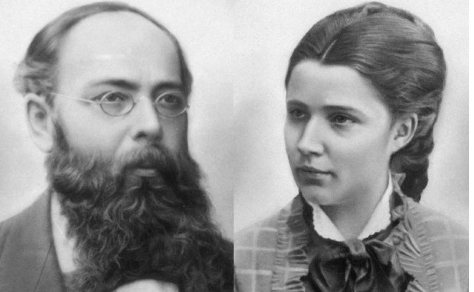

<small>Karl Gottfrid Brotherus ja Milette</small>

Tällainen oli siis se kouluympäristö, joka isoisäsi isoisällä [**Carl Gottfrid Brotheruksella**](https://www.geni.com/family-tree/index/6000000000232232035) oli hänen käydessään koulunsa loppuun Helsingissä ja suorittaessaan siellä yliopistolliset opintonsa. Perhe ei omistanut omaa asuntoa tai huoneistoa. Se ei ollut siihen aikaan tapana virkamies- ja opettajaperheissä. Hehän, varsinkin sotaväkeä palvelevat, kuten Alexander Nikolai, joutuivat komennetuiksi milloin mihinkin maanääreen, ja omaa asuntoa ei voinut ottaa mukaan muuttokuormaan. Sitä paitsi oli perheen koon vaihdellessa käytännöllistäkin voida muuttaa suurempaan lapsiluvun lisääntyessä ja taas pienempään lasten aikuistuttua jättäessä vanhempien kodin. Tilannehan oli aivan toinen kuin maatilataloudessa, missä useampikin sukupolvi saattoi työskennellä samalla tilalla jatkuvasti sukupolvesta toiseen, tai käsityöläisperheessä tai pienyrityksessä, missä ainakin yksi tai kaksi lapsista jatkoi isänsä rinnalla hänen ammattinsa harjoittamista, ja aikanaan isänsä jälkeen jatkoi samaa yritystoimintaa. Näissä tapauksissa liittyi oma asunto välittömästi elinkeinoon, mutta virkamies- ja opettajaperheissä oli asianlaita toinen, ja vuokra-asuntoja oli runsaasti saatavissa siihen aikaan.

Lyseon pulpeteissa kulutti Carl Gottfrid housuntakamuksiaan neljä vuotta tullen ylioppilaaksi syksyllä 1854. Keisarillisessa Aleksanterin Yliopistossa hän opiskeli pääaineenaan historia, ja promotoitiin maisteriksi kesän kynnyksellä 1860. Lisenssiaattitutkinnon hän suoritti seitsemän vuotta myöhemmin, jouluna 1867 ja promotoitiin tohtoriksi taas kesän kynnyksellä 1869. Juhlalliset promotiot, joissa maisterit ja tohtorit promovoitiin samalla kertaa, suoritettiin aina toukokuun viimeisenä päivänä. Väitöskirjansa Carl Gottfrid kirjoitti Englannin kirkollista ja poliittista elämää sivuavasta aiheesta.

Samana vuonna kun saa filosofian tohtorin arvon Carl Gottfrid lähtee kahdeksi vuodeksi Moskovan yliopistoon opintojaan jatkamaan, ja palaa sinne taas lukuvuodeksi 1874-75. Mitenkä hän on mahtanut kaikki opintonsa rahoittaa? Kotoa hän ei ole voinut saada rahallista tukea, siihen eivät virkamiehen tulot ole voineet riittää. Hän on ollut Hämeenlinnan siviililukiossa latinan ja saksankielen lehtorin sijaisena 1863-65 ja Helsingfors Tidningar -lehden ulkomaanosaston toimittajana 1866 sekä Haminan kadettikoulun valtiotieteiden vt. opettajana 1868-69. Mutta opintomatkansa Moskovaan ja niiden välinen aika 1871-74 hänen on täytynyt saada rahoitetuksi osittain stipendeillä, osittain tilapäistöillä.

On mahdollista, että Carl Gottfrid on rahoittanut opintonsa hyvin suurelta osalta antamalla yksityistunteja kielissä. Hänen kielitaitonsa on ollut hämmästyttävä. Hänen kotikielenään on ollut ruotsi, hän on toiminut kaksi vuotta latinan ja saksankielen lehtorina, toimii myöhemmin venäjänkielen opettajana ja kääntäjänä, kirjoittaa väitöskirjansa Englannin poliittisen elämän piiristä, ja hänen omistamansa ruotsinkielinen "Maailmanhistoria" sisältää tasaisella, kauniilla käsialalla tehtyjä kommentteja paitsi ruotsiksi myös latinaksi, englanniksi ja ranskaksi. Kun tähän vielä lisää, että isäni kertoman mukaan hänen isänsä luki säännöllisesti "Suometarta" ja myöskin tutkiskeli Kalevalaa, lienee oikeutettua olettaa, että C. G. enemmän tai vähemmän täydellisesti hallitsi suomen, ruotsin, venäjän, saksan, ranskan, englannin ja latinan kielet.

Toisen Moskovaan tehdyn opintomatkan jälkeen on viimein aika vakiintua, ja niin Carl Gottfrid ottaa vastaan Haminan kadettikoulun venäjänkielen opettajan paikan. Kymmenen vuotta myöhemmin, 1885, hän siirtyy Helsinkiin Keisarillisen Aleksanterin Yliopiston venäjänkielen ja kirjallisuuden lehtoriksi.

Näin piirtyy mieleeni kuva humanistista, joka seitsemää kieltä halliten liikkuu historian, valtio-opin ja kirjallisuuden maailmoissa, ei hankkiakseen itselleen mainetta tai mahtia, vaan ainoastaan rikastuttaakseen henkistä maailmaansa ja saadakseen perheelleen riittävän toimeentulon.

Sisarusparven keskinäiset suhteet ovat olleet erittäin lämpimät. Siitä jäi vahvat jäljet vielä seuraavankin sukupolven keskinäiseen kanssakäymiseen. Kun sisaruksista kolme Ina, Viktor ja Arvid asuivat pääasiallisesti Helsingissä, kävi poikamiehenä elelevä C. G. varmaan Haminasta käsin usein heitä tervehtimässä, vaikka yhteys olikin joko kievarihevosen tai laivan varassa. Kaksi vuorokautta oli varattava kievarikyytiin, mutta elämisen tahtihan oli siihen aikaan verkkaisempi kuin nykyään, joten matkan pituus ei tuottanut estettä. Tällaisella matkalla C. G. sitten tapasi viehättävän sukulaisen, joka ei kuitenkaan ollut verisukua C. G.:lle, nimittäin sisarensa Emma Malmin tytärpuolen Emilia Karolina Malmin, joka oli Carl Didrik Malmin tytär tämän ensimmäisestä avioliitosta.

Päätettyään koulunkäyntinsä Pietarissa Smolnan tyttökoulussa Emilia Karolina Malm oli muuttanut Helsinkiin ja saanut siellä opettajan paikan. Smolna oli keisarinnan erityissuojeluksessa oleva tyttöjen sisäoppilaitos, ja nuori Emilia Karolina (Milette) oli kelpuutettu sinne varmaan enemmänkin isoisänsä kuin isänsä ansioiden vuoksi. Kaikin mokomin on todettava, että Carl Didrik Malm oli ollut ansiokas sotilas ja rykmentinkomentaja, mutta laajassa Venäjänmaassa oli sadoittain everstejä ja heillä opinhaluisia tyttäriä. Isoisä Carl Wilhelm Malm sitä vastoin oli ollut osittain jopa sadunhohteisen menestyksen saavuttanut sissipäällikkö 1808-09 vuosien sodassa, joka oli ollut siinä suhteessa ainutlaatuinen sota, että siihen osallistuneet puolin ja toisin kunnioittivat vihollisen suorituksia. Ehkäpä isoisän maine avasi Milettelle Smolnan tyttökoulun ovet.

Kesäkuussa 1878 lähes 42-vuotias C. G. ja 21 täyttänyt Milette solmivat avioliiton. Milette jätti toistaiseksi opettajantyönsä ja muutti Haminaan, missä esikoinen, **Helena Emilia**, syntyi noin puolitoista vuotta myöhemmin. Runsaan vuoden kuluttua siitä syntyi **Karl Robert**, ja taas puolentoista vuoden jälkeen **Johanna Maria**, jonka synnytys tapahtui Tammisaaressa äitipuolen, Emma Malmin suojissa. Emma Malm oli silloin siellä reaalikoulun venäjänkielen opettajana.

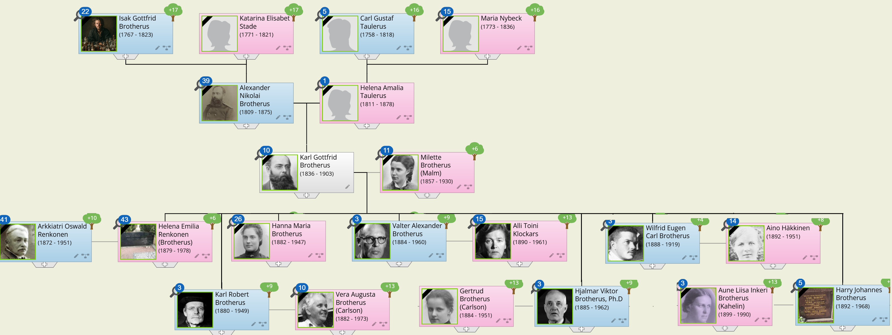

**Valter Alexander** syntyi kaksi vuotta myöhemmin Haminassa. Perheen kasvaessa eivät kadettikoulun opettajan toimesta saatavat tulot enää riittäneet talousmenoihin, ja pienessä Haminan kaupungissa oli vaikea saada lisäansiota C. G.:n tai Milette hallitsemilta aloilta. Kun sitten syksyllä 1885 yliopistossa avautui venäjänkielen ja kirjallisuuden vt. professorin virka, haki C. G. sitä ja sai viran. Vain pari kuukautta muuton jälkeen, marraskuussa 1885, syntyi **Hjalmar Viktor**. Kun **Wilfrid Eugen** syntyi maaliskuussa 1888 ja **Harry Johannes** helmikuussa 1892, oli ruokittavia, vaatetettavia ja koulutettavia lapsia jo seitsemän. Yliopistollisesta päätoimesta saadut tulot eivät saattaneet enää kattaa kaikkia menoja, mitä siinä asemassa olevalle perheelle katsottiin välttämättömäksi, ja vt. professorin virkakin muutettiin vuodesta 1887 alkaen lehtorin viraksi. Mutta Helsingissä C. G. sai sivutoimia omalta alaltaan. Hän oli Ylioppilastutkintovaliokunnan jäsen jo vuodesta 1886, Helsingin reaalikoulun venäjänkielen opettaja 1887-96, rautatiehallituksen venäjänkielen kääntäjä 1890-96 ja Helsingin ruotsalaisen jatko-opiston venäjänkielen opettaja 1891-93.

Myös Milette sai opettajanpaikan ruotsalaisessa tyttökoulussa. Todennäköisesti hän otti tämän toimen vasta kun kuopus Harry oli päässyt lapsenkengistään. Talossa oli kyllä uskollinen pitkäaikainen palvelija, Stina, johon myös seuraava sukupolvi tutustui hänen käydessään joulua viettämässä vuoron perään kussakin perheessä.

Opettajilla on aina ollut kiitos olkoon oppilaiden loman tarpeen pitkät kesälomat, ja niin myös C. G. ja Milette pian Helsinkiin muuttonsa jälkeen vuokrasivat perheelleen kesäasunnon Vihdin Nummelasta, Niemenkylän rusthollista. Tämä tuli merkitsemään kaikille lapsille paitsi kesävirkistystä myöskin tilaisuutta läheltä seurata suuren maatalon elämää ja itsekin ottaa osaa sen arkeen niin kuin juhlaankin. Niemenkylän rustholliin kuului lukuisia torppia niin, että sen isäntä laski alustalaisiaan rengit ja piiat mukaan lukien olevan toista sataa. Tässä sitä on ollut kaupunkilaislapsilla näkemistä ja kokemista, mistä Harry Brotherus kertoo elävästi kirjassaan "Peitsi menneen puolesta".

Tuon ajan suomalaisuus-ideologiaa kuvaa se, että C. G. ja Milette panivat kaikki lapsensa vasta perustettuun Helsingin suomalaiseen yhteiskouluun, vaikka eivät kotona milloinkaan puhuneet suomen sanaakaan. Samaa ideologiaa kuvastaa se, että Karl Robertin luokalla - joka muuten koko ajan oli koulun toiseksi ylin - kaikki oppilaat puhuivat keskenään välitunnillakin suomea, vaikka vain yhdellä heistä oli kotikielenä suomi. Ehkäpä muodin vaihtuvaisuudelle ominaista lienee sekin, että kun kuopus Harry 12 vuotta myöhemmin kävi samaa koulua, ei hänen luokallaan kielellisessä suhteessa enää oltu enää näin "puhdasoppisia".

Isäni kertomuksista olen saanut sellaisen kuvan hänen isästään C. G.:stä, että tämä oli hiljainen, enimmäkseen kirjojensa pariin vetäytyvä herra, joka pienenä ylellisyytenään silloin tällöin tilasi Ranskasta korillisen hyvää punaviiniä. Pojan mieleen - tai oikeastaan poikien mieleen, sillä nuorimmainenkin muistaa tämän heikkouden - on tämä tapa jäänyt kun se ei ollut sopusoinnussa perheen muutoin niin taloudellisen elämäntavan kanssa. Se, että C. G. on jäänyt lapsilleen jokseenkin kaukaiseksi johtuu siitä, että hän lastensa syntyessä oli jo suhteellisen iäkäs, eikä enää jaksanut täysin rinnoin omistautua perheenisän asemaan. Vanhimman syntyessä hän oli jo 43-vuotias ja nuorimmainen syntyi hänen ollessaan 55 vuotta vanha.

Kun C. G. kuoli 66 vuoden ikäisenä helmikuun 24 päivänä 1903, oli nuorin lapsista, Harry, vasta 11-vuotias, eikä toiseksi nuorinkaan, Wilfrid, ollut vielä ennättänyt suorittaa ylioppilastutkintoa. C. G. ei ennättänyt nähdä kenenkään lapsistaan vielä solmivan avioliitoa, sillä vanhin, Helena, meni naimisiin hänen kuolemaansa seuraavana vuonna, 1904.

Miehensä vaatimattoman eläkkeen, opettajan palkkansa ja vanhimmilta lapsiltaan saamansa tuen avulla Milette vei perheensä läpi lapsuus- ja nuoruusvaiheen itsenäisen elämän alkuun. Hän joutui perheenäitinä kokemaan kasvavan levottomuuden vuodet ensimmäisen maailmansodan alusta vapaussodan alkamiseen, levottomuuden taakan pojistaan vapaussodan aikana ja toiseksi nuorimmaisen pojan, Wilfridin kaatumisen Aunuksen sotaretkellä. Hänen runsas kirjeenvaihtonsa sodan aikana molempien nuorempien poikiensa kanssa antaa oivallisen kuvan uljaasta, tasapainoisesta äidistä, todellisesta sotilaan tyttärestä. Milette eli miehensä jälkeen vielä 27 vuotta, ja ennätti nähdä yhtä lukuun ottamatta kaikkien lastenlastensa syntymän. Kuollessaan Helsingissä maaliskuussa 1930 oli Milette 73 vuoden ikäinen.

## Päätössanat

On parasta lopettaa tähän, sillä Carl Gottfridin ja Viktor Ferdinandin jälkeläiset elävät niin monena elinvoimaisena sukuhaarana, että niiden kuvaaminen sillä tavoin kuin olen nämä tarinani aloittanut, olisi minulle ylivoimainen urakka. Olen saatellut Sinut ja muutkin Carl Gottfridin ja Viktor Ferdinandin lapsenlapsenlapsen-lapset sentään niin pitkälle tarinoillani, että itsekukin teistä voi jatkaa siitä pisteestä omaa sukuhaaraansa. Sukusiteiden selvittäminen tästä eteenpäin ei ole millään tavalla vaikea tehtävä, jos vain halua ja kärsivällisyyttä riittää. Haluaisin kuitenkin yhdessä kanssasi sijoittaa tarinani henkilöt niihin tärkeimpiin tapahtumiin kansamme vaiheissa, jotka askel askeleelta ovat johtaneet sen itsenäiseksi kansakunnaksi.

Ensimmäinen askel tiellä itsenäisyyteen oli havahtuminen huomaamaan kansamme kielellinen omaleimaisuus. Kun **Mikael Agrikola**, talonpojan poika itäisen Uudenmaan rannikkopitäjästä, Perniöstä, loi suomalaisen kirjakielen kirjoittamalla ensin ohjeet kielen käytöstä ja sitten suomentamalla tärkeimmät kirkolliset perusteokset, Uuden Testamentin ja osia Vanhasta Testamentista, sekä kirjoittamalla niiden tulkintaa ja käyttöä koskevat ohjeensa, ei hän varmasti uskonut kirjojensa "kuluvan kansan käsissä". Luku- ja kirjoitustaito oli Suomessa vain papiston, oppineiden ja eräiden ylimpiin sosiaaliryhmiin kuuluvien omaisuutta, ja ne jotka sen osasivat, hallitsivat ruotsin sekä latinan kielet. Tämä Mikael Agrikolan tyhjästä esiin polkema kirjallisuus olikin tarkoitettu papiston käyttöön jumalanpalveluksissa, koska protestanttisen uskon mukaan Jumalan sanaa oli esitettävä sanankuulijoille heidän omalla kielellään. Sitä varten olivat yhtenäiset kielenkäyttöohjeet sekä yhtenäinen raamatunteksti kansan kielellä tarpeen. Raamatun sanaa ei voitu jättää yksittäisten pappien tulkittavaksi suomenkielelle, koska monet eivät osanneet suomea riittävän hyvin. Vaikka Suomessa oli tuolloin asukkaita vain noin 250 000, oli täällä kymmenittäin kirkkoja, ja yhtenäinen käytäntö pyhissä toimituksissa oli erittäin tarpeellinen.

Sinun esi-isäsi Sigfridus Michaelis, ensimmäisen Brotheruksen appi, oli ensimmäinen protestanttinen kirkkoherra Vantaan seurakunnassa, ja siis ensimmäinen, joka Vantaan kirkon alttarilta luki ja tulkitsi raamatun sanomaa suomenkielellä. Kirkkokansan ajatusmaailmaan on täytynyt tehdä valtavan vaikutuksen se, että hämärien vieraskielisten taikasanojen tilalle on tullut kuulijan omalla kielellä kerrottu sanoma, joka näin on muuttunut kuolleesta rituaalista eläväksi vereksi ja lihaksi.

Toinen virstanpylväs itsenäisyyteen on tunnustus kansamme oikeuslaitoksen omaleimaisuudesta. Kun Venäjän tsaari vuonna 1735 myöntyi siihen, että Viipurin ja Käkisalmen kuvernementeissa saatiin edelleen harjoittaa oikeudenhoitoa muusta valtakunnasta poikkeavien sääntöjen mukaisesti siitä syystä, että siellä asuvat ihmiset ja sikäläisestä oikeudenhoidosta huolehtiva henkilö tätä sitkeästi vaativat, on tämä kiistattomasti vahvan omaleimaisuuden tunnustamista. Sinänsä, ja sillä hetkellä tehtynä tämä myönnytys oli vähäarvoisen tuntuinen, mutta se johti ensi vaiheessa siihen, että kun Kymenkartanon lääni kahdeksan vuotta myöhemmin liitettiin Venäjän valtakuntaan, se sai ilman muuta pitää entisen oikeusjärjestyksensä siten modifioituna kuin järjestelyt Viipurin ja Käkisalmen kuvernementeissä edellyttivät. Seuraavassa vaiheessa tämä myönnytys johti siihen, että kun Suomen autonominen suuriruhtinaskunta vuonna 1809 oli perustettu, liitti Venäjän tsaari kaksi vuotta myöhemmin "Vanhan Suomen" autonomiseen suuriruhtinaskuntaan. Oli hankala pitää Venäjän valtakunnan osana pientä kolkkaa, jossa oli toisenlainen oikeusjärjestys kuin muualla valtakunnassa - varsinkin, kun tämä oikeusjärjestys oli sama kuin naapurina olevassa suuriruhtinaskunnassa.

Varmaankaan ei **Erik Johan Brotterus** saattanut aavistaa, kuinka kauaskantoiset seuraukset oli hänen sitkeällä uurastuksellaan, kun hän parhaan kykynsä mukaan pyrki saattamaan oikeudenhoidon toimivaltansa alueella sen luonteiseksi, että hän pystyisi tehtävästään selviytymään. Se että hänen työnsä vaikuttaa vielä tänäkin päivänä onkin jo taas toinen juttu.

Kolmas virstanpylväs on maamme poliittisen omaleimaisuuden tunnustaminen. Omalta osaltaan Venäjän keisarinna Elisabet tunnusti maamme poliittisen omaleimaisuuden manifestillaan maaliskuun 13 päivänä vuonna 1742, kun hän melkoisen hyvällä suomen kielellä kehottaa suomalaisia irrottautumaan Ruotsista ja muodostamaan Venäjän suojeluksessa oman autonomisen suuriruhtinaskunnan. Kun saman vuoden lopulla Turkuun ja Vaasaan koolle kutsutut maapäivät hyväksyvät keisarinnan ehdotuksen, ja Turussa jopa valitaan maalle suuriruhtinas, ja perustetaan suuriruhtinaskunnan kanslia, niin hyvällä syyllä voidaan sanoa poliittisen omaleimaisuuden tunnustamisen olleen molemminpuolista.

**Henrik Brotheruksen** toimista Turussa ei löydy kirjallisia dokumentteja, ja toiminnan luonteesta johtuen sellaisia on tuskin löydettävissäkään. On kuitenkin olemassa todisteita, jotka varsin painavasti puhuvat esittämäni kertomuksen puolesta. Ensimmäiseksi tulee **Karl Brotteruksen** vaikutusvaltainen asema Turussa ja hänen hyvät suhteensa miehitysviranomaisiin, sekä se että sukulaiset erittäin suurella todennäköisyydellä tunsivat toisensa entuudesta. Toiseksi tulee edellä mainitun "suuriruhtinaskunnan kanslian" Henrik Brotherukselle antaman "passituksen" ajankohta ja sanamuoto. Passihan annettiin juuri ennen rauhanneuvottelujen aloittamista, joten niitä mahdollisesti "häiritsevä" henkilö oli saatava pois paikkakunnalta. Edelleen tulee Henrikin suhde Johan Karl Natt och Dagiin sekä viimemainitun siirtyminen Ruotsin palveluksesta Venäjän palvelukseen, mitkä kaikki yllä mainitut seikat ovat dokumentoitavissa.

Neljäntenä virstanpylväänä tulee 1800-luvun ensimmäisinä vuosikymmeninä alkanut ja pitkälle kuluvalle vuosisadalle jatkunut suullisen perimätiedon keruu, ja sen tulosten innostunut vastaanotto. Varsinkin **Elias Lönnrothin** keräämä ja osittain runoilema "Kalevala" herätti tietoisuuden omaleimaisen suomalaisen kulttuurin olemassaolosta. Oleellista asiassa ei kuitenkaan liene suullisen perimätiedon löytyminen - sehän oli luonnollinen seuraus luku- ja kirjoitustaidon puuttumisesta. Tässä suhteessa ei ollut mainittavaa eroa Agrikolan aikoihin. Oleellista sen sijaan on, että oli syntynyt voimakas tarve kansallisen identiteetin etsintään. Tämä tarve ei aluksi levinnyt kovinkaan laajalla pohjalla. Sakari Topeliuksen "Maamme"-kirjassa todettiin vuonna 1875, että suomenkielistä väestöä oli silloin noin 84%, ja valtaosa heistä oli lukutaidotonta, joten he eivät pystyneet lukemaan "Kalevalaa". Ensi-innostuksen jälkeen koettiin takatalviakin, niin että kokonainen uusi sukupolvi oli ehtinyt syntyä "Kalevalan" ilmestymisen jälkeen ennen kuin suomenkielinen kansakoulujärjestelmä 1860-luvulla luotiin. Silloin vasta katsottiin tarpeelliseksi opettaa Suomen kansa lukemaan ja kirjoittamaan omalla äidinkielellään, joka Mikael Agrikolan herättämänä kuitenkin oli ollut olemassa jo yli 300 vuotta.

Miltei kokonaisen toisen sukupolven aika vierähti, ennen kuin ensimmäiset suomenkieliset oppikoulut perustettiin Helsinkiin yksityisin varoin. Vain muutamaa vuotta aikaisemmin oli suomenkieli tullut virastoissa tasaveroiseksi virkakieleksi ruotsinkielen rinnalle. Vielä kolmas sukupolvi ehti nähdä päivänvalon ennen kuin Helsingin yliopistossa suomenkieli tuli tasavertaiseksi opetuskieleksi ruotsinkielen rinnalle. Ruotsinkieli oli siihen mennessä ollut yliopiston ainoana opetuskielenä. Silloin oli Suomi jo itsenäinen tasavalta, isoisäsi 10-vuotias iloinen koulupoika ja hänen isänsä juuri nimitetty vasta perustettuun yleisen valtio-opin professorin virkaan.

Olen usein mielessäni ihmetellyt, minkä vuoksi **Carl Gottfrid Brotherus**, jonka kotikielenä oli ruotsinkieli, niin perään antamattoman johdonmukaisesti pani kaikki lapsensa suomenkieliseen kouluun, Helsingin Suomalaiseen Yhteiskouluun. "Yleinen muotivirtaus" olisi yksi selitys, mutta se ei ole riittävä, sillä suomenkielisten oppikoulujen perustamista vastustettiin myös voimakkaasti niissä piireissä, missä perhe seurusteli. Hänen veljensä Viktor Ferdinand Brotherus valitsi toisen tien. Ehkäpä selitys Carl Gottfridin valinnalle löytyy hänen kirjahyllystään.

Irlantilais-englantilainen historian tutkija William E. H. Lecky on kirjoittanut kirjan: "Englannin historia kahdeksannellatoista vuosisadalla". Kirja ilmestyi alkukielellä vuosina 1878-90 kahdeksana osana ja ruotsinkielelle käännettynä Tukholmassa vuosina 1880-93. Tämä kirja kuvaa pääasiassa Englannin ja Irlannin suhteiden kehitystä mainitulla 1700-luvulla. Se kuvaa, kuinka Englanti poliittisin, sotilaallisin, taloudellisin ja sivistyksellisin painostuskeinoin - ehkäpä ei edes tahallisestikaan - tuhoaa irlantilaisten identiteetin. 1700-luvun toimet kantavat satoa 1800-luvulla, ja kirjan kirjoittamisen aikaan irlantilaisten kansallisen olemassaolon häviämisprosessi on kuumimmillaan.

On selvää että niissä piireissä Suomessa, joissa sanomalehtiä luettiin, ja varsinkin niissä piireissä, joita valtiolliset asiat kiinnostivat, olivat Irlannin kysymykset - kuten aikaisemmin Puolan tragedia - vilkkaan keskustelun ja voimakkaiden tunteiden kohteina. Leckyn kirja on isoisäni kirjastosta löytänyt tiensä minun kirjahyllyyni, ja sen jokainen tyhjä sivu on varustettu isoisän sirolla käsialalla tehdyin huomautuksin. En voi välttyä ajatukselta, että tämä kirja kaikkine sitä koskevine keskusteluineen samoin kuin pohdiskelut Puolan tapahtumista ovat ratkaisseet hänen kohdallaan lasten kouluvalinnan.

Nyt olen sitten johdattanut Sinut näiden esivanhempiesi viimeistenkin vaiheiden läpi, ja kiitän Sinua hyvästä matkaseurasta. Se on ollut minulle hyvin mielenkiintoinen matka menneisyyteen, ja on herättänyt kymmenen uutta kysymystä jokaisen ratkaistun johdosta. Paljon on jäänyt kertomatta, ei niinkään esivanhempiesi vaiheista kuin heidän elinympäristöstään ja maamme vaiheista heidän elinaikanaan, mutta johonkin on kertominenkin lopetettava. Senkin uhalla että tarina jonkun mielestä saattoi jäädä yksipuoliseksi. Se jota tämä puute kiusaa kertokoon itse lisää. Olisin sellaisesta herätteestä hyvin kiitollinen.

Kuohijoella, joulukuun 18 päivänä 1982,  
Robert Siegfrid Brotherus  
